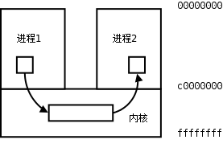
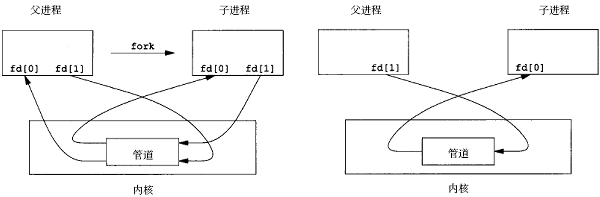
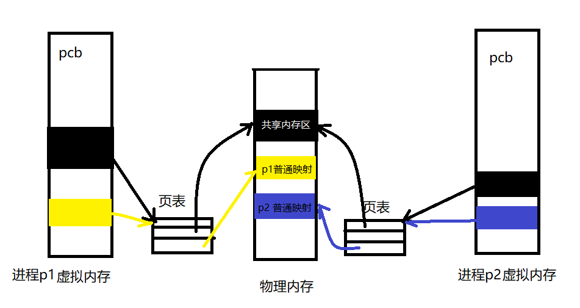
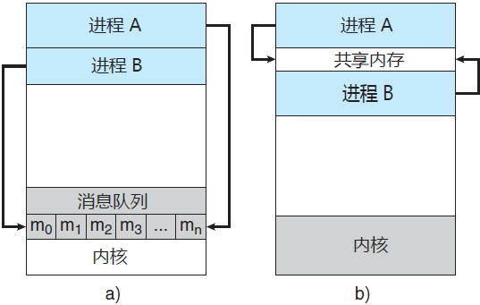
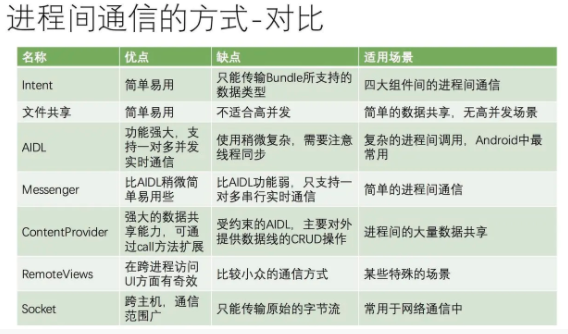
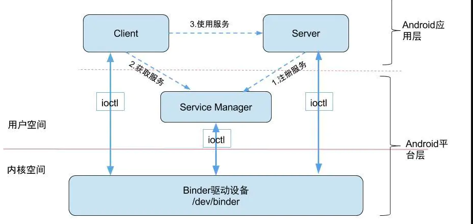
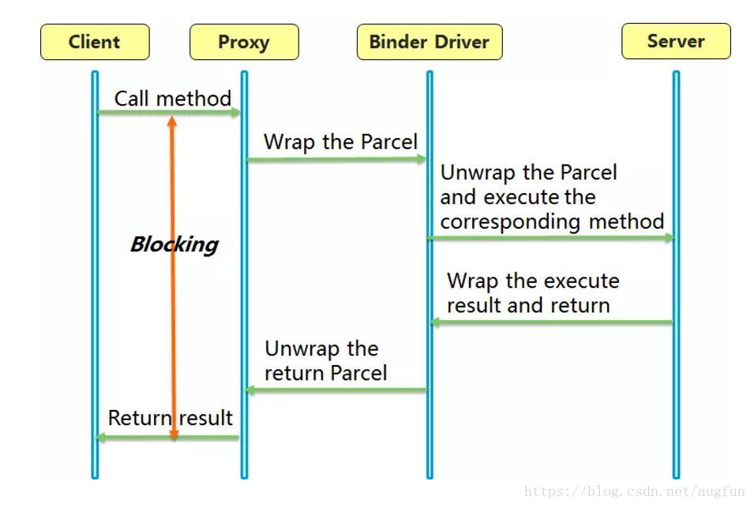
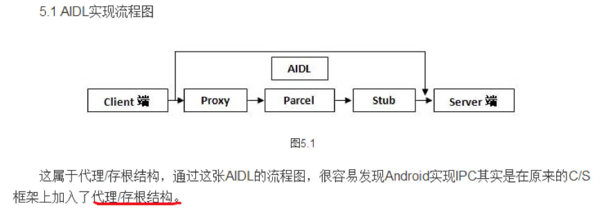

# Binder进程通信机制


## **1. 基础通信模型**

​	每个进程各自有不同的用户空间，任何一个进程的全局变量在另一个进程中是不可见的，所以进程之间要交换数据**必须通过内核**，在内核中开辟一块缓冲区，进程1把数据从用户空间拷到内核缓冲区，进程2从内核缓冲区把数据读走，内核提供的这种机制称为(IPC,InterProcess Communication)。如下图所示：



## **2. 进程隔离**

​	进程和进程之间内存不是共享的。

### **3. 进程空间划分：用户空间(user space)/内核空间(kernel spce)**

​	例如4G的内存，linux最多分配1G字节供内核空间使用，其他供各进程使用。

### **4. 系统调用：用户态和内核态**

虽然从逻辑上进行了用户空间和内核空间的划分，但不可避免的用户空间需要访问内核资源，比如文件操作、访问网络等等。为了突破隔离限制，就需要借助**系统调用**来实现。系统调用是用户空间访问内核空间的唯一方式，保证了所有的资源访问都是在内核的控制下进行的，避免了用户程序对系统资源的越权访问，提升了系统安全性和稳定性。	Linux 使用两级保护机制：0 级供系统内核使用，3 级供用户程序使用。

当一个任务（进程）执行系统调用而陷入内核代码中执行时，称进程处于**内核运行态（内核态）**。此时处理器处于特权级最高的（0级）内核代码中执行。当进程处于内核态时，执行的内核代码会使用当前进程的内核栈。每个进程都有自己的内核栈。

当进程在执行用户自己的代码的时候，我们称其处于**用户运行态（用户态）**。此时处理器在特权级最低的（3级）用户代码中运行。

系统调用主要通过如下两个函数来实现：

```java
copy_from_user() //将数据从用户空间拷贝到内核空间
copy_to_user() //将数据从内核空间拷贝到用户空间
```

### 2. 传统通讯方式？

目前linux支持的IPC包括传统的管道、SystemV IPC(即消息队列/共享内存/信号量)，以及socket。

#### **1. 管道Pipe**

> 管道可用于具有亲缘关系进程间的通信，有名管道克服了管道没有名字的限制，因此，除具有管道所具有的功能外，它还允许无亲缘关系进程间的通信。

管道(半双工管道)是一种基本的IPC机制，分为无名管道和有名管道，**本质上是一种特殊的文件**[无名管道可以看做一个公用内存，是无名无形的；有名管道只是磁盘上的一个节点，而文件存储再内存缓冲页面中，与普通管道一样]。调用pipe/fifo函数是会创建一块内核缓冲区(管道)用于通信，它有一个读端有一个写端。

[流程如下图]：

父进程创建管道文件，得到两个文件描述符指向管道的两端；

fork子进程，那么子进程也具有值两个文件描述符；

父进程关闭读端，子进程关闭写端；父进程写数据，子进程读数据，管道使用**环形队列**实现的，数据从写端流入读端，这样实现了进程间通讯。



[无名管道限制]：

(1) 半双工的，数据只能单向流动；

(2) 它们只能在具有公共祖先的进程之间使用,通常为父子进程(有名管道已解决)；

(3) 数据大小有限制。

#### **2. 信号量**

​	信号量(Semaphore)可以被看成一种具有原子操作的计数器，它控制多个进程对**共享资源**的访问，通常描述临界资源当中，表示临界资源的数目，常常被当做**锁**(lock)来使用，防止一个进程访问另外一个进程正在使用的资源。

​	信号量不具备数据交换功能，主要目的是包含临界资源。

​	[工作原理]：

​	P(sv)：如果sv的值大于零，就给它减1；如果它为零，就挂起该进程的执行；

​	V(sv)：如果其他进程因sv而被挂起，就让他恢复运行，如果没有进程因等待sv而挂起，就给它加1。

举个例子，就是两个进程共享信号量sv，一旦其中一个进程执行了P(sv)操作，它将得到信号量，并可以进入临界区，使sv减1。而第二个进程将被阻止进入临界区，因为当它试图执行P(sv)时，sv为0，它会被挂起以等待第一个进程离开临界区域并执行V(sv)释放信号量，这时第二个进程就可以恢复执行。

#### **3. 共享内存**

​	共享内存指：把所有需要使用的共享数据都存放在共享内存(IPC shared memory region)区域中,任何想要访问这些共享数据的进程都必须在自己的进程地址空间中新增加一块内存区域,用来映射存放共享数据的物理内存页面;也就是说,任何想要访问这些共享数据的进程都必须把存放共享数据的物理内存页面的全部地址空间都映射到自己的进程地址空间中;这就是System V共享内存的实现机制;



[优点]：传输速度最快，无数据大小限制，不需要复制；

[缺点]：没有提供同步机制，需要与信号量配合使用；

#### **4. 消息队列**

​	消息队列的本质就是由内核创建的用于存放消息的**链表或链表**，由于是存放消息的，所以我们就把这个链表称为了消息队列。通信的进程通过共享操作同一个消息队列，就能实现进程间通信。

​	

[优势]：

​	消息队列与管道以及有名管道相比，具有更大的灵活性，适合分布式场景。首先，它提供有格式字节流，有利于减少开发人员的工作量；其次，消息具有类型，在实际应用中，可作为优先级使用。这两点是管道以及有名管道所不能比的。同样，消息队列可以在几个进程间复用，而不管这几个进程是否具有亲缘关系，这一点与有名管道很相似；但消息队列是随内核持续的，与有名管道（随进程持续）相比，生命力更强，应用空间更大。

#### **5. Socket**

​	Socket API原本是为网络通讯设计的，后来在socket框架上发展出一种IPC机制，就是UNIX Domain Socket。更有效率，不需要经过网络协议栈，不需要打包拆包、计算校验等，只是将应用层数据从一个进程copy到另一个进程。是全双工的。


### 3. Android 进程通信比较



**其中 Intent、AIDL、Messenger、COntentProvider都是基于Binder实现。**

### 4. Binder通信机制

#### **1. 介绍**

> 来源：Android之父团队研发，后来开源OpenBinder。
>
> **Binder 是来自OpenBinder框架的一个用于本地IPC的技术。它使用了linux 的mmap机制把进程的用户空间的内存映射到一个叫做 `/dev/binder` 驱动设备上，使得进程间传递数据只需要复制就能完成。**

​	Binder 框架是一个完整的RPC框架，本地的IPC支持只是它其中的一个功能点。和一个普通的RPC不太一样的是，OpenBinder 的设计目标就是在针对系统的，它不会被应用层直接使用，而是需要被内置到系统里面。

​	内部使用mmap机制提高性能。简单来说，就是能够把一个文件的内容，映射到内存里面，使得进程之间对这个内存空间的操作能够同步到那个文件上，同时文件里面的改动也能同步到内存里面。需要注意的是，这里说的`文件`，指的是linux上广义的文件。在linux上，一切皆文件。

​	这其中"内存映射" 这个过程，是在B进程启动的时候，就已经做过映射的。这里映射的，是一个驱动 `/dev/binder`，这个驱动也是一个 ”文件“。每一个进程启动后，都会在自己的进程内部指定一块内存，用来接收来自启动程序的数据。这一块内存区域会和内核空间的文件 `/dev/binder` 进行映射。

当有IPC要发生的时候，进程A之间把数据复制到内核中，也就是写到 `/dev/binder` 里面对应的位置，正好这一段位置就是进程B的用户空间。

我们可以看到，binder 驱动在这个机制中担任了核心的位置，它是一个虚拟的驱动，并没有真实的设备，在IPC的时候把它当作一个文件来和用户空间的内存进行一个映射。也就是这个内存映射的存在，使得数据的复制次数降低到了1，也就是所谓的“一次拷贝”。

主要包含四个部分：

- **Client进程**

  使用服务的进程。客户端要想访问Binder的远程服务，就必须获取远程服务的Binder对象在binder驱动层对应的binder驱动层对应的mRemote引用。当获取到mRemote对象的引用后，就可以调用相应Binde对象的服务了。

- **Server进程**

  提供服务的进程。一个Binder服务器就是一个Binder类的对象。当创建一个Binder对象后，内部就会开启一个线程，这个线程用户接收binder驱动发送的消息，收到消息后，会执行相关的服务代码。

- **ServiceManager进程**

  将字符形式的Binder名字转化为Client中对该Binder的引用，使得Client能够通过Binder名称获取对应Serview的Binder实体的引用。需要注意的是此处的Service Manager是指Native层的ServiceManager（C++），并非指framework层的ServiceManager(Java)。

- **Binder驱动**

  驱动负责进程之间Binder通信的建立，Binder在进程之间的传递，Binder引用计数管理，数据包在进程之间的传递和交互等一系列底层支持。当服务端成功创建一个Binder对象后，Binder驱动也会相应创建一个mRemote对象，该对象的类型也是Binder类，客户就可以借助这个mRemote对象来访问远程服务。



​	图中的Client,Server,Service Manager之间交互都是虚线表示，是由于它们彼此之间不是直接交互的，而是都通过与[Binder驱动](https://link.jianshu.com?t=http%3A%2F%2Fgityuan.com%2F2015%2F11%2F01%2Fbinder-driver%2F)进行交互的，从而实现IPC通信方式。其中Binder驱动位于内核空间，Client,Server,Service Manager位于用户空间。Binder驱动和Service Manager可以看做是Android平台的基础架构，而Client和Server是Android的应用层，开发人员只需自定义实现client、Server端，借助Android的基本平台架构便可以直接进行IPC通信。

#### **2. 优劣势**

- 性能

  传统通信方式问题：

  1. 性能低下，一次数据传递需要经历：用户缓存区->内核缓存区->用户缓存区，需要经历2次拷贝；
  2. 接受数据的缓存区由数据接受者提供，但它不知道需要多大空间，只能尽量开辟大点空间或先获取消息头来获取消息大小，浪费空间或时间。

  **Binder内存映射**

  > 内存映射是通过mmap()实现，mmap()是操作系统中一种内存映射的方法。内存映射简单的讲，**就是将用户空间的一块内存区域映射到内核缓存区**。映射关系建立后，用户对这块区域的修改可以直接反应到内核空间；反之内核空间对这段数据的修改立即反应到用户空间。
  >
  > 内存映射能减少数据拷贝次数，实现用户空间和内核空间的高效互动。两个空间各自的修改能直接反映在映射的内存区域，从而被对方空间及时感知。也正因为如此，内存映射能够提供对进程间通信的支持。

| IPC方式                                     | 数据拷贝次数 |
| ------------------------------------------- | ------------ |
| 共享内存(控制复杂，难以使用)                | 0            |
| Binder                                      | 1            |
| Socket/管道/消息队列(2次copy，socket开销大) | 2            |

- 稳定性，低功耗

  基于Client-Server结构，架构清晰、职责明确。

- 安全性

  为每个app分配UID，进程的UID是鉴别进程身份的重要标志。同时 Binder 既支持实名 Binder，又支持匿名 Binder，安全性高。

#### **3. 程序调用**

```java
//获取WindowManager服务引用
WindowManager wm = (WindowManager)getSystemService(getApplication().WINDOW_SERVICE);  
//布局参数layoutParams相关设置略...
View view=LayoutInflater.from(getApplication()).inflate(R.layout.float_layout, null);  
//添加view
wm.addView(view, layoutParams);
```

**注册服务(addService)：**在Android开始过程中，Android会初始化系统的各种Service，并将这些Service向ServiceManager注册(即让其管理)。这一步是系统自动完成的。

**获取服务(getService)：**客户端想要得到具体的Service直接向ServiceManager要即可。客户端首先向ServiceManager查询得到具体的Service的引用，通常是Service引用的代理对象，对数据进行一些处理操作。

**使用服务：**通过这个引用向具体的服务器发送请求，服务器完成后就返回。

具体执行过程：



#### **5. Aidl实现**

​	Aidl基于底层binder机制实现，使用Proxy/Stub模式(Stub 跟 Proxy 是一对，俗称“代理-桩”，一般用在远程方法调用,如遥控器、售货机、取款机等)。当我们创建一个AIdl文件，会生成一个接口文件,最重要的是三个部分，`Proxy`，`Stub`和`asInterface`。



```java
/*
 * This file is auto-generated.  DO NOT MODIFY.
 * Original file: /Users/QisenTang/Program/Wandoulabs/baymax/packages/baymax/src/main/aidl/com/wandoujia/baymax/aidl/IMultiply.aidl
 */
package com.wandoujia.baymax.aidl;
// Declare any non-default types here with import statements

public interface IMultiply extends android.os.IInterface {
  /**
   * Local-side IPC implementation stub class.
   */
  public static abstract class Stub extends android.os.Binder implements com.wandoujia.baymax.aidl.IMultiply {
    private static final java.lang.String DESCRIPTOR = "com.wandoujia.baymax.aidl.IMultiply";

    /**
     * Construct the stub at attach it to the interface.
     */
    public Stub() {
      this.attachInterface(this, DESCRIPTOR);
    }

    /**
     * Cast an IBinder object into an com.wandoujia.baymax.aidl.IMultiply interface,
     * generating a proxy if needed.
     */
    public static com.wandoujia.baymax.aidl.IMultiply asInterface(android.os.IBinder obj) {
      // 自动生成代理
      if ((obj == null)) {
        return null;
      }
      android.os.IInterface iin = obj.queryLocalInterface(DESCRIPTOR);
      if (((iin != null) && (iin instanceof com.wandoujia.baymax.aidl.IMultiply))) {
        return ((com.wandoujia.baymax.aidl.IMultiply) iin);
      }
      return new com.wandoujia.baymax.aidl.IMultiply.Stub.Proxy(obj);
    }

    @Override
    public android.os.IBinder asBinder() {
      return this;
    }

    @Override
    public boolean onTransact(int code, android.os.Parcel data, android.os.Parcel reply, int flags) throws android.os.RemoteException {
      switch (code) {
        case INTERFACE_TRANSACTION: {
          reply.writeString(DESCRIPTOR);
          return true;
        }
        case TRANSACTION_multiply: {
          // 读取client数据，执行返回
          data.enforceInterface(DESCRIPTOR);
          long _arg0;
          _arg0 = data.readLong();
          long _arg1;
          _arg1 = data.readLong();
          long _result = this.multiply(_arg0, _arg1);
          reply.writeNoException();
          reply.writeLong(_result);
          return true;
        }
      }
      return super.onTransact(code, data, reply, flags);
    }

    // 接受远程Binder实现client调用
    private static class Proxy implements com.wandoujia.baymax.aidl.IMultiply {
      private android.os.IBinder mRemote;

      Proxy(android.os.IBinder remote) {
        mRemote = remote;
      }

      @Override
      public android.os.IBinder asBinder() {
        return mRemote;
      }

      public java.lang.String getInterfaceDescriptor() {
        return DESCRIPTOR;
      }

      @Override
      public long multiply(long left, long right) throws android.os.RemoteException {
        android.os.Parcel _data = android.os.Parcel.obtain();
        android.os.Parcel _reply = android.os.Parcel.obtain();
        long _result;
        try {
          // 读取数据，调用远程binder
          _data.writeInterfaceToken(DESCRIPTOR);
          _data.writeLong(left);
          _data.writeLong(right);
          mRemote.transact(Stub.TRANSACTION_multiply, _data, _reply, 0);
          _reply.readException();
          _result = _reply.readLong();
        } finally {
          _reply.recycle();
          _data.recycle();
        }
        return _result;
      }
    }
    static final int TRANSACTION_multiply = (android.os.IBinder.FIRST_CALL_TRANSACTION + 0);
  }

  public long multiply(long left, long right) throws android.os.RemoteException;
}
```


- 参考

[binder参考文章1](https://www.cnblogs.com/baronzhang/p/8784458.html)

[binder参考文章2](https://blog.csdn.net/augfun/article/details/82343249)

[红茶一杯话Binder](https://www.cnblogs.com/lzlltmf/p/5836903.html)

[知乎binder](https://zhuanlan.zhihu.com/p/137812696)

[aidl使用方式](https://www.cnblogs.com/huangjialin/p/7738104.html)

[aidl原理](https://www.jianshu.com/p/9a13f1afbc6e/)

[自定义aidl进程通信实例](https://github.com/BaronZ88/HelloBinder)