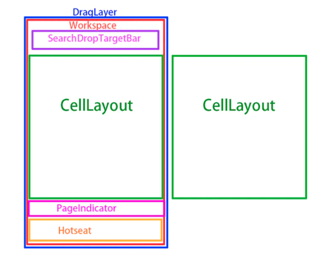

### Launcher启动流程

[TOC]

#### 1. 介绍

>  Launcher是系统初始化后启动的**第一个应用程序**，负责展示系统中所有app到桌面，并进行响应。单单从应用角度来讲，Launcher是其他的应用一样，也是packages/apps/下面的一个apk。
>
> 主要包含： LauncherActivity、LauncherAppsService等

​	Launcher本质上就是一个app，用来对手机上其他app进行管理或启动。才代码上来说多了`<category android:name="android.intent.category.HOME" />`属性，单击home键会跳转到这个界面。

#### 2. 桌面基本结构

​	桌面其实是一个Activity，只是与平常的应用不同，它用来显示图标、Widget和文件夹等。

UI结构如下：

- Workspace层

  手机显示父组件。

- DragLayter层

  拖动层。

- Celllayout层

  一个workspace包含多个celllayout，多个横向并排显示，每个宽度占满屏幕，用来显示其他应用图标。

- PageIndiator层

  指示器

- Hotset

  放置短信、电话等常用应用图标。拖动时不滑动。

  当用户长按桌面时，中间的CellLayout会缩小，下面的Hotseat和上面的SearchDropTargetView会隐藏，从而显示出隐藏的三个菜单按钮。

#### 启动流程

1. 系统启动时，Zygote进程fork出SystemServer进程，执行SystemServer.java类；
2. SystemServer会启动AMS、PMS以及其他service;
3. PMS解析本地应用，并把数据信息保存起来(包括launcher app)；
4. AMS触发systemReady(...)方法，其中执行了startHomeActivity(...);
5. 构建home intent,然后通过PMS查找到一个符合HomeIntent的Activity；
6. 启动Acitvity。

