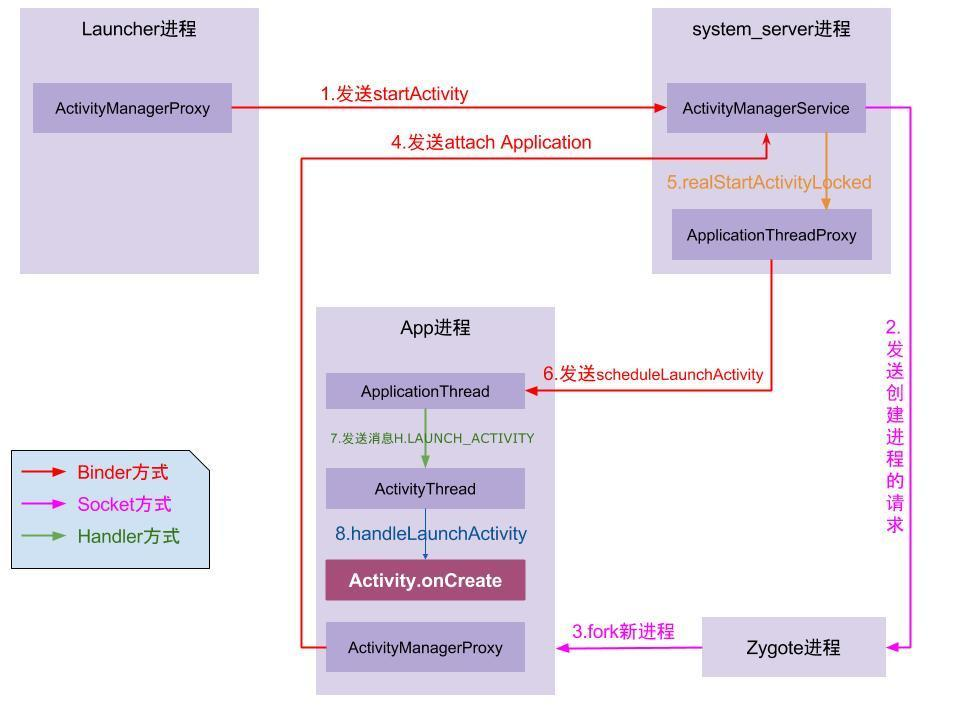

### Activity启动流程

[TOC]

#### 1. 介绍

>  **大致流程：(背诵)**
>
>  单击桌面图标 -> 发送请求到AMS-> Zygote fork新进程->ActivityThread执行main方法(handler loop)
>
>  ->通过attach函数创建ApplicationThread于AMS通信(server端)`                mgr.attachApplication(mAppThread);`
>
>  ->AMS发送bindApplication message -> create application(onCreate)
>
>  ->AMS发送 launcherActivity message -> Activity attach创建PhoneWindow对象(包含空DecorViewFL)
>
>  =》在onCreate的`setContentView(layoutId)`中将布局加载到DecorView的content中
>
>  =》在onResume中将DecorView添加到WindowManager中`wm.addView(mDecor, getWindow().getAttributes());`
>
>  =》在WindowManagerGlobal中分别报错view，和新创建的ViewRootImpl，然后执行root.setView进行遍历绘制。
>
>  =>ViewRoot执行测量绘制、然后与WMS通信提供窗口信息或接受窗口事件到view。

- ActivityThread

  代表App的主线程，它是app的入口类，main函数被加载，执行loop循环。

  ```java
    public static void main(String[] args) {
          ......
          Looper.prepareMainLooper();
          ActivityThread thread = new ActivityThread();//实例化这个类
          thread.attach(false);//这个attach也很关键后面分析.
          if (sMainThreadHandler == null) {
              sMainThreadHandler = thread.getHandler();//很重要mainHandler用于处理UI线程的各种信息
          }
          ......
          Looper.loop();
          //可以看出来主线程也是在无限的循环的，异常退出循环的时候会报错.
          throw new RuntimeException("Main thread loop unexpectedly exited");
      }
  ```

  

- final H mH = new H();

  这个H是继承自Handler的,它是个私有的内部类，其实就是主线程的Handler，通过这个Handler就可以往主线程的消息队列发消息如：启动Activity、service，接收广播等等,很多重要的工作.

- ApplicationThread

  > 该类是ActivityThread的内部类，一个成员变量，用于和AMS Binder通信 `private class ApplicationThread extends IApplicationThread.Stub {}`，然后通话mH发送message。

  与AMS绑定代码如如下：

  ```java
  private void attach(boolean system) {
      // 省略部分代码
      // IActivityManager是一个接口，具体的实现类是ActivityManagerService
      final IActivityManager mgr = ActivityManager.getService();
      try {
          // mAppThread是ActivityThread类里面的一个内部类!!!
          mgr.attachApplication(mAppThread);
      } catch (RemoteException ex) {
          throw ex.rethrowFromSystemServer();
      }
  ```
  
- AMS发送BindApplicaiton

  AMS准备进程启动数据信息，调用ApplicationThread的bindApplication函数,开始创建Application。

  ```java
  private void handleBindApplication(AppBindData data) {
      ...
      mInstrumentation = (Instrumentation)
          cl.loadClass(data.instrumentationName.getClassName())
          .newInstance();
      //通过反射初始化一个Instrumentation仪表。后面会介绍。
      ...
      Application app = data.info.makeApplication(data.restrictedBackupMode, null);
      //通过LoadedApp命令创建Application实例
      mInitialApplication = app;
      ...
      mInstrumentation.callApplicationOnCreate(app);
      //让仪器调用Application的onCreate()方法
      ...
  }
  ```

  Instrumentation仪表：会在应用程序的任何代码运行之前被实例化，用于监控系统和应用程序的所以交互。

- Launcher Activity

  当Application初始化完成后，系统会更具Manifests中的配置的启动Activity发送一个Intent去启动相应的Activity。 发送Launcher_Activity消息。

#### 2. 流程



-  例子
   1. 单击桌面淘宝图标，Launcher通知AMS启动淘宝APP(清单文件中的入口类);
   2. AMS记录要启动的Activity信息，并且通知Launcher进入pause状态;
   3. Launcher进入pause状态后，通知AMS已经paused了，可以启动淘宝了;
   4. 淘宝app未开启过，所以AMS启动新的进程，并且在新进程中创建ActivityThread对象，执行其中的main函数方法;
   5. 淘宝app主线程启动完毕后通知AMS，并传入applicationThread以便通讯;
   6. AMS通知淘宝绑定Application并启动MainActivity;
   7. 淘宝启动MainActivitiy，并且创建和关联Context,最后调用onCreate方法。
