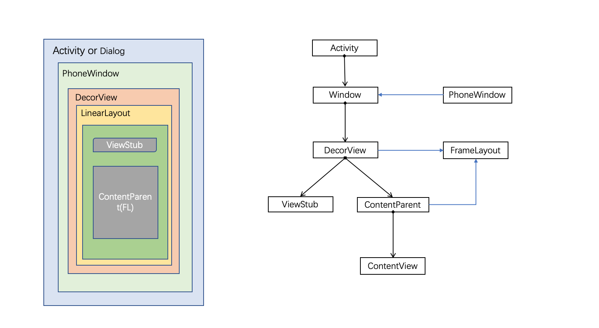
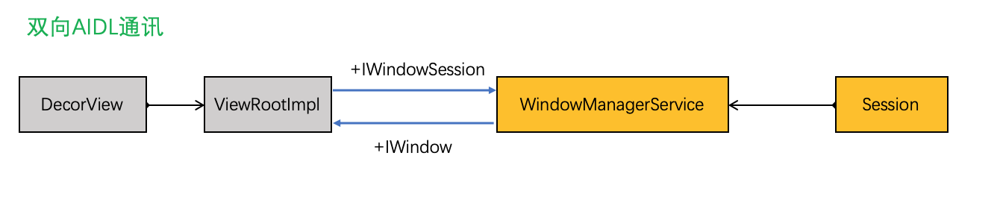
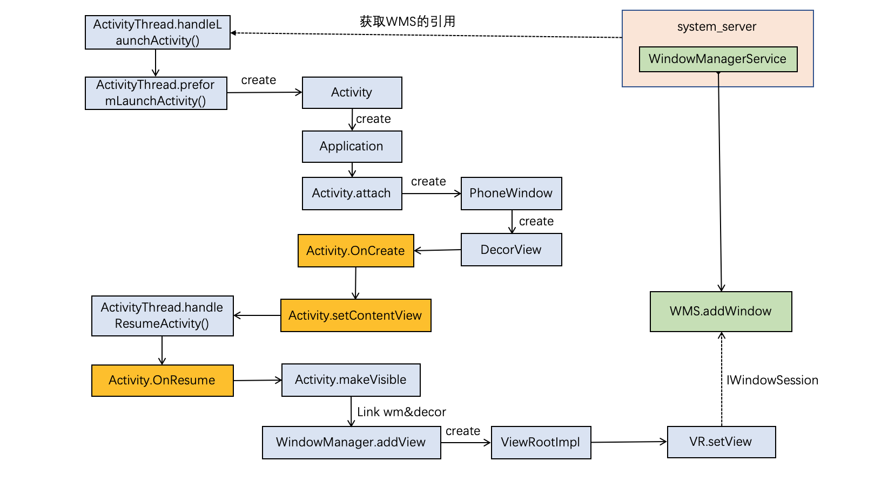

### Windows加载机制

[TOC]

#### 1. 基本概念

###### 1. Window

​	Window是一个抽象类，具体实现是PhoneWindow。Android中所以的视图都是通过Window来呈现的。

`每一个Window对应一个DecorView和ViewRootImpl`,Window和View通过ViewRootImpl来建立联系，Window并不是实际存在的，View才是Window存在的实体(View不能单独存在，必须依附在Window上)。

###### 2. Window和WindowManager

​	**WindowManager是外界访问Window的入口，** WindowManager继承ViewManager，常用的有三个功能：

- 创建一个Window并增加View(addView)；
- 更新Window中的View；
- 删除一个View；

###### 3. Window的创建过程

​	ActivityThread中的`performLaunchActivity()`来完成启动过程，并调用`attach`方法，在`attach`中完成PhoneWindow的创建：

`mWindow = new PhoneWindow(this, window, activityConfigCallback);`

###### 4. DecorView

​	DecorView是一个FrameLayout，是Activity中顶级View，一般包括标题栏和内容栏，但随着主题的变化而变化；内容栏是一定存在的，完整的id为android.R.id.content;在Activity中的setContentView设置布局文件。

```java
 public void setContentView(int layoutResID) {
        // 如果mContentParent为空，就去创建一个DecorView
        if (mContentParent == null) {
            installDecor();
        } else if (!hasFeature(FEATURE_CONTENT_TRANSITIONS)) {
        //如果不为空，就删除其中的View
            mContentParent.removeAllViews();
        }

        if (hasFeature(FEATURE_CONTENT_TRANSITIONS)) {
            final Scene newScene = Scene.getSceneForLayout(mContentParent, layoutResID,
                    getContext());
            transitionTo(newScene);
        } else {
        //把布局文件添加到mContentParent中
            mLayoutInflater.inflate(layoutResID, mContentParent);
        }
        mContentParent.requestApplyInsets();
        final Callback cb = getCallback();
        if (cb != null && !isDestroyed()) {
        //回调通知，内容发生改变了
            cb.onContentChanged();
        }
        mContentParentExplicitlySet = true;
    }
```

```java
// 生成DecorView
protected DecorView generateDecor(int featureId) {
        ......
        return new DecorView(context, featureId, this, getAttributes());
}
```

这里的mContentParent实际上是前面提到的id为content的FrameLayout.

​	而generateLayout()主要就是先获取主题的样式，然后根据样式加载对应的布局到DecorView中，然后再获取mContentParent并返回，就可以把布局文件添加到mContentParent中了，即Activity所需要展示的布局.
到这为止，Activity的布局文件已经成功添加到了DecorView的mContentParent中，**但是DecorView还没有被WindowManager添加到Window中，即用户还不能看到视图.！！！**

###### 5. DecorView的展示

​	在ActivityThread的`handleResumeActivity`方法中，会首先调用Activity的onResume方法，接着调用Activity的**makeVisible()**:

```java
void makeVisible() {
  if (!mWindowAdded) {
    ViewManager wm = getWindowManager();
    wm.addView(mDecor, getWindow().getAttributes());
    mWindowAdded = true;
  }
  mDecor.setVisibility(View.VISIBLE);
}
```

到此DecorView真正完成添加和显示两个过程，视图可见了。

​	我们来看下addView方法，WindowManager是个接口，具体实现类是WindowManagerImpl，其内部调用`WindowManagerGlobal.addView()`：

```java
 public void addView(View view, ViewGroup.LayoutParams params,
            Display display, Window parentWindow) {
        ......
        ViewRootImpl root;
        root = new ViewRootImpl(view.getContext(), display);
        view.setLayoutParams(wparams);

        mViews.add(view);
        mRoots.add(root);
        mParams.add(wparams);
       ......
       try {
       	  //将DecorView交给ViewRootImpl
          root.setView(view, wparams, panelParentView);
       } catch (RuntimeException e) {
        }
    }
```

这是实例化了**ViewRootImpl**对象，然后调用`setView`方法，经过一系列处理后最终调用`performTraversals()`方法，开始进行View的measure、layout、draw，把界面显示出来。

###### 6. ViewRoot

​	ViewRoot对应于ViewRootImpl类(不真实存在)，是连接**DecorView**和**WindowManager**的纽带，View的三大流程操作都是有ViewRoot完成。在ActivityThread中，Activity对象创建成功后，会将DecorView添加到Window中，并创建ViewRootImpl对象，并将DecorView和ViewRootImpl进行关联。

​	`ViewRootImpl负责和WMS通讯，和WMS通讯的AIDL WindowSession虽然不是ViewRootImpl自己创建的，但是WindowManagerGlobal在和WMS联通之后，把WindowSession传递给了ViewRootImpl的。WMS和window通讯的AIDL IWindow也是ViewRootImpl创建的，可见ViewRootImpl是负责通讯的。`

​	`除了通信外，ViewRootImpl负责整个window窗口所有UI视图的Measure、Layout、Draw，ViewRootImpl.performTraversals()是整个视图树的起点。`

```java
// 作为server端接收窗口事件 move drag 
static class W extends IWindow.Stub {
  W(ViewRootImpl viewAncestor) {
            mViewAncestor = new WeakReference<ViewRootImpl>(viewAncestor);
            mWindowSession = viewAncestor.mWindowSession;
  }
	 @Override
        public void moved(int newX, int newY) {
            final ViewRootImpl viewAncestor = mViewAncestor.get();
            if (viewAncestor != null) {
                viewAncestor.dispatchMoved(newX, newY);
            }
        }
    @Override
        public void dispatchAppVisibility(boolean visible) {
            final ViewRootImpl viewAncestor = mViewAncestor.get();
            if (viewAncestor != null) {
                viewAncestor.dispatchAppVisibility(visible);  // 触发view绘制。
            }
        }
   ...     
}
```


###### 7. WindowManagerService

​	运作在Android系统自己的进程中，用于屏幕显示的逻辑控制，Window只是持有每个Activity的UI内容，但是如何显示，和其他Window如何交互，都是有WMS完成的。

​	WMS中除了可以增加、删除Window外，还通过**Z-order**概念管理Window的负责关系，Z-order大的会覆盖在小的上面。利用他可以

###### 8. Surface

> ​	一个Surface就是一个对象，该对象持有一群像素（pixels），这些像素是要被组合到一起显示到屏幕上的。你在手机屏幕上看到的每一个window（如对话框、全屏的activity、状态栏）都有唯一一个自己的surface，window将自己的内容（content）绘制到该surface中。Surface Flinger根据各个surface在Z轴上的顺序（Z-order）将它们渲染到最终的显示屏上。
>
> ​	另一种解释：在Android系统中，窗口是独占一个Surface实例的显示区域，每个窗口的Surface由WindowManagerService分配。我们可以把Surface看作一块画布，应用可以通过Canvas或OpenGL在其上面作画。画好之后，通过SurfaceFlinger将多块Surface按照特定的顺序（即Z-order）进行混合，而后输出到FrameBuffer中，这样用户界面就得以显示。

​	其中，SurfaceFlinger是Android一个服务进程，负责管理Surface。

#### 2. Android视图结构



###### 分析

1. **一个Activity对应一个Window**

   Activity并不负责视图控制，它只控制生命周期和处理事件。真正控制视图的事Window。一个Activity包含一个Window，在attach()方法中创建。

2. **一个PhoneWindow持有一个DecorView实例**

   Window内部持有一个DecorView，而这个DecorView才是View的根布局；

   Window是一个抽象类，PhoneWinow是实现类。通过创建DecorView来加载用户布局；

   Window通过WindowManager将DecorView加载其中，并将DecorView交给ViewRoot，进行视图绘制和其他交互。

3. **DecorView**

   DecorView是FrameLayout的子类，是Android的根视图节点；

   一般情况包含一个竖向的LinearLayout，**它包含上中下三部分，上面是ViewStub,延迟加载的视图(根据Theme的ActionBar)，中间是标题栏，下面是内容栏。**

   ```java
   // 具体实现与Android版本有关
   <LinearLayout xmlns:android="http://schemas.android.com/apk/res/android"
       android:fitsSystemWindows="true"
       android:orientation="vertical">
       <!-- Popout bar for action modes -->
       <ViewStub
           android:id="@+id/action_mode_bar_stub"
           android:layout_width="match_parent"
           android:layout_height="wrap_content"
           android:inflatedId="@+id/action_mode_bar"
           android:layout="@layout/action_mode_bar"
           android:theme="?attr/actionBarTheme" />
   
       <FrameLayout
           style="?android:attr/windowTitleBackgroundStyle"
           android:layout_width="match_parent"
           android:layout_height="?android:attr/windowTitleSize">
   
           <TextView
               android:id="@android:id/title"
               style="?android:attr/windowTitleStyle"
               android:layout_width="match_parent"
               android:layout_height="match_parent"
               android:background="@null"
               android:fadingEdge="horizontal"
               android:gravity="center_vertical" />
       </FrameLayout>
   
   		// Activity中用户的自定义布局加载到 content中！！！
       <FrameLayout
           android:id="@android:id/content"
           android:layout_width="match_parent"
           android:layout_height="0dip"
           android:layout_weight="1"
           android:foreground="?android:attr/windowContentOverlay"
           android:foregroundGravity="fill_horizontal|top" />
   </LinearLayout>
   ```

   

#### 2. Android UI Window加载过程

###### 设计思路



​	ViewRootImpl持有与WMS通讯的AIDL WindowSession，WMS持有与ViewRootImp通讯的AIDL IWindow，这个IWindow也是ViewRootImpl注册到WMS里面的。



###### 分析

- 涉及类

  ```java
  /**
  	* ViewManager 添加、删除、更新View
  	*/
  public interface ViewManager
  {
      public void addView(View view, ViewGroup.LayoutParams params);
      public void updateViewLayout(View view, ViewGroup.LayoutParams params);
      public void removeView(View view);
  }
  /**
  	* ViewParent 父View交互API
  	*/
  public interface ViewParent {
    	// 导致View的onMeasure、onLayout、onDraw方法被调用
      public void requestLayout();
    	...
  }
  
  /**
  	* ViewGroup
  	*/
  public abstract class ViewGroup extends View implements ViewParent, ViewManager {
    // Child views of this ViewGroup
    private View[] mChildren;
    private int mChildrenCount;
    
    public void addView(View child, int index, LayoutParams params) {
      // addViewInner() will call child.requestLayout() when setting the new LayoutParams
      // therefore, we call requestLayout() on ourselves before, so that the child's request
      // will be blocked at our level
      requestLayout();
      invalidate(true);
      addViewInner(child, index, params, false);
    }
    ...
  }
  ```

  **WindowManagerImpl实现了WindowManager接口：**

  > 注意：
  >
  > 不管是`WindowManagerImpl`还是ViewGroup的addView(View view, ViewGroup.LayoutParams params)方法都是来自于`ViewManager`接口，但是在ViewGroup中是将普通的view或者ViewGroup作为Children加入，但是在`WindowManagerImpl`是将`DecorView`作为根布局加入到PhoneWindow中去，虽然都是基于同一个`ViewManager`接口，但是起作用截然不同.

  ```java
  // windown交互管理类
  public final class WindowManagerImpl implements WindowManager {
      private final WindowManagerGlobal mGlobal = WindowManagerGlobal.getInstance();
    
        ...
        @Override
      public void addView(@NonNull View view, @NonNull ViewGroup.LayoutParams params) {
          applyDefaultToken(params);
          mGlobal.addView(view, params, mContext.getDisplay(), mParentWindow);
      }
        ...
  }
  
  // 单例window全局管理类
  public final class WindowManagerGlobal {
    	private static WindowManagerGlobal sDefaultWindowManager;
      private static IWindowManager sWindowManagerService;
      private static IWindowSession sWindowSession;
  		// 存储viewList,ViewRootImplList.
      private final ArrayList<View> mViews = new ArrayList<View>();
      private final ArrayList<ViewRootImpl> mRoots = new ArrayList<ViewRootImpl>();
      private final ArrayList<WindowManager.LayoutParams> mParams =
              new ArrayList<WindowManager.LayoutParams>();
      private final ArraySet<View> mDyingViews = new ArraySet<View>();
  
    	// viewrootimpl创建
    	public void addView(View view, ViewGroup.LayoutParams params,
              Display display, Window parentWindow) {  	
      	ViewRootImpl root;
        View panelParentView = null;
       	// begin	
        root = new ViewRootImpl(view.getContext(), display);
        view.setLayoutParams(wparams);
  			// 保存到List
        mViews.add(view);
        mRoots.add(root);
        mParams.add(wparams);
        // do this last because it fires off messages to start doing things
        root.setView(view, wparams, panelParentView);
        ...
      }
  }
  
  // viewRootImpl通信类
  public final class ViewRootImpl implements ViewParent,
          View.AttachInfo.Callbacks, ThreadedRenderer.DrawCallbacks {
      // 与WMS通信接口
      final IWindowSession mWindowSession;
      // 显示类
      @NonNull Display mDisplay;
      final DisplayManager mDisplayManager;      
  
      public void setView(View view, WindowManager.LayoutParams attrs, View panelParentView) {
      	...
        // Schedule the first layout -before- adding to the window
        // manager, to make sure we do the relayout before receiving
        // any other events from the system.
        requestLayout();   // 1.触发绘制流程 
        // 通信WMS添加显示view  2. 通过IPC 执行WMS.addWindow方法。
        // 通过WindowSession进行IPC调用，将View添加到Window上
        // mWindow即W类，用来接收WMS信息；同时通过InputChannel接收触摸事件回调。
        res = mWindowSession.addToDisplay(mWindow, mSeq, mWindowAttributes,
                              getHostVisibility(), mDisplay.getDisplayId(),
                              mAttachInfo.mContentInsets, mAttachInfo.mStableInsets,
                              mAttachInfo.mOutsets, mInputChannel);
      	...
      }
            
      @Override
      public void requestLayout() {
          if (!mHandlingLayoutInLayoutRequest) {
              checkThread();
              mLayoutRequested = true;
              scheduleTraversals();
          }
      }
      
      // 遍历View进行测量计算(2次执行)      
      private void performTraversals() {
        ...
          if (!cancelDraw && !newSurface) {
              if (mPendingTransitions != null && mPendingTransitions.size() > 0) {
                  for (int i = 0; i < mPendingTransitions.size(); ++i) {
                      mPendingTransitions.get(i).startChangingAnimations();
                  }
                  mPendingTransitions.clear();
              }
              // draw
              performDraw();
          } else {
              if (isViewVisible) {
                  // Try again！！！
                  scheduleTraversals();
              } else if (mPendingTransitions != null && mPendingTransitions.size() > 0) {
                  for (int i = 0; i < mPendingTransitions.size(); ++i) {
                      mPendingTransitions.get(i).endChangingAnimations();
                  }
                  mPendingTransitions.clear();
              }
          }
      }           
  }
  ```

**addToDisplay**

```java
   @Override
        public int addToDisplay(IWindow window, int seq, WindowManager.LayoutParams attrs,
                int viewVisibility, int displayId, Rect outContentInsets, Rect outStableInsets,
                Rect outOutsets, InputChannel outInputChannel) {
            return mService.addWindow(this, window, seq, attrs, viewVisibility, displayId,
                    outContentInsets, outStableInsets, outOutsets, outInputChannel);
        }
```

​	注意，addToDisplay是在WMS系统进程中执行的。

简单总结下Activity启动后布局显示过程：

1. SurfaceFlinger 是在init.rc解析的时候被创建的，执行其main方法，实例化了Surfaceflinger，并向ServiceManager注册，SurfaceFlinger运行在单独进程中。

2. 在 Activity 创建过程中执行 scheduleLaunchActivity() 之后便调用到了 handleLaunchActivity() 方法。首先通过Instrumentation创建Activity，然后执行Activity的attach()方法，创建 PhoneWindow，且与activity建立回调关联。获取WindowManager，层层代理最终干活的是WindowManagerGlobal。

3. setContentView过程，创建DecorView，并把xml的View树解析出来，加到DecorView上的contentParent部分。

4. Activity 调用makeVisible ，实际上是WindowManagerGlobal执行addView操作，然后调用ViewRootImpl setView操作。

5. ViewRootImpl setView 做了两件事： 1） requestLayout触发绘制流程 2）mWindowSession.addToDisplay 通过IPC 执行WMS.addWindow

6. requestLayout ：中的relayoutWindow过程中app请求SurfaceFlinger创建Surface

7. mWindowSession.addToDisplay：最终执行WMS.addWindow方法，该方法流程最终建立了app与SurfaceFlinger服务连接。

8. Android应用程序与SurfaceFlinger服务是运行在不同的进程中的，用Binder进行通信，用匿名共享内存进行UI数据传递。

9. requestLayout draw的流程中：Surface通过dequeueBuffer获取一块GraphicBuffer, 然后onDraw中通过传入的Java层Canvas 调用底层Skia引擎中的SKCanvas（画家）、SKBitmap（画布）进行具体绘制操作，绘制完成之后把图形数据放入GraphicBuffer，最后Surface执行queueBuffer，把这块带有图形数据的buffer送回BufferQueue,并通过onFrameAvailable通知Layer更新。

10. SurfaceFlinger合成图层依赖于Android的异步消息处理机制，每16ms接收一次vsync信号来执行图层合成操作，最终通过handleMessageRefresh一系列方法的处理，其中包括把GraphicBuffer数据映射为OpenGL的texture ，收集所有Layer计算显示区域，然后通过openG 或 HWC进行合成以及栅格化处理，最后送显。

    

- 参考

  [GUI系统](https://www.cnblogs.com/samchen2009/category/524173.html)

  [VSYNC设计](https://www.cnblogs.com/blogs-of-lxl/p/11443693.html)

  [Surface&SurfaceFlinger关系](http://www.360doc.com/content/18/0328/15/7377734_740892969.shtml)
  
  [参考](https://blog.csdn.net/huachao1001/article/details/52035510)

