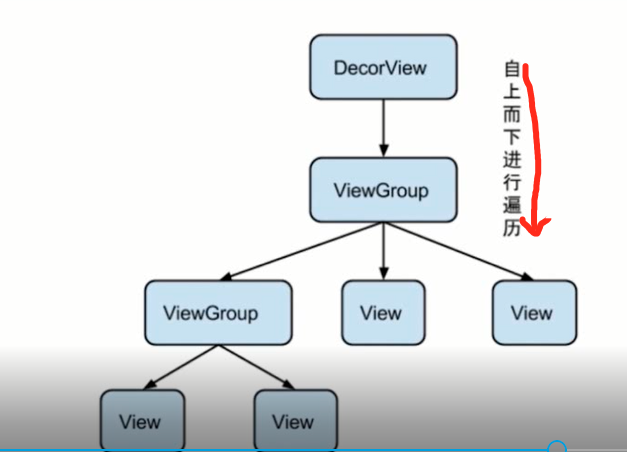

### View绘制流程

[TOC]

#### 1. 基础知识点

##### 1. 前提

```java
public final class ActivityThread extends ClientTransactionHandler {
    @Override
    public void handleResumeActivity(IBinder token, boolean finalStateRequest, boolean isForward,
            String reason) {
        if (r.window == null && !a.mFinished && willBeVisible) {
            r.window = r.activity.getWindow();
            View decor = r.window.getDecorView();
            decor.setVisibility(View.INVISIBLE);
            ViewManager wm = a.getWindowManager();
            WindowManager.LayoutParams l = r.window.getAttributes();
            a.mDecor = decor;
            if (a.mVisibleFromClient) {
                if (!a.mWindowAdded) {
                    a.mWindowAdded = true;
                    //这里调用了WindowManager的addView()方法,而我们知道WindowManager的具体实现类是WindowManagerImpl,我们到WindowManagerImpl中查看addView()的实现
                    wm.addView(decor, l);
                } else {
                    a.onWindowAttributesChanged(l);
                }
            }
        }
     ...
    }
}

public final class WindowManagerImpl implements WindowManager {
     @Override
    public void addView(@NonNull View view, @NonNull ViewGroup.LayoutParams params) {
        applyDefaultToken(params);
        //这里调用了WindowManagerGlobal类的addView()方法
        mGlobal.addView(view, params, mContext.getDisplay(), mParentWindow);
    }
}

public final class WindowManagerGlobal {
    public void addView(View view, ViewGroup.LayoutParams params,
            Display display, Window parentWindow) {
            ...
            ViewRootImpl root;
            View panelParentView = null;
            root = new ViewRootImpl(view.getContext(), display);

            view.setLayoutParams(wparams);

            mViews.add(view);
            mRoots.add(root);
            mParams.add(wparams);
            try {
                //这里调用了ViewRootImpl的setView()方法
                root.setView(view, wparams, panelParentView);
            } 
      }
}

public final class ViewRootImpl implements ViewParent,
        View.AttachInfo.Callbacks, ThreadedRenderer.DrawCallbacks {
    public void setView(View view, WindowManager.LayoutParams attrs, View panelParentView) {
        synchronized (this) {
            if (mView == null) {
                mView = view;
                ...
                //这里终于到了我们今天要开始分析的真正的主角
                requestLayout();
                ...
    }
}
```


##### 2.  View绘制的起点

​	ViewRootImpl类的`performTraversals()`是执行遍历的方法。

```java
public void setView(View view, WindowManager.LayoutParams attrs, View panelParentView) {
    	...
      requestLayout();   // 1.触发绘制流程 
      // 通信WMS添加显示view  2. 通过IPC 执行WMS.addWindow方法。
      // 通过WindowSession进行IPC调用，将View添加到Window上
      // mWindow即W类，用来接收WMS信息；同时通过InputChannel接收触摸事件回调。
      res = mWindowSession.addToDisplay(mWindow, mSeq, mWindowAttributes,
                            getHostVisibility(), mDisplay.getDisplayId(),
                            mAttachInfo.mContentInsets, mAttachInfo.mStableInsets,
                            mAttachInfo.mOutsets, mInputChannel);
    	...
}
@Override
public void requestLayout() {
  if (!mHandlingLayoutInLayoutRequest) {
    // 检查发起布局请求的线程是否为主线程  
    checkThread();
    mLayoutRequested = true;
    scheduleTraversals();
  }
}
// 开始执行遍历三大流程
private void performTraversals() { 
...... 
int childWidthMeasureSpec = getRootMeasureSpec(mWidth, lp.width); 
int childHeightMeasureSpec = getRootMeasureSpec(mHeight, lp.height); 
...... 
performMeasure(childWidthMeasureSpec, childHeightMeasureSpec); // mView.measure(childWidthMeasureSpec, childHeightMeasureSpec); 
......
performLayout(lp, mWidth, mHeight); // mView.layout(0, 0, mView.getMeasuredWidth(), mView.getMeasuredHeight());
...... 
performDraw(); // mView.draw(canvas); 
......
}
```

##### 3. MeasureSpec原理

- what: MeasureSpec类是View类的一个静态内部类，一个MeasureSpec封装了从父容器**传递**给子容器的**布局要求(规格参数测量参数)**。子View的MeasureSpec是有父类的MS和子类本身的LayoutParams共同决定。

- Why: 主要用于父类向子类传递测量参数。

- how:组成部分

  由一个`int`类型的数字表示，分为2部分：mode(模式前两位)+size(大小后30位)；

  mode类型：

  1. UNSPECIFIED：不对View大小做限制，如：ListView，ScrollView；
  2. EXACTLY：确切的大小，如：100dp或者march_parent；
  3. AT_MOST：大小不可超过某数值，如：wrap_content。

- **如何计算某个View的MS？**

  ```java
  // spec:父类宽或高ms,padding:占用空间，childDimesion子view大小
  public static int getChildMeasureSpec(int spec, int padding, int childDimension) {
      int specMode = MeasureSpec.getMode(spec);
      int specSize = MeasureSpec.getSize(spec);
      int size = Math.max(0, specSize - padding);
      int resultSize = 0;
      int resultMode = 0;
      switch (specMode) {
      // Parent has imposed an exact size on us
      若父View是EXACTLY，则父View有确切数值或者march_parent
      case MeasureSpec.EXACTLY:
          若子View的childDimension大于0，则表示有确切数值，则子View大小为其本身且mode是EXACTLY
          if (childDimension >= 0) {
              resultSize = childDimension;
              resultMode = MeasureSpec.EXACTLY;
          } 
          若子View的childDimension是MATCH_PARENT，则子View的大小为父View的大小且mode是EXACTLY
          else if (childDimension == LayoutParams.MATCH_PARENT) {
              // Child wants to be our size. So be it.
              resultSize = size;
              resultMode = MeasureSpec.EXACTLY;
          } 
          若子View的childDimension是WRAP_CONTENT，则子View的大小为父View的大小且mode是AT_MOST，表示最大不可超过父View数值
          else if (childDimension == LayoutParams.WRAP_CONTENT) {
              // Child wants to determine its own size. It can't be
              // bigger than us.
              resultSize = size;
              resultMode = MeasureSpec.AT_MOST;
          }
          break;
  
      // Parent has imposed a maximum size on us
      若父View是AT_MOST，则父View一般是wrap_content，强给子View最大的值
      case MeasureSpec.AT_MOST:
          若子View的childDimension大于0，则表示有确切数值，则子View大小为其本身且mode是EXACTLY
          if (childDimension >= 0) {
              // Child wants a specific size... so be it
              resultSize = childDimension;
              resultMode = MeasureSpec.EXACTLY;
          } 
          若子View的childDimension是MATCH_PARENT，则子View的大小不超过父View的大小且mode是AT_MOST
          else if (childDimension == LayoutParams.MATCH_PARENT) {
              // Child wants to be our size, but our size is not fixed.
              // Constrain child to not be bigger than us.
              resultSize = size;
              resultMode = MeasureSpec.AT_MOST;
          } 
         若子View的childDimension是WRAP_CONTENT，则子View的大小不超过父View的大小且mode是AT_MOST
          else if (childDimension == LayoutParams.WRAP_CONTENT) {
              // Child wants to determine its own size. It can't be
              // bigger than us.
              resultSize = size;
              resultMode = MeasureSpec.AT_MOST;
          }
          break;
  
      // Parent asked to see how big we want to be
      若父View是UNSPECIFIED，则父View不限制子View大小
      case MeasureSpec.UNSPECIFIED:
      若子View的childDimension大于0，则表示有确切数值，则子View大小为其本身且mode是EXACTLY
          if (childDimension >= 0) {
              // Child wants a specific size... let him have it
              resultSize = childDimension;
              resultMode = MeasureSpec.EXACTLY;
          } 
          若子View的childDimension是MATCH_PARENT，因为父View是UNSPECIFIED，所以子View大小为0
          else if (childDimension == LayoutParams.MATCH_PARENT) {
              // Child wants to be our size... find out how big it should
              // be
              resultSize = View.sUseZeroUnspecifiedMeasureSpec ? 0 : size;
              resultMode = MeasureSpec.UNSPECIFIED;
          }
          若子View的childDimension是WRAP_CONTENT，因为父View是UNSPECIFIED，所以子View大小为0 
          else if (childDimension == LayoutParams.WRAP_CONTENT) {
              // Child wants to determine its own size.... find out how
              // big it should be
              resultSize = View.sUseZeroUnspecifiedMeasureSpec ? 0 : size;
              resultMode = MeasureSpec.UNSPECIFIED;
          }
          break;
      }
      //noinspection ResourceType
      return MeasureSpec.makeMeasureSpec(resultSize, resultMode);
  }
  ```

  总结一下：
   不管父View是何模式，若子View有确切数值，则子View大小就是其本身大小，且mode是EXACTLY；
   若子View是match_parent，则模式与父View相同，且大小同父View（若父View是UNSPECIFIED，则子View大小为0）；
   若子View是wrap_content，则模式是AT_MOST，大小同父View，表示不可超过父View大小（若父View是UNSPECIFIED，则子View大小为0）。

#### 2. 三个阶段

View的整个绘制流程可以分为以下三个阶段：

- measure: 判断是否需要重新计算View的大小，需要的话则计算(`从顶层父View到子View递归调用measure方法，measure方法又回调OnMeasure`)；
- layout: 判断是否需要重新计算View的位置，需要的话则计算(`从顶层父View向子View的递归调用view.layout方法的过程，即父View根据上一步measure子View所得到的布局大小和布局参数，将子View放在合适的位置上`)；
- draw: 判断是否需要重新绘制View，需要的话则重绘制(`ViewRoot创建一个Canvas对象，然后调用OnDraw()。六个步骤：①、绘制视图的背景；②、保存画布的图层（Layer）；③、绘制View的内容；④、绘制View子视图，如果没有就不用；⑤、还原图层（Layer）；⑥、绘制滚动条。`)。
  这三个子阶段可以用下图来描述(measure和layout可以执行多次)：



##### measure阶段

###### 结论

​	通过`WindowManager`将`DecorView`传入`ViewRootImpl`,在`ViewRootImpl`中的`performTraversals()`方法中分别对`View`进行`measure`, `layout`, `draw`,通过`ViewGroup`的类分别对子`View`依次进行测量,摆放和绘制。

​	View树的绘制是从ViewRoot的performTraversals()方法开始，这个方法的主要作用是判断是否重新measure、是否重新layout、是否重新draw。

```java
private void performTraversals() {
        ......
        int childWidthMeasureSpec = getRootMeasureSpec(mWidth, lp.width);
        int childHeightMeasureSpec = getRootMeasureSpec(mHeight, lp.height);
        ......
        mView.measure(childWidthMeasureSpec, childHeightMeasureSpec); // mView=DocorView
        mView.layout(0, 0, mView.getMeasuredWidth(), mView.getMeasuredHeight());
        mView.draw(canvas);
        ......
    }

		// 1. 获取DecorView的MeasureSpec,默认屏幕像素高
    private int getRootMeasureSpec(int windowSize, int rootDimension) {
        int measureSpec;
        switch (rootDimension) {
            case ViewGroup.LayoutParams.MATCH_PARENT:
                measureSpec = MeasureSpec.makeMeasureSpec(windowSize, MeasureSpec.EXACTLY);
                break;
            case ViewGroup.LayoutParams.WRAP_CONTENT:
                measureSpec = MeasureSpec.makeMeasureSpec(windowSize, MeasureSpec.AT_MOST);
                break;
            default:
                measureSpec = MeasureSpec.makeMeasureSpec(rootDimension, MeasureSpec.EXACTLY);
                break;
        }
        return measureSpec;
    } 

		// 计算View大小，调用onMeasure
    public final void measure(int widthMeasureSpec, int heightMeasureSpec) {
        if ((mPrivateFlags & FORCE_LAYOUT) == FORCE_LAYOUT ||
                widthMeasureSpec != mOldWidthMeasureSpec ||
                heightMeasureSpec != mOldHeightMeasureSpec) {
            mPrivateFlags &= ~MEASURED_DIMENSION_SET;
          	// 执行onMeasure
            onMeasure(widthMeasureSpec, heightMeasureSpec);
            mPrivateFlags |= LAYOUT_REQUIRED;
        }
        mOldWidthMeasureSpec = widthMeasureSpec;
        mOldHeightMeasureSpec = heightMeasureSpec;
      
        mMeasureCache.put(key, ((long) mMeasuredWidth) << 32 |
                (long) mMeasuredHeight & 0xffffffffL); // suppress sign extension
    }

    //View的onMeasure默认实现方法，设置View的长和宽；如果写死，则外边变化时界面不变化
    protected void onMeasure(int widthMeasureSpec, int heightMeasureSpec) {
        setMeasuredDimension(getDefaultSize(getSuggestedMinimumWidth(), widthMeasureSpec),
                getDefaultSize(getSuggestedMinimumHeight(), heightMeasureSpec));
    }

    public static int getDefaultSize(int size, int measureSpec) {
        int result = size;
        int specMode = MeasureSpec.getMode(measureSpec);
        int specSize = MeasureSpec.getSize(measureSpec);
        switch (specMode) {
            case MeasureSpec.UNSPECIFIED:
                result = size;
                break;
            case MeasureSpec.AT_MOST:
            case MeasureSpec.EXACTLY:
                result = specSize;
                break;
        }
        return result;
    }
```

如果是ViewGroup，还应该进行嵌套测量

```java
// ViewGroup的默认实现
protected void measureChildren(int widthMeasureSpec, int heightMeasureSpec) {
        final int size = mChildrenCount;
        final View[] children = mChildren;
        for (int i = 0; i < size; ++i) {
            final View child = children[i];
            if ((child.mViewFlags & VISIBILITY_MASK) != GONE) {
                measureChild(child, widthMeasureSpec, heightMeasureSpec);
            }
        }
    }

    protected void measureChild(View child, int parentWidthMeasureSpec,
                                int parentHeightMeasureSpec) {
        final LayoutParams lp = child.getLayoutParams();
        final int childWidthMeasureSpec = getChildMeasureSpec(parentWidthMeasureSpec,
                mPaddingLeft + mPaddingRight, lp.width);
        final int childHeightMeasureSpec = getChildMeasureSpec(parentHeightMeasureSpec,
                mPaddingTop + mPaddingBottom, lp.height);
        child.measure(childWidthMeasureSpec, childHeightMeasureSpec);
    }  

    public static int getChildMeasureSpec(int spec, int padding, int childDimension) {
        int specMode = MeasureSpec.getMode(spec);
        int specSize = MeasureSpec.getSize(spec);
        int size = Math.max(0, specSize - padding);
        int resultSize = 0;
        int resultMode = 0;
        switch (specMode) {
            case MeasureSpec.EXACTLY:
                if (childDimension >= 0) {
                    resultSize = childDimension;
                    resultMode = MeasureSpec.EXACTLY;
                } else if (childDimension == LayoutParams.MATCH_PARENT) {
                    resultSize = size;
                    resultMode = MeasureSpec.EXACTLY;
                } else if (childDimension == LayoutParams.WRAP_CONTENT) {
                    // Child wants to determine its own size. It can't be
                    // bigger than us.
                    resultSize = size;
                    resultMode = MeasureSpec.AT_MOST;
                }
                break;
            ......
        }
        //将mode与size通过MeasureSpec方法整合为32位整数返回
        return MeasureSpec.makeMeasureSpec(resultSize, resultMode);
    }
```

**FrameLayout实现例子：**

```java
//FrameLayout 的测量实现
protected void onMeasure(int widthMeasureSpec, int heightMeasureSpec) {  
....
int maxHeight = 0;
int maxWidth = 0;
int childState = 0;
for (int i = 0; i < count; i++) {    
   final View child = getChildAt(i);    
   if (mMeasureAllChildren || child.getVisibility() != GONE) {   
    // 遍历自己的子View，只要不是GONE的都会参与测量，measureChildWithMargins方法在最上面
    // 的源码已经讲过了，如果忘了回头去看看，基本思想就是父View把自己当MeasureSpec 
    // 传给子View结合子View自己的LayoutParams 算出子View 的MeasureSpec，然后继续往下穿，
    // 传递叶子节点，叶子节点没有子View，只要负责测量自己就好了。
     measureChildWithMargins(child, widthMeasureSpec, 0, heightMeasureSpec, 0);      
     ....
     ....
   }
}
....
}  

```

​	每个View控件的实际宽高都是由父视图和自身决定的。实际的测量是在onMeasure方法进行，所以在View的子类需要重写onMeasure方法，这是因为measure方法是final的，不允许重载，所以View子类只能通过重载onMeasure来实现自己的测量逻辑。

##### layout阶段

测量完各个组件的大小之后，就可以排列他们的位置了。

```java
private void performTraversals() {
        ......
        int childWidthMeasureSpec = getRootMeasureSpec(mWidth, lp.width);
        int childHeightMeasureSpec = getRootMeasureSpec(mHeight, lp.height);
        ......
        mView.measure(childWidthMeasureSpec, childHeightMeasureSpec);
        ......
        mView.layout(0, 0, mView.getMeasuredWidth(), mView.getMeasuredHeight());
        ......
        mView.draw(canvas);
        ......
    }

    public void layout(int l, int t, int r, int b) {
        int oldL = mLeft;
        int oldT = mTop;
        int oldB = mBottom;
        int oldR = mRight;
        boolean changed = setFrame(l, t, r, b);//视图大小是否发生变化
        if (changed || (mPrivateFlags & LAYOUT_REQUIRED) == LAYOUT_REQUIRED) {
          	// 调用onLayout
            onLayout(changed, l, t, r, b);
            mPrivateFlags &= ~LAYOUT_REQUIRED;
            if (mOnLayoutChangeListeners != null) {
                ArrayList<OnLayoutChangeListener> listenersCopy =
                        (ArrayList<OnLayoutChangeListener>) mOnLayoutChangeListeners.clone();
                int numListeners = listenersCopy.size();
                for (int i = 0; i < numListeners; ++i) {
                    listenersCopy.get(i).onLayoutChange(this, l, t, r, b, oldL, oldT, oldR, oldB);
                }
            }
        }
        mPrivateFlags &= ~FORCE_LAYOUT;
    }
```

​	View中的onLayout()方法就是一个空方法，因为onLayout()过程是为了确定视图在布局中所在的位置，而这个操作应该是由布局来完成的，即父视图决定子视图的显示位置。

```java
// View的onLayout方法(空方法)
protected void onLayout(boolean changed, int left, int top, int right, int bottom) {
}
// ViewGroup的onLayout方法(子类必须实现)
protected abstract void onLayout(boolean changed, int l, int t, int r, int b);  
```

​	然而，ViewGroup中的onLayout()方法是一个抽象方法，这就意味着所有ViewGroup的子类都必须重写这个方法。自定义ViewGroup控件中，onLayout配合onMeasure方法一起使用可以实现自定义View的复杂布局。自定义View首先调用onMeasure进行测量，然后调用onLayout方法动态获取子View和子View的测量大小，然后进行layout布局。重载onLayout的目的就是安排其children在父View的具体位置，重载onLayout通常做法就是写一个for循环调用每一个子视图的layout(l, t, r, b)函数，传入不同的参数l, t, r, b来确定每个子视图在父视图中的显示位置。

下面代码以LinearLayout举例：

```java
public class LinearLayout extends ViewGroup {
    @Override
    protected void onLayout(boolean changed, int l, int t, int r, int b) {
        if (mOrientation == VERTICAL) {
            layoutVertical(l, t, r, b);
        } else {
            layoutHorizontal(l, t, r, b);
        }
    }
}

void layoutVertical(int left, int top, int right, int bottom) {
        final int paddingLeft = mPaddingLeft;
        int childTop;
        int childLeft;
        final int width = right - left;
        int childRight = width - mPaddingRight;
        int childSpace = width - paddingLeft - mPaddingRight;
        final int count = getVirtualChildCount();
        final int majorGravity = mGravity & Gravity.VERTICAL_GRAVITY_MASK;
        final int minorGravity = mGravity & Gravity.RELATIVE_HORIZONTAL_GRAVITY_MASK;
        switch (majorGravity) {
            case Gravity.BOTTOM:
                childTop = mPaddingTop + bottom - top - mTotalLength;
                break;
            case Gravity.CENTER_VERTICAL:
                childTop = mPaddingTop + (bottom - top - mTotalLength) / 2;
                break;
            case Gravity.TOP:
            default:
                childTop = mPaddingTop;
                break;
        }
        for (int i = 0; i < count; i++) {
           	// 遍历子View
            final View child = getVirtualChildAt(i);
            if (child == null) {
                childTop += measureNullChild(i);
            } else if (child.getVisibility() != GONE) {
                final int childWidth = child.getMeasuredWidth();
                final int childHeight = child.getMeasuredHeight();
                final LinearLayout.LayoutParams lp =
                        (LinearLayout.LayoutParams) child.getLayoutParams();
                int gravity = lp.gravity;
                if (gravity < 0) {
                    gravity = minorGravity;
                }
                final int layoutDirection = getLayoutDirection();
                final int absoluteGravity = Gravity.getAbsoluteGravity(gravity, layoutDirection);
                switch (absoluteGravity & Gravity.HORIZONTAL_GRAVITY_MASK) {
                    case Gravity.CENTER_HORIZONTAL:
                        childLeft = paddingLeft + ((childSpace - childWidth) / 2)
                                + lp.leftMargin - lp.rightMargin;
                        break;
                    case Gravity.RIGHT:
                        childLeft = childRight - childWidth - lp.rightMargin;
                        break;
                    case Gravity.LEFT:
                    default:
                        childLeft = paddingLeft + lp.leftMargin;
                        break;
                }
                if (hasDividerBeforeChildAt(i)) {
                    childTop += mDividerHeight;
                }
                childTop += lp.topMargin;
              	// 确定矩形大小，在调用子view的OnLayout计算最终大
                setChildFrame(child, childLeft, childTop + getLocationOffset(child),
                        childWidth, childHeight);
                childTop += childHeight + lp.bottomMargin + getNextLocationOffset(child);
                i += getChildrenSkipCount(child, i);
            }
        }
    }
```


##### draw阶段

```java
public void draw(Canvas canvas) {  
    final int privateFlags = mPrivateFlags;  
    final boolean dirtyOpaque = (privateFlags & DIRTY_MASK) == DIRTY_OPAQUE &&  
            (mAttachInfo == null || !mAttachInfo.mIgnoreDirtyState);  
    mPrivateFlags = (privateFlags & ~DIRTY_MASK) | DRAWN;  
    // Step 1, draw the background, if needed  
    int saveCount;  
    if (!dirtyOpaque) {  
        final Drawable background = mBGDrawable;  
        if (background != null) {  
            final int scrollX = mScrollX;  
            final int scrollY = mScrollY;  
            if (mBackgroundSizeChanged) {  
                background.setBounds(0, 0,  mRight - mLeft, mBottom - mTop);  
                mBackgroundSizeChanged = false;  
            }  
            if ((scrollX | scrollY) == 0) {  
                background.draw(canvas);  
            } else {  
                canvas.translate(scrollX, scrollY);  
                background.draw(canvas);  
                canvas.translate(-scrollX, -scrollY);  
            }  
        }  
    }  
    final int viewFlags = mViewFlags;  
    boolean horizontalEdges = (viewFlags & FADING_EDGE_HORIZONTAL) != 0;  
    boolean verticalEdges = (viewFlags & FADING_EDGE_VERTICAL) != 0;  
    if (!verticalEdges && !horizontalEdges) {  
        // Step 3, draw the content  
        if (!dirtyOpaque) onDraw(canvas);  
        // Step 4, draw the children  
        dispatchDraw(canvas);  
        // Step 6, draw decorations (scrollbars)  
        onDrawScrollBars(canvas);  
        // we're done...  
        return;  
    }  
}
```

