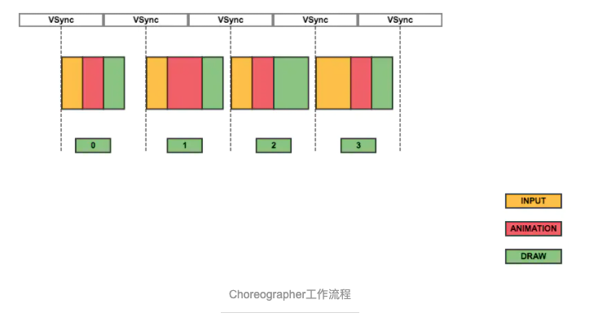

# Choreographer机制

[TOC]

## 一、简介

> 在Android4.1之后添加了Choreographer机制，用于同Vsync机制配合，统一动画、输入和绘制时机。
>
> Choreographer以每秒60帧的时间，接受垂直信号。你设置的callCack会在下一个frame被渲染时触发。Callback有4种类型，Input、Animation、Draw。动画会根据当前时间查询得的对应的动画执行数据(矩阵数据)，然后执行。

[参考1](https://blog.csdn.net/stven_king/article/details/80153400)

[参考2](https://www.jianshu.com/p/bab0b454e39e)

