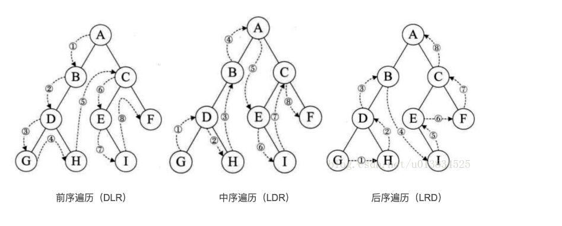
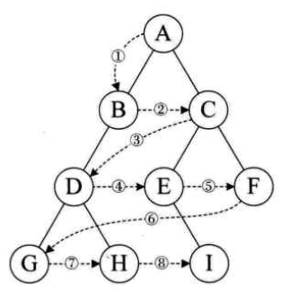
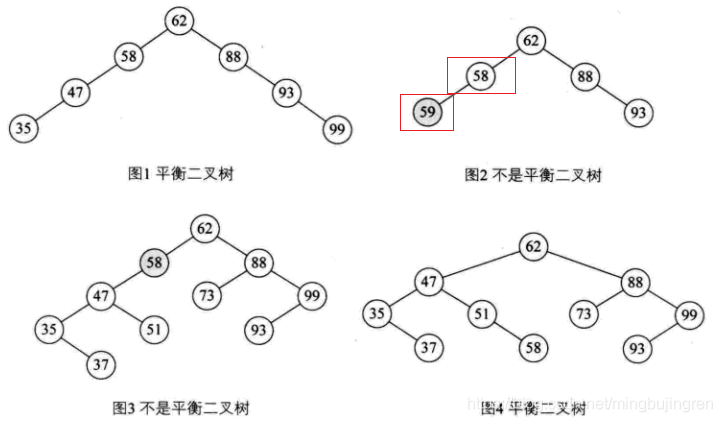
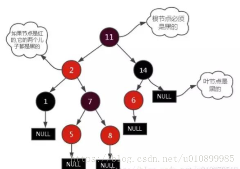
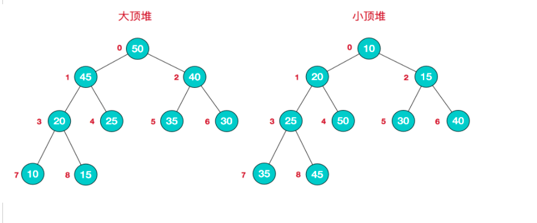

## 树形结构

[TOC]

### 一、树形结构概念

#### 1. 二叉树

​	**特点：**每个节点最多有两个子树。

​	**存储形式：**顺序存储(数组,适合完全二叉树，避免浪费空间)、链式存储(left,right)。

##### 	**!!!遍历方法!!!：**

​	DLR--前序遍历（根在前，从左往右，一棵树的根永远在左子树前面，左子树又永远在右子树前面 ）

​	LDR--中序遍历（根在中，从左往右，一棵树的左子树永远在根前面，根永远在右子树前面）

​	LRD--后序遍历（根在后，从左往右，一棵树的左子树永远在右子树前面，右子树永远在根前面）

​	层序遍历(按层，从上到下，从左到右遍历)





##### 	**!!!构建方法!!!：**

实现思路：

1. 根据**前序+中序**或者**后序+中序**来唯一确定二叉树的结构。
2. 扩充二叉树前序序列构建二叉树。


#### 2. 满二叉树

​	特点：除叶子节点外，其他节点的度一点是2。

#### 3. 完全二叉树

​	特定：与满二叉树类似，只是叶子节点允许可以为一个；满二叉树一定是完全二叉树。

#### 4. 二叉查找树(有序)

​	二叉排序树（Binary Sort Tree），又称二叉查找树（Binary Search Tree），亦称二叉搜索树。是数据结构中的一类。在一般情况下，查询效率比链表结构要高。

​	特点：左子树上的节点均小于根节点，右子树上的节点均大于根节点。

#### 5. 平衡二叉树(有序)

​	定义：其实平衡二叉树的英文是Self-Balancing Binary Searching Tree，但是在1962年两位科学家G.M.Adelson-Velskii和E.M.Landis共同发明了一种解决平衡二叉树的算法，所以后续资料就称平衡二叉树为AVL树。 

​	**平衡二叉树的常用实现方法有AVL、红黑树、替罪羊树、Treap、伸展树等。**

​	**特点：平衡树(Balance Tree，BT) 指的是，任意节点的子树的高度差都小于等于1。**

​	**是对二叉查找树的优化；避免二叉查找树(有序的)变成“链表”，保证树的左右平衡。**

r

**场景：**

​	AVL树是带有平衡条件的二叉查找树，一般是用平衡因子差值判断是否平衡并通过旋转来实现平衡，左右子树高度差不超过1，和红黑树相比，AVL树是**严格的平衡二叉树**，平衡条件必须满足(**所有结点的左右子树高度差不超过1**)。不管我们是执行插入还是删除操作，只要不满足上面的条件，就要通过旋转来保存平衡，而因为旋转非常**耗时**，由此我们可以知道**AVL树适合用于插入与删除次数比较少，但查找多的情况**。

#### 6. 红黑树(有序)

​	R-B Tree，全称是Red-Black Tree，又称为“红黑树”，它一种平衡二叉树。红黑树的每个节点上都有存储位表示节点的颜色，可以是红(Red)或黑(Black)。

​	特点： 

1. 根节点必须为黑色；

2. 节点非黑即红，不可以同时存在红色节点；

3. **从根到叶子的最长的可能路径不多于最短的可能路径的两倍长**。(区别：当前节点到任何叶子节点的黑色节点数相同)

4. 如果一个节点是红色，它的孩子节点都是黑色；

5. 叶子节点都是黑色。

   

**场景：**

红黑树的应用比较广泛，主要是用它来存储有序的数据，它的时间复杂度是O(logN)，效率非常之高。
   它虽然是复杂的，但它的最坏情况运行时间也是非常良好的，并且在实践中是高效的： 它可以在O(log n)时间内做查找，插入和删除，这里的n 是树中元素的数目。
   例如，Java集合中的TreeSet和TreeMap，C++ STL中的set、map，以及Linux虚拟内存的管理，都是通过红黑树去实现的。

**区别：**

1、红黑树放弃了追求完全平衡，追求大致平衡，在与平衡二叉树的时间复杂度相差不大的情况下，保证每次插入最多只需要三次旋转就能达到平衡，实现起来也更为简单。

2、平衡二叉树追求绝对平衡，条件比较苛刻，实现起来比较麻烦，每次插入新节点之后需要旋转的次数不能预知。

#### 7. 小顶堆和大顶堆

​	堆是一种**非线性结构**，（本篇随笔主要分析堆的数组实现）可以把堆看作一个数组，也可以被看作一个完全二叉树，通俗来讲**堆其实就是利用完全二叉树的结构来维护的一维数组**

按照堆的特点可以把堆分为**大顶堆**和**小顶堆**

大顶堆：每个结点的值都**大于**或**等于**其左右孩子结点的值;

小顶堆：每个结点的值都**小于**或**等于**其左右孩子结点的值;

**大顶堆：**arr[i] >= arr[2i+1] && arr[i] >= arr[2i+2] ;

**小顶堆：**arr[i] <= arr[2i+1] && arr[i] <= arr[2i+2] ;



**场景：**

​	海量数据找TopK问题、优先级队列问题。

#### 8. B-树或B树(多路查找树)

[!!参考!!](https://blog.csdn.net/herr_kun/article/details/80550652)

多路搜索树，每个结点存储M/2到M个关键字，非叶子结点存储指向关键

字范围的子结点；

所有关键字在整颗树中出现，且只出现一次，非叶子结点可以命中；

场景：B/B+树是为了磁盘或其它存储设备而设计的一种平衡多路查找树(相对于二叉,B树每个内节点有多个分支),与红黑树相比,在相同的的节点的情况下,一颗B/B+树的高度远远小于红黑树的高度(**在下面B/B+树的性能分析中会提到**).B/B+树上操作的时间通常由存取磁盘的时间和CPU计算时间这两部分构成,而CPU的速度非常快,所以B树的操作效率取决于访问磁盘的次数,关键字总数相同的情况下B树的高度越小，磁盘I/O所花的时间越少.

Ｂ树出现是因为磁盘ＩＯ。ＩＯ操作的效率很低，那么，当在大量数据存储中，查询时我们不能一下子将所有数据加载到内存中，只能逐一加载磁盘页，每个磁盘页对应树的节点。造成大量磁盘ＩＯ操作（最坏情况下为树的高度）。平衡二叉树由于树深度过大而造成磁盘IO读写过于频繁，进而导致效率

#### B+树

在B-树基础上，为叶子结点增加链表指针，所有关键字都在叶子结点

中出现，非叶子结点作为叶子结点的索引；B+树总是到叶子结点才命中；

#### B*树

在B+树基础上，为非叶子结点也增加链表指针，将结点的最低利用率

从1/2提高到2/3；

[资料](https://segmentfault.com/a/1190000019927682)	

### 二、树形搜索

> 最好时间复杂度都是O(logN)。 

#### 1. 红黑树(重点)

​	性能最好，时间复杂度是O(logN)。适用于查找、插入、删除。

#### 2. AVL树

​	查找性能好，时间复杂度是O(logN)。插入和删除需要多次旋转。

#### 3. 大顶堆(重点)

​	适用有TopK问题，O(logN)。

### 三、常见问题

1. 红黑树效率很高，为什么没有用在`MySQL`中做索引？

   数据库是将记录保存在磁盘中，将数据库的内容读取到内存中，是读一页大小（4K）的内容，而红黑树中的一个结点仅仅保存了一个数据，所以被查找到的概率很低，需要多次`I/O`操作，存在`I/O`浪费以及读取资源浪费。**红黑树适合在内存中进行查找，不适合数据量大或磁盘存储的情况中查找。**

2. **B+树 适合文件存储系统。**

### 四、习题

##### 1. 根据前序、中序推导二叉树结构

前序遍历: GDAFEMHZ
中序遍历: ADEFGHMZ

结果：

​                         G1

​        D2                                M

A3              F4                    H       Z

​           E5

[参考](https://www.cnblogs.com/jpfss/p/11141956.html)

##### 2. 根据中序、后序推导二叉树结构

中序遍历：ADEFGHMZ
后序遍历：AEFDHZMG

结果：

​                            G1										

​              D                          M2 

​      A          F                 H3             Z4

​              E

##### 3.  扩充前序序列 构建二叉树

前序字符串： ABC##DE#G##F### 其中“#”表示的是空格，代表一棵空树。

```java
public static MyTreeNode createBinaryTree(LinkedList<String> list) {
        if (list == null || list.isEmpty()) {
            return null;
        }

        String data = list.removeFirst();
        if(data.equals("#")){
            return null;
        }

        MyTreeNode node = new MyTreeNode(data);
        node.leftChild = createBinaryTree(list);
        node.rightChild = createBinaryTree(list);

        return node;
    }
```

[参考](https://cloud.tencent.com/developer/article/1176915)

##### 4.  用中序序列和前序序列 构建二叉树

其前序遍历序列为：{1,2,4,7,3,5,6,8}，中序遍历序列为：{4,7,2,1,5,3,8,6}。

**构建过程：**  （1）前序遍历序列中的第一个数字为根节点，构造根节点；  （2）找到根节点在中序遍历序列中的位置，中序中根节点左右两边分别为左子树和有子树，前序序列根节点后面为左子树+右子树；  （3）递归处理处理左右子树，返回根节点，完成构造。

```java
//1. 根据区分动态数组长度计算 
private static MyTreeNode createBinaryTree(int[] preorder, int p, int q, int[] inorder, int i, int j) {

        if (p > q) return null;
        if (p == q) return new MyTreeNode<>(preorder[p]);

        MyTreeNode node = new MyTreeNode<>(preorder[p]);
        int k = i;
        // 找到根节点在中序遍历序列中的位置
        while (preorder[p] != inorder[k]) k++;
        node.leftChild = createBinaryTree(preorder, p + 1, p + k - i, inorder, i, k - 1);
        node.rightChild = createBinaryTree(preorder, p + k - i + 1, q, inorder, k + 1, j);

        return node;
    }

    public static MyTreeNode buildTree(int[] preorder, int[] inorder) {
        return createBinaryTree(preorder, 0, preorder.length - 1, inorder, 0, inorder.length - 1);
    }

//2. 根据区分节点数计算  大致相同

```

##### 5. 遍历二叉树

两种思路：递归、利用栈实现。

```java
    // 前序遍历
    public static void preOrderTree(MyTreeNode myTreeNode){
        if(myTreeNode == null){
            return;
        }
        System.out.print(myTreeNode.data + " -> ");

        preOrderTree(myTreeNode.leftChild);
        preOrderTree(myTreeNode.rightChild);
    }

    // 中序遍历
    public static void inOrderTree(MyTreeNode myTreeNode){
        if(myTreeNode == null){
            return;
        }

        inOrderTree(myTreeNode.leftChild);
        System.out.print(myTreeNode.data + " -> ");
        inOrderTree(myTreeNode.rightChild);
    }

    // 后序遍历
    public static void postOrderTree(MyTreeNode myTreeNode){
        if(myTreeNode == null){
            return;
        }

        postOrderTree(myTreeNode.leftChild);
        postOrderTree(myTreeNode.rightChild);
        System.out.print(myTreeNode.data + " -> ");
    }
```

