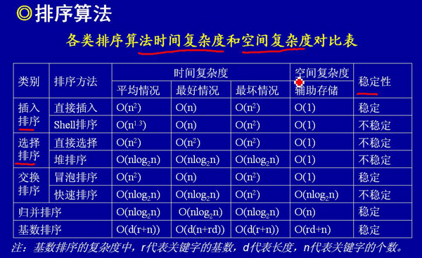
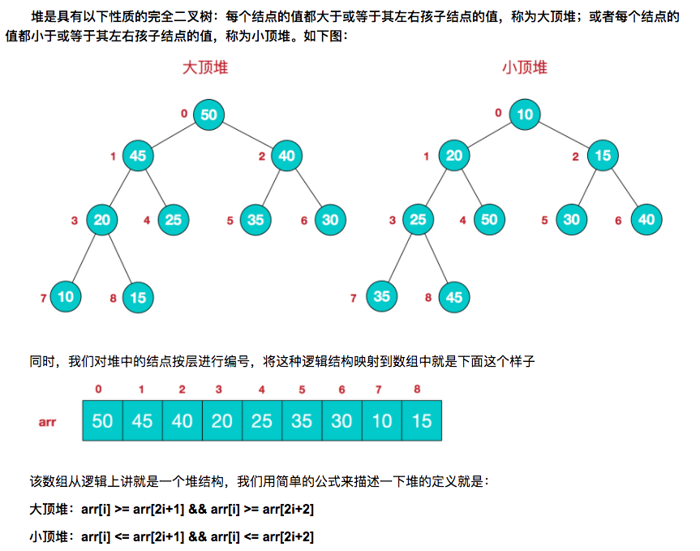

### 排序算法

[TOC]



> 当n较大，则应采用时间复杂度为O(nlog2n)的排序方法：快速排序、堆排序或归并排序序。

#### 口诀和区别

​	牢记思想最重要，速度最快快归堆，数据序少选插入；

​	快排先选个基数，小于放左，大于右；

​	冒泡大泡放后边，外层循环n-1,内层循环n-1-i;

​	插排放入有序中，直排遍历最小值；

​	堆排调整大顶堆，归并先分后合并。

​	**使用场景：**	

​	O(NlogN)：快排适合数据分散的数据；归并排、堆排适合大量数据；

​	O(N^2)：数据量小选插入(大部分有序最好)，数据量大冒泡最差。

​	稳定性：插排、冒泡、归并 为稳定，其他为不稳定。

#### 1. 快速排序

**适用场景：**是目前基于比较的内部排序中被认为是最好的方法，当待排序的关键字是**随机分布时**，快速排序的平均时间最短。

**思想：**快速排序法的基本精神是在数列中找出适当的轴心，然后将数列一分为二(左边都小于等于轴心值，右边大于轴心值)，然后分别对左边与右边数列进行排序。 **挖坑填数+分治法。**

**复杂度：**O(NlogN)，O(NlogN)。

```java
	 /**
     * 快速排序(NLogN)
     * 思想： 找个基准值，小于它的放左边，大于它的放右边，依次左右两边数据再进行上述操作。
     * 实现： 1. 递归遍历(array,left,right) 2. wihle依次循环(右边小值放左边，左边大值放右边，交错执行) 3. 中间值赋值
     */
     public static void quickSort(int[] nums, int left, int right) {
        if (left < right) {
            int i = quickSortAdjust(nums, left, right);
            quickSort(nums, left, i - 1);
            quickSort(nums, i + 1, right);
        }
    }

    public static int quickSortAdjust(int[] nums, int left, int right) {
        int i = left, j = right, v = nums[left];

        while (i < j) {

            while (i < j && nums[j] >= v) {
                j--;
            }
            if (i < j) {
                nums[i] = nums[j];
                i++;
            }

            while (i < j && nums[i] <= v) {
                i++;
            }
            if (i < j) {

                nums[j] = nums[i];
                j--;
            }
        }

        nums[i] = v;

        return i;
    }


//优化代码后
void quick_sort(int s[], int l, int r)
{
    if (l < r)
    {
        //Swap(s[l], s[(l + r) / 2]); //将中间的这个数和第一个数交换 参见注1
        int i = l, j = r, x = s[l];
        while (i < j)
        {
            while(i < j && s[j] >= x) // 从右向左找第一个小于x的数
                j--;  
            if(i < j) 
                s[i++] = s[j];
            
            while(i < j && s[i] < x) // 从左向右找第一个大于等于x的数
                i++;  
            if(i < j) 
                s[j--] = s[i];
        }
        s[i] = x;
        quick_sort(s, l, i - 1); // 递归调用 
        quick_sort(s, i + 1, r);
    }
}
```

#### 2. 冒泡排序

**适用场景：**任何。

**思想：** 通过一趟排序，将数组中最大元素移动到最后一个位置，然后继续排第二大元素到倒数第二个位置**（外层循环n-1,内存循环n-1-i）**。

**复杂度:**O(n^2)，O(1)。

```java
	 /**
     * 冒泡排序(n^2)
     * 思想：挨个交换，把最大值放最后。
     * 实现：外层循环n-1,内存循环n-1-i。
     */
    public static void bubbleSort(int[] nums) {
        for (int i = 0; i < nums.length - 1; i++) {
            for (int j = 0; j < nums.length - 1 - i; j++) {
                if (nums[j] > nums[j + 1]) {
                    swap(nums, j + 1, j);
                }
            }
        }
    }
```

#### 3. 直接插入

**适用场景：** 少量数据，最好有部分是有序的(有序数组O(n)，逆序数组O(n^2))。

**思想：** 在一个有序的数组中为要插入的元素找到指定的插入位置，但这个位置并不一定是最后排序结果中对应元素的最终位置。。

**复杂度:**O(n^2)，O(1)。

```java
   /**
     * 直接插入(n^2,有序场景最好)
     * 思想：维护一个有序数组，依次向有序数组插入值。
     */
    public static void insertSort(int[] nums) {
        for (int i = 0; i < nums.length; i++) {

            for (int j = 1; j < nums.length; j++) {
                while (j > 0 && nums[j] < nums[j - 1]) {
                    swap(nums, j, j - 1);
                    j--;
                }
            }

        }
    }

```

#### 4. 直接选择

**适用场景：** 开始就有序。

**思想：** 从最小一个元素开始，以此选择放入。数组分成有序区和无序区，初始时整个数组都是无序区，然后每次从无序区选一个最小的元素直接放到有序区的最后，直到整个数组变有序区。

**复杂度:**O(n^2)，O(1)。

初始关键字：『 **8**，5，2，6，9，3，1，4，**0**，7 』

 第一趟排序后：0，『**5**，2，6，9，3，**1**，4，8，7』

 第二趟排序后：0，1，『**2**，6，9，3，5，4，8，7』

 第三趟排序后：0，1，2，『**6**，9，**3**，5，4，8，7』

 第四趟排序后：0，1，2，3，『**9**，6，5，**4**，8，7』 ...

```java
    /**
     * 直接选择(n^2,有序场景最好)
     * 思想：每次找到一个最小值，依次找完。
     */
    public static void selectSort(int[] nums) {
        for (int i = 0; i < nums.length; i++) {

            int minIndex = i;
            for (int j = i + 1; j < nums.length; j++) {
                if (nums[j] < nums[minIndex]) {
                    minIndex = j;
                }

            }
            swap(nums, i, minIndex);
        }

    }
```

#### 5. 堆排序

**适用场景：**大数据。堆排序比较和交换次数比快速排序多，所以平均而言比快速排序慢，也就是常数因子比快速排序大，如果你需要的是“排序”，那么绝大多数场合都应该用快速排序而不是其它的O(nlogn)算法。

但有时候你要的不是“排序”，而是另外一些与排序相关的东西，比如最大/小的元素，topK之类，这时候堆排序的优势就出来了。用堆排序可以在N个元素中找到top K，时间复杂度是O(N log K)，空间复杂的是O(K)，而快速排序的空间复杂度是O(N)，也就是说，如果你要在很多元素中找很少几个top K的元素，或者在一个巨大的数据流里找到top K，快速排序是不合适的，堆排序更省地方。

另外一个适合用heap的场合是优先队列，需要在一组不停更新的数据中不停地找最大/小元素，快速排序也不合适。

此外merge sort之类算法虽说也是O(nlogn)，但一般都只在一些很特殊的场合才会用，比如N-way merge，可以把N个已经排好序的数据流合并成一个排好序的数据流，当然这个算法其实严格说并不能算是merge sort，只是用了其中的几个步骤，不过思路是一样的。

**思想：**堆排序是利用**堆(大顶堆)**这种数据结构而设计的一种排序算法，堆排序是一种**选择排序，**它的最坏，最好，平均时间复杂度均为O(nlogn)，它也是不稳定排序。**堆排序的基本思想是：将待排序序列构造成一个大顶堆，此时，整个序列的最大值就是堆顶的根节点。将其与末尾元素进行交换，此时末尾就为最大值。然后将剩余n-1个元素重新构造成一个堆，这样会得到n个元素的次小值。如此反复执行，便能得到一个有序序列了**




```java
  public static void sort(int []arr){
        //1.构建大顶堆
        for(int i=arr.length/2-1;i>=0;i--){
            //从第一个非叶子结点从下至上，从右至左调整结构
            adjustHeap(arr,i,arr.length);
        }
        //2.调整堆结构+交换堆顶元素与末尾元素
        for(int j=arr.length-1;j>0;j--){
            swap(arr,0,j);//将堆顶元素与末尾元素进行交换
            adjustHeap(arr,0,j);//重新对堆进行调整
        }
    }

	 /**
     * 调整大顶堆（仅是调整过程，建立在大顶堆已构建的基础上）
     */
    public static void adjustHeap(int []arr,int i,int length){
        int temp = arr[i];//先取出当前元素i
        for(int k=i*2+1;k<length;k=k*2+1){//从i结点的左子结点开始，也就是2i+1处开始
            if(k+1<length && arr[k]<arr[k+1]){//如果左子结点小于右子结点，k指向右子结点
                k++;
            }
            if(arr[k] >temp){//如果子节点大于父节点，将子节点值赋给父节点（不用进行交换）
                arr[i] = arr[k];
                i = k;
              	// !!! 子节点数据变更，需要继续遍历该子节点下的节点是否需要交换。！！！
            }else{
                break;
            }
        }
        arr[i] = temp;//将temp值放到最终的位置(最后放置)
    }
```

[参考](https://www.cnblogs.com/chengxiao/p/6129630.html)

#### 6. 归并排序

**适用场景：**大数据。

**思想：** 分治法思想(自上而下递归，自下而上迭代)。

```java
public static void mergeSort(int[] arr) {
    sort(arr, 0, arr.length - 1);
}

public static void sort(int[] arr, int L, int R) {
    if(L == R) {
        return;
    }
    int mid = L + ((R - L) >> 1);
    sort(arr, L, mid);
    sort(arr, mid + 1, R);
    merge(arr, L, mid, R);
}

public static void merge(int[] arr, int L, int mid, int R) {
    int[] temp = new int[R - L + 1];
    int i = 0;
    int p1 = L;
    int p2 = mid + 1;
    // 比较左右两部分的元素，哪个小，把那个元素填入temp中
    while(p1 <= mid && p2 <= R) {
        temp[i++] = arr[p1] < arr[p2] ? arr[p1++] : arr[p2++];
    }
    // 上面的循环退出后，把剩余的元素依次填入到temp中
    // 以下两个while只有一个会执行
    while(p1 <= mid) {
        temp[i++] = arr[p1++];
    }
    while(p2 <= R) {
        temp[i++] = arr[p2++];
    }
    // 把最终的排序的结果复制给原数组
    for(i = 0; i < temp.length; i++) {
        arr[L + i] = temp[i];
    }
}
```


[参考](https://www.jianshu.com/p/33cffa1ce613)

