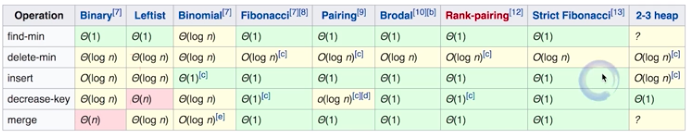
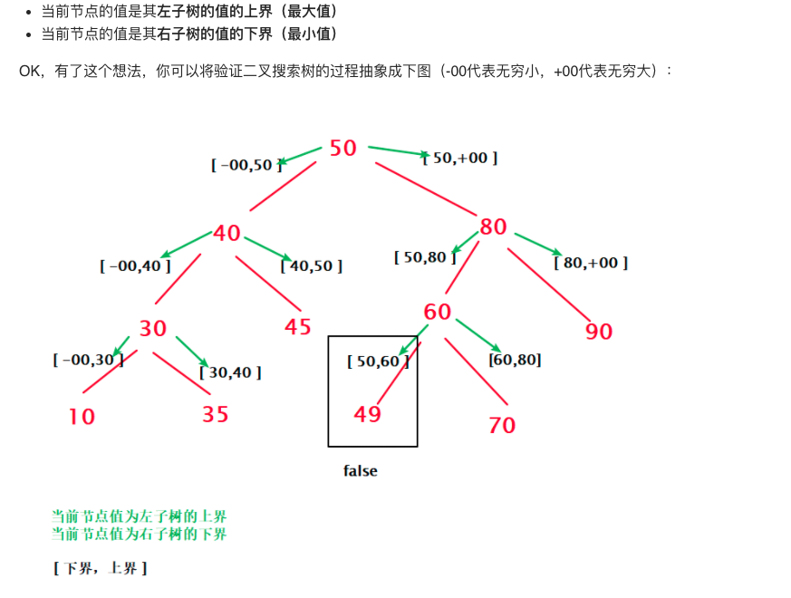
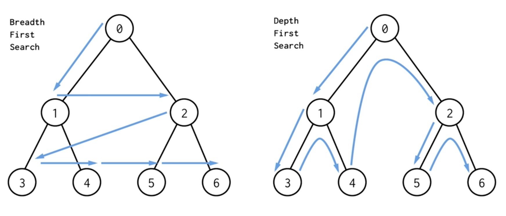
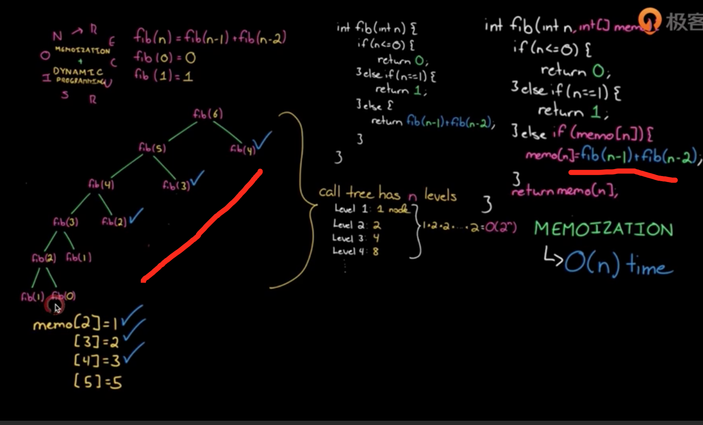
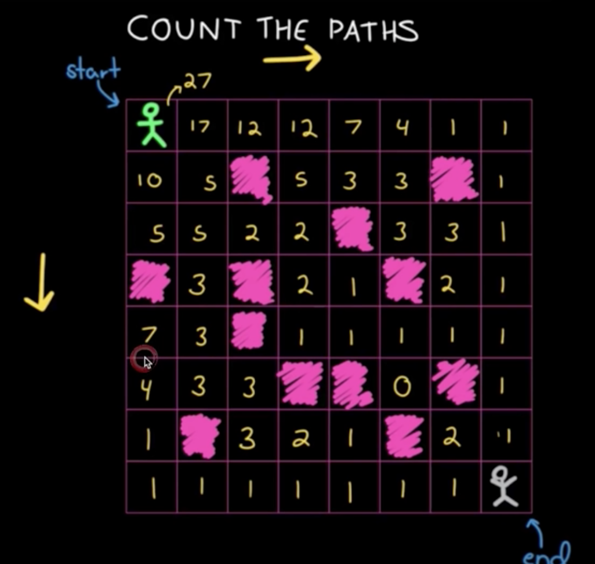
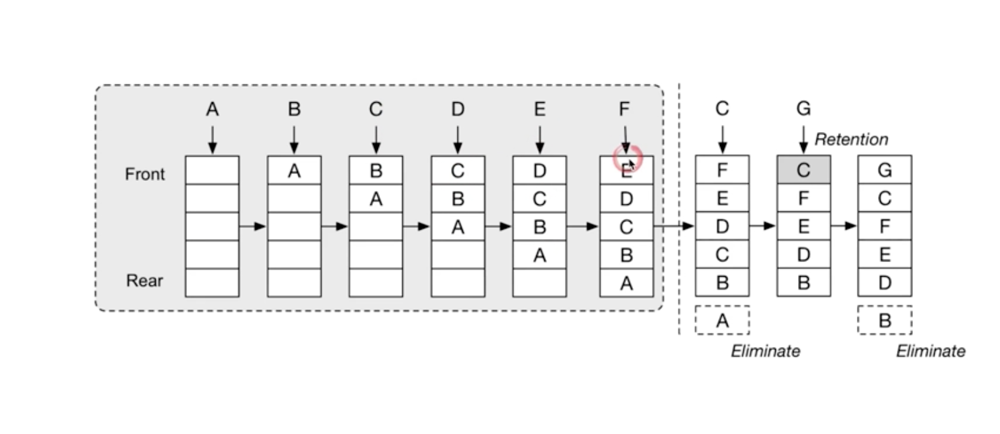
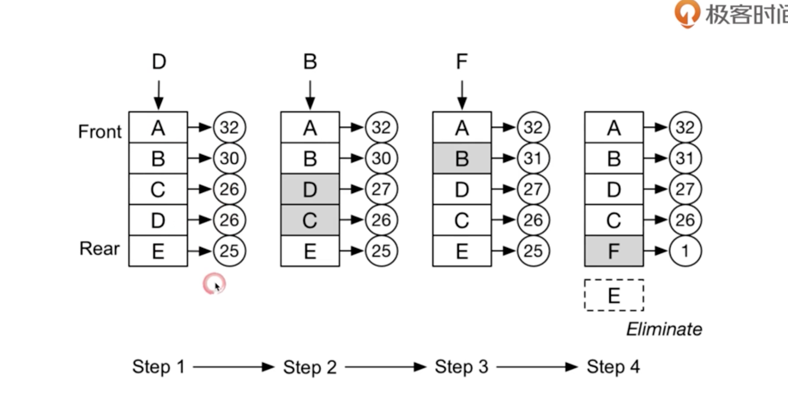

### 算法面试题-基础

[TOC]

[文章1](https://leetcode-cn.com/circle/discuss/AfJAq7/)

[文章2](https://www.jianshu.com/p/c70989bd5f29)

[文章3](https://www.jianshu.com/p/b08413d5bdb5)

[文章4](https://www.sohu.com/a/256897604_100231250)

[文章5](https://leetcode-cn.com/circle/discuss/CdPmqz/)

> 注意事项：
>
> 	1. 持续练习、精深练习。
>  	2. 切题四件套。
>  	3. 沟通和交流很重要。

#### 一、综合题目

##### 1. 查找数组中的重复数字

**[题目内容](https://leetcode-cn.com/problems/shu-zu-zhong-zhong-fu-de-shu-zi-lcof/)**

**思路(查重复)：**

1. 利用HashSet集合

   利用哈希表特性。

   复杂度：O(N)、O(N)。

2. 遍历对比

   暴力破解，遍历依次与前面所有元素对比。

   复杂度：O(n(n+1)/2约等于n^2)，O(1)。

3. 排序

   先快排，再遍历。

   复杂度：O(N$\log$N+N约等于NLogN)、O(logN)。

4. 原地置换(抽屉原理) **最优解**

   利用数组元素特征，`数字num[i]应该放在下标为i的位置上`。

   复杂度：O(N)、O(1)。

   **区别：**1、2不需要需改原数组，3，4需要修改。

```java
//1. 遍历对比
int[] arrays = {2, 3, 1, 0, 2, 5, 3};
jump:for (int i=0;i<arrays.length;i++) {
  int value = arrays[i];
  for (int j=0;j<i;j++){å
    if(value == arrays[j]){
      System.out.println("找到了" + value);
      break jump;
    }
  }
}
//2. 位置交换
int temp;
for (int i=0;i<nums.length;i++){
  if(i == nums[i]){
    continue;
  }

  temp = nums[nums[i]];
  if(temp == nums[i]){
    System.out.println("找到了" + temp);
    break;
  }

  nums[nums[i]] = nums[i];
  nums[i] = temp;
  i--;
}
//3. 快排
```

##### 2. 在排序数组中查找数字I出现的次数

**[题目内容](https://leetcode-cn.com/problems/zai-pai-xu-shu-zu-zhong-cha-zhao-shu-zi-lcof/)**

**思路(查重复、二分)：**

1. 二分查找，左右分别查找。

   时间复杂度O(NlogN+N约等于NlogN)，空间复杂度O(logN)。

```java
 public static int findNumberInArrayRepeat(int[] nums, int number, int left, int right) {
        int valueIndex = binarySearch(nums, 0, left, right);

        int repeatNumber = 0;
        if (valueIndex == -1) {
            return repeatNumber;
        }

        for (int i = valueIndex; i >= 0; i--) {
            if (nums[i] == number) {
                repeatNumber++;
                continue;
            }
            break;
        }

        for (int i = valueIndex + 1; i < nums.length; i++) {
            if (nums[i] == number) {
                repeatNumber++;
                continue;
            }
            break;
        }

        return repeatNumber;
    }

		// 二分查找元素索引
    public static int binarySearch(int[] nums, int target) {
        int left = 0;
        int right = nums.length - 1; // 注意

        while (left <= right) { // 注意
            int mid = (right + left) / 2;
            if (nums[mid] == target)
                return mid;
            else if (nums[mid] < target)
                left = mid + 1; // 注意
            else if (nums[mid] > target)
                right = mid - 1; // 注意
        }
        return -1;
    }
```

##### 3. 二维数组的查找

**[题目内容](https://leetcode-cn.com/problems/er-wei-shu-zu-zhong-de-cha-zhao-lcof/)**

**思路(找规律)：**

1. 右上角元素 大于左边值，小于下边值(或右下角)。

   时间复杂度O(n+m)，空间复杂度O(1)。

2. 暴力循环，全部遍历。

   时间复杂度O(n*m)，空间复杂度O(1)。

3. 二分+列循环。

   遍历比较找每一行最大值，找到target小于最大值的一行；

   二分遍历该行，找到相邻的比target小的元素Index;

   从该行开始，按列遍历比较Index的元素，直到匹配成功。

   时间复杂度大概是O(logN+M或N+logM);

```java
// 二位数组
int[][] arrays = {
                {1, 4, 7, 11, 15},
                {2, 5, 8, 12, 19},
                {3, 6, 9, 16, 22},
                {10, 13, 14, 17, 24},
                {18, 21, 23, 26, 30}
        };
        
int target = 6;
int row = arrays.length;
int col = arrays[0].length;

// 右上角为起点，依次排除行列(分析规律，找对起点)
for (int i=0,j=arrays[0].length-1;(i>=0 && i<row) && (j>=0 && j<col);){
  if(target == arrays[i][j]){
    System.out.println("找到了"+i + " " + j);
    break;
  }else if(target < arrays[i][j]){
    j--;
  }else{
    i++;
  }
}

```

##### 4. 替换空格

**[题目内容](https://leetcode-cn.com/problems/ti-huan-kong-ge-lcof/)**

请实现一个函数，把字符串 `s` 中的每个空格替换成"%20"。

**思路：**

1. 利用replace或split函数或urlencoder直接处理。

   空间复杂度和时间复杂度太高。

2. 遍历，利用StringBuffer拼接数据。

   时间复杂度O(n)，空间复杂度O(n)。

3. 构建一个3倍长度数组(可优化)，遍历即可。

   时间复杂度O(n)，空间复杂度O(3n)。

```java
// 推荐使用urlecode、replace、StringBuffer解决。
public static void main(String[] args) {
        String test = "We are happy.";
        // 新count
        int newSize = test.length();
        for (int i=0;i< test.length();i++){
            if(test.charAt(i) == ' '){
                newSize +=2;
            }
        }

        // 遍历赋值
        char[] newTest = new char[newSize];
        int tempJumpIndex=0; // 注意索引跳过
        for (int i=0;i< test.length();i++) {
            if(test.charAt(i) == ' '){
                newTest[i+tempJumpIndex] = '%';
                newTest[i+tempJumpIndex+1] = '2';
                newTest[i+tempJumpIndex+2] = '0';
                tempJumpIndex +=2;
            }else {
                newTest[i+tempJumpIndex] =test.charAt(i);
            }
        }

        System.out.println(newTest);
    }
```


#### 二、链表

**[题目内容](https://leetcode-cn.com/problems/reverse-linked-list/)**

**思路：**

1. 暴力遍历到新链表头

   时间复杂度O(n)，空间复杂度O(1)。

2. 头插入法(最简洁)

   时间复杂度O(n)，空间复杂度O(1)。

3. 递归处理

   时间复杂度O(n)，空间复杂度O(n)。

##### 1. 反转链表(从尾到头打印)

```java
// 1. 思想：头插入法
public static Node reverseByInsert(Node headNode){
        Node temp;
        Node newHead = null;
        while (headNode != null){
            temp = headNode;
            headNode = headNode.next;
            
            temp.next = newHead;
            newHead = temp;
        }
        return newHead;
}

 //2. 强制 循环处理
    public static Node reverseLinkedNode(Node head) {
        Node newNode = new Node(-1, null);

        while (head != null) {
            Node tempNext = head.next;
            head.next = newNode.next;
            newNode.next = head;

            head = tempNext;
        }

        return newNode.next;
    }
// 3. 思想：递归到尾部，依次翻转断链
public static Node reverse(Node headNode){
        if(headNode == null || headNode.next == null){
            return headNode;
        }

        Node newNode = reverse(headNode.next);
        headNode.next.next = headNode;  // node翻转
        headNode.next = null;           // 断链
        return newNode;
}
```


##### 2. 两两交换链表中的节点

**[题目内容](https://leetcode-cn.com/problems/swap-nodes-in-pairs/)**

**思路：**

1. 暴力遍历破解

   时间复杂度O(n)，空间复杂度O(1)。

2. 利用栈解决

   时间复杂度O(n)，空间复杂度O(n)。

3. 递归处理(最简单)

   时间复杂度O(n)，空间复杂度O(n)。

```java
//1. 暴力遍历破解
public static Node swapPairsLinkedNode(Node node) {
        if (node == null || node.next == null) {
            return node;
        }

        Node newNode = node.next;
        Node pre = null;
        while (node != null && node.next != null) {
            Node tempNext = node.next.next;
            if (pre != null) {
                // 与pre链上
                pre.next = node.next;
            }

            node.next.next = node; // 2指1
            node.next = tempNext;  // 1指3

            pre = node;
            node = tempNext;
        }

        return newNode;
    }
//2. 递归
public static Node swapPairsNew(Node head) {  // 3
        if (head == null || head.next == null) {
            return head;
        }
        Node newHead = head.next;  // 4 保留next值
        head.next = swapPairsNew(newHead.next) // 5;  3指向5，然后4指向3，返回4  
        newHead.next = head;
        return newHead;
    }
```

##### 3. 判断链表是否有环

**[题目内容](https://leetcode-cn.com/problems/linked-list-cycle/)**

**思路：**

1. 快慢指针

   时间复杂度O(n)，空间复杂度O(1)。

2. HashSet

   时间复杂度O(n)，空间复杂度O(n)。

3. 暴力循环5s，看循环是否终止。

```java
public static Node detectCycleInter(Node head) {
        Node fast = head, slow = head;
        while (true) {
            if (fast == null || fast.next == null) return null;
            fast = fast.next.next;
            slow = slow.next;
            if (fast == slow) break;
        }
  			// 查找入环节点(碰撞位置和head一起next遍历，相遇的位置就是入环节点)
        fast = head;
        while (slow != fast) {
            slow = slow.next;
            fast = fast.next;
        }
        return fast;
    }
```


##### 4. 返回环形链表入环节点

**[题目内容](https://leetcode-cn.com/problems/linked-list-cycle-ii/)**

**思路：**

1. 利用数学周长原理(周长等于n)

   发生碰撞的位置和起点依次向后遍历，相遇的地方就是入环节点。

   时间复杂度O(n)，空间复杂度O(1)。

2. HashSet

   时间复杂度O(n)，空间复杂度O(n)。

   代码在上面👆。

#### 三、栈和队列

##### 1. 有效的括号("({[]})")

**[题目内容](https://leetcode-cn.com/problems/valid-parentheses/)**

**思路：**

1. 利用栈特性。

   时间复杂度O(n)，空间复杂度O(1)。

2. 利用replace函数

   循环replace("()") || replace("[]")。

3. 栈变种实现LinkedList

   时间复杂度O(n)，空间复杂度O(1)。

```java
 public static boolean isValidStr(String str) {
        boolean result = true;
        HashMap<Character, Character> data = new HashMap<>();
        data.put(')', '(');
        data.put(']', '[');
        data.put('}', '{');

        Stack<Character> stack = new Stack<>();

        for (int i = 0; i < str.length(); i++) {
            char s = str.charAt(i);

            if (!data.containsKey(s)) {
                stack.push(s);
            } else {
                if (stack.pop() != data.get(s)) {
                    result = false;
                    break;
                }

            }
        }

        return result;
    }

//2. LinkedList实现
 public boolean isValidNew(String s) {
        LinkedList<Character> stack = new LinkedList<>();
        for (char c : s.toCharArray()) {
            if (c == '[') stack.push(']');
            else if (c == '(') stack.push(')');
            else if (c == '{') stack.push('}');
            else if (stack.isEmpty() || c != stack.pop()) return false;
        }
        return stack.isEmpty();
    }
```

##### 2. 用栈实现队列

**[题目内容](https://leetcode-cn.com/problems/implement-queue-using-stacks/)**

**思路：**

1. 两个栈实现(注意并发问题)。

   一个入栈一个出站。

   时间复杂度O(n)，空间复杂度O(1)。

##### 3. 用队列实现栈

**[题目内容](https://leetcode-cn.com/problems/implement-stack-using-queues/)**

**思路：**

1. 一个双端队列LinkedList实现(或每次把元素放前面)。

   时间复杂度O(n)，空间复杂度O(1)。

2. 两个队列实现

   两个队列相互倒腾，新元素每次插入新队列的第一个，然后包旧队列依次放入新队列。

```java
//1. 一个双端队列实现
 LinkedList<Integer> linkedList = new LinkedList<Integer>();
  linkedList.addFirst(1);
  linkedList.addFirst(2);
  linkedList.addFirst(3);
  linkedList.addFirst(4);
  linkedList.addFirst(5);

  System.out.println(linkedList.removeFirst());
  System.out.println(linkedList.removeFirst());
  System.out.println(linkedList.removeFirst());
  System.out.println(linkedList.removeFirst());
//2. 一个队列实现，每次插入元素放最前面。
  Queue<Integer> queue = new LinkedList<Integer>();

  public void push(int x) {
        int n = queue.size();
        queue.offer(x);
        for (int i = 0; i < n; i++) {
            queue.offer(queue.poll());
        }
  }
//3. 二个队列实现
static class MyStack {
        Queue<Integer> queue1 = new LinkedList<>();
        Queue<Integer> queue2 = new LinkedList<>();
        MyStack(){}

        public void push(int value) {
            if (queue1.size() == 0) {
                queue1.offer(value);
                while (queue2.size() > 0) {
                    queue1.offer(queue2.poll());
                }
            } else {
                queue2.offer(value);
                while (queue1.size() > 0) {
                    queue2.offer(queue1.poll());
                }
            }
        }
  
        public int pop() {
            if (queue1.size() > 0) {
                return queue1.poll();
            } else if (queue2.size() > 0) {
                return queue2.poll();
            }
            return -1;
        }
    }
```

#### 四、 优先队列

堆实现：二叉堆(jdk默认**小顶堆实现PriorityQueue**)、斐波拉契堆(效率最高)等。

堆实现区别：



##### 1. 优先队列排序

**思路：**

​	默认按字典排序，也可以传入对象比较器。

```java
public static void main(String[] args) {
        //优先队列自然排序示例
        Queue<Integer> integerPriorityQueue = new PriorityQueue<>(7);
        Random rand = new Random();
        for(int i=0;i<7;i++){
            integerPriorityQueue.add(new Integer(rand.nextInt(100)));
        }

        for(int i=0;i<7;i++){
            Integer in = integerPriorityQueue.poll();
            System.out.println("Processing Integer:"+in);
        }
  
        //自定义排序优先队列使用示例
        Queue<Customer> customerPriorityQueue = new PriorityQueue<>(7, idComparator);
        addDataToQueue(customerPriorityQueue);
        pollDataFromQueue(customerPriorityQueue);
    }
    //匿名Comparator实现
    public static Comparator<Customer> idComparator = new Comparator<Customer>(){
        @Override
        public int compare(Customer c1, Customer c2) {
            return (int) (c1.getId() - c2.getId());
        }
    };
    //用于往队列增加数据的通用方法
    private static void addDataToQueue(Queue<Customer> customerPriorityQueue) {
        Random rand = new Random();
        for(int i=0; i<7; i++){
            int id = rand.nextInt(100);
            customerPriorityQueue.add(new Customer(id, "Pankaj "+id));
        }
    }
    //用于从队列取数据的通用方法
    private static void pollDataFromQueue(Queue<Customer> customerPriorityQueue) {
        while(true){
            Customer cust = customerPriorityQueue.poll();
            if(cust == null) break;
            System.out.println("Processing Customer with ID="+cust.getId());
        }
    }
```

##### 1. 数据流中第K大元素

**[题目内容](https://leetcode-cn.com/problems/kth-largest-element-in-a-stream/)**

**思路：**

1. PriorityQueue小顶堆实现

   维护K个元素，最小的在最上面。

   时间复杂度N*logK，空间复杂度O(K)。

2. 比较快排前K大个元素。

   时间复杂度N*KlogK，空间复杂度O(logN)。

```java
// 1. 利用小顶堆维护
static class KthLargest {
        int k;
        PriorityQueue<Integer> priorityQueue;

        KthLargest(int k, int[] nums) {
            this.k = k;
            priorityQueue = new PriorityQueue<>();
            init(nums);
        }

        private void init(int[] nums) {
            for (int i = 0; i < nums.length; i++) {
                priorityQueue.add(nums[i]);

                if (i >= k) {
                    priorityQueue.poll();
                }
            }
        }

        public int getKValue() {
            return priorityQueue.peek();
        }

        public int add(int val) {
            if (val <= getKValue()) {
                return getKValue();
            }

            priorityQueue.poll();
            priorityQueue.add(val);

            return getKValue();
        }
    }
```


##### 2. 滑动窗口最大值

**[题目内容](https://leetcode-cn.com/problems/sliding-window-maximum/)**

**思路：**

1. 利用大顶堆(小顶堆加比较器实现)

   每个窗口的值都放入大顶堆。

   时间复杂度O(N*logK),空间复杂度O(logK)。

2. 利用双端队列实现LinkedList

   维护左边是最大值，保存其索引(可以删除部分没有出头之日的元素)

   时间复杂度O(n),空间复杂度O(K)。

```java
//1. 大顶堆(利用小顶堆加比较器实现)
 public static ArrayList<Integer> maxSlidingWindowNew(int[] nums, int k) {
        ArrayList<Integer> arrayList = new ArrayList<>();
        PriorityQueue<Integer> priorityQueue = new PriorityQueue<>((o1, o2) -> {
            if (o2.equals(o1)) {
                return 0;
            } else {
                return (o2 - o1) > 0 ? 1 : -1;
            }
        });

        int ignore = 0;
        for (int i = k - 1; i < nums.length; i++) {
            for (int j = i; j >= ignore; j--) {
                priorityQueue.add(nums[j]);
            }
            arrayList.add(priorityQueue.peek());

            ignore++;
            priorityQueue.clear();
        }

        return arrayList;
    }

//2. 双端队列
public static ArrayList<Integer> maxSlidingWindowNewLink(int[] nums, int k) {
        ArrayList<Integer> arrayList = new ArrayList<>();
        LinkedList<Integer> linkedList = new LinkedList<>(); // 存索引

        for (int i = 0; i < nums.length; i++) {
            if (i == 0) {
                linkedList.add(i);
                continue;
            }

            // 维护排序数组，左边最大
            if (nums[i] >= nums[linkedList.getLast()]) {
                linkedList.clear();
                linkedList.add(i);
            } else {
                linkedList.add(i);
            }

            if (i >= (k - 1)) {
                arrayList.add(nums[linkedList.getFirst()]);
								// 删除划出的元素
                if (linkedList.getFirst() == i - (k - 1)) {
                    linkedList.removeFirst();
                }
            }
        }

        return arrayList;
    }
```

#### 四、哈希表

##### 1. 有效的字母异位词(242)

**[题目内容](https://leetcode-cn.com/problems/valid-anagram/)**

**思路：**

1. 利用HashMap实现。

   时间复杂度O(n)，空间复杂度O(S)。

2. 排序实现

   时间复杂度O(NlogN)，空间复杂度O(logN)。

##### 2. 两数之和

**[题目内容](https://leetcode-cn.com/problems/two-sum/)**

**思路：**

1. 暴力循环(依次往前比对)

   时间复杂度O(n^2)，空间复杂度O(1)。

2. 利用HashMap

   时间复杂度O(n)，空间复杂度O(n)。

```java
    public static int[] towSum(int[] nums,int target){
        HashMap<Integer,Integer> hashMap = new HashMap<>();

        for (int i=0;i<nums.length;i++){

            if(hashMap.containsKey(target - nums[i])){
                return new int[]{hashMap.get(target - nums[i]),i};
            }

            hashMap.put(nums[i],i);
        }

        return new int[]{};
    }
```

##### 3. 三数之和

**[题目内容](https://leetcode-cn.com/problems/3sum/)**

**思路：**

1. 暴力循环(依次往前比对)

   时间复杂度O(n^3)，空间复杂度O(1)。

2. 利用HashMap和前面的两数之和

   时间复杂度O(n^2)，空间复杂度O(n)。

```java
    public static int[] threeSum(int[] nums,int target){
        for (int i=2;i<nums.length;i++){
            int[] towSum = towSum(nums, i,target-nums[i]);
            if(towSum.length == 2){
                return new int[]{towSum[0],towSum[1],i};
            }
        }
        
        return new int[]{};
    }

    public static int[] towSum(int[] nums,int endLenght,int target){
        HashMap<Integer,Integer> hashMap = new HashMap<>();

        for (int i=0;i<endLenght;i++){
            if(hashMap.containsKey(target - nums[i])){
                return new int[]{hashMap.get(target - nums[i]),i};
            }
            hashMap.put(nums[i],i);
        }

        return new int[]{};
    }
```


#### 五、二叉树

##### 1. 验证二叉搜索树

**[题目内容](https://leetcode-cn.com/problems/validate-binary-search-tree/)**

**思路：**

1. 中序遍历，验证结果是升序数组。

   时间复杂度O(n)，空间复杂度O(n)。

2. 递归，左子树最大值小于root，右子树最小值大于root。

   时间复杂度O(n)，空间复杂度O(n)。

   

```java
// 中序遍历
    public static void inOrderTree(MyTreeNode myTreeNode){
        if(myTreeNode == null){
            return;
        }

        inOrderTree(myTreeNode.leftChild);
        System.out.print(myTreeNode.data + " -> ");
        inOrderTree(myTreeNode.rightChild);
    }
// 递归
 public static void vaildBST(MyTreeNode<Integer> myTreeNode){
        System.out.println(helper(myTreeNode,null,null));
    }

    public static boolean helper(MyTreeNode<Integer> node,Integer lower,Integer upper){
        if (node == null) {
            return true;
        }

        int val = node.data;
        if(lower != null && val <= lower){
            return false;
        }
        if(upper != null && val >= upper){
            return false;
        }

        if(!helper(node.leftChild,lower,val)){
            return false;
        }
        if(!helper(node.rightChild,val,upper)){
            return false;
        }

        return true;
    }

```

##### 2. 二叉树&二叉搜索树最近公共祖先

**[题目内容](https://leetcode-cn.com/problems/lowest-common-ancestor-of-a-binary-tree/)**

1. 保存所有节点父节点，按路径交叉查找。

   时间复杂度O(n)，空间复杂度O(n)。

2. 递归查找

   时间复杂度O(n)，空间复杂度O(n)。

```java
  // 递归查询二叉树 
	public TreeNode lowestCommonAncestor(TreeNode root, TreeNode p, TreeNode q) {
        if(root == null || root == p || root == q) return root;
        TreeNode left = lowestCommonAncestor(root.left, p, q);
        TreeNode right = lowestCommonAncestor(root.right, p, q);
        if(left == null) return right;
        if(right == null) return left;
        return root;
    }
}
// 递归查询二叉树搜索树 
// 1. 迭代
TreeNode* lowestCommonAncestor(TreeNode* root, TreeNode* p, TreeNode* q) {
        while(root) {
            if (root->val > p->val && root->val > q->val) {
                root = root->left;
            } else if (root->val < p->val && root->val < q->val) {
                root = root->right;
            } else return root;
        }
        return NULL;
    }
//2. 递归
const lowestCommonAncestor = (root, p, q) => {
    if (p.val < root.val && q.val < root.val) {
        return lowestCommonAncestor(root.left, p, q);
    }
    if (p.val > root.val && q.val > root.val) {
        return lowestCommonAncestor(root.right, p, q);
    }
    return root;
};
```

##### 3. 二叉树前序、中序、后序遍历

**[题目内容](https://leetcode-cn.com/problems/binary-tree-preorder-traversal/)**

注意：如果是搜索二叉树，中序遍历为升序数组。

```java
// 前序遍历
public void preorder(TreeNode root, List<Integer> res) {
        if (root == null) {
            return;
        }
        res.add(root.val);
        preorder(root.left, res);
        preorder(root.right, res);
    }
```

##### 4. 二叉树的层序遍历

**[题目内容](https://leetcode-cn.com/problems/binary-tree-level-order-traversal/)**

**思路：**

1. 广度优先(队列实现)

   时间复杂度O(n)

2. 深度优先(栈实现)

   时间复杂度O(n)

```java
// bfs Breadth First Search
   public static List<List<Integer>> bsfLeverOrder(MyTreeNode<Integer> myTreeNode) {
        List<List<Integer>> list = new ArrayList<>();

        Queue<MyTreeNode> queue = new LinkedList();
        queue.offer(myTreeNode);

        while (queue.size() > 0) {
            List<Integer> valueList = new ArrayList<>();
            int levelSize = queue.size();

            for (int i = 0; i < levelSize; i++) {
                MyTreeNode node = queue.poll();
                valueList.add((int) node.data);

                if (node.leftChild != null) {
                    queue.offer(node.leftChild);
                }
                if (node.rightChild != null) {
                    queue.offer(node.rightChild);
                }
            }

            list.add(valueList);
        }

        return list;
    }
// dfs Depth-First-Search
public static List<List<Integer>> dsfLeverOrder(MyTreeNode<Integer> myTreeNode) {
        List<List<Integer>> res = new ArrayList<>();
        if (myTreeNode != null) {
            dfs(res, myTreeNode, 0);
        }
        return res;
    }

    private static void dfs(List<List<Integer>> res, MyTreeNode node, int level) {
        if (res.size() - 1 < level) {
            res.add(new ArrayList<>());
        }
        res.get(level).add((int) node.data);
        if (node.leftChild != null) {
            dfs(res, node.leftChild, level + 1);
        }
        if (node.rightChild != null) {
            dfs(res, node.rightChild, level + 1);
        }
    }
```

##### 5. 二叉树的最大深度和最小深度

**[题目内容](https://leetcode-cn.com/problems/maximum-depth-of-binary-tree/)**

**思路：**

1. 利用BFS或DFS实现

   按层遍历无叶子节点是最小深度，遍历大最大层数是最大深度。


##### 6. 对称的二叉树

[题目内容](https://leetcode-cn.com/problems/dui-cheng-de-er-cha-shu-lcof/)

**思路：**

1. 利用栈或队列，一次比较对称的两个值。
2. 递归


#### 六、经典思想

##### 1. 递归和分治

​	递归：不断调用自身函数，一层一层深入直到终止条件，然后从底层将结果一层一层返回。

​	demo: n的阶乘，斐波拉契算法。

​	分治：将大问题分为一个个不相干的小问题，然后再一次次合并。

​	demo: 排序算法。

##### 2. 广度优先搜索和深度优先搜索

BFS: 按层搜索，人脑思维；

DFS:竖向搜索，然后反向查找漏网之鱼，继续竖向搜索，电脑递归思维。



##### 3. 贪心算法

​	Greedy：在对问题求解时，总是做出在当前看来最好的选择(目光短浅，当前最优，结果不一定最优)。

​	使用场景：简单地说，问题能够分解成子问题解决，**子问题的最优解能递推出最终问题的最优解**。

   说明：

​		贪心算法与动态规划的不同在于它对每个子问题的解决方案都做出选择，不能回退。 动态规划则会保存以前的运算结果，并且根据以前的结果对当前就行选择，有回退功能。

##### 4. 动态规划DP

1. 递归 + 记忆化 -> 递推。
2. 状态的定义：opt[n],dp[n],fib[n]。
3. 状态转移方程：opt[n] = best_of(opt(n-1),opt(n-2),...)。
4. 最优子结构。

- 斐波拉契-递推

  正常斐波拉契时间复杂度为O(2~N)次方。里面用许多重复计算，如果加上缓存记忆，时间复杂度为O(n)。

  

  然后从下往上倒转回去，用动态规划计算如下**(从递归底层开始倒着推导)**：

  ```java
  递归 + 记忆化 ==> 递推 (动态规划的思路)
  递推公式：F(n) = F(n-1) + F(n-2)
  
    F[0] = 0, F[1] = 1;
  	for(int i = 2; i <= n; i++){
      F[i] = F[i-1] + F[i-2];
    }
  ```

  

- 最优路线-递推

  计算从开始走到结束的路线总数(递归实现和上面一样，有大量重复计算)。

  递推公式：opt[i,j] = opt[i-1,j] + opt[i,j-1]。**还是倒着推结果，后面结果形成前面数据，即每一个的结果是下方方格和右方方格路线数目的总和！**

  

- **DP VS 回溯 VS 贪心**
  1. 回溯(递归) - 重复计算
  2. 贪心 - 永远局部最优
  3. DP - 记录局部最优子结构/多种记录值

##### 5. LRU Cache 缓存机制

​	[算法参考](https://en.wikipedia.org/wiki/Cache_replacement_policies)

​	Least recently used(最近最少使用)，一般用双向链表实现，O(1)复杂度的查询和更新。

​	LFU- Least frequently used(最近最不常用算法)





**[题目内容](https://leetcode-cn.com/problems/lru-cache/)**

**思路：**

1. 利用双向链表和哈希表实现(类似于系统中LinkedHashMap集合)。

```java
public class LRUCache {
    class DLinkedNode {
        int key;
        int value;
        DLinkedNode prev;
        DLinkedNode next;
        public DLinkedNode() {}
        public DLinkedNode(int _key, int _value) {key = _key; value = _value;}
    }

    private Map<Integer, DLinkedNode> cache = new HashMap<Integer, DLinkedNode>();
    private int size;
    private int capacity;
    private DLinkedNode head, tail;

    public LRUCache(int capacity) {
        this.size = 0;
        this.capacity = capacity;
        // 使用伪头部和伪尾部节点
        head = new DLinkedNode();
        tail = new DLinkedNode();
        head.next = tail;
        tail.prev = head;
    }

    public int get(int key) {
        DLinkedNode node = cache.get(key);
        if (node == null) {
            return -1;
        }
        // 如果 key 存在，先通过哈希表定位，再移到头部
        moveToHead(node);
        return node.value;
    }

    public void put(int key, int value) {
        DLinkedNode node = cache.get(key);
        if (node == null) {
            // 如果 key 不存在，创建一个新的节点
            DLinkedNode newNode = new DLinkedNode(key, value);
            // 添加进哈希表
            cache.put(key, newNode);
            // 添加至双向链表的头部
            addToHead(newNode);
            ++size;
            if (size > capacity) {
                // 如果超出容量，删除双向链表的尾部节点
                DLinkedNode tail = removeTail();
                // 删除哈希表中对应的项
                cache.remove(tail.key);
                --size;
            }
        }
        else {
            // 如果 key 存在，先通过哈希表定位，再修改 value，并移到头部
            node.value = value;
            moveToHead(node);
        }
    }

    private void addToHead(DLinkedNode node) {
        node.prev = head;
        node.next = head.next;
        head.next.prev = node;
        head.next = node;
    }

    private void removeNode(DLinkedNode node) {
        node.prev.next = node.next;
        node.next.prev = node.prev;
    }

    private void moveToHead(DLinkedNode node) {
        removeNode(node);
        addToHead(node);
    }

    private DLinkedNode removeTail() {
        DLinkedNode res = tail.prev;
        removeNode(res);
        return res;
    }
}
```


#### 七、其他

##### 1.  旋转数组

**[题目内容](https://leetcode-cn.com/problems/rotate-array/)**

**思路：**

1. 暴力循环依次移动

   时间复杂度O(N*K),空间复杂度O(1)。

2. 使用额外数组

   时间复杂度O(n),空间复杂度O(n)。

3. 使用环状替换(难)

   时间复杂度O(n),空间复杂度O(1)。

4. 三次反转

   时间复杂度O(n),空间复杂度O(1)。

```java
// 暴力移动
    public static void rotateSimple(int[] nums, int k) {
        for (int i = 0; i < k; i++) {
            int endValue = nums[nums.length - 1];

            for (int j = nums.length - 1 - 1; j >= 0; j--) {
                nums[j + 1] = nums[j];
            }
            nums[0] = endValue;
        }
    }
// 三次反转
  public void rotate(int[] nums, int k) {
        k = k%nums.length;
        reverse(nums, 0, nums.length - 1);
        reverse(nums, 0, k - 1);
        reverse(nums, k, nums.length - 1);
    }
    public void reverse(int[] nums, int start, int end) {
        while (start < end) {
            int temp = nums[start];
            nums[start] = nums[end];
            nums[end] = temp;
            start++;
            end--;
        }
    }
```


##### 2.  买卖股票最佳时机

**[题目内容(最大买卖K次)121/122/123/309/188/714](https://leetcode-cn.com/problems/best-time-to-buy-and-sell-stock/)**

**思路：**

1. 暴力破解

2. 动态规划

   DP定义多维数组状态，倒推结果。

```java
// 最优股票(不限交易次数)
    public static int maxProfit(int[] prices){
        int[][] dp = new int[prices.length][2];

        dp[0][0] = 0;
        dp[0][1] = -prices[0];

        for (int i=1;i<prices.length;i++){
            dp[i][0] = Math.max(dp[i-1][0],dp[i-1][1]+prices[i]);
            dp[i][1] = Math.max(dp[i-1][1],dp[i-1][0]-prices[i]);
        }

        return dp[prices.length-1][0];
    }
    // 最优股票(非动态规划，交易1次)
    public static int maxProfitNew(int prices[]) {
        int minprice = Integer.MAX_VALUE;
        int maxprofit = 0;
        for (int i = 0; i < prices.length; i++) {
            if (prices[i] < minprice) {
                minprice = prices[i];
            } else if (prices[i] - minprice > maxprofit) {
                maxprofit = prices[i] - minprice;
            }
        }
        return maxprofit;
    }
```


- 参考

[1. leetcode](https://leetcode-cn.com/problemset/lcof/)

[2. big-O](https://www.bigocheatsheet.com/)