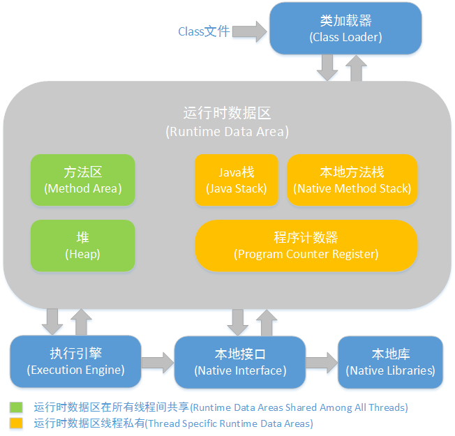

### JVM

[TOC]

#### 1. JVM组成

> Java虚拟机是一个可以执行Java字节码的虚拟机进程。虚拟机的跨平台性实现了java语言的跨平台性。

1. 类加载器(ClassLoader)
2. 运行时数据(Runtime Data Area)
3. 执行引擎(Execution Engine)
4. 本地库接口(Native Interface)

#### 2. JVM模型

1. 方法区(Method Area)

   线程共享，存储被虚拟机加载的类信息、常量、静态变量、即编译器编译后的代码等数据(常量池)。

2. 虚拟机栈(JVM Stacks)

   线程私用，生命周期与线程相同。虚拟机栈描述的是Java方法执行的内存模型：每个方法被执行的时候都会同时创建一个**栈帧（Stack Frame）用于存储局部变量表、操作栈、动态链接、方法出口等信息。**每一个方法被调用直至执行完成的过程，就对应着一个栈帧在虚拟机栈中从**入栈到出栈**的过程。

3. 本地方法栈

   区别不过是虚拟机栈为虚拟机执行Java方法（也就是字节码）服务，而本地方法栈则是为虚拟机使用到的Native方法服务。

4. 堆(Heap)

   线程共享，几乎所有的对象都在这里分配内存。

5. 程序计数器(Program Counter Register)

   线程私用，是一块较小的内存空间，它的作用是记录当前线程所执行的字节码的行号指示器。

#### 3. GC回收模型

##### 1. 分类

1. 新生代

   组成：Eden+S0+S1(8:1:1)，Survivor区中默认对象被复制15次后移到老年区。

   设置两个Survivor区最大的好处就是解决了碎片化，刚刚新建的对象在Eden中，经历一次Minor GC，Eden中的存活对象就会被移动到第一块survivor space S0，Eden被清空；等Eden区再满了，就再触发一次Minor GC，Eden和S0中的存活对象又会被复制送入第二块survivor space S1（这个过程非常重要，因为这种复制算法保证了S1中来自S0和Eden两部分的存活对象占用连续的内存空间，**避免了碎片化**的发生）。

2. 老年代

3. 永久代(Jdk1.8后改为元空间)

   存放已被虚拟机加载的**类信息、常量、静态变量，即编译器编译后的代码**。是一片连续的堆空间。

   **为什么要用Metaspace替代方法区**？
   	随着动态类加载的情况越来越多，这块内存变得不太可控，如果设置小了，系统运行过程中就容易出现内存溢出，设置大了又浪费内存。

   - 在metaspace中，类和其元数据的生命周期与其对应的类加载器相同，只要类的类加载器是存活的，在Metaspace中的类元数据也是存活的，不能被回收。

   - 每个加载器有单独的存储空间。

   - 省掉了GC扫描及压缩的时间。

   - 当GC发现某个类加载器不再存活了，会把对应的空间整个回收。

##### 2. 流程

- Java堆 = 老年代 + 新生代
- 新生代 = Eden + S0 + S1
- 当 Eden 区的空间满了， Java虚拟机会触发一次 Minor GC，以收集新生代的垃圾，存活下来的对象，则会转移到 Survivor区。
- 大对象（需要大量连续内存空间的Java对象，如那种很长的字符串）直接进入老年态；
- 如果对象在Eden出生，并经过第一次Minor GC后仍然存活，并且被Survivor容纳的话，年龄设为1，每熬过一次Minor GC，年龄+1，若年龄超过一定限制（15），则被晋升到老年态。即长期存活的对象进入老年态。
  老年代满了而无法容纳更多的对象，Minor GC 之后通常就会进行Full GC，Full GC 清理整个内存堆 – 包括年轻代和年老代。
- Major GC 发生在老年代的GC，清理老年区，经常会伴随至少一次Minor GC，比Minor GC慢10倍以上。

#### 4. GC回收策略和算法

1. 对象是否存活算法：引用计数器算法、可达性分析算法；

##### 1. 三种垃圾回收算法？

`Jvm采用分代回收算法，对不同区域采用不同算法实现。` 

具体如下：

1、在新生代中，每次垃圾收集时都发现有大批对象死去，只有少量存活，那就选用复制算法。只需要付出少量存活对象的复制成本就可以完成收集；
 2、老年代中因为对象存活率高、没有额外空间对他进行分配担保，就必须用标记-清除或者标记-整理。

- 标记/清除算法

  分为**标记**和**清除**两阶段：首先标记出所有需要回收的对象，然后统一回收所有被标记的对象。

  缺点：

  ​	标记阶段和清除阶段的效率都不高。

  ​	显而易见的，清除后产生了大量不连续的内存碎片，导致在程序运行过程中需要分配较大对象的时候，无法找到足够的连续内存而不得不提前触发一次垃圾收集动作。

- 复制算法

  将可用内存按容量划分为大小相等的两块，每次只用其中一块。当这块内存用完了，就将还存活的对象复制到另外一块上面，然后再把已使用过的内存空间一次清理掉。

  优点：

  ​	效率高于标记-清除，但效率也不是很高；

  ​	不会产生过多碎片，每次都对半块内存操作。

- 标记/整理算法

  标记过程仍然与“标记-清除”算法一样，但后续步骤不是直接对可回收对象进行清理，而是让所有存活的对象都向一端移动，然后直接清理掉端边界以外的内存。

  优点：

  ​	自带整理功能，这样不会产生大量不连续的内存空间，适合老年代的大对象存储。

##### 2. 几种垃圾收集器？

- Serial收集器： 单线程的收集器，收集垃圾时，必须stop the world，使用**复制算法**；

- ParNaw收集器：Serial的多线程版本，一样。

- Parallel Scavenge收集器(吞吐量优先收集器)，是一个新生代收集器，使用复制算法的并行多线程收集器，是jdk1.8的默认的收集器。

  重要设置参数： 控制最大垃圾收集停顿时间、直接设置吞吐量（默认运行100分钟中间可以停顿一分钟）;

- Serial Old收集器：是Serial收集器的老年代版本，单线程收集器，使用**标记-整理算法**。

- Parallel Old收集器：是Parallel的老年代版本，多线程收集器，使用**标记-整理算法**。

- **CMS(Concurrent Mark Sweep)收集器：** 是一种以获得最短回收停顿时间为目标的收集器，**标记清除算法，运作过程：初始标记，并发标记，重新标记，并发清除**，收集结束会产生大量空间碎片。

- **G1收集器：**标记整理算法实现，**运作流程主要包括以下：初始标记，并发标记，最终标记，筛选标记**。不会产生空间碎片，可以精确地控制停顿。

  G1(Garbage First)垃圾收集器是当今垃圾回收技术最前沿的成果之一。早在JDK7就已加入JVM的收集器大家庭中，成为HotSpot重点发展的垃圾回收技术。同优秀的CMS垃圾回收器一样，G1也是关注最小时延的垃圾回收器，也同样适合大尺寸堆内存的垃圾收集，官方也推荐使用G1来代替选择CMS。G1最大的特点是引入分区的思路，弱化了分代的概念，合理利用垃圾收集各个周期的资源，解决了其他收集器甚至CMS的众多缺陷。

##### **3. CMS收集器和G1收集器的区别：**

1. CMS收集器是老年代的收集器，可以配合新生代的Serial和ParNew收集器一起使用；
2. G1收集器收集范围是老年代和新生代，不需要结合其他收集器使用；
3. CMS收集器以最小的停顿时间为目标的收集器；
4. G1收集器可预测垃圾回收的停顿时间;
5. CMS收集器是使用“标记-清除”算法进行的垃圾回收，容易产生内存碎片;
6. G1收集器使用的是“标记-整理”算法，进行了空间整合，降低了内存空间碎片。

#### 5. 类加载分类和如何打破双亲委派?

##### 1. 什么是类加载器

​	类加载器是根据指定全限定名称将class文件加载到JVM内存，转换为Class对象。

**加载过程**

- 加载：类加载过程的一个阶段：通过一个类的完全限定查找此类字节码文件，并利用字节码文件创建一个Class对象
- 验证：目的在于确保Class文件的字节流中包含信息符合当前虚拟机要求，不会危害虚拟机自身安全。主要包括四种验证，文件格式验证，元数据验证，字节码验证，符号引用验证。
- 准备：为类变量(即static修饰的字段变量)分配内存并且设置该类变量的初始值即0(如static int i=5;这里只将i初始化为0，至于5的值将在初始化时赋值)，这里不包含用final修饰的static，因为final在编译的时候就会分配了，注意这里不会为实例变量分配初始化，类变量会分配在方法区中，而实例变量是会随着对象一起分配到Java堆中。
- 解析：主要将常量池中的符号引用替换为直接引用的过程。符号引用就是一组符号来描述目标，可以是任何字面量，而直接引用就是直接指向目标的指针、相对偏移量或一个间接定位到目标的句柄。有类或接口的解析，字段解析，类方法解析，接口方法解析(这里涉及到字节码变量的引用，如需更详细了解，可参考《深入Java虚拟机》)。
- 初始化：类加载最后阶段，若该类具有超类，则对其进行初始化，执行静态初始化器和静态初始化成员变量(如前面只初始化了默认值的static变量将会在这个阶段赋值，成员变量也将被初始化)。

**分类**

1. 启动类加载器(bootstrap)

   启动类加载器主要加载的是JVM自身需要的类，这个类加载使用C++语言实现的，是虚拟机自身的一部分，它负责将 `/lib`路径下的核心类库或`-Xbootclasspath`参数指定的路径下的jar包加载到内存中，注意必由于虚拟机是按照文件名识别加载jar包的，如rt.jar，如果文件名不被虚拟机识别，即使把jar包丢到lib目录下也是没有作用的(出于安全考虑，Bootstrap启动类加载器只加载包名为java、javax、sun等开头的类)。

2. 扩展类加载器(Extension)

   扩展类加载器是指Sun公司(已被Oracle收购)实现的`sun.misc.Launcher$ExtClassLoader`类，由Java语言实现的，是Launcher的静态内部类，它负责加载`/lib/ext`目录下或者由系统变量-Djava.ext.dir指定位路径中的类库，开发者可以直接使用标准扩展类加载器。

3. 系统类加载器(System)

   也称应用程序加载器是指 Sun公司实现的`sun.misc.Launcher$AppClassLoader`。它负责加载系统类路径`java -classpath`或`-D java.class.path` 指定路径下的类库，也就是我们经常用到的classpath路径，开发者可以直接使用系统类加载器，一般情况下该类加载是程序中默认的类加载器，通过`ClassLoader#getSystemClassLoader()`方法可以获取到该类加载器

4. 自定义加载器

##### 2. 双亲委派模式

> 如果一个类加载器收到类加载的请求，它首先不会自己去尝试加载这个类，而是把这个请求委派给父类加载器完成。每个类加载器都是如此，只有当父加载器在自己的搜索范围内找不到指定的类时（即ClassNotFoundException），子加载器才会尝试自己去加载。

​	优势：避免重复加载，更安全。

打破双亲委派机制则不仅**要继承ClassLoader**类，还要**重写loadClass和findClass**方法。

