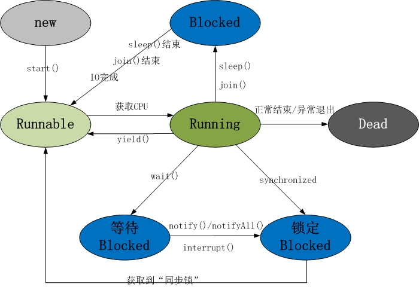
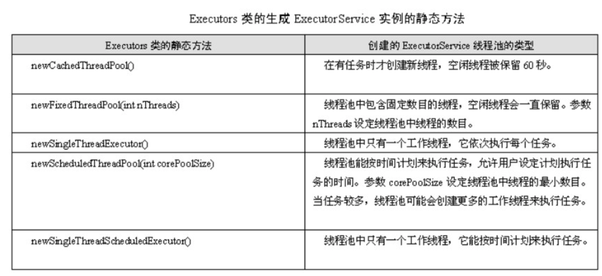

### 多线程

[TOC]

[参考1](https://juejin.im/post/5c20c27551882504bd0e6f6d)

##### 线程、进程、纤程、协程

[区别](多线程.md)

##### 1. 线程状态

new、runnable、running、block、dead。

block的三种情况：

(1)等待阻塞(wait,放入等待队列；再调用notify进入锁池队列)；

(2)同步阻塞(sync，放入锁池队列)；

(3)其他阻塞(sleep/io/join)；




##### 2. 创建线程的方式

继承Thread;实现Runnable接口；实现Callabe接口；**本质上都是实现Runnable接口。**

```java
Callable<String > callable = () -> "test";
FutureTask<String> futureTask = new FutureTask<>(callable);
new Thread(futureTask).start();
String result = futureTask.get(); // 获取返回值
```

##### 3. start、run 方法的区别

start方法会开启一个线程；run方法是线程的主体方法。有先后顺序。

##### 4. sleep、wait、notify、yield、jion方法的区别

sleep是线程静态本地方法，让出CPU，但不放弃对象锁；

wait是对象方法，让出对象锁，进入等待队列(**必须在sync(obj)方法体内执行**)；

yield是线程静态本地方法，让出cpu，进入runnable状态；

jion 当前线程阻塞，不放弃对象锁，等待其他线程执行完毕，就就让runnable状态；

notify 唤醒此对象监视器等待的任意单个线程，唤醒的他线程进入锁池；

##### 5. wait 为什么必须在sync(obj){}中执行

​	(1) sync可以看成已经实现了lock/unlock的基本功能，用于互斥访问临界区。而wait和notify，是**高级**一点同步机制，需要在**临界区内执行**。

​	(2) **obj.wait(), obj.notify()都需要原子性（互斥性）**，实现简单。

##### 6. 线程交替计数设计

```java
public class TwoExecThread{
 	public static int inc = 0;
  public static void main(String[] args) {
    Object object = new Object();
    new ThreadA(object).start();
    new ThreadB(object).start();
  }
}
// ThreadA ThreadB 轮流调用 sync(obj)->notify()->wait()方法
static class ThreadA extends Thread{
        private Object mObject;
        public ThreadA(Object object){
            mObject = object;
        }
        @Override
        public void run() {
            while (true){
                inc();
            }
        }
        private  void inc(){
            synchronized (mObject) {
                TwoExecThread.inc++;
                System.out.println("ThreadA --- " + TwoExecThread.inc);
                try {
                    mObject.notify();
                    mObject.wait();
                    sleep(100);
                } catch (Exception e) {
                    e.printStackTrace();
                }
            }
        }
    }

static class ThreadB extends Thread{
        private Object mObject;
        public ThreadB(Object object){
            mObject = object;
        }
        @Override
        public void run() {
            while (true){
                if(TwoExecThread.inc > 0){
                    inc();
                }
            }
        }

        private  void inc(){
            synchronized (mObject) {
                TwoExecThread.inc++;
                System.out.println("ThreadB ==== " + TwoExecThread.inc);
                try {
                    mObject.notify();
                    mObject.wait();
                    sleep(100);
                } catch (InterruptedException e) {
                    e.printStackTrace();
                }
            }
        }
    }

// 可重入锁
 ReentrantLock lock = new ReentrantLock(true);
 new LockA(lock).start();
 new LockA(lock).start();
 static class LockA extends Thread{

        public ReentrantLock lock;

        public LockA(ReentrantLock lock){
            this.lock = lock;
        }

        @Override
        public void run() {
            for (int i=0;i<100;i++){
                lock.lock();
                inc++;
                System.out.println(Thread.currentThread().getName() + " " + inc);
                lock.unlock();
            }
        }
    }

```

##### 7. 线程如何关闭

(1)interrupt()

​	其本质只是设置线程的中断标志位为ture(runnable,block)，并不会立即执行，**当线程进入阻塞状态(wait,join,sleep)，会抛出异常InterruptedException并清除标志位。**

```java
public void run() {
    while (!Thread.currentThread().isInterrupted()&& more work to do) {
        try {
            ...
            sleep(delay);
        } catch (InterruptedException e) {
          	// 因为抛出InterruptedException异常后，中断标示位会自动清除
            Thread.currentThread().interrupt();//重新设置中断标示
        }
    }
}
```

(2)stop()  由于不安全，已经废弃。`sync void {x=3;y=4}`，线程立即停止，导致方法执行了一半。

(3)标志位   `private volatile boolean cancelled;`

##### 8. 什么导致线程阻塞

sleep()、sync{}、wait()、join()、io输入、suspend()。注意：yield()方法直接进入runnable状态。

##### 9. 线程同步方法有哪些？

###### 1. synchronized修饰方法或同步代码块

###### 2. volatile 修饰变量

​	变量规则：**对volitale变量的写入操作必须在堆该变量的读操作之前执行。**

​	每次读取变量都从内存中读取，保证**可见性**和有序性；无法保证原子性(i++)。

###### 3. ReentrantLock 重入锁

​	通俗来说：同一个线程函数获得锁之后，内层递归函数依然能够获取到该锁对象的代码，也即，在同一个线程的外层方法访问的时候，获取到了锁，在进入内层方法后能够自动获取到锁(sycn也是重入锁)。

​	lock(),unlock(),tryLock()

​	区别：

（1）synchronized是独占锁，加锁和解锁的过程自动进行，易于操作，但不够灵活。ReentrantLock也是独占锁，加锁和解锁的过程需要手动进行，不易操作，但非常灵活。

（2）synchronized可重入，因为加锁和解锁自动进行，不必担心最后是否释放锁；ReentrantLock也可重入，但加锁和解锁需要手动进行，且次数需一样，否则其他线程无法获得锁。

（3）synchronized不可响应中断，一个线程获取不到锁就一直等着；ReentrantLock可以相应中断。

​	ReentrantLock好像比synchronized关键字没好太多，我们再去看看synchronized所没有的，一个最主要的就是ReentrantLock还可以实现公平锁机制。什么叫公平锁呢？也就是在锁上等待时间最长的线程将获得锁的使用权。通俗的理解就是谁排队时间最长谁先执行获取锁。

###### 4. ThreadLocal

```java
为每个线程保存自己变量的副本，方便传递参数。如springn就能让线程内多次获取到的Connection对象是同一个。 ThreadLocalMap(this, firstValue);//key为threadlocal对象 value为值void 
// 每个线程内部都有一个threadlocalsMap对象！！！
createMap(Thread t, T firstValue) {
    t.threadLocals = new ThreadLocalMap(this, firstValue);
} 
```

###### 5. 使用原子变量

AtomicInteger `在并发线程先保证 i++ 的原子性`

###### 6. 使用阻塞队列

ArrayBlockingQueue、LinkedBlockingQueue。保证并发存取问题。

###### 7. 其他方法

​	CountDownLatch: 通过计数方式实现，等待其他线程执行完毕，计数为0后 countDownLatch.await()开始执行；

​	CyclicBarrier: 与CDL类似，可以看成一个障碍，所有线程必须到齐后才能通过这个障碍。

 **区别：**

CountDownLatch是一个计数器，线程完成一个记录一个，计数器递减，只能只用一次
 CyclicBarrier的计数器更像一个阀门，需要所有线程都到达，然后继续执行，计数器递增，提供reset功能，可

##### 10. 如何保证线程安全？

###### 1. 原子性

Atomic、synchronized、ReentrantLock。

###### 2. 可见性

synchronized、volatile。

###### 3. 有序性

synchronized、volatile、lock。

##### 11. synchronized、ReentrantLock的区别？

(1)synchronized,reentrantLock都是重入锁，一个线程可以多次获取对象的锁(计数原理实现)。

(2)synchronized是Jvm层面的实现，自动加锁解锁；lock需要手动释放，在finally中执行；

(3)synchronized是悲观锁，而Lock是乐观锁的实现，采用**CAS**的尝试机制。

(4)高并发下Lock锁性能高于sync;

(5)lock 提供高级功能：如可以提供公平的锁、可以中断锁的等待、绑定多个条件等。

##### 12. Synchronized 锁优化

> 在JDK1.6之后，对sync进行了优化，根据不同情形出现了轻量锁、偏向锁、自旋锁(自适应锁)等。
>
> 锁的四种状态依次是：**无锁状态、偏向锁状态、轻量级锁状态、重量级锁状态**，锁可以从偏向锁升级到轻量级锁，

- 自旋锁

  原因：频繁的线程从阻塞到唤醒状态切换(cpu从用户态到核心太切换)，花费时间太多。

  实现机制： 线程阻塞后不着急加入等待队列，执行一个无意义的循环去竞争锁。自适应性自旋锁的自旋次数是JVM动态计算的。超出限制进入重量级锁状态。

- 偏向锁

  偏向锁是比轻量锁更轻的锁，使用轻量级锁还需要CAS操作消耗一下资源，如果同步块被一个线程占用，不需要cas，只做标记对比即可获取锁。

- 轻量锁

  > 轻量级锁或偏向锁，只是在无竞争环境下，减少无端消耗。如何出现竞争，进入重量级锁。

  利用Java对象头的结构和CAS原理实现。

- 重量锁

- 锁粗化、锁消除

##### 13. 如何避免死锁

- 原因

  系统资源的竞争；进程运行推进不合理。

- 四个必要条件

  互斥条件、请求与保持条件、不可剥夺条件、循环等待条件；

- 如何避免

  破坏死锁的四个条件。

##### 14. 断点续传&多线程下载

断点续传：从上次中断的断点处开始上上传；

多线程下载： 将文件分为n块，n个线程同时下载，完成后合并。

##### 15. 线程池

 Why: 提高服务器性能，避免频繁创建消耗线程的资源消耗；

 What: 线程池管理器(ThreadPool)、工作线程(PoolWorker)、任务接口(Task)、任务队列(TaskQueue)。

包括： newSingleThreadExecutor()、newFixedThreadExecutor(n)、newCacheThreadExecutor(推荐使用)、newScheduleThreadExecurot。

```java
 
ExecutorService pool = Executors.newCachedThreadPool(); 
 pool.execute(thread);

 public static ExecutorService newCachedThreadPool() {
        return new ThreadPoolExecutor(0, Integer.MAX_VALUE,
                                      60L, TimeUnit.SECONDS,
                                      new SynchronousQueue<Runnable>());
 }
```


``



- 实现原理

  1. 当提交一个新任务到线程池时，判断核心线程池里的线程是否都在执行。如果不是，则创建一个新的线程执行任务。如果核心线程池的线程都在执行任务，则进入下个流程。

  2. 判断工作队列是否已满。如果未满，则将新提交的任务存储在这个工作队列里。如果工作队列满了，则进入下个流程。

  3. 判断线程池是否都处于工作状态。如果没有，则创建一个新的工作线程来执行任务。如果满了，则交给饱和策略来处理这个任务


- 核心类ThreadPoolExecutor、ExecutorService、Executor、AbstractExecutorService

  ```java
  /**
  	*
  	*	corePoolSize: 核心池大小，默认情况下线程池中没有任何线程，当任务到来会创建一个线程执行，当线程数量	* 达到corePoolSize后，就会把到达的任务放到缓存队列当中(线程池长期维持的线程数，即使线程处于Idle状 
    * 态，也不会回收)；
  	* maximumPoolSize: 最大线程数；
  	*	keepAliveTime: 表示线程没有任务执行时最多保持多久时间会终止。默认情况下，只有当线程池中的线程数大于
    * corePoolSize时，keepAliveTime才会起作用，直到线程池中的线程数不大于corePoolSize，即当线程池中
    * 的线程数大于corePoolSize时，如果一个线程空闲的时间达到keepAliveTime，则会终止，直到线程池中的线程
    * 数不超过corePoolSize。
  	* workQueue: 一个阻塞队列，用来存储等待执行的任务，这个参数的选择也很重要，会对线程池的运行过程产生重
    * 大影响，一般来说，这里的阻塞队列有以下几种选择： ArrayBlockingQueue、LinkedBlockingQueue、
    * SynchronousQueue；
  	* threadFactory: 线程工厂，主要用来创建线程；
  	* handler: 表示当拒绝处理任务时的策略，有以下四种取值：
  	*/
  	ThreadPoolExecutor.AbortPolicy:丢弃任务并抛出RejectedExecutionException异常。 
    ThreadPoolExecutor.DiscardPolicy：也是丢弃任务，但是不抛出异常。 
    ThreadPoolExecutor.DiscardOldestPolicy：丢弃队列最前面的任务，然后重新尝试执行任务（重复此过程）
    ThreadPoolExecutor.CallerRunsPolicy：由调用线程处理该任务 
  
  public ThreadPoolExecutor(int corePoolSize,
                                int maximumPoolSize,
                                long keepAliveTime,
                                TimeUnit unit,
                                BlockingQueue<Runnable> workQueue) {
          this(corePoolSize, maximumPoolSize, keepAliveTime, unit, workQueue,
               Executors.defaultThreadFactory(), defaultHandler);
      }
  
  // 执行一个任务(submit一样)
  public void execute(Runnable command) {submit()}
  shutdown()    // 关闭线程池
  shutdownNow()
  ```

  ```java
  public interface Executor {
      /**
       * Executor是一个顶层接口
       */
      void execute(Runnable command);
  }
  
  
  public interface ExecutorService extends Executor {
  		void shutdown();
    	<T> Future<T> submit(Callable<T> task);
      <T> Future<T> submit(Runnable task, T result);
      boolean isTerminated();
  }
  ```

  

- 线程的工作顺序

  ```
  If fewer than corePoolSize threads are running, the Executor always prefers adding a new thread rather than queuing.
  If corePoolSize or more threads are running, the Executor always prefers queuing a request rather than adding a new thread.
  If a request cannot be queued, a new thread is created unless this would exceed maximumPoolSize, in which case, the task will be rejected.
  ```

  **corePoolSize -> 任务队列 -> maximumPoolSize -> 拒绝策略**

- 线程池状态

  ```java
  volatile int runState;
  static final int RUNNING    = 0;
  static final int SHUTDOWN   = 1;
  static final int STOP       = 2;
  static final int TERMINATED = 3;
  ```

  当创建线程池后，初始时，线程池处于RUNNING状态；

  　　如果调用了shutdown()方法，则线程池处于SHUTDOWN状态，此时线程池不能够接受新的任务，它会等待所有任务执行完毕；

  　　如果调用了shutdownNow()方法，则线程池处于STOP状态，此时线程池不能接受新的任务，并且会去尝试终止正在执行的任务；

  　　当线程池处于SHUTDOWN或STOP状态，并且所有工作线程已经销毁，任务缓存队列已经清空或执行结束后，线程池被设置为TERMINATED状态。

  

- 获取线程结果

  ```java
  ExecutorService executor = Executors.newFixedThreadPool(4); 
  // 定义任务:
  Callable<String> task = new Task();
  // 提交任务并获得Future:
  Future<String> future = executor.submit(task);
  // 从Future获取异步执行返回的结果:
  String result = future.get(); // 可能阻塞
  ```

- 例子

  ```java
  public class Test {
       public static void main(String[] args) {   
           ThreadPoolExecutor executor = new ThreadPoolExecutor(5, 10, 200,
                 TimeUnit.MILLISECONDS,new ArrayBlockingQueue<Runnable>(5));
        
           for(int i=0;i<15;i++){
               MyTask myTask = new MyTask(i);
               executor.execute(myTask);
               System.out.println("线程池中线程数目："+executor.getPoolSize()+"，队列中等待执行的
               "任务数目："+ executor.getQueue().size()+"，已执行玩别的任务数
               "目："+executor.getCompletedTaskCount());
           }
           executor.shutdown();
       }
  }
   
  class MyTask implements Runnable {
      private int taskNum; 
      public MyTask(int num) {
          this.taskNum = num;
      }
      @Override
      public void run() {
          System.out.println("正在执行task "+taskNum);
          try {
              Thread.currentThread().sleep(4000);
          } catch (InterruptedException e) {
              e.printStackTrace();
          }
          System.out.println("task "+taskNum+"执行完毕");
      }
  }
  ```

- java提供的创建线程池方法

  不过在java doc中，并不提倡我们直接使用ThreadPoolExecutor，而是使用Executors类中提供的几个静态方法来创建线程池：

  ```java
  Executors.newCachedThreadPool();        //创建一个缓冲池，缓冲池容量大小为Integer.MAX_VALUE
  Executors.newSingleThreadExecutor();    //创建容量为1的缓冲池
  Executors.newFixedThreadPool(int);      //创建固定容量大小的缓冲池
  
  // 实现
  // 大小固定
  public static ExecutorService newFixedThreadPool(int nThreads) {
      return new ThreadPoolExecutor(nThreads, nThreads,
                                    0L, TimeUnit.MILLISECONDS,
                                    new LinkedBlockingQueue<Runnable>());
  }
  // 单个线程
  public static ExecutorService newSingleThreadExecutor() {
      return new FinalizableDelegatedExecutorService
          (new ThreadPoolExecutor(1, 1,
                                  0L, TimeUnit.MILLISECONDS,
                                  new LinkedBlockingQueue<Runnable>()));
  }
  // 大小不固定
  public static ExecutorService newCachedThreadPool() {
      return new ThreadPoolExecutor(0, Integer.MAX_VALUE,
                                    60L, TimeUnit.SECONDS,
                                    new SynchronousQueue<Runnable>());
  }
  ```

  

##### 16. 线程中断方法？

- 使用退出标志位，使线程run方法执行结束；

- 调用interrupt()方法；

  **interrupt()的本质也是利用了标志位来中断线程，它并不会真正地中断一个线程，而是通过改变标志位，让线程自己根据标志位和时机,灵活地决定要不要退出线程。**

  分为两种情况：

  (1) 线程正常运行的情况(没有阻塞)，那么该线程的中断标志位被设置为true，如果没有在线程中读取中断状态，退出线程里的循环的话，线程将继续执行。

  (2) 线程被阻塞的情况，由于线程已经被阻塞，要中断线程的话，就需要将线程的中断状态清除，同时抛出InterruptedException异常，线程才得以中断。

```java
public void interrupt()
中断线程。 
如果线程在调用 Object 类的 wait()、wait(long) 或 wait(long, int) 方法，
或者该类的 join()、join(long)、join(long, int)、sleep(long) 或 sleep(long, int) 方法过程中受阻，
则其中断状态将被清除，它还将收到一个 InterruptedException。

Thread.isInterrupted() 用来读取中断状态， 
Thread.interrupted() 用来读取中断状态和清除标志位。

/**
	* 中断例子
	*/
public class TestThread extends Thread {
     @Override
     public void run() {
          while (!isInterrupted()) {
                try {
                   // do something
                   
                } catch (InterruptedException e) {
                    // 执行资源释放工作
                    Thread.currentThread().interrupt();
                }
          }
     }
}

TestThread testThread = new TestThread();
testThread.start();
// 一段时间以后
testThread.interrupt();
```

##### 17. Synchronized原理及使用?

- 原理

​	**synchronizde可以把任何一个非null对象作为“锁”，或叫“对象监视器(Object Monitor)”。同一时刻只有一个线程能够获得对象的监视器。**

​    具体实现是在编译之后在同步方法调用前加入一个`monitor.enter`指令，在退出方法和异常处插入`monitor.exit`的指令。

​     对于没有获取到锁的线程将会阻塞到方法入口处，直到获取锁的线程`monitor.exit`之后才能尝试继续获取锁。

- 三种用法

  (1) 普通同步方法，锁的是当前实例对象(this);

  (2) 静态同步方法，锁的是当前类的class对象；

  (3) 同步代码块，锁的是括号里的对象；

- 锁的优化

  从synchronized的特点中可以看到它是一种重量级锁，会涉及到操作系统状态的切换影响效率，到了JDK1.6，发生了变化，对synchronize加入了很多优化措施，`有自适应自旋，锁消除，锁粗化，轻量级锁，偏向锁等等`。导致在JDK1.6上synchronize的性能并不比Lock差。

  (1) 悲观锁、乐观锁

  synchronized是悲观锁，这种线程一旦得到锁，其他需要锁的线程就挂起的情况就是悲观锁。

  CAS操作的就是乐观锁，每次不加锁而是假设没有冲突而去完成某项操作，如果因为冲突失败就重试，直到成功为止。 AtomicInteger的底层实现就是cas。

  (2)CAS(Compare and swap)原理

  ​	CAS机制当中使用了3个基本操作数：内存地址V，旧的预期值A，要修改的新值B。

  ​	缺点： 并发量大的话cpu消耗大；不能保证代码块的原子性；

  ​	[参考](https://www.jianshu.com/p/ae25eb3cfb5d)

  (3) 锁的四种状态

  ​	依次是：**无锁状态、偏向锁状态、轻量级锁状态、重量级锁状态**，锁可以从偏向锁升级到轻量级锁，再升级的重量级锁。**但是锁的升级是单向的，也就是说只能从低到高升级，不会出现锁的降级**。

  (4)对象头

  [参考](https://www.cnblogs.com/xudilei/p/6840061.html)

  (5) 自旋锁

  自旋锁不会使线程状态发生切换，一直处于用户态，即线程一直都是active的；不会使线程进入阻塞状态，减少了不必要的上下文切换，执行速度快。

  **自适应自旋锁**，就是自旋的次数是通过JVM在运行时收集的统计信息，动态调整自旋锁的自旋次数上界。

  (6) 轻量级锁和偏向锁

  在某些情况下，synchronized区域不存在竞争，依然按照重量级锁的方式运行，会无端消耗资源，因此JDK1.6之后，加入了轻量锁和偏向锁。
  不过，需要注意的是轻量锁或者偏向锁不能代替重量级锁的功能，只是在`无竞争环境下，减少无端消耗，如果出现竞争，还是会转换成重量级锁`。

  [参考](https://www.cnblogs.com/paddix/p/5405678.html)

  (7) 锁粗化

  锁粗化就是将多次连接在一起的加锁、解锁操作合并为一次，将多个连续的锁扩展成一个范围更大的锁。

  ```java
  StringBuffer str = new StringBuffer();
  str.append("1")；
  str.append("2");
  str.append("3");
  ```

  这里由于StringBuffer内部是有锁的，在执行append()的时候原来是需要加锁解锁三次的，这里锁的粗化将三个锁合并成一个，最开始加锁之后最后再解锁。

  (8) 锁消除

  ​	锁消除就是虚拟机即时编译器在运行时，对一些代码上要求同步，但是被检测到不可能存在共享数据竞争的锁进行削除，即对于代码数据的逃逸分析，如果数据无法逃逸并且私有的话，锁其实是没必要的，可以消除。
  比如上面的StringBuffer变量，如果被放在有个私有函数中作为中间值，不被输出，那个根本不存在数据逃逸，就不需要加锁。