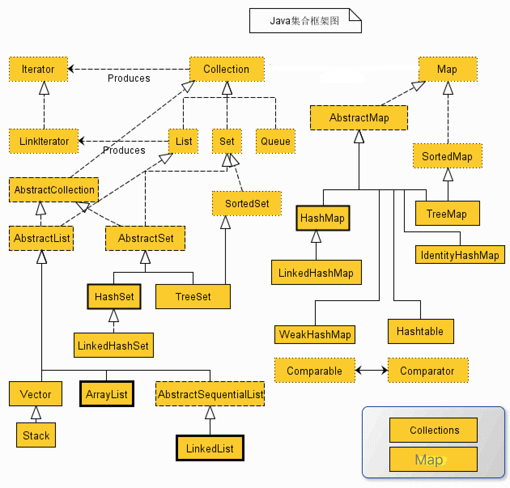
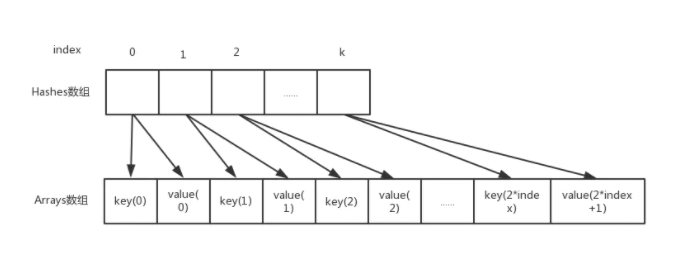

### 集合

[TOC]

#### 1. Java集合框架？

##### 介绍

- Map、Collection接口是所有集合框架的父类接口。

- Collection接口的子接口包括：Set和List接口；

- Map(**kv**)接口的实现类主要有：HashMap、TreeMap、HashTable、ConcurrentHashMap以及Propreties等。

- List(**有序可重复**)接口的实现类主要有：ArrayList、LinkedList、Vetor、Stack等。

- Set(**不可重复**)接口的实现类主要有：HashSet、TreeSet、LinkedHashSet等。

  


#### 2. HashMap原理？

##### 存储结构

​	采用**链表散列**的数据结构，即数组和链表组成的，当链表长度大于8，采用红黑树存储。

​	注意：初始容量为16，扩容方式为2N。

```java
/**
 * HashMap数据结构
 * "链表散列"的数据结构，内部实现是一个桶数组，每个桶中存放着一个单链表的头结点。
 *  链表长度大于8，采用红黑树存储。
 */
 static final float DEFAULT_LOAD_FACTOR = 0.75f;  // 默认负载因子！
 static final int DEFAULT_INITIAL_CAPACITY = 1 << 4; // aka 16   默认容量！

 transient Node<K,V>[] table; // extned Entry<K,V>
 transient int size;
 int threshold;			// 阈值 table.size * loadFactor
 final float loadFactor;

 // 计算hash
 static final int hash(Object key) {
    int h;
    return (key == null) ? 0 : (h = key.hashCode()) ^ (h >>> 16);
 }
 // 获得key索引
 tab[index = (tableSize - 1) & hash];

 // 大于阈值后，2倍扩容
 newCap = oldCap << 1
```

##### 常见问题

1. putVal逻辑？

   

2. 为什么要自己计算hash?

   ```java
   static final int hash(Object key) {
           int h;
     			// 把高16位和低16位做异或运算，更好保留高位数特征。避免后面计算index时，高位数没有参与运算。
           return (key == null) ? 0 : (h = key.hashCode()) ^ (h >>> 16);
       }
   ```

   为了让key的高低位数据都参与运算，防止计算槽位是丢失高位特征。

   [参考！！](https://www.cnblogs.com/zxporz/p/11204233.html)

3. 为什么容量总是2的次幂？

   - 为了让哈希后的结果更加均匀
   - 当n为2次幂时，满足公式：`(n - 1) & hash = hash % n`，与运算效率更高。

   索引位置计算公式： `tab[(n - 1) & hash]`。

   因为 n 永远是2的次幂，所以 n-1 通过 二进制表示，永远都是尾端以连续1的形式表示（00001111，00000011）。当(n - 1) 和 hash 做与运算时，会保留hash中 后 x 位的 1(且索引合法)，
   例如 00001111 & 10000011 = 00000011

   好处：

   - &(与)运算符比%(取模)运算速度快；
   - 能保证索引值不会超出长度；
   - 当n为2次幂时，满足公式：`(n - 1) & hash = hash % n`

   **说了这么多点，上面提到的所有问题，最终目的还是为了让哈希后的结果更均匀的分部，减少哈希碰撞，提升hashmap的运行效率。**

4. 为什么hash计算公式是`(key == null) ? 0 : (h = key.hashCode()) ^ (h >>> 16)`?

   实质上是把一个数的低16位和高16位做异或运算，因为前面计算索引公式，只有hash的低x位参与到运算。使高16位也参到hash的运算能减少hash冲突。

5. 为什么默认加载引子选择0.75？

   **提高空间利用率和减少查询成本的折中，主要是泊松分布，0.75的话碰撞最小。**

   加载因子过高，例如为1，虽然减少了空间开销，提高了空间利用率，但同时也增加了查询时间成本；

   加载因子过低，例如0.5，虽然可以减少查询时间成本，但是空间利用率很低，同时提高了rehash操作的次数。

6. HashMap扩容机制`resize()`？

   - Bucket 只有一个Node，重新计算位置；

   - Buket是Node链表，循环遍历，采用高低位链进行扩容；

     **通过e.hash & oldCap来判断节点位置通过再次hash算法后，是否会发生改变，如果为0表示不会发生改变(newIndex = oldIndex)，如果为1表示会发生改变(newIndex = oldIndex+oldCap)。**

     遍历链表添加，通过计算位置添加。

   - Buket是TreeNode，采用红黑树挪移元素；

   ```java
   final Node<K,V>[] resize() {
      ...
       /**构造新表，初始化表中数据*/
       Node<K,V>[] newTab = (Node<K,V>[])new Node[newCap];
       //将刚创建的新表赋值给table
       table = newTab;
       if (oldTab != null) {
           //遍历将原来table中的数据放到扩容后的新表中来
           for (int j = 0; j < oldCap; ++j) {
               Node<K,V> e;
               if ((e = oldTab[j]) != null) {
                   oldTab[j] = null;
                   //1. 没有链表Node节点，直接放到新的table中下标为【e.hash & (newCap - 1)】位置即可
                   if (e.next == null)
                       newTab[e.hash & (newCap - 1)] = e;
                   //2. 如果是treeNode节点，则树上的节点放到newTab中
                   else if (e instanceof TreeNode)
                       ((TreeNode<K,V>)e).split(this, newTab, j, oldCap);
                   //3. 如果e后面还有链表节点，则遍历e所在的链表，
                   else { // 保证顺序
                       Node<K,V> loHead = null, loTail = null;
                       Node<K,V> hiHead = null, hiTail = null;
                       Node<K,V> next;
                       do {
                           //记录下一个节点
                           next = e.next;
                           /**
                            * newTab的容量是以前旧表容量的两倍,因为数组table下标并不是根据循环逐步递增
                            * 的，而是通过（table.length-1）& hash计算得到，因此扩容后，存放的位置就
                            * 可能发生变化，那么到底发生怎样的变化呢，就是由下面的算法得到.
                            *
                            * 通过e.hash & oldCap来判断节点位置通过再次hash算法后，是否会发生改变，如
                            * 果为0表示不会发生改变，如果为1表示会发生改变。到底怎么理解呢，举个例子：
                            * e.hash = 13 二进制：0000 1101
                            * oldCap = 32 二进制：0001 0000
                            *  &运算：  0  二进制：0000 0000
                            * 结论：元素位置在扩容后不会发生改变
                            */
                           if ((e.hash & oldCap) == 0) {
                               if (loTail == null)
                                   loHead = e;
                               else
                                   loTail.next = e;
                               loTail = e;
                           }
                           /**
                            * e.hash = 18 二进制：0001 0010
                            * oldCap = 16 二进制：0001 0000
                            * &运算：  16 二进制：0001 0000
                            * 结论：元素位置在扩容后会发生改变，那么如何改变呢？
                            * newCap = 32 二进制：0010 0000
                            * 通过(newCap-1)&hash
                            * 即0001 1111 & 0001 0010 得0001 0010，32+2 = 18
                            */
                           else {
                               if (hiTail == null)
                                   hiHead = e;
                               else
                                   hiTail.next = e;
                               hiTail = e;
                           }
                       } while ((e = next) != null);
                       if (loTail != null) {
                           loTail.next = null;
                           /**
                            * 若(e.hash & oldCap) == 0，下标不变，将原表某个下标的元素放到扩容表同样
                            * 下标的位置上
                            */
                           newTab[j] = loHead;
                       }
                       if (hiTail != null) {
                           hiTail.next = null;
                           /**
                            * 若(e.hash & oldCap) != 0，将原表某个下标的元素放到扩容表中
                            * [下标+增加的扩容量]的位置上 !!!
                            */
                           newTab[j + oldCap] = hiHead;
                       }
                   }
               }
           }
       }
       return newTab;
   }
   ```

   

7. HashMap在JDK1.7和1.8中区别？

   | 不同                     | JDK1.7                                                       | JDK1.8                                                       |
   | ------------------------ | ------------------------------------------------------------ | ------------------------------------------------------------ |
   | 存储结构                 | 数组+链表                                                    | 数组+链表+红黑树                                             |
   | 初始化方式               | 单独函数：`inflateTable()`                                   | 直接集成到了扩容函数`resize()`中                             |
   | hash值计算方式           | 扰动处理 = 9次扰动 = 4次位运算 + 5次异或运算                 | 扰动处理 = 2次扰动 = 1次位运算 + 1次异或运算                 |
   | 存放数据的规则           | 无冲突时，存放数组；冲突时，存放链表                         | 无冲突时，存放数组；冲突 & 链表长度 < 8：存放单链表；冲突 & 链表长度 > 8：树化并存放红黑树 |
   | 插入数据方式             | 头插法（先讲原位置的数据移到后1位，再插入数据到该位置）      | 尾插法（直接插入到链表尾部/红黑树）                          |
   | 扩容后存储位置的计算方式 | **全部按照原来方法进行计算**（即hashCode ->> 扰动函数 ->> (h&length-1)） | 按照扩容后的规律计算（即扩容后的位置=**原位置 or 原位置 + 旧容量**） |

8. HashMap如何解决hash冲突？

   - 链表法(目前使用)

   - 开放寻址法

     核心思想：如果出现冲突，重新探测一个空闲位置，再将元素插入。

     1. 线性探测法；

        往后逐个或n个一次查找空闲位置存储；

     2. 线性补偿探测法：

        如果冲突，根据规则重新生成一个新的hash值。

     缺点：1.容易造成堆聚现象，添加元素越多，堆聚现象越严重。 

     ​      2.删除元素特别困难，当位置为空时，无法判断元素的位置

   - 双重散列法

     假设第二个散列函数值为T
     \- 线性探测法：逐个检查冲突位置的下一个位置
     \- 双重散列表：每隔T个位置检查一次

   - 建立公共溢出区域


#### 3. hashmap和hashtable区别？

1. HashTable是线程安全的；
2. HashTable不允许K/V为null;
3. HashMap继承自AbstractMap类，而HashTable继承自Dictionary类;
4. hash计算方式不同，hashmap自己计算，hashtable直接使用hashCode()函数值；
5. 计算索引方式不同(hashmap效率更高，但必须是2容量必须为2的幂)，`index = (n - 1) & hash`和`(hash & 0x7FFFFFFF) % tab.length`;
6. 扩容方式不同： 默认容量 16、11，扩容2n,2n+1;
7. 存储方式不同，hashtable只用链表存储，hashmap大于8后使用红黑树存储。

#### 4. ConcurrentHashMap和HashTable的区别？

​	ConcurrentHashMap 结合了 HashMap 和 HashTable 二者的优势。HashMap 没有考虑同步，HashTable 考虑了同步的问题。但是 HashTable 在每次同步执行时都要锁住整个结构。 ConcurrentHashMap 锁的方式是稍微细粒度的。

​	在**JDK1.8中，放弃了Segment臃肿的设计，取而代之的是采用Node + CAS + Synchronized来保证并发安全进行实现。**

#### 5. HashSet如何保证数据不可重复的？

底层使用HashMap存储，数值存储在HashMap的key中，key本身就不允许重复。

#### 6. Array和ArrayList的区别？

1. Array中可以包含基本类型和对象类型，ArrayList中只能包含对象类型；
2. Array大小固定，ArrayList支持动态变化；

#### 7. ArrayList和LinkedList的区别？

1. LinkedList实现了List和Deque接口，一般称双向链表。ArrayList实现了List接口，动态数组；
2. LinkedList在插入或删除数据时更加高效，ArrayList在查找时更加高效；
3. LinkedList比ArrayList需要更多的内存。

#### 8. ArrayList和Vector的区别？

1. 都是基于数组实现，扩从使用`Arrays.copyOf(original,newLength)`;
2. Vector是线程安全的；
3. ArrayList 每次扩容1.5倍；Vector每次扩容2倍。

#### 9. String、StringBuffer、StringBuilder区别？

1. String 适合存储常量，不易频繁修改；

2. StringBuffer 适合存储可变数据，线程安全；

3. StringBulider 适合存储可变数据，执行效率高于StringBuffer，非线程安全,单线程场景使用；

   执行效率： StringBuilder < StringBuffer < String < +.

#### 10. equals、==和hashcode的区别？

- 区别

  1. ==   基本数据类型，比较的是它们的`值`；引用类型，比较的是`内存地址`,即同一个对象才为true;

  2. equals  默认比较的是`内存地址`，String类型默认比较的是字符串内容; 如果类覆盖了equals方法，那就根据代码进行比较。

     ```java
     /**
      * Object类默认equals方法，比较内存地址
      */
     public boolean equals(Object obj) {
             return (this == obj);
     }
     
     /**
      * String类equals方法，比较字符串每个字符是否相等
      */
     public boolean equals(Object anObject) {
             if (this == anObject) {
                 return true;
             }
             if (anObject instanceof String) {
                 String anotherString = (String)anObject;
                 int n = value.length;
                 if (n == anotherString.value.length) {
                     char v1[] = value;
                     char v2[] = anotherString.value;
                     int i = 0;
                     while (n-- != 0) {
                         if (v1[i] != v2[i])
                             return false;
                         i++;
                     }
                     return true;
                 }
             }
             return false;
         }
     /**
      * Integer类equals方法，比较数值相等
      */
     public boolean equals(Object obj) {
             if (obj instanceof Integer) {
                 return value == ((Integer)obj).intValue();
             }
             return false;
     }
     ```

     

  3. hashcode

     > 在集合中添加新元素是，通过hashcode比较，大大减少需要equals次数。还可以提升查找效率。
     >
     > 将对象放入到集合中时，首先判断要放入对象的hashcode值与集合中的任意一个元素的hashcode值是否相等，如果不相等直接将该对象放入集合中。如果hashcode值相等，然后再通过equals方法判断要放入对象与集合中的任意一个对象是否相等，如果equals判断不相等，直接将该元素放入到集合中，否则不放入。

     1、如果两个对象equals，Java运行时环境会认为他们的hashcode一定相等。 
     2、如果两个对象不equals，他们的hashcode有可能相等。 
     3、如果两个对象hashcode相等，他们不一定equals。 
     4、如果两个对象hashcode不相等，他们一定不equals。 

- 涉及知识点

  1. 比较结果

     ```java
      // 例如
      Integer a1 = 127;  // java在编译的时候,被翻译成-> Integer b1 = Integer.valueOf(127);
      Integer b1 = 127;
      Integer s1 = 128;
      Integer s2 = 128;
      System.out.println("a1==b1" + (a1==b1)); // true  ？
      System.out.println("s1==s2" + (s1==s2)); // false
      /**
      * 看一下源码大家都会明白，对于-128到127之间的数，会进行缓存。
      */
      public static Integer valueOf(int i) {  
              assert IntegerCache.high >= 127;  
              if (i >= IntegerCache.low && i <= IntegerCache.high)  
                  return IntegerCache.cache[i + (-IntegerCache.low)];  
              return new Integer(i);  
          }  
     
     ```

     

  2. int和integer比较时候，integer会自动拆箱为int.

  3. 为什么覆盖equals时总要覆盖hashcode方法？

     会违反Object.hashcode的通俗约定，从而导致该类无法结合所有基于散列的集合一起正常运作，这样的集合包括HashMap、HashSet和Hashtable。

#### 11. HashSet、LinkedHashSet、TreeSet区别？

- 数据结构

  ```java
  /**
   * HashSet数据结构
   * 1. 基于HashMap实现，key存数据，value存统一个空对象；
   * 2. 存储唯一、无序的对象；
   * 3. 非线程安全；
   * 4. 可以存储一个null;
   */
  private transient HashMap<E,Object> map;
  // Dummy value to associate with an Object in the backing Map
  private static final Object PRESENT = new Object();
  
  /**
   * TreeSet数据结构
   * 1. 基于TreeMap实现，key存数据，value存统一个空对象；
   * 2. 存储元素唯一、有序的对象；
   * 3. 非线程安全；
   * 4. 不可存储null;
   */
   public TreeSet() {this(new TreeMap<E,Object>());}
   private static final Object PRESENT = new Object();
  
  /**
   * LinkedHashSet数据结构
   * 1. 继承自HashSet，基于LinkedHashMap实现；区别是：插入或遍历对象顺序一致；
   */
  HashSet(int initialCapacity, float loadFactor, boolean dummy) {
     map = new LinkedHashMap<>(initialCapacity, loadFactor);
  } 
  ```

- 使用场景

  1. 三者都实现Set接口，特性是元素唯一；

  2. HashSet 查询速度快，用HashTable实现，它的元素是无序的；

     LinkedHashSet 继承HashSet,用LinkedHashMap实现，它的元素是有序的；

     TreeSet  底层实现是红黑树(自平衡二叉树)，可以对数据进行排序；不但能保证元素唯一，还能元素保证有序;

#### 12. ArrayMap原理

##### 数据结构

[参考](https://zhuanlan.zhihu.com/p/23329871?from_voters_page=true)

```java
public final class ArrayMap<K, V> implements Map<K, V> {
	 int[] mHashes;    // 存储key的hash值，方便二分查找(如果碰撞，两边继续查找)
   Object[] mArray;  // 存放key和value值
   int mSize;
}  
```



##### 作用和特点

ArrayMap是Android特有的api，用在移动端，它主要是提升内存效率；

ArrayMap比传统的HashMap慢，所以ArrayMap不适合包含大数据的处理，因为添加和删除元素的时候需要使用二分搜索来查找元素；

ArrayMap会在remove item的时候收缩数组；

线程不安全的。

它可以避免在将数据插入Map中时额外的空间消耗（对比`HashMap`）。
而且它扩容的更合适，**扩容时只需要数组拷贝工作，不需要重建哈希表**。

#### 13. SparseArray原理

> SparseArray类似于ArrayMap,在Key为整数时可以考虑替代HashMap提供更有效的空间利用。
>
> 使用二分查找，大数据的时候查找慢，但效率高，在千级数据量内可以取代Hashmap。

```java
private int[] mKeys; // 二分查找
private Object[] mValues;
private int mSize;

// 几种列席
SparseArray          <int, Object>
LongSparseArray      <long, Object>
SparseBooleanArray   <int, boolean>
SparseIntArray       <int, int>
SparseLongArray      <int, long>
```

#### 14. BlockingQueue(阻塞队列)？

> 多用于并发模型，条件不足会是调用线程阻塞，满足条件后唤醒调用线程。
>
> put/take() 会阻塞当前线程；offer/pool()方法不阻塞。

分类：

- ArrayBlockingQueue

  基于数组实现，大小固定，公用一个锁对象，意味着放入或消费无法并发运行。

- LinkedBlockingQueue

  基于链表实现，默认大小int最大值，读写锁分离，效率更高。

- DelayQueue(延迟)

- PriorityBlockingQueue(优先级)

- SynchronousQueue(无缓存队列)

#### 15. TreeMap实现原理

​	基于红黑树**（Red-Black tree）**实现。

