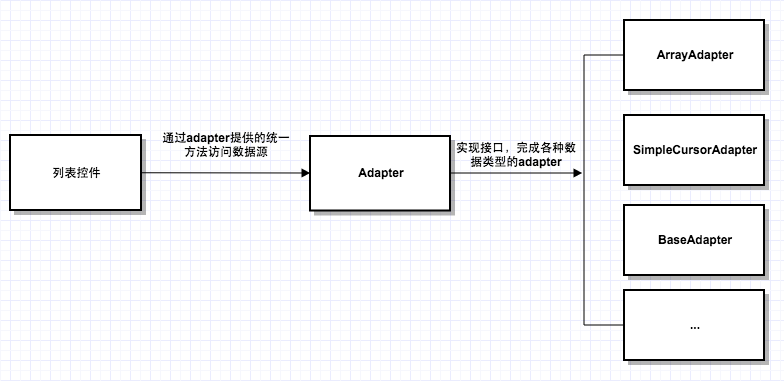

### Android开源项目

[TOC]

> Android 知识总结。
>

#### 1. ListView原理

[参考1](https://blog.csdn.net/qq_15827013/article/details/97809431)

[参考2](https://blog.csdn.net/guolin_blog/article/details/44996879)

[参考3](https://www.jianshu.com/p/0ec7b56d974e)

- 组成部分

1. 列表控件

   

   AbsListView继承自AdapterView，泛型参数为ListAdapter，一个列表adapter，该ViewGroup有一套view的回收复用机制供子类使用，专门负责对多数据多view的控件的展示优化；

   ListView与GridView都继承自AbsListView，使用了其父类的回收机制，并重写相应的布局方法来实现各自的布局；

   ExpandableListView继承了ListView，只是对数据的展示划分的更细一层，分为section和child。

2. Adapter适配器

   > 避免列表控件直接与各种数据源打交道而变得复杂；Adapter为数据源定义了一个通用的实现接口，是控件通过指定的方法完成对数据的监控和使用，而不用关系数据是什么类型。

   

3. RecycleBin回收机制

> RecycleBin是AbsListView的一个内部类，都是在内部维护一个缓存池，回收划出列表的item，添加给将要进入列表的item。ListView内部是两级缓存，分别是mActiveViews和mScrapViews.而RecycleView内部有四级缓存。

- 工作原理

```java
class RecycleBin{
   //1. 用来保存item的一个临时数组，主要用在listView第二次onLayout()时，给listView提供item.
   private View[] mActiveViews = new View[0];
   //2. 存在划出屏幕的view，回收利用。 
   private ArrayList<View>[] mScrapViews;
   private ArrayList<View> mCurrentScrap;

	 // 填充mActiveViews
   void fillActiveViews(int childCount, int firstActivePosition) {
            if (mActiveViews.length < childCount) {
                mActiveViews = new View[childCount];
            }
            mFirstActivePosition = firstActivePosition;
            //noinspection MismatchedReadAndWriteOfArray
            final View[] activeViews = mActiveViews;
            for (int i = 0; i < childCount; i++) {
                View child = getChildAt(i);
                AbsListView.LayoutParams lp = (AbsListView.LayoutParams) child.getLayoutParams();
                // Don't put header or footer views into the scrap heap
                if (lp != null && lp.viewType != ITEM_VIEW_TYPE_HEADER_OR_FOOTER) {
                    // Note:  We do place AdapterView.ITEM_VIEW_TYPE_IGNORE in active views.
                    //        However, we will NOT place them into scrap views.
                    activeViews[i] = child;
                    // Remember the position so that setupChild() doesn't reset state.
                    lp.scrappedFromPosition = firstActivePosition + i;
                }
            }
        }
  
  	// 获取view，并从列表移除
  	View getActiveView(int position) {...}
  	// 将废弃的View进行缓存
    void addScrapView(View scrap, int position) {...}
    // 获取废弃的view
    View getScrapView(int position) {...}
    // listview中几种类型的数据项
    setViewTypeCount()
    /**
     * onlayout 获取view！！！
     */
    View obtainView(int position, boolean[] outMetadata) {
        final View child = mAdapter.getView(position, scrapView, this);
    }  
}
```

- 二次layout

  > 任何一个View，在展示到界面上之前都会经历至少两次onMeasure()和两次onLayout()的过程。

  总结一下:
  1.在第一次布局的时候调用我们写的getView()的逻辑代码来加载第一次的数据，
  2.因为需要二次布局的原因，将第一次加载的item放到一个临时数组mActiveViews中,用于在第二次makeAndAddView()时复用，
  3.通过while循环和makeAndAddView()填满可见屏幕
  4.接下来的listView中item的复用主要通过mScrapViews来解决。


