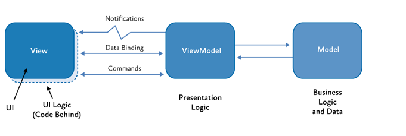
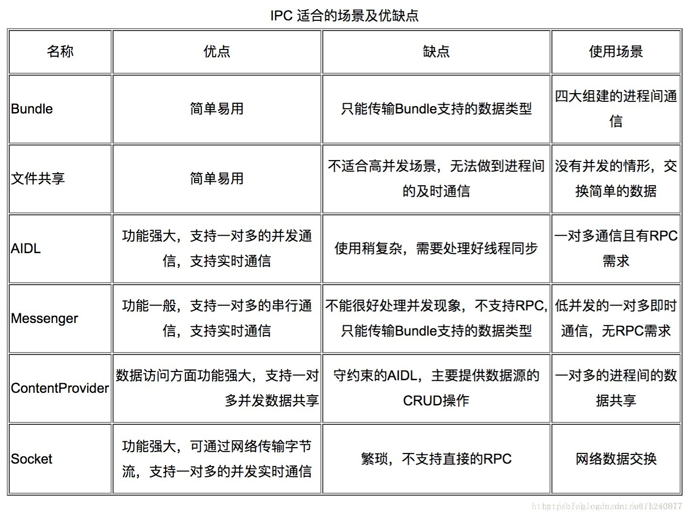

### Android进阶

[TOC]

> Android 知识总结。
>


#### 1. 性能优化

[参考1](https://www.cnblogs.com/lixiansheng/p/11382341.html)

##### 1布局优化

(1) 删除布局中无用的控件和层次，选择性能较低的ViewGroup。如：层级相同情况下：RL > LL。

(2) 采用ViewStub、include、merge标签：

- <include/> 标签 提高布局的复用性；
- <ViewStub/> 标签 延迟加载；原理是 加载了一个宽高都为0的View，默认是不可见的。只能通过setVisibilty或inflate函数才能加载目标布局；
- <Merge/> 标签 直接将子元素加载到parent布局(其实就是减少include的层级)。

(3) 避免过度绘制

​	Overdraw是指屏幕上一个像素点绘制了多次，多个控件叠加。

​	查看方法： 开发者选项->调试GPU过度绘制；

​	解决办法：1. 移除Window默认的backgroup(背景色处理) 2. 减少布局嵌套和view深度。

##### 2绘制优化

Android系统每隔16ms发出VSYNC信号，触发对UI进行渲染，如果每次渲染都成功，这样就能够达到流畅的画面所需要的60fps，为了能够实现60fps，这意味着程序的大多数操作都必须在16ms内完成。

- onDraw中不要创建新的局部对象；
- onDraw中不要做耗时任务，也不能有大量循环。

##### 3内存泄漏

优化方面：

1. 在开发过程中避免写出内存泄漏的代码；
2. 通过一些分析工具比如MAT、LeakCanary来找出潜在的内存泄漏，然后解决；

内存泄漏种类：

1. 集合类内存泄漏；
2. 单例/静态变量造成的内存泄漏；
3. 匿名内部类/非静态内部类；(例如Handler使用)
4. 资源未关闭；

##### 4响应速度

响应速度优化的核心思想就是避免在主线程中做耗时操作。

Activity 5s、BoradcastReceiver 10s内未完成报ANR。

##### 5线程优化

线程优化的思想就是采用线程池，避免程序中存在大量的Thread。

##### 6ListView/RecycleView/Bitmap优化

1. 使用ViewHolder模式提示效率；
2. 耗时操作异步加载(如图片加载和设置缓存);
3. 分页加载或滑动停止时加载；
4. **对图片进行压缩或缓存**。

##### 7其他

1. 避免过度创建对象；
2. 不要使用枚举；
3. 常量请使用static final来修饰；
4. 使用一些Android特有的数据结构，比如SparseArray和Pair等
5. 适当采用软引用和弱引用；
6. 采用内存缓存和磁盘缓存；
7. 尽量使用静态内部类；

#### 2.框架

[参考1](https://blog.csdn.net/smile_Running/article/details/94724540)

##### 1. 目录结构

**base**存放app的基类

**common**存放一些常量,接口,公用的东西

**contract**连接V层和P层的一个契约包

**model**M层,数据库,网络请求,服务等业务操作

**presenter**P层,负责连接V层和M层,中心管理器

**ui**V层,负责UI的展示

**utils**存放工具类

**widget**存放自定义的一些组件

##### 2. MVP

> model（模型），负责访问网络数据、访问数据库数据，提供数据源
>
> view（视图），负责更新界面、响应用户界面操作
>
> controller（控制器），负责业务逻辑控制，处理数据

- 好处

  `易于维护`，`易于测试`，`松耦合`，`复用性高`

  分离了视图逻辑和业务逻辑，降低了耦合；

  Activity只处理声明周期的任务，代码更加简洁；

  视图逻辑和业务逻辑分别抽象到了View和Presenter的接口中，提高代码的阅读性。

  Presenter被抽象成接口，可以有多种具体的实现，所以方便进行单元测试。

- 缺点

  (1)activity 内存泄漏

  `解决办法就是让Presenter 持有Activity的弱引用。`

  ```java
  public abstract class BasePresenter <V extends ImvpBaseView> {  
    protected Reference<V>mViewRef;  
  //建立关联 
    public void attachView(V view){           
       mViewRef=new WeakReference<V>(view);  
    } 
  //获取view 
    protected V getView(){  
        return mViewRef.get(); 
     }    
  //判断是否与View建立了关联
  public boolean isViewAttached(){  
        return mViewRef!=null && mViewRef.get()!=null; 
     }   
  
   //该方法在activity或者Fragment的onDestory中调用 
     public void detachView(){  
        if(mViewRef!=null){    
          mViewRef.clear();     
         mViewRef=null;     
     }   
   }}
  ```

  (2) 一个Activity对应多个P?

  有一定p重复实现，极少。

  (3) 接口过于复杂？

  建立Base类，抽common接口实现。

- ....

```java
public interface IBaseView {
}

public interface IBasePresenter<V extends IBaseView> {
    void attachView(V view);
}

public abstract class BaseActivity<P extends IBasePresenter> extends AppCompatActivity implements IBaseView{
    protected P mPresenter;
    @Override
    protected void onCreate(@Nullable Bundle savedInstanceState) {
        super.onCreate(savedInstanceState);
        setContentView(getLayoutId());
        //初始化mPresenter
        initPresenter();
        if(mPresenter != null){
            mPresenter.attachView(this);
        }
        //初始化
        initView();
    }
    
    // 初始化mPresenter
    protected abstract void initPresenter();
    protected abstract void initView();
    protected abstract int getLayoutId();
}

public abstract class BasePresenter<V extends IBaseView> implements IBasePresenter<V> {
    protected DataManager mDataManager;
    protected V mView;
    public BasePresenter(){
         AppDbHelper appDbHelper = new DbHelper();
         AppPreferenceHelper appPreferenceHelper = new PreferenceHelper();
         AppApiHelper appApiHelper = new ApiHelper();
         mDataManager = new DataManager(appDbHelper, appApiHelper, appPreferenceHelper);
    }

    @Override
    public void attachView(V view) {
        this.mView = view;
    }
}

public interface MainContract {
    interface View extends IBaseView{
        void testGetMview();
    }
    interface Presenter extends IBasePresenter<View>{
        void testGetMpresenter();
        void testDb();
        void testRequestNetwork();
        void testPreference();
    }
}

public class MainActivity extends BaseActivity<MainPresenter> implements MainContract.View {
    @Override
    protected void initPresenter() {
        mPresenter = new MainPresenter();
    }

    @Override
    protected void initView() {
        mPresenter.testGetMpresenter();
        mPresenter.testDb();
        mPresenter.testRequestNetwork();
        mPresenter.testPreference();
    }

    @Override
    protected int getLayoutId() {
        return R.layout.activity_main;
    }

    @Override
    public void testGetMview() {
        Log.d("print", "我是V层的引用");
    }
}

public class MainPresenter extends BasePresenter<MainContract.View> implements MainContract.Presenter{
    @Override
    public void testGetMpresenter() {
        Log.d("print", "我是P层的引用");
        mView.testGetMview();
    }

    @Override
    public void testDb() {
        mDataManager.testDb();
    }

    @Override
    public void testRequestNetwork() {
        mDataManager.testRequestNetwork();
    }

    @Override
    public void testPreference() {
        mDataManager.testPreference();
    }
}

```

##### 3.MVVM

[参考1](https://www.e-learn.cn/content/qita/615073)

[参考2](https://www.cnblogs.com/loaderman/p/10076529.html)

[gitdemo](https://github.com/antoniolg/androidmvvm)

> **关键字： MVVM、Databinding、ViewModel、LiveData、Lifecycle。**
>
> MVP中的P替换为VM。



- `DataBinding`用来实现`View`层与`ViewModel`数据的双向绑定(但实际上在`Android Jetpack`中`DataBinding`只存在于布局和布局生命周期控制器之间,当数据变化绑定到布局生命周期控制器时再转发给`ViewModel`,布局控制器可以持有`DataBinding`但`ViewModel`不应该持有`DataBinding`)

- `ViewModel`与`Presenter`大致相同,都是负责处理数据和实现业务逻辑,但是`ViewModel`层不应该直接或者间接地持有`View`层的任何引用,因为一个`ViewModel`不应该直达自己具体是和哪一个`View`进行交互的.`ViewModel`主要的工作就是将`Model`提供来的数据直接翻译成`View`层能够直接使用的数据,并将这些数据暴露出去,同时`ViewModel`也可以发布事件,供`View`层订阅.

  MVVM的核心思想是观察者模式,它通过事件和转移View层数据持有权来实现View层与ViewModel层的解耦.

  在MVVM中View不是数据的实际持有者,它只负责数据如何呈现以及点击事件的传递,不做的数据处理工作,而数据的处理者和持有者变成ViewModel,它通过接收View层传递过来的时间改变自身状态,发出事件或者改变自己持有的数据触发View的更新.

  MVVM解决了MVP中的存在的一些问题,比如它无需定义接口,ViewModel与View层彻底无关更好复用,并且有Google的Android Jetpack作为强力后援.

  但是MVVM也有自己的缺点,那就是使用MVVM的情况下ViewModel与View层的通信变得更加困难了,所以在一些极其简单的页面中请酌情使用,否则就会有一种脱裤子放屁的感觉,在使用MVP这个道理也依然适用.

  ##### 4.Jetpack

  > **Jetpack可以有效减少OOM和No Pointer Exception**

  [官网文档](https://developer.android.google.cn/jetpack)

  [github](https://github.com/KunMinX/Jetpack-MVVM-Best-Practice)

#### 3.进程通信方式和机制

[参考1](https://www.jianshu.com/p/16daa35de724)

> **进程间通信 Inter-Process Communication（IPC）：是在多任务操作系统或联网的计算机之间运行的程序和进程所用的通信技术。有两种类型的进程间通信（IPC）。**
> **1 本地过程调用（LPC）：LPC用在多任务操作系统中，使得同时运行的任务能互相会话。这些任务共享内存空间使任务同步和互相发送信息。**
> **2　远程过程调用（RPC）：RPC类似于LPC，只是在网上工作RPC开始是出现在Sun微系统公司和HP公司的运行UNIX操作系统的计算机中。**



- Messenger AIDI区别

  Messenger的本质也是AIDL，只不过对其进行了封装，在操作的时候不需要写.aidl问题；

  在server端，messenger处理任务是单线程的，aidl多多线程的；

  在client端，aidl是同步的，messenger是异步的。

- **都是基于Binder机制通信！！！**

  AIDL、Messenger、ContentProvider。

- 为什么SystemServer进程与Zygote进程通讯采用Socket而不是Binder?

  fork只能拷贝当前线程，不支持多线程的fork。

  如果zygote使用binder的多线程模型与system_server进程进行通讯的话，fork()出的App进程的binder通讯没法用，那么只能再使用exec()启动一个新进程。

  [参考](https://blog.csdn.net/qq_39037047/article/details/88066589)

#### 4.Flutter/ReactNative


#### 5.AMS、PMS源码学习


#### 6.Java注解

[参考](https://www.cnblogs.com/yangming1996/p/9295168.html)

**「注解的本质就是一个继承了 Annotation 接口的接口」**。

**原理**

应用层面：

```java
// java内置Override注解
@Target(ElementType.METHOD)
@Retention(RetentionPolicy.SOURCE)
public @interface Override {

}
// 本质是
public interface Override extends Annotation{
    
}
```

虚拟机层面：

```java
/**
	* 虚拟机编译时生成了代理类(注解类的所有方法都会被代理)。
	* 然后可以通过方法名获取注解属性值。
	*/
public final class $Proxy1 extends Proxy implements HelloWorldAnn {
    private static Method m1;
    private static Method m2;
    private static Method m4;
    private static Method m0;
    private static Method m3;

    public $Proxy1(InvocationHandler var1) throws  {
        super(var1);
    }

    public final boolean equals(Object var1) throws  {
        try {
            return (Boolean)super.h.invoke(this, m1, new Object[]{var1});
        } catch (RuntimeException | Error var3) {
            throw var3;
        } catch (Throwable var4) {
            throw new UndeclaredThrowableException(var4);
        }
    }

    public final String toString() throws  {
        try {
            return (String)super.h.invoke(this, m2, (Object[])null);
        } catch (RuntimeException | Error var2) {
            throw var2;
        } catch (Throwable var3) {
            throw new UndeclaredThrowableException(var3);
        }
    }

    public final Class annotationType() throws  {
        try {
            return (Class)super.h.invoke(this, m4, (Object[])null);
        } catch (RuntimeException | Error var2) {
            throw var2;
        } catch (Throwable var3) {
            throw new UndeclaredThrowableException(var3);
        }
    }

    public final int hashCode() throws  {
        try {
            return (Integer)super.h.invoke(this, m0, (Object[])null);
        } catch (RuntimeException | Error var2) {
            throw var2;
        } catch (Throwable var3) {
            throw new UndeclaredThrowableException(var3);
        }
    }

    public final String value() throws  {
        try {
            return (String)super.h.invoke(this, m3, (Object[])null);
        } catch (RuntimeException | Error var2) {
            throw var2;
        } catch (Throwable var3) {
            throw new UndeclaredThrowableException(var3);
        }
    }

    static {
        try {
            m1 = Class.forName("java.lang.Object").getMethod("equals", Class.forName("java.lang.Object"));
            m2 = Class.forName("java.lang.Object").getMethod("toString");
            m4 = Class.forName("com.company.MainTest$HelloWorldAnn").getMethod("annotationType");
            m0 = Class.forName("java.lang.Object").getMethod("hashCode");
            m3 = Class.forName("com.company.MainTest$HelloWorldAnn").getMethod("value");
        } catch (NoSuchMethodException var2) {
            throw new NoSuchMethodError(var2.getMessage());
        } catch (ClassNotFoundException var3) {
            throw new NoClassDefFoundError(var3.getMessage());
        }
    }
}

```