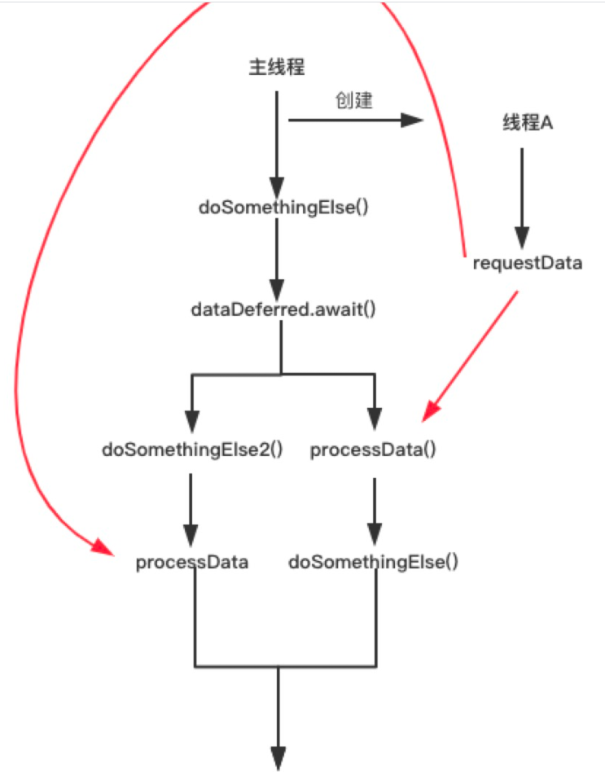

# Kotlin协程

[TOC]

## 一、Kotlin

### 1. 简介

​		Kotlin是一个用于多平台应用的静态开发语言，由JetBrains开发。可以用于服务器端开发、Android开发、JavaScript开发、原生开发。其中kotlin源代码会被编译为.class文件，用于在JVM上运行。

### 2. 好处

- 代码更少、可读性强；
- 新语言特性：协程、扩展函数、lambdas、作用域、非空判断等。
- 与Java语言互通，支持多平台开发。

### 3. 问题

- 什么是内联函数？

  如果有一些函数被频繁调用，不断地入栈，会造成栈空间或**栈内存**的大量消耗。因此引入**inline修饰符**，即**内联函数**。

  ```c
  #include <stdio.h>  
   
  //函数定义为inline即:内联函数  
  inline char* dbtest(int a) 
  {  
  	return (i % 2 > 0) ? "奇" : "偶";  
  }   
    
  int main()  
  {  
  	int i = 0;  
  	for (i=1; i < 100; i++) 
  	{  
  		printf("i:%d    奇偶性:%s /n", i, dbtest(i));      
  	}  
  }  
  ```

     **上面的例子就是标准的内联函数的用法，使用inline修饰带来的好处我们表面看不出来，其实在内部的工作就是在每个for循环的内部任何调用dbtest(i)的地方都换成了(i%2>0)?"奇":"偶"这样就避免了频繁调用函数对栈内存重复开辟所带来的消耗。**

  **inline限制：**只适合函数体内代码简单的函数使用，不能包含循环不支持内部递归。

  **内联函数的工作原理**：Kotlin 编译器会将内联函数中的代码在编译时自动替换到调用它的地方，这样也就不存在运行时的开销了。

- Let/run/also/apply区别？

  Let、run都返回闭包执行结果，let有闭包参数；

  also、apply都返回调用者本身，also有闭包参数；

- Lambda语法

  匿名函数或闭包。

  ```java
  // java
  mName.setOnClickListener(new View.OnClickListener() {
      @Override
      public void onClick(View v) {
      }
  });
  // kotlin 匿名函数
  mName.setOnClickListener { 
  }
  // kotlin 闭包
  val sum = { x:Int, y:Int -> 
      x + y
  } 
  ```

- 高阶函数

  **高阶函数**：接收另一个函数（函数类型）作为参数，或返回值的类型是另一个函数。

  ```kotlin
  // 基本定义规则
  // -> 左边部分是用来声明该函数接收什么参数，多个参数可用逗号隔开，若不接收参数则写空括号即可
  // -> 右边部分是用来声明该函数的返回值是什么类型，若没有返回值就使用 Unit (类似Java中的void)
  (String, Int) -> Unit
  
  // demo1
  fun example(func: (String, Int) -> Unit) {
      func("hello", 123) // 高阶函数允许让函数类型的参数来决定函数的执行逻辑。
  }
  // demo2
  // 这边第三个参数是一个接收两个整型参数并且返回值也是整型的函数类型参数
  fun num1AndNum2(num1: Int, num2: Int, operation: (Int, Int) -> Int): Int {
      val result = operation(num1, num2)
      return result
  }
  // 两数相加并返回
  fun plus(num1: Int, num2: Int): Int {
      return num1 + num2
  }
  
  // 两数相减并返回
  fun minus(num1: Int, num2: Int): Int {
      return num1 - num2
  }
  fun main() {
      val num1 = 100
      val num2 = 200
      val result1 = num1AndNum2(num1, num2, ::plus)  // ！！！
      val result2 = num1AndNum2(num1, num2, ::minus)
      println("result1 is $result1")
      println("result2 is $result2")
  }
  // 除了用上面的方式来调用高阶函数，Kotlin 也支持用 Lambda 表达式、匿名函数、成员引用等来调用高阶函数，如使用 Lambda 表达式来实现上述代码：
  fun main() {
      val num1 = 100
      val num2 = 200
      // !!!这样用 Lambda 表达式来调用就无需定义 plus() 和 minus() 函数了。
      val result1 = num1AndNum2(num1, num2) { n1, n2 ->
          n1 + n2
      }
      val result2 = num1AndNum2(num1, num2) { n1, n2 ->
          n1 - n2
      }
      println("result1 is $result1")
      println("result2 is $result2")
  }
  ```

- 扩展函数

  ```kotlin
  //扩展函数定义
  fun TextView.isBold() = this.apply { 
  	paint.isFakeBoldText = true
  }
  
  //扩展函数调用
  activity.find<TextView>(R.id.course_comment_tv_score).isBold()
  ```

  **原理：**扩展函数实际上就是一个对应Java中的静态函数，这个静态函数参数为接收者类型的对象，然后利用这个对象就可以访问这个类中的成员属性和方法了，并且最后返回一个这个接收者类型对象本身。这样在外部感觉和使用类的成员函数是一样的。

  ```kotlin
  public final class ExtendsionTextViewKt {//这个类名就是顶层文件名+“Kt”后缀，这个知识上篇博客有详细介绍
     @NotNull
     public static final TextView isBold(@NotNull TextView $receiver) {//扩展函数isBold对应实际上是Java中的静态函数，并且传入一个接收者类型对象作为参数
        Intrinsics.checkParameterIsNotNull($receiver, "$receiver");
        $receiver.getPaint().setFakeBoldText(true);//设置加粗
        return $receiver;//最后返回这个接收者对象自身，以致于我们在Kotlin中完全可以使用this替代接收者对象或者直接不写。
     }
  }
  ```

- 中缀表达式

  [参考](https://my.oschina.net/u/4135686/blog/3051463)

## 二、协程

### 一、简介

#### 1. 概念

> 协程，又称微线程和纤程等,“协程”（Coroutine）概念最早由 Melvin Conway 于 1958 年提出。协程可以理解为纯用户态的线程，其通过协作而不是抢占来进行切换。相对于进程或者线程，协程所有的操作都可以在用户态完成，创建和切换的消耗更低。总的来说，协程为协同任务提供了一种运行时抽象，这种抽象非常适合于协同多任务调度和数据流处理。**在现代操作系统和编程语言中，因为用户态线程切换代价比内核态线程小，协程成为了一种轻量级的多任务模型**。
>
> 从编程角度上看，协程的**思想本质上就是控制流的主动让出（yield）和恢复（resume）机制**，迭代器常被用来实现协程，所以大部分的语言实现的协程中都有 yield 关键字，比如 Python、PHP、Lua。但也有特殊比如 Go 就使用的是通道来通信。
>
> 有趣的是协程的历史其实要早于线程。

这里有两个关键点： **1 不阻塞** 、**2 中断、恢复执行**

**好处：**避免线程切换性能消耗。**协程更加轻量，创建成本更小，降低了内存消耗。协作式的用户态调度器，减少了 CPU 上下文切换的开销，提高了 CPU 缓存命中率。减少同步加锁，整体上提高了性能。可以按照同步思维写异步代码，即用同步的逻辑，写由协程调度的回调。**

**适合场景：**多IO操作场景，避免cpu密集场景。

**区别：**

​	**协程(Coroutine)编译器级的，进程(Process)和线程(Thread)操作系统级的**

​	进程(Process)和线程(Thread)是os通过调度算法，保存当前的上下文，然后从上次暂停的地方再次开始计算，重新开始的地方不可预期，每次CPU计算的指令数量和代码跑过的CPU时间是相关的，跑到os分配的cpu时间到达后就会被os强制挂起，开发者无法精确的控制它们。

​	协程（Coroutine）是一种轻量级的用户态线程，实现的是非抢占式的调度，即由当前协程切换到其他协程由当前协程来控制。目前的协程框架一般都是设计成 1:N 模式。所谓 1:N 就是一个线程作为一个容器里面放置多个协程。那么谁来适时的切换这些协程？答案是有协程自己主动让出 CPU，也就是每个协程池里面有一个调度器，这个调度器是被动调度的。意思就是他不会主动调度。而且当一个协程发现自己执行不下去了（比如异步等待网络的数据回来，但是当前还没有数据到)，这个时候就可以由这个协程通知调度器，这个时候执行到调度器的代码，调度器根据事先设计好的调度算法找到当前最需要 CPU 的协程。切换这个协程的 CPU 上下文把 CPU 的运行权交个这个协程，直到这个协程出现执行不下去需要等等的情况，或者它调用主动让出 CPU 的 API 之类，触发下一次调度。

这点是和 thread 最大的不同，thread 线程之间采取的是竞争 cpu 时间段的方法，谁抢到谁运行，由系统内核控制，对我们来说是不可见不可控的。协程不同，协程之间不用竞争、谁运行、谁挂起、什么时候恢复都是由我们自己控制的。

#### 2. 原理	 

[参考](https://zhuanlan.zhihu.com/p/52495120)

#### 3. 使用

它们在某些 [CoroutineScope](https://kotlin.github.io/kotlinx.coroutines/kotlinx-coroutines-core/kotlinx.coroutines/-coroutine-scope/index.html) 上下文中与 [launch](https://kotlin.github.io/kotlinx.coroutines/kotlinx-coroutines-core/kotlinx.coroutines/launch.html) *协程构建器* 一起启动。 这里我们在 [GlobalScope](https://kotlin.github.io/kotlinx.coroutines/kotlinx-coroutines-core/kotlinx.coroutines/-global-scope/index.html) 中启动了一个新的协程，这意味着新协程的生命周期只受整个应用程序的生命周期限制。

可以将 `GlobalScope.launch { …… }` 替换为 `thread { …… }`，并将 `delay(……)` 替换为 `Thread.sleep(……)` 达到同样目的。 试试看（不要忘记导入 `kotlin.concurrent.thread`）

```kotlin
import kotlinx.coroutines.*

fun main() {
   // 非阻塞
    GlobalScope.launch { // 在后台启动一个新的协程并继续
        delay(1000L) // 非阻塞的等待 1 秒钟（默认时间单位是毫秒）
        println("World!") // 在延迟后打印输出
    }
  	// 阻塞 调用了 runBlocking 的主线程会一直 阻塞 直到 runBlocking 内部的协程执行完毕。
  	runBlocking {     // 但是这个表达式阻塞了主线程
        delay(2000L)  // ……我们延迟 2 秒来保证 JVM 的存活
    } 
  	// 也是阻塞
    println("Hello,") // 协程已在等待时主线程还在继续
    Thread.sleep(2000L) // 阻塞主线程 2 秒钟来保证 JVM 存活
}
```

**kotlin协程** 是一种异步编程的顺序写法，将上诉例子中的代码可以改写成下面这样（为了表达出主线程不会阻塞，加了两行代码）：

虽然异步回调能很好的处理异步问题，但是有两点坏处：

- 将一条控制流分割成两条控制流，**增加代码复杂性**
- 如果嵌套层级过多，会造成**回调地狱**，同时控制流数量也可能呈指数上升

```kotlin
 fun setUpUI(){
        GlobalScope.launch(Main) { 
            val dataDeferred  = requestDataAsync()
            doSomethingElse()
            val data = dataDeferred.await()
            processData(data)
        }
        Thread.sleep(1000)
        doSomethingElse2()
    }

    fun requestDataAsync():Deferred<String>{
        // 启动一个异步协程去执行耗时任务
        return GlobalScope.async { 
            requestData()
        }
    }  

    fun doSomethingElse2(){
        println("doSomethingElse2")
    }

```



#### 2. **好处**

1. 同步的写法写异步程序；
2. 充分利用挖掘线程潜力；

### 二、使用场景

#### 1. 网络请求像同步

```java
  private fun netTest() {
        Log.e(TAG, "netTest() Main start...")

        CoroutineScope(Dispatchers.Main).launch {
            val result = async(Dispatchers.IO) { //或者withContext(Dispatchers.IO) {
                //使用okhttp使用同步请求，完事将response返回
                val request = Request.Builder().url("http://www.baidu.com").build()
                val response = OkHttpClient().newCall(request).execute()
                Log.e(TAG, "CoroutineScope  IO : ${Thread.currentThread().name}")

                response
            }
            Log.e(TAG, "CoroutineScope Main start : ${Thread.currentThread().name}")

            //等待异步执行的结果
            val response = result.await()
            //返回的结果，直接显示在sample_text这个textview上，也就是更新UI
            btn_jump.text = response.body()?.string()
            Log.e(TAG, "CoroutineScope Main end: ${Thread.currentThread().name}")
        }


        Log.e(TAG, "netTest() Main end...")
    }

// 结果：
 E/MainActivityCoroutine: netTest() Main start...
 E/MainActivityCoroutine: netTest() Main end...
 E/MainActivityCoroutine: CoroutineScope Main start : main
 E/MainActivityCoroutine: CoroutineScope  IO : DefaultDispatcher-worker-1
 E/MainActivityCoroutine: CoroutineScope Main end: main
```

#### 2. 线程切换

```java
// 2.
override fun onCreate(savedInstanceState: Bundle?) {
        super.onCreate(savedInstanceState)
        setContentView(R.layout.activity_thread)
        loadData()
    }

    private fun loadData() {
        GlobalScope.launch(Dispatchers.IO) { //在IO线程开始
            //IO 线程里拉取数据
            val result = fetchData()
            //主线程里更新 UI
            withContext(Dispatchers.Main) { //执行结束后，自动切换到UI线程
                tvShowContent.text = result
            }
        }
    }
    
    //关键词 suspend
    private suspend fun fetchData(): String {
        delay(2000) // delaying for 2 seconds to keep JVM alive
        return "content"
    }

// 2
val request = Request.Builder().url("http://www.baidu.com").build()
        val call = OkHttpClient().newCall(request)
        call.enqueue(object : Callback{
            override fun onResponse(call: Call, response: Response) {
                response.body()?.string()?.let { threadToMain(it) }
            }
 
            override fun onFailure(call: Call, e: IOException) {
 
            }
 
})
 
  fun threadToMain(string: String){
        MainScope().launch {
            sample_text.text = string
        }
    } 
```


- 参考

  [kotlin学习网站](https://www.kotlincn.net/docs/reference/coroutines-overview.html)

  [协程原理](https://ethanhua.github.io/2018/12/24/kotlin_coroutines/)
  
  [协程理解](https://segmentfault.com/a/1190000021068283)
  
  [异步、并发、协程原理](http://www.iigrowing.cn/?p=6736)
  
  [协程使用理解！！！](https://www.jianshu.com/p/76d2f47b900d)

