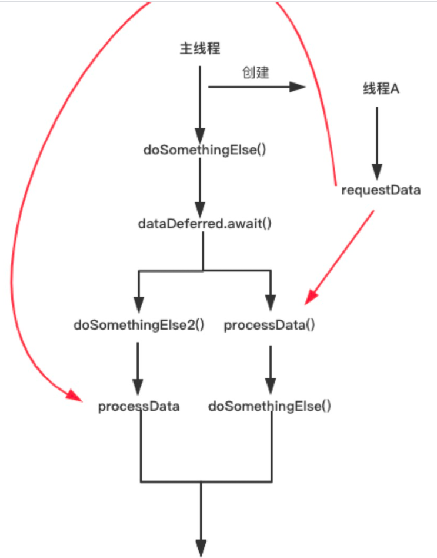

## 协程特性

[TOC]

### 一、简介

#### 1. **本质**

> **本质上，协程是轻量级的线程。协程不会阻塞当前线程，执行异步逻辑时将该点之后的代码块的执行中断，在异步回调回来后恢复执行**

这里有两个关键点： **1 不阻塞** 、**2 中断、恢复执行**

​	 它们在某些 [CoroutineScope](https://kotlin.github.io/kotlinx.coroutines/kotlinx-coroutines-core/kotlinx.coroutines/-coroutine-scope/index.html) 上下文中与 [launch](https://kotlin.github.io/kotlinx.coroutines/kotlinx-coroutines-core/kotlinx.coroutines/launch.html) *协程构建器* 一起启动。 这里我们在 [GlobalScope](https://kotlin.github.io/kotlinx.coroutines/kotlinx-coroutines-core/kotlinx.coroutines/-global-scope/index.html) 中启动了一个新的协程，这意味着新协程的生命周期只受整个应用程序的生命周期限制。

可以将 `GlobalScope.launch { …… }` 替换为 `thread { …… }`，并将 `delay(……)` 替换为 `Thread.sleep(……)` 达到同样目的。 试试看（不要忘记导入 `kotlin.concurrent.thread`）

```kotlin
import kotlinx.coroutines.*

fun main() {
   // 非阻塞
    GlobalScope.launch { // 在后台启动一个新的协程并继续
        delay(1000L) // 非阻塞的等待 1 秒钟（默认时间单位是毫秒）
        println("World!") // 在延迟后打印输出
    }
  	// 阻塞 调用了 runBlocking 的主线程会一直 阻塞 直到 runBlocking 内部的协程执行完毕。
  	runBlocking {     // 但是这个表达式阻塞了主线程
        delay(2000L)  // ……我们延迟 2 秒来保证 JVM 的存活
    } 
  	// 也是阻塞
    println("Hello,") // 协程已在等待时主线程还在继续
    Thread.sleep(2000L) // 阻塞主线程 2 秒钟来保证 JVM 存活
}
```

**kotlin协程** 是一种异步编程的顺序写法，将上诉例子中的代码可以改写成下面这样（为了表达出主线程不会阻塞，加了两行代码）：

虽然异步回调能很好的处理异步问题，但是有两点坏处：

- 将一条控制流分割成两条控制流，**增加代码复杂性**
- 如果嵌套层级过多，会造成**回调地狱**，同时控制流数量也可能呈指数上升

```kotlin
 fun setUpUI(){
        GlobalScope.launch(Main) { 
            val dataDeferred  = requestDataAsync()
            doSomethingElse()
            val data = dataDeferred.await()
            processData(data)
        }
        Thread.sleep(1000)
        doSomethingElse2()
    }

    fun requestDataAsync():Deferred<String>{
        // 启动一个异步协程去执行耗时任务
        return GlobalScope.async { 
            requestData()
        }
    }  

    fun doSomethingElse2(){
        println("doSomethingElse2")
    }

```



#### 2. **好处**

1. 同步的写法写异步程序；
2. 充分利用挖掘线程潜力；

### 二、使用场景

#### 1. 网络请求像同步

```java
  private fun netTest() {
        Log.e(TAG, "netTest() Main start...")

        CoroutineScope(Dispatchers.Main).launch {
            val result = async(Dispatchers.IO) { //或者withContext(Dispatchers.IO) {
                //使用okhttp使用同步请求，完事将response返回
                val request = Request.Builder().url("http://www.baidu.com").build()
                val response = OkHttpClient().newCall(request).execute()
                Log.e(TAG, "CoroutineScope  IO : ${Thread.currentThread().name}")

                response
            }
            Log.e(TAG, "CoroutineScope Main start : ${Thread.currentThread().name}")

            //等待异步执行的结果
            val response = result.await()
            //返回的结果，直接显示在sample_text这个textview上，也就是更新UI
            btn_jump.text = response.body()?.string()
            Log.e(TAG, "CoroutineScope Main end: ${Thread.currentThread().name}")
        }


        Log.e(TAG, "netTest() Main end...")
    }

// 结果：
 E/MainActivityCoroutine: netTest() Main start...
 E/MainActivityCoroutine: netTest() Main end...
 E/MainActivityCoroutine: CoroutineScope Main start : main
 E/MainActivityCoroutine: CoroutineScope  IO : DefaultDispatcher-worker-1
 E/MainActivityCoroutine: CoroutineScope Main end: main
```

#### 2. 线程切换

```java
// 2.
override fun onCreate(savedInstanceState: Bundle?) {
        super.onCreate(savedInstanceState)
        setContentView(R.layout.activity_thread)
        loadData()
    }

    private fun loadData() {
        GlobalScope.launch(Dispatchers.IO) { //在IO线程开始
            //IO 线程里拉取数据
            val result = fetchData()
            //主线程里更新 UI
            withContext(Dispatchers.Main) { //执行结束后，自动切换到UI线程
                tvShowContent.text = result
            }
        }
    }
    
    //关键词 suspend
    private suspend fun fetchData(): String {
        delay(2000) // delaying for 2 seconds to keep JVM alive
        return "content"
    }

// 2
val request = Request.Builder().url("http://www.baidu.com").build()
        val call = OkHttpClient().newCall(request)
        call.enqueue(object : Callback{
            override fun onResponse(call: Call, response: Response) {
                response.body()?.string()?.let { threadToMain(it) }
            }
 
            override fun onFailure(call: Call, e: IOException) {
 
            }
 
})
 
  fun threadToMain(string: String){
        MainScope().launch {
            sample_text.text = string
        }
    } 
```


- 参考

  [kotlin学习网站](https://www.kotlincn.net/docs/reference/coroutines-overview.html)

  [协程原理](https://ethanhua.github.io/2018/12/24/kotlin_coroutines/)
  
  [协程理解](https://segmentfault.com/a/1190000021068283)

