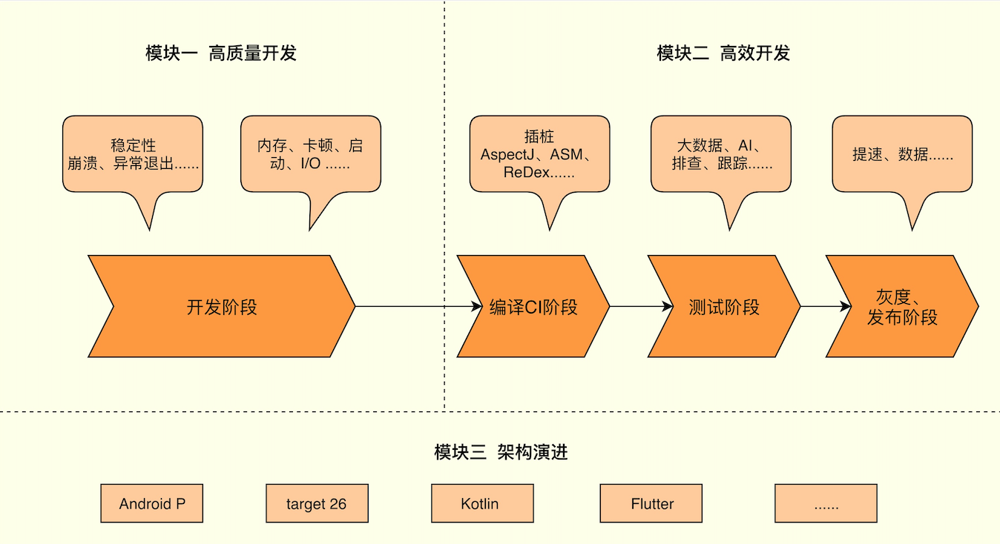

### Android开发高手课

[TOC]

#### 一、概述

​	对程序员来说，日常的工作分为两类：

1. 熟悉需求、开发业务代码；

2. 提高程序质量，增加团队效率(**简称：提质增效**)。

   需求业务开发是程序员的基本操作，衡量一个程序员是普通、优秀或卓越的一个最重要的标准就是“提质增效”，你在这条道路走的越远，代表你的开发功力和工作价值越高。

   下面就针对 提高代码质量和增加产品效率两方面进行深入讨论。

   

#### 二、高质量开发

> 注意两点：
>
> 1. 组织内部人员要把“质量观”深入骨髓，精益求精，心态摆正。
> 2. 产品需要严格的质量把控，做到可量化、可控。

APM平台可以协助我们把控产品质量，它所关注的问题就是性能优化需要解决的问题。下面就问题进行具体研究，大致分为以下3类：

##### 1.  崩溃问题、ANR问题；

##### 2. 启动速度、内存、卡顿、渲染、IO、存储；

##### 3. 电量、网络、安装包。

#### 三、高效开发

#### 四、架构演进