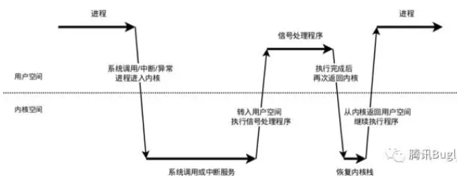
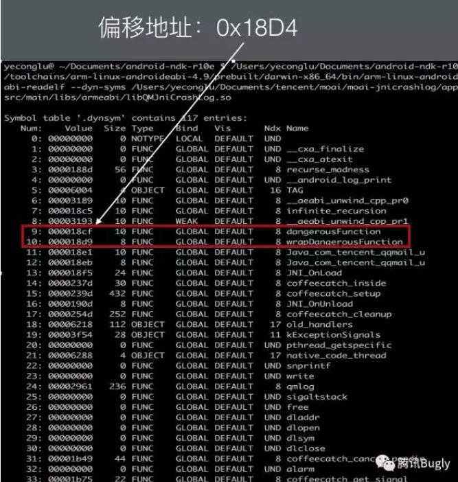

### 崩溃优化

[TOC]

#### 一、概述

​	我们都知道，Android崩溃分为Java崩溃和Native崩溃。Java崩溃捕获比较简单，Native崩溃捕获复杂。

​	正常的崩溃问题处理流程是，

1. 定义崩溃率指标；
2. 收集和分析崩溃信息；
3. 持续优化和更新指标。

#### 二、Java崩溃

##### 1. 崩溃捕获原理

 1. 当某个线程发生异常时，JVM会主动调用该线程的异常分发函数。

    ```java
    /**  Thread.java
         * Dispatch an uncaught exception to the handler. This method is
         * intended to be called only by the JVM.
         */
    private void dispatchUncaughtException(Throwable e) {
      getUncaughtExceptionHandler().uncaughtException(this, e);
    }
    ```

 2. 按优先级查找该线程的异常处理函数

    | 优先级 | 影响范围                    | 如何设置                                  |
    | ------ | --------------------------- | ----------------------------------------- |
    | 最高   | 当个线程                    | thread.setUncaughtExeptionHandler         |
    | 次高   | 当前ThreadGroup中所有的线程 | 重写threadGroup.uncaughtException         |
    | 最次   | 全部线程(静态方法)          | Thread.setDefaultUncaughtExceptionHandler |
    | 最末   | 打印堆栈到log或控制台       | e.printStackTrace(System.err);            |

    每个线程都是属于一个线程组的，UI线程(或新创建的线程)都属于main线程组，main线程组属于system线程组。

 3. 执行处理函数

##### 2. Android代码

```java
// AppApplication.java 
Thread.setDefaultUncaughtExceptionHandler(new Thread.UncaughtExceptionHandler() {
            @Override
            public void uncaughtException(@NonNull Thread t, @NonNull Throwable e) {
                // 收集、上传、分析。
            }
        });
```

##### 3. 知识点

​	Java异常分类；Thread线程代码；ThreadGroup和线程池。


#### 三、Native崩溃

##### 1. Logcat默认崩溃信息：

```verilog
// 根据Linux信号量类型我们能分析出错误类型(地址访问错误)，无法输出native和java堆栈
--------- beginning of crash
2020-12-17 17:54:28.340 17883-17883/com.alex.androidjetpack A/libc: Fatal signal 11 (SIGSEGV), code 1 (SEGV_MAPERR), fault addr 0x1b13f in tid 17883 (.androidjetpack), pid 17883 (.androidjetpack)
2020-12-17 17:54:28.423 18002-18002/? I/crash_dump64: obtaining output fd from tombstoned, type: kDebuggerdTombstone
2020-12-17 17:54:28.424 738-738/? I//system/bin/tombstoned: received crash request for pid 17883
2020-12-17 17:54:28.425 18002-18002/? I/crash_dump64: performing dump of process 17883 (target tid = 17883)
2020-12-17 17:54:28.433 18002-18002/? A/DEBUG: *** *** *** *** *** *** *** *** *** *** *** *** *** *** *** ***
2020-12-17 17:54:28.433 18002-18002/? A/DEBUG: Build fingerprint: 'HONOR/STF-AL00/HWSTF:9/HUAWEISTF-AL00/9.1.0.201C00:user/release-keys'
2020-12-17 17:54:28.433 18002-18002/? A/DEBUG: Revision: '0'
2020-12-17 17:54:28.433 18002-18002/? A/DEBUG: ABI: 'arm64'
2020-12-17 17:54:28.434 18002-18002/? A/DEBUG: Happend: 'Thu Dec 17 17:54:28 2020
    '
2020-12-17 17:54:28.434 18002-18002/? A/DEBUG: SYSVMTYPE: Art
    APPVMTYPE: Art
2020-12-17 17:54:28.434 18002-18002/? A/DEBUG: pid: 17883, tid: 17883, name: .androidjetpack  >>> com.alex.androidjetpack <<<
2020-12-17 17:54:28.434 18002-18002/? A/DEBUG: signal 11 (SIGSEGV), code 1 (SEGV_MAPERR), fault addr 0x1b13f
2020-12-17 17:54:28.434 18002-18002/? A/DEBUG:     x0  000000000001b13f  x1  0000000000000320  x2  000000000001b13f  x3  0000000000000320
2020-12-17 17:54:28.434 18002-18002/? A/DEBUG:     x4  0000007cc7c15c00  x5  0000007ff25d5bf0  x6  0000007ff25d59f0  x7  0000007cc7758fb4
2020-12-17 17:54:28.434 18002-18002/? A/DEBUG:     x8  000000000001b13f  x9  0000000000000320  x10 0000000000430000  x11 0000007cc7b2d6d8

```

##### 2. 崩溃捕获原理

###### 1. 系统层面原理



###### 2. 捕获Native crash

 1. 注册信号处理函数

    ```java
    #include <signal.h> 
    int sigaction(int signum,const struct sigaction *act,struct sigaction *oldact));
    ```

 2. 设置额外栈空间

```java
#include <signal.h>
int sigaltstack(const stack_t *ss, stack_t *oss);
```

- SIGSEGV很有可能是栈溢出引起的，如果在默认的栈上运行很有可能会破坏程序运行的现场，无法获取到正确的上下文。而且当栈满了（太多次递归，栈上太多对象），系统会在同一个已经满了的栈上调用SIGSEGV的信号处理函数，又再一次引起同样的信号。
- 我们应该开辟一块新的空间作为运行信号处理函数的栈。可以使用sigaltstack在任意线程注册一个可选的栈，保留一下在紧急情况下使用的空间。（系统会在危险情况下把栈指针指向这个地方，使得可以在一个新的栈上运行信号处理函数）

4. 兼容其他singal处理

```java
static void my_handler(const int code, siginfo_t *const si, void *const sc) {
...  
  /* Call previous handler. */  
  old_handler.sa_sigaction(code, si, sc);  
}
```

- 某些信号可能在之前已经被安装过信号处理函数，而sigaction一个信号量只能注册一个处理函数，这意味着我们的处理函数会覆盖其他人的处理信号
- 保存旧的处理函数，在处理完我们的信号处理函数后，在重新运行老的处理函数就能完成兼容。

###### 3. 收集Native crash原因

 1. code

    查询Code标，找到错误大致原因。

    `signal 11 (SIGSEGV), code 0 (SI_USER), fault addr 0x0`

    ```java
    case SIGFPE:
        switch(code) {
        case FPE_INTDIV:
          return "Integer divide by zero";
        case FPE_INTOVF:
          return "Integer overflow";
        case FPE_FLTDIV:
          return "Floating-point divide by zero";
        case FPE_FLTOVF:
          return "Floating-point overflow";
        case FPE_FLTUND:
          return "Floating-point underflow";
        case FPE_FLTRES:
          return "Floating-point inexact result";
        case FPE_FLTINV:
          return "Invalid floating-point operation";
        case FPE_FLTSUB:
          return "Subscript out of range";
        default:
          return "Floating-point";
        }
        break;
      case SIGSEGV:
        switch(code) {
        case SEGV_MAPERR:
          return "Address not mapped to object";
        case SEGV_ACCERR:
          return "Invalid permissions for mapped object";
        default:
          return "Segmentation violation";
        }
        break;
    ```

 2. 分析pc值和查找共享库名称和相对偏移量

    得到相对偏移地址之后，使用readelf查看共享库的符号表，就可以知道是哪个函数crash了。



###### 4. 获取堆栈

在前一步，我们获取了奔溃时的pc值和各个寄存器的内容，通过SP和FP所限定的stack frame，就可以得到母函数的SP和FP，从而得到母函数的stack frame（PC，LR，SP，FP会在函数调用的第一时间压栈），以此追溯，即可得到所有函数的调用顺序。

- 在4.1.1以上，5.0以下：使用安卓系统自带的libcorkscrew.so
- 5.0以上：安卓系统中没有了libcorkscrew.so，使用自己编译的libunwind

###### 5. 获取函数符号

可以通过libcorkscrew中的get_backtrace_symbols函数获得函数符号。

更通用的方法是通过dladdr获得函数名字。

传入每一层堆栈的相对偏移地址，就可以从dli_fname中获得函数名字。

###### 6. 获取Java堆栈

如何获得native crash所对应的java层堆栈，这个问题曾经困扰了我一段时间。这里有一个前提：我们认为crash线程就是捕获到信号的线程，虽然这在SIGABRT下不一定可靠。有了这个认知，接下来就好办了。在信号处理函数中获得当前线程的名字，然后把crash线程的名字传给java层，在java里dump出这个线程的堆栈，就是crash所对应的java层堆栈了。

在c中获得线程名字：

然后传给java层：

```java
  /**
     * 根据线程名获得线程对象，native层会调用该方法，不能混淆
     * @param threadName
     * @return
     */
    @Keep
    public static Thread getThreadByName(String threadName) {
        if (TextUtils.isEmpty(threadName)) {
            return null;
        }

        Set<Thread> threadSet = Thread.getAllStackTraces().keySet();
        Thread[] threadArray = threadSet.toArray(new Thread[threadSet.size()]);

        Thread theThread = null;
        for(Thread thread : threadArray) {
            if (thread.getName().equals(threadName)) {
                theThread =  thread;
            }
        }

        Log.d(TAG, "threadName: " + threadName + ", thread: " + theThread);
        return theThread;
    }
```

###### 7. 结果展示

经过诸多探索，终于得到了完美的堆栈(有时候需要与logcat结合分析)：

```java
java.lang.Error: signal 11 (Address not mapped to object) at address 0x0
  at dalvik.system.NativeStart.run(Native Method)
Caused by: java.lang.Error: signal 11 (Address not mapped to object) at address 0x0
  at /data/app-lib/com.tencent.moai.crashcatcher.demo-1/libQMCrashGenerator.so.0xd8e(dangerousFunction:0x5:0)
  at /data/app-lib/com.tencent.moai.crashcatcher.demo-1/libQMCrashGenerator.so.0xd95(wrapDangerousFunction:0x2:0)
  at /data/app-lib/com.tencent.moai.crashcatcher.demo-1/libQMCrashGenerator.so.0xd9d(nativeInvalidAddressCrash:0x2:0)
  at /system/lib/libdvm.so.0x1ee8c(dvmPlatformInvoke:0x70:0)
  at /system/lib/libdvm.so.0x503b7(dvmCallJNIMethod(unsigned int const*, JValue*, Method const*, Thread*):0x1ee:0)
  at /system/lib/libdvm.so.0x28268(Native Method)
  at /system/lib/libdvm.so.0x2f738(dvmMterpStd(Thread*):0x44:0)
  at /system/lib/libdvm.so.0x2cda8(dvmInterpret(Thread*, Method const*, JValue*):0xb8:0)
  at /system/lib/libdvm.so.0x648e3(dvmInvokeMethod(Object*, Method const*, ArrayObject*, ArrayObject*, ClassObject*, bool):0x1aa:0)
  at /system/lib/libdvm.so.0x6cff9(Native Method)
  at /system/lib/libdvm.so.0x28268(Native Method)
  at /system/lib/libdvm.so.0x2f738(dvmMterpStd(Thread*):0x44:0)
  at /system/lib/libdvm.so.0x2cda8(dvmInterpret(Thread*, Method const*, JValue*):0xb8:0)
  at /system/lib/libdvm.so.0x643d9(dvmCallMethodV(Thread*, Method const*, Object*, bool, JValue*, std::__va_list):0x14c:0)
  at /system/lib/libdvm.so.0x4bca1(Native Method)
  at /system/lib/libandroid_runtime.so.0x50ac3(Native Method)
  at /system/lib/libandroid_runtime.so.0x518e7(android::AndroidRuntime::start(char const*, char const*):0x206:0)
  at /system/bin/app_process.0xf33(Native Method)
  at /system/lib/libc.so.0xf584(__libc_init:0x64:0)
  at /system/bin/app_process.0x107c(Native Method)
Caused by: java.lang.Error: java stack
  at com.tencent.crashcatcher.CrashCatcher.nativeInvalidAddressCrash(Native Method)
  at com.tencent.crashcatcher.CrashCatcher.invalidAddressCrash(CrashCatcher.java:33)
  at com.tencent.moai.crashcatcher.demo.MainActivity$4.onClick(MainActivity.java:56)
  at android.view.View.performClick(View.java:4488)
  at android.view.View$PerformClick.run(View.java:18860)
  at android.os.Handler.handleCallback(Handler.java:808)
  at android.os.Handler.dispatchMessage(Handler.java:103)
  at android.os.Looper.loop(Looper.java:222)
  at android.app.ActivityThread.main(ActivityThread.java:5484)
  at java.lang.reflect.Method.invokeNative(Native Method)
  at java.lang.reflect.Method.invoke(Method.java:515)
  at com.android.internal.os.ZygoteInit$MethodAndArgsCaller.run(ZygoteInit.java:860)
  at com.android.internal.os.ZygoteInit.main(ZygoteInit.java:676)
  at dalvik.system.NativeStart.main(Native Method)
```

##### 3. 解决方案

Google Breakpad 权威，代码体量大；

coffeecatch 存在兼容问题；

bugly、阿里-岳鹰平台、网易云捕(中小公司可以使用)。

##### 4. 知识点

NDK开发、Linux系统知识和编译知识。

[参考文章](https://mp.weixin.qq.com/s/g-WzYF3wWAljok1XjPoo7w?)

[breadpad项目练习研究](https://github.com/AndroidAdvanceWithGeektime/Chapter01)

#### 四、解决方案

##### 1. 定义崩溃验收标准

**UV 崩溃率：**`UV 崩溃率 = 发生崩溃的 UV / 登录 UV`

当然，崩溃率与用户使用时长有关，另外还可以单独统计PV崩溃率、启动崩溃率、重复崩溃率等指标。

- 启动崩溃

  可以通过添加**安全模式**解决，如何启动崩溃是保存错误信息，如何连续发生三次，清除补丁或对应缓存。

##### 2. 实现崩溃的捕获、分析、报警、持续改进

##### 3. 启动崩溃安全模式解决方法

[安全模式](https://mp.weixin.qq.com/s?__biz=MzUxMzcxMzE5Ng==&mid=2247488429&idx=1&sn=448b414a0424d06855359b3eb2ba8569&source=41#wechat_redirect)

##### 4. 崩溃分析方法

**信息采集：**

1. 崩溃信息
2. 系统信息
3. 内存信息
4. 资源信息
5. 业务信息

**分析：**

1. 确认重点
2. 查找共性
3. 尝试复现

#### 五、BreakPad源码研究

[1. demo](https://github.com/AndroidAdvanceWithGeektime/Chapter01)

[2. 源码地址](https://github.com/google/breakpad)

1. 自己编译源码

   翻墙下载源代码；

   生成堆栈解析执行文件： `/Users/xin/Desktop/breakpad/src/processor/minidump_stackwalk`

2. 生成crashlog

   运行项目，生成crashlog;

   执行命令(**生成可读的文件**)：`/minidump_stackwalk crashDump/***.dmp >crashLog.txt ` 

   ```java
   Operating system: Android
                     0.0.0 Linux 4.9.148 #1 SMP PREEMPT Wed Jul 24 06:26:03 CST 2019 aarch64
   CPU: arm64
        8 CPUs
   
   GPU: UNKNOWN
   
   Crash reason:  SIGSEGV /SEGV_MAPERR
   Crash address: 0x0
   Process uptime: not available
   
   Thread 0 (crashed)
    0  libcrash-lib.so + 0x650
        x0 = 0x0000007cc7cc5460    x1 = 0x0000007ff25d5ca4
        x2 = 0x0000007ff25d5d40    x3 = 0x0000007cc7758f98
        x4 = 0x0000007ff25d5f60    x5 = 0x0000007cc3c77218
        x6 = 0x0000007ff25d5af0    x7 = 0x0000007caae25adc
        x8 = 0x0000000000000000    x9 = 0x0000000000000001
       x10 = 0x0000000000430000   x11 = 0x0000007cc7b2d6d8
       x12 = 0x0000007d4e121590   x13 = 0x8f68110c7404b1eb
       x14 = 0x0000007d4e089000   x15 = 0xffffffffffffffff
       x16 = 0x0000007cb7362fe8   x17 = 0x0000007cb736163c
       x18 = 0x0000000000000001   x19 = 0x0000007cc7c15c00
       x20 = 0x0000000000000000   x21 = 0x0000007cc7c15c00
       x22 = 0x0000007ff25d5f70   x23 = 0x0000007caae98bad
       x24 = 0x0000000000000004   x25 = 0x0000007d4e4bd5e0
       x26 = 0x0000007cc7c15ca0   x27 = 0x0000000000000001
       x28 = 0x0000007ff25d5ca0    fp = 0x0000007ff25d5c70
        lr = 0x0000007cb7361674    sp = 0x0000007ff25d5c50
        pc = 0x0000007cb7361650
       Found by: given as instruction pointer in context
    1  libcrash-lib.so + 0x670
        fp = 0x0000007ff25d5ca0    lr = 0x0000007cc7a52fe4
        sp = 0x0000007ff25d5c80    pc = 0x0000007cb7361674
       Found by: previous frame's frame pointer
    2  libart.so + 0x577fe0
        fp = 0x132c090800000001    lr = 0x0000007d4e4bd5e0
        sp = 0x0000007ff25d5cb0    pc = 0x0000007cc7a52fe4
       Found by: previous frame's frame pointer
    3  system@framework@boot-framework.art + 0x10744c
        sp = 0x0000007ff25d5cc0    pc = 0x00000000706f1450
       Found by: stack scanning
    4  dalvik-main space (region space) (deleted) + 0x6c0904
        sp = 0x0000007ff25d5cf8    pc = 0x00000000132c0908
       Found by: stack scanning
    
   Thread 1
    0  libc.so + 0x1f2ec
        x0 = 0x0000007cc7c44ae8    x1 = 0x0000000000000000
        x2 = 0x0000000000000024    x3 = 0x0000000000000000
        x4 = 0x0000000000000000    x5 = 0x0000000000000000
        x6 = 0x0000000000000000    x7 = 0x000000002e230bf8
        x8 = 0x0000000000000062    x9 = 0xec34b51c15165519
       x10 = 0x0000000000000000   x11 = 0x0000000000000001
       x12 = 0x0000000000000002   x13 = 0x00000000000026f8
       x14 = 0x0008bf3a10477400   x15 = 0x00001348ba1548b2
       x16 = 0x0000007cc7b2a338   x17 = 0x0000007d4a4612d0
       x18 = 0x0000000000000000   x19 = 0x0000007cc7c44ad8
       x20 = 0x0000007cc1434000   x21 = 0x0000000000000024
       x22 = 0x0000007cc7c44ae8   x23 = 0x0000007cc7c44af0
       x24 = 0x0000007cc13ff570   x25 = 0x0000007cc13ff588
       x26 = 0x0000000000000001   x27 = 0x0000000000000016
       x28 = 0x0000007cc7c44a88    fp = 0x0000007cc13ff3e0
        lr = 0x0000007cc75b6d98    sp = 0x0000007cc13ff380
        pc = 0x0000007d4a4612ec
       Found by: given as instruction pointer in context
    1  libart.so + 0xdbd94
        fp = 0x0000007cc13ff420    lr = 0x0000007cc799bfc8
        sp = 0x0000007cc13ff3f0    pc = 0x0000007cc75b6d98
       Found by: previous frame's frame pointer
    2  libart.so + 0x4c0fc4
        fp = 0x0000007cc13ff450    lr = 0x0000007cc799b530
        sp = 0x0000007cc13ff430    pc = 0x0000007cc799bfc8
       Found by: previous frame's frame pointer
    ....   
   ```

3. 符号解析，可以使用 ndk 中提供的`addr2line`来根据地址进行一个符号反解的过程

   ```shell
   # 出现乱码
   /Users/xin/Library/Android/sdk/ndk/21.0.6113669/toolchains/arm-linux-androideabi-4.9/prebuilt/darwin-x86_64/bin/arm-linux-androideabi-addr2line -f -C -e  /Users/xin/Desktop/libcrash-lib.so 0x650
   #输出结果如下
   ??
   ??:0
   # 修复  
   aarch64-linux-android-addr2line -f -C -e /Users/xin/Chapter01/sample/build/intermediates/cmake/debug/obj/arm64-v8a/libcrash-lib.so 0x650
   #输出结果如下  
   Crash()
   /Users/xin/Chapter01/sample/src/main/cpp/crash.cpp:10 
   ```

