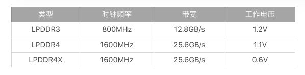

## 内存优化

[TOC]

### 一、概述

#### 1. 手机内存和PC内存区别？

​	PC内存：DDR,全名 **双倍数据速率内存**。

​	手机内存：LPDDR，全称是**“低功耗双倍数据速率内存”**，其中 LP 就是“Lower Power”低功耗的意思。

​	区别：体积小、功耗小。

​	以 LPDDR4 为例，带宽 = 时钟频率 × 内存总线位数 ÷ 8，即 1600 × 64 ÷ 8 = 12.8GB/s，因为是 DDR 内存是双倍速率，所以最后的带宽是 12.8 × 2 = 25.6GB/s。



目前市面上的手机，主流的运行内存有 LPDDR3、LPDDR4 以及 LPDDR4X。可以看出 LPDDR4 的性能要比 LPDDR3 高出一倍，而 LPDDR4X 相比 LPDDR4 工作电压更低，所以也比 LPDDR4 省电 20%～40%。当然图中的数据是标准数据，不同的生成厂商会有一些低频或者高频的版本，性能方面高频要好于低频。

#### 2. 设备内存大小与年限表

其中：2010、2013位分水岭。

| RAM   | condition | Year Class |
| ----- | --------- | ---------- |
| 768MB | 1 core    | 2009       |
|       | 2+ cores  | 2010       |
| 1GB   | <1.3GHz   | 2011       |
|       | 1.3GHz+   | 2012       |
| 1.5GB | <1.8GHz   | 2012       |
|       | 1.8GHz+   | 2013       |
| 2GB   |           | 2013       |
| 3GB   |           | 2014       |
| 5GB   |           | 2015       |
| more  |           | 2016       |

#### 3. 引发问题

1. 异常。比如：OOM、重启、low memory kill 杀进程。
2. 卡顿。比如：GC回收频繁。

**两个误区：**

误区一：内存占用越少越好；

误区二：Native 内存不用管。

### 二、测量方式

#### 1. Java内存分配

​	跟踪Java堆内存使用情况，最常用的工具有Allocation Tracker 和 MAT(Memory Analyzer Tool)，一个是AS工具自带的，一个是eclipse 插件。

Allocation Tracker 的三个缺点。

​	获取的信息过于分散，中间夹杂着不少其他的信息，很多信息不是应用申请的，可能需要进行不少查找才能定位到具体的问题。

​	跟 **Traceview(统计函数执行时间)** 一样，无法做到自动化分析，每次都需要开发者手工开始 / 结束，这对于某些问题的分析可能会造成不便，而且对于批量分析来说也比较困难。

​	虽然在 Allocation Tracking 的时候，不会对手机本身的运行造成过多的性能影响，但是在停止的时候，直到把数据 dump 出来之前，经常会把手机完全卡死，如果时间过长甚至会直接 ANR。

​	**解决方法（困难多多）：**

​	实现一个自定义的“Allocation Tracker”，实现对象内存的自动化分析。通过这个工具可以获取所有对象的申请信息（大小、类型、堆栈等），可以找到一段时间内哪些对象占用了大量的内存。

#### 2. Native内存分配

1. 利用Allocation Tracker工具，不太友好。
 	2. 利用[Malloc 调试](https://android.googlesource.com/platform/bionic/+/master/libc/malloc_debug/README.md)、[Malloc Hooks](https://android.googlesource.com/platform/bionic/+/master/libc/malloc_hooks/README.md)。

### 三、内存优化方向探讨

#### 1. 设备分级

```java
// 动画设备分级展示
if (year >= 2013) {
    // Do advanced animation
} else if (year >= 2010) {
    // Do simple animation
} else {
    // Phone too slow, don't do any animations
}
```

#### 2. 图片优化


#### 3. 内存泄漏


#### 4. 本地或线上内存监控


### 四、LeakCanary内存泄漏原理分析

> LeakCanary如何检测内存泄漏的呢？主要分为7步:
>
> - 1、`RefWatcher.watch()`创建了一个`KeyedWeakReference`用于去观察对象。
> - 2、然后，在后台线程中，它会检测引用是否被清除了，并且是否没有触发GC。
> - 3、如果引用仍然没有被清除，那么它将会把堆栈信息保存在文件系统中的.hprof文件里。
> - 4、`HeapAnalyzerService`被开启在一个独立的进程中，并且`HeapAnalyzer`使用了`HAHA`开源库解析了指定时刻的堆栈快照文件heap dump。
> - 5、从`heap dump`中，`HeapAnalyzer`根据一个独特的引用`key`找到了`KeyedWeakReference`，并且定位了泄露的引用。
> - 6、`HeapAnalyzer`为了确定是否有泄露，计算了到GC Roots的最短强引用路径，然后建立了导致泄露的链式引用。
> - 7、这个结果被传回到app进程中的`DisplayLeakService`，然后一个泄露通知便展现出来了。

官方原理解释是:

**在一个Activity执行完onDestroy后，将它放入到WeakReference中，然后将这个WeakReference类型的Activity的对象与ReferenceQueue关联，注意: 如果一个对象要被GC回收了，会把它引用的对象放入到ReferenceQueue中。这时候只需要在ReferenceQueue中去查找是否存在该对象，如果没有就执行一个GC，再次查找，如果还是没有，则说明该对象可能无法被回收，也就可能发生了内存泄漏，最后使用HAHA这个开源库取分析dump之后的heap内存。**

**测试demo：**

```java
  // 对象
  Object obj = new Object();
  // 引用队列，gc回收后会放入队列
  ReferenceQueue referenceQueue = new ReferenceQueue();
  // 建立弱引用
  WeakReference weakReference = new WeakReference(obj,referenceQueue);

  obj = null;
  Runtime.getRuntime().gc();

  try {
    Thread.sleep(1000);
  } catch (InterruptedException e) {
    e.printStackTrace();
  }

  Log.e("testme", "得到gc回收结果：" + referenceQueue.poll());
```


**参考：**

[1. Allcation Tracker帮助文档](https://developer.android.com/studio/profile/memory-profiler?hl=zh-cn#performance)

[2. LeakCanary学习](http://www.youkmi.cn/2020/01/01/android-xing-neng-you-hua-zhi-leakcanary-nei-cun-yuan-li-fen-xi/)

