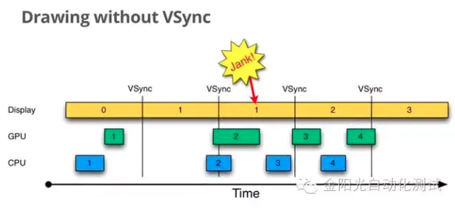
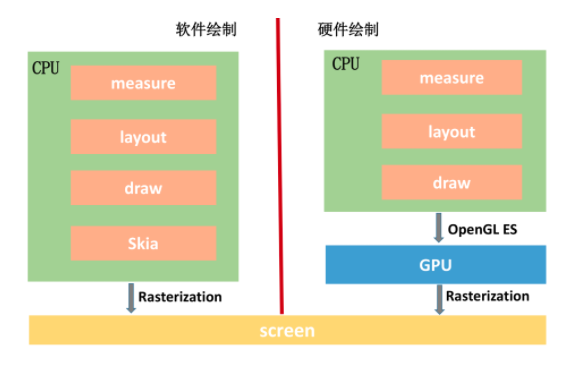
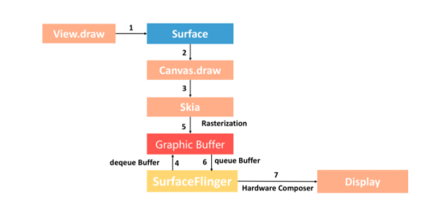
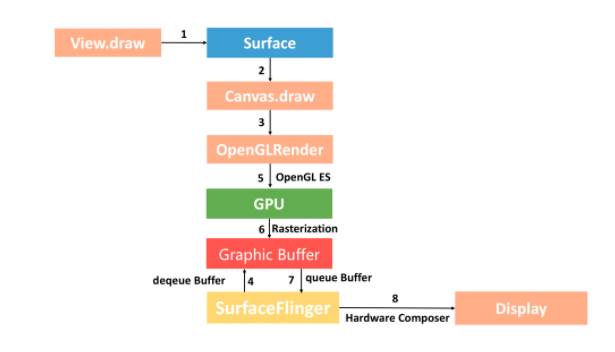
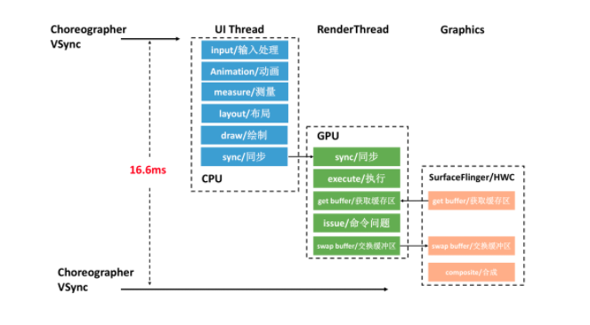

## UI渲染优化

[TOC]

### 一、UI渲染原理

#### 1. 超过16ms没绘制完成就会卡顿

- 帧率

​	60fps:人眼和大脑之间的协助无法感知超过60fps的画面更新；

​	24fps:电影胶卷通常用的帧率，已经能够支撑大部分电影画面需要表达的内容了；

​	30fps:低于30fps是无法顺畅表现绚丽的画面内容的。	

- VSYNC信号(垂直同步)

  Android系统每个16ms发出VSYNC信号，触发对UI的渲染。当CPU和GPU处理时间都很慢，或因为其他的原因，如在主线程中干活太多，那么就会出现如下图这样的状况。

  CPU、GPU工作时间大于16ms，就会发生卡顿。

  

- 冻帧

  连续丢帧超过30，用户可以感受到，google建议需要优化。

#### 2. CPU和GPU

​	除了屏幕，UI渲染还依赖两个核心硬件：CPU和GPU。CPU负责包括Measure、Layout、Execute的计算操作，GPU负责Rasterization(栅格化)操作。

​	所谓的栅格化就是绘制那些Button，Shape，Path，String，Bitmap等组件最基础的操作。它把那些组件拆分到不同的像素上进行显示，说的俗气一点，**就是解决那些复杂的XML布局文件和标记语言，使之转化成用户能看懂的图像，但是这不是直接转换的，XML布局文件需要在CPU中首先转换为多边形或者纹理，然后再传递给GPU进行格栅化，对于栅格化，跟OpenGL有关，格栅化是一个特别费时的操作。**

​	可以从图上看到，软件绘制使用的是skia库，它是一款能在低端设备上呈现高质量的2D跨平台图形框架，类似Chrome、Flutter内部使用的都是Skia库。

​	对于硬件绘制(**硬件加速**)，我们通过调用 OpenGL ES 接口利用 GPU 完成绘制。OpenGL是一个跨平台的图形 API，它为 2D/3D 图形处理硬件指定了标准软件接口。而 OpenGL ES 是 OpenGL 的子集，专为嵌入式设备设计。

#### 3. Android渲染的演进

##### 1. 系统绘制过程

- 画笔：Skia 或者 OpenGL。我们可以用 Skia 画笔绘制 2D 图形，也可以用 OpenGL 来绘制 2D/3D 图形。正如前面所说，前者使用 CPU 绘制，后者使用 GPU 绘制。
- 画纸：Surface。所有的元素都在 Surface 这张画纸上进行绘制和渲染。在 Android 中，Window 是 View 的容器，每个窗口都会关联一个 Surface。而 WindowManager 则负责管理这些窗口，并且把它们的数据传递给 SurfaceFlinger。
- 画板：Graphic Buffer。Graphic Buffer 缓冲用于应用程序图形的绘制，在 Android 4.1 之前使用的是双缓冲机制；在 Android 4.1 之后，使用的是三缓冲机制。
- 显示：SurfaceFlinger。它将 WindowManager 提供的所有 Surface，通过硬件合成器 Hardware Composer 合成并输出到显示屏。

##### 2. 硬件加速时代

​	在 Android 3.0 之前，或者没有启用硬件加速时，系统都会使用软件方式来渲染 UI。

​	

​	硬件加速绘制与软件绘制整个流程差异非常大，最核心就是我们通过 GPU 完成 Graphic Buffer 的内容绘制。此外硬件绘制还引入了一个 DisplayList 的概念，每个 View 内部都有一个 DisplayList，当某个 View 需要重绘时，将它标记为 Dirty。

​	当需要重绘时，仅仅只需要重绘一个 View 的 DisplayList，而不是像软件绘制那样需要向上递归。这样可以大大减少绘图的操作数量，因而提高了渲染效率。

##### 3. Android4.1:Project Butter(黄油计划)

​	**VSYNC信号**

​	cpu在忙其他事情得时候，每当收到VSYNC中断，CPU会放下手头工作，立即准备Buffer数据。

​    **三级缓存**

​	自己理解。

##### 4. Android5.0:RenderThread

​	把部分渲染放在ReaderThread线程。减轻主线程压力。

##### 5. Vulkan

​	Vulkan是OpenGL的下一代版本，和DirectX 12一样都是基于AMD私有的Mantle API，不同的是Vulkan是开源的图形API，它承诺通过给予开发者访问硬件底层的能力而大幅提升3D应用的性能。AMD同时发布了支持Vulkan API的beta版驱动，竞争对手Nvidia也宣布将会发布新驱动支持Vulkan。Vulkan等新一代图形API让开发者自己去管理显存和指令，而不是将其留给驱动程序。

### 二、UI渲染测量

在16ms内优化下面事件：

#### 1. 过度绘制（overdraw）检测

​	蓝色，淡绿，淡红，深红代表了4种不同程度的Overdraw情况，

#### 2. Hierarchy Viewer(Layout Inspector) 减少层次

#### 3. 帧率工具检测

### 三、优化

1. 尽量使用硬件加速
2. Create View优化
3. View重用
4. measure/layout 优化

- 减少 UI 布局层次。例如尽量扁平化，使用<ViewStub> <Merge>等优化。
- 优化 layout 的开销。尽量不使用 RelativeLayout 或者基于 weighted LinearLayout，它们 layout 的开销非常巨大。这里我推荐使用 ConstraintLayout 替代 RelativeLayout 或者 weighted LinearLayout。
- 背景优化。尽量不要重复去设置背景，这里需要注意的是主题背景（theme)， theme 默认会是一个纯色背景，如果我们自定义了界面的背景，那么主题的背景我们来说是无用的。但是由于主题背景是设置在 DecorView 中，所以这里会带来重复绘制，也会带来绘制性能损耗。

5. Litho 异步布局

   Litho 如我前面提到的 PrecomputedText 一样，把 measure 和 layout 都放到了后台线程，只留下了必须要在主线程完成的 draw，这大大降低了 UI 线程的负载。

6. 界面扁平化

7. 优化RecyclerView

8. Flutter:自己布局+渲染引擎

**参考:**

[Android 图形系统架构](https://source.android.com/devices/graphics)

[Android渲染的演进](https://time.geekbang.org/column/article/80921)

[一颗像素的诞生](https://mp.weixin.qq.com/s/QoFrdmxdRJG5ETQp5Ua3-A)

[Android 屏幕绘制机制及硬件加速](https://blog.csdn.net/qian520ao/article/details/81144167)

