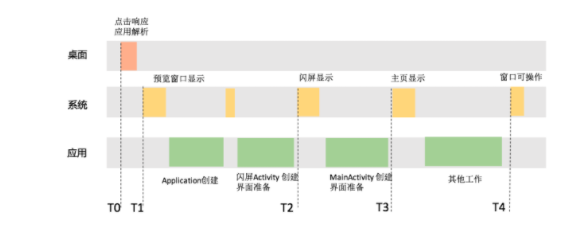

## 启动优化

[TOC]

### 一、启动速度分析

1. 时间线

2. 问题
   - 点击图标很久不响应
   - 首页显示太慢
   - 首页显示后无法操作

#### 二、优化方式

#### 1. 闪屏优化

#### 2. 业务梳理和优化

#### 3. 线程优化

#### 4. GC优化

#### 5. 系统调度优化

#### 6. IO优化、数据重排、资源重排

**参考：**

[ASM框架](https://www.cnblogs.com/zt007/p/6377789.html)

