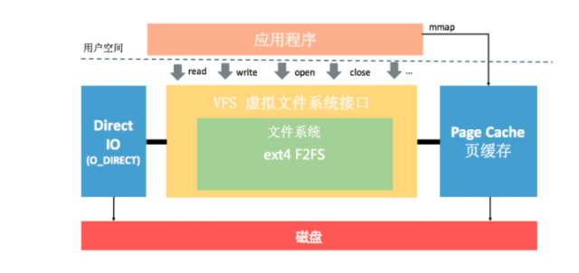
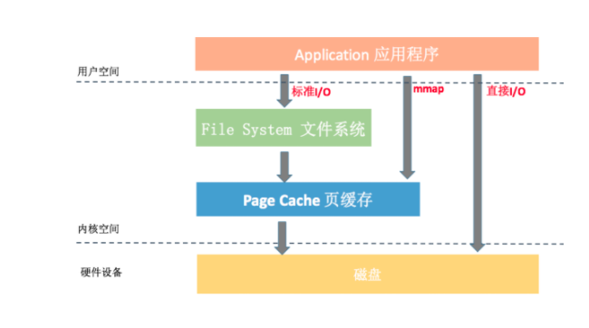

## I/O优化

[TOC]

### 一、IO基础知识

#### 1. 文件系统

​	好比 CPU、内存、磁盘三个小伙伴一起完成接力跑，最终跑完的时间很大程度上取决于最慢的小伙伴。我们知道，CPU 和内存相比磁盘是高速设备，整个流程的瓶颈在于磁盘 I/O 的性能。所以很多时候，文件系统性能比磁盘性能更加重要，为了降低磁盘对应用程序的影响，文件系统需要通过各种各样的手段进行优化。那么接下来，我们首先来看文件系统。

​	**文件系统：**

- Windows : FAT16、FAT32、NTFS。
- Linux: Ext2、Ext3、Ext4。
- Mac：HFS+。
- IOS：HFS+、APFS(Apple File System)。
- Android: ext4、F2FS(华为在EMUI5.0后使用，以后的主流文件系统)。



```java
//通过/proc/meminfo 查看内存情况 
MemTotal:    2866492 kB
MemFree:      72192 kB
Buffers:      62708 kB      // Buffer Cache
Cached:      652904 kB      // Page Cache
```

#### 2. 磁盘

​	正如我上面所说，如果发现应用程序要 read() 的数据没有在页缓存中，这时候就需要真正向磁盘发起 I/O 请求。这个过程要先经过内核的通用块层、I/O 调度层、设备驱动层，最后才会交给具体的硬件设备处理。

### 二、I/O测量

#### 1. proc

#### 2. strace

#### 3. Vmstat

### 三、I/O的三种方式

