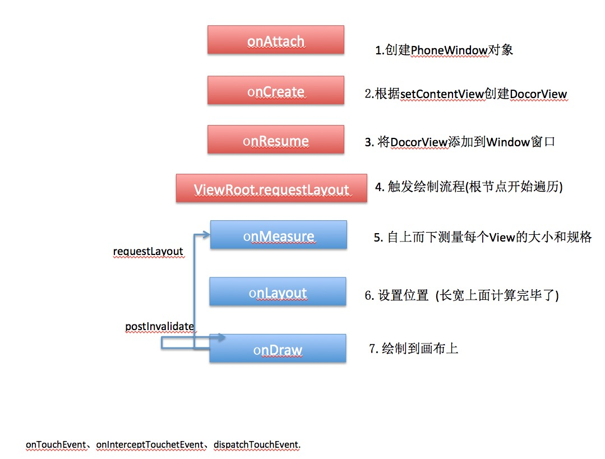

# UI进阶

[TOC]

#### 1. UI绘制流程？



#### 2. getWidth和getMeasureWidth区别？

##### ①：赋值时机不同

getMeasuredWidth是当view绘制流程中的measure流程结束之后有值
getWidth是当view的绘制流程中的layout流程结束之后有值。

##### ②：数值含义不同

getMeasuredWidth获取的是view的测量宽度
 getWidth获取的是view的实际宽度
 正常情况下这个两个数值都是相同的，手动设置layout值。

```java
// 强行改变getWidth(辟谣：View大于屏幕还是相等的)
@Override
public void layout( int l , int t, int r , int b){
   // 改变传入的顶点位置参数
   super.layout(l，t，r+100，b+100)；
}
```

#### 3. 事件分发流程？

#### 4. 滑动事件冲突？

```java
   // 主View判断事件是否需要继续传递下去
   @Override
    public boolean onInterceptTouchEvent(MotionEvent e) {
        int y = (int) e.getRawY();
        int x = (int) e.getRawX();
        boolean resume = false;
        switch (e.getAction()) {
            case MotionEvent.ACTION_DOWN:
                // 发生down事件时,记录y坐标
                mLastMotionY = y;
                mLastMotionX = x;
                resume = false;
                break;
            case MotionEvent.ACTION_MOVE:
                // deltaY > 0 是向下运动,< 0是向上运动
                int deltaY = y - mLastMotionY;
                int deleaX = x - mLastMotionX;
								// 横向滑动距离大于纵向时，无须拦截这次滑动事件，滑动事件会传递到下一层的view，也就是这里的轮播图控件，这样横向滑动轮播图的时候，PullToRefreshView就不会有下拉的动作了。
                if (Math.abs(deleaX) > Math.abs(deltaY)) {
                    resume = false;
                } else {
                //当前正处于滑动
                    if (isRefreshViewScroll(deltaY)) {
                        resume = true;
                    }
                }
                break;
            case MotionEvent.ACTION_UP:
            case MotionEvent.ACTION_CANCEL:
                break;
        }
        return resume;
    }
```

#### 5. 自定义仿QQ拖拽小红点效果

​	onTouchEvent、WindowManger浮窗拖拽、贝塞尔曲线。

#### 6. onMeasure()研究

[参考](https://blog.csdn.net/weixin_42477338/article/details/105979515)

#### 7. onLayout()研究

[参考](https://www.jianshu.com/p/da4e77fd0cfe)

#### 8. 动画实现总结？

[参考](https://www.jianshu.com/p/420629118c10)

