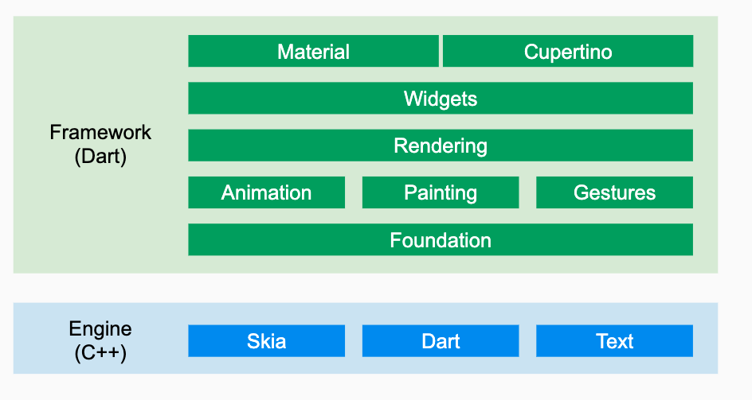

### 跨平台技术

[TOC]


#### 1.跨平台技术简介

针对原生开发面临问题，人们一直都在努力寻找好的解决方案，而时至今日，已经有很多跨平台框架(注意，本书中所指的“跨平台”若无特殊说明，即特指Android和iOS两个平台)，根据其原理，主要分为三类：

1、H5+原生（Cordova、Ionic、微信小程序）

​	利用WebView实现，WebView存在内存泄漏和不好用问题。

2、Java开发+原生渲染 （React Native、Weex、快应用）

​	RN: js编写代码和逻辑，抛弃Webview，通过javascriptcore实现桥联，然后执行js代码并利用系统渲染UI。


3、自绘UI+原生(QT for mobile、Flutter)

​	Flutter实现跨平台采用了更为彻底的方案。它既没有采用WebView也没有采用JavaScriptCore，而是自己实现了一台UI框架，然后直接系统更底层渲染系统上画UI。所以它采用的开发语言不是JS，而Dart。据称Dart语言可以编译成原生代码，直接跟原生通信。

​	系统的UI框架可以取代，但是系统提供的一些服务是无法取代的。Flutter在跟系统service通信方式，采用的是一种类似插件式的方式，或者有点像远程过程调用RPC方式。这种方式据说也要比RN的桥接方式高效。

#### 2. 介绍

在接下来的章节中我们逐个来看看这三类框架的原理及优缺点。

https://blog.csdn.net/wolfking0608/article/details/80769567

#### 3. Flutter

- 优势

​	dart语言： 性能快，可以编译成ARM、X86;

​	自定义UI框架和自己渲染： 速度快；

- 架构

  Flutter的状态管理有：
  1、State：Flutter自带的，开发耦合度高，不推荐
  2、fish_redux：阿里开源的，中型和大型应用，实力有保证
  3、provide：Google官方的，但是很久没更新了，官方推荐了provider
  4、provider：InheritedWidget的封装 ，Google推荐，目前更新活跃。

​	

#### 4. File Structure

```markdown
assets/
lib
├── configs
├── styles
├── utils
├── models
├── providers
├── routers
├── pages
└── widgets  

pages
├── index
├── users
├── goods
├── shopcarts
└── orders
```

| 文件夹    |                                   说明 |
| :-------- | -------------------------------------: |
| assets    |             本地调用的资源,图片,视频等 |
| configs   |                               通用配置 |
| styles    |     个性化配置,多主题切换使用,暂时忽略 |
| utils     | APP通用函数,或者http请求封装都可以放入 |
| models    |           Json文件对应的 Dart Model 类 |
| providers |                  跨页面,跨组件共享状态 |
| routers   |                           页面路由管理 |
| pages     |                         具体的业务页面 |
| widgets   |      APP通用型强的封装起来的Widget组件 |


- 参考

  [1. React思想(优势：mvvm、虚拟Dom、专注逻辑、数据驱动)](https://www.jianshu.com/p/5e86a793fb3d)

  [2. React菜鸟教程](https://www.runoob.com/react/react-tutorial.html)

