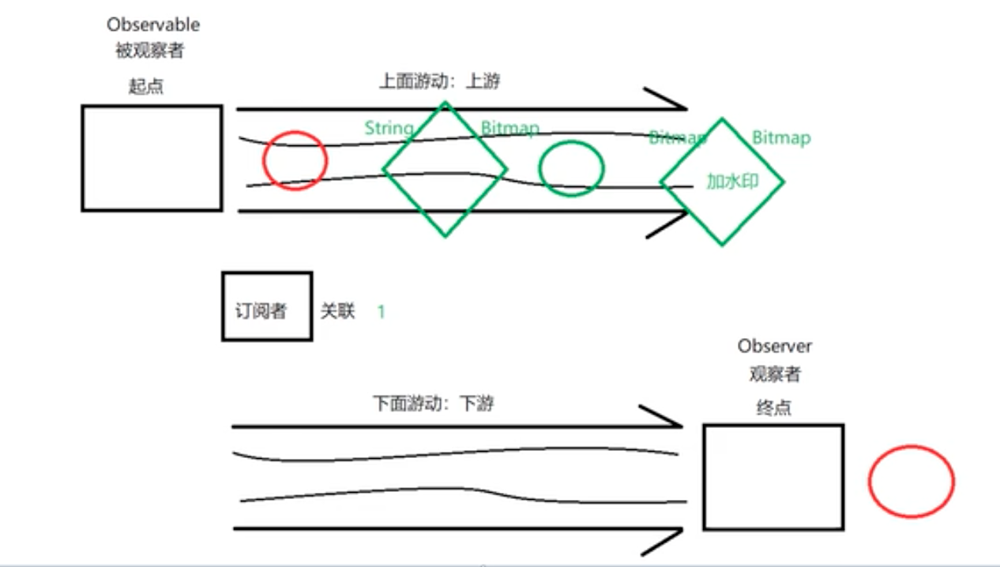

# Rxjava

[TOC]

## 一、简介

### 1. 概念

​	Reactive Extensions(简称ReactiveX)是对**响应式编程**理念的一个实现。它最初是由微软的一个团队所开发的响应式扩展库（Reactive Extensions libraray，Rx），随后越来流行，目前已经支持了几乎全部的流行编程语言。

​	**响应式编程：** 一直基于数据流和变化传递的异步编程方式。 其核心思想是观察者模式，上游数据发生变化，下游能够及时感知到这些变化。

>  一个词：**异步**。 组成部分 ：`Observable` (可观察者，即被观察者)、 `Observer` (观察者)、 `subscribe` (订阅)、事件。`Observable` 和 `Observer` 通过 `subscribe()` 方法实现订阅关系，从而 `Observable` 可以在需要的时候发出事件来通知 `Observer`。

RxJava 在 GitHub 主页上的自我介绍是 "a library for composing asynchronous and event-based programs using observable sequences for the Java VM"（一个在 Java VM 上使用可观测的序列来组成异步的、基于事件的程序的库）。这就是 RxJava ，概括得非常精准。

### 2. 核心

流程：

1. 建立订阅关系；

2. 切换到被观察者指定的线程；

3. 执行对应业务、进行变换；

4. 切换到观察者线程；

5. 执行对应业务，如更新UI。

   **核心：被观察者发生变化后，观察者通过调度器获取worker线程，把代码包装为Runnable后进行执行。**



**变异的观察者模式：**

1. 标准观察者设计模式：

   多个观察者，一个被观察者，注册多次，需要自己主动产生事件并通知观察者。

2. RxJava的变种模式：

   一个观察者，多个被被观察者，注册一次(注册完毕立即分发事件)。

### 3. 如何实现线程切换的Scheduler！！！？

> [Scheduler](https://link.zhihu.com/?target=http%3A//reactivex.io/RxJava/javadoc/io/reactivex/Scheduler.html) 是所有调度器实现的抽象父类，子类可以通过复写其 scheduleDirect() 来自行决定如何调度被分配到的任务；其实还有个 schedulePeriodicallyDirect() 方法，但大同小异；同时通过复写其 createWorker() 返回的 Scheduler.Worker 实例来执行具体的某个任务。此处的任务指的是通过 Runnable 封装的可执行代码块。

```java
// 不同的调度器通过不同的实现类实现
public abstract class Scheduler {
    ...

    @NonNull
    public Disposable scheduleDirect(
            @NonNull Runnable run, long delay, @NonNull TimeUnit unit) {

        // 每次调度都新建一个 Worker！
        final Worker w = createWorker();

        final Runnable decoratedRun = RxJavaPlugins.onSchedule(run);
        DisposeTask task = new DisposeTask(decoratedRun, w);

        // 将任务提交给 Worker 执行
        w.schedule(task, delay, unit);

        return task;
    }
}
```

#### 1. Scheduler.newThread()调度器

**每次调用CreateWorker()会开启一个容量为1的线程池。**

 `newThread()` 是上述几个调度器中最简单的实现，对于每一个分配到该调度器上的任务，都会新开启一个线程来执行，因此频繁使用可能会导致 OOM. 对应的调度器实现为 NewThreadScheduler, 它**并没有**复写 scheduleDirect() 的默认实现, 而仅仅是复写了 createWorker() 返回 NewThreadWorker:

```java
public final class NewThreadScheduler extends Scheduler {
    final ThreadFactory threadFactory;
    public NewThreadScheduler(ThreadFactory threadFactory) {
        this.threadFactory = threadFactory;
    }
    @Override
    public Worker createWorker() {
        // 每次创建一个新的线程处理任务!!
        return new NewThreadWorker(threadFactory);
    }
}

public class NewThreadWorker extends Scheduler.Worker implements Subscription {
 public NewThreadWorker(ThreadFactory threadFactory) {
   			// 调用JDK方法 创建了 **只有一个线程的线程池**！！！！
        ScheduledExecutorService exec = Executors.newScheduledThreadPool(1, threadFactory);
        executor = exec;
    }
  
  public ScheduledAction scheduleActual(final Action0 action, long delayTime, TimeUnit unit{
        Action0 decoratedAction = RxJavaHooks.onScheduledAction(action);
        ScheduledAction run = new ScheduledAction(decoratedAction);
        Future<?> f;
        if (delayTime <= 0) {
            f = executor.submit(run); // 提交线程池处理runnable task
        } else {
            f = executor.schedule(run, delayTime, unit);
        }
        run.add(f);

        return run;
    }
}
```

#### 2. Scheduler.single()调度器

**每次调用CreateWorker()会复用一个容量为1的线程池。**

```java
public final class SingleScheduler extends Scheduler {
      final AtomicReference<ScheduledExecutorService> executor = new AtomicReference<ScheduledExecutorService>();
  
  public SingleScheduler(ThreadFactory threadFactory) {
        this.threadFactory = threadFactory;
        // 初始化时候创建了唯一一个线程池
        executor.lazySet(createExecutor(threadFactory));
  }

   static ScheduledExecutorService createExecutor(ThreadFactory threadFactory) {
        return SchedulerPoolFactory.create(threadFactory);
   }
  
  /**
  * SchedulerPoolFactory类，创建了一个容量为1的线程池
  */
  public static ScheduledExecutorService create(ThreadFactory factory) {
        final ScheduledExecutorService exec = Executors.newScheduledThreadPool(1, factory);
        tryPutIntoPool(PURGE_ENABLED, exec);
        return exec;
    }
  
	@Override
    public Worker createWorker() {
        return new ScheduledWorker(executor.get());
    }
    ...
}
```

#### 3. Scheduler.io()调度器

**每个WorkThread 支持完毕后，存储在ConcurrentLinkedQueue < ThreadWorker >队列中，供下一次复用;如何队列为空，则创建新的worker.**

[io()](https://link.zhihu.com/?target=http%3A//reactivex.io/RxJava/2.x/javadoc/io/reactivex/schedulers/Schedulers.html%23io--) 不像 newThread() 那样每次都会新建一个线程，相反地，如果有空闲线程，新任务就会被调度到这个空闲线程上；只有线程不够时，才会扩容。通常大多数异步操作，如网络请求，都可以切换到这个调度器上。

```java
public final class IoScheduler extends Scheduler {
    final AtomicReference<CachedWorkerPool> pool;
    ...
    @NonNull
    @Override
    public Worker createWorker() {
        return new EventLoopWorker(pool.get());
    }
}
static final class EventLoopWorker extends Scheduler.Worker {
    private final ThreadWorker threadWorker;
    ...
    EventLoopWorker(CachedWorkerPool pool) {
        ...
        // 这一句是关键
        this.threadWorker = pool.get();
    }
    @Override
    public Disposable schedule(
            @NonNull Runnable action, long delayTime, @NonNull TimeUnit unit) {
        ...
        // ThreadWorker 是 NewThreadWorker 的子类，
        // 其 scheduleActual() 就是 NewThreadWorker 的 scheduleActual()
        return threadWorker.scheduleActual(action, delayTime, unit, tasks);
    }
}

static final class CachedWorkerPool implements Runnable {
    private final ConcurrentLinkedQueue<ThreadWorker> expiringWorkerQueue;
    final CompositeDisposable allWorkers;
    ...
    // 返回一个可以被复用的 Worker, 或一个新的 Worker
    ThreadWorker get() {
        ...

        // 如果有空闲 Worker 则使用之
        while (!expiringWorkerQueue.isEmpty()) {
            ThreadWorker threadWorker = expiringWorkerQueue.poll();
            if (threadWorker != null) {
                return threadWorker;
            }
        }

        // No cached worker found, so create a new one.
        ThreadWorker w = new ThreadWorker(threadFactory);
        allWorkers.add(w);
        return w;
    }
}
```

#### 4. Scheduler.mainThread()调度器

**Handler实现.**

```java
final class HandlerScheduler extends Scheduler {
    // handler 是与 Looper.getMainLooper() 绑定的 Handler 实例
    private final Handler handler;
    private final boolean async;
    ...
    @Override
    public Disposable scheduleDirect(Runnable run, long delay, TimeUnit unit) {
        ...
        run = RxJavaPlugins.onSchedule(run);
        ScheduledRunnable scheduled = new ScheduledRunnable(handler, run);
        // 延时调度
        handler.postDelayed(scheduled, unit.toMillis(delay));
        return scheduled;
    }

    @Override
    public Worker createWorker() {
        return new HandlerWorker(handler, async);
    }
}

private static final class HandlerWorker extends Worker {
    private final Handler handler;
    private final boolean async;
    ...
    // Async will only be true when the API is available to call.
    @Override
    @SuppressLint("NewApi")
    public Disposable schedule(Runnable run, long delay, TimeUnit unit) {
        ...

        ScheduledRunnable scheduled = new ScheduledRunnable(handler, run);
        Message message = Message.obtain(handler, scheduled);
        // Used as token for batch disposal of this worker's runnables.
        message.obj = this;
        if (async) {
            message.setAsynchronous(true);
        }
        // 延迟调度
        handler.sendMessageDelayed(message, unit.toMillis(delay));
        ...
    }
}
```


[参考1](https://www.jianshu.com/p/a9ebf730cd08)

[参考2!!!](https://zhuanlan.zhihu.com/p/62130962)

## 二、使用

```java
 // 下载图片
    private void testRxJava1() {
        Observable.just("https://www.yiqizou.com/images/img_3.png").map(new Function<String, Bitmap>() {
            @Override
            public Bitmap apply(String path) throws Exception {
                //2. 执行
                URL url = new URL(path);
                HttpURLConnection connection = (HttpURLConnection) url.openConnection();
                connection.setConnectTimeout(5000);
                int code = connection.getResponseCode();
                Log.e("testme", code + " path = " + path + "; thread = " + Thread.currentThread().getName());
                if (code == HttpURLConnection.HTTP_OK) {
                    Bitmap bitmap = BitmapFactory.decodeStream(connection.getInputStream());
                    return bitmap;
                }
                return null;
            }
        })
                .subscribeOn(Schedulers.io()) 
                .observeOn(AndroidSchedulers.mainThread())
                .subscribe(new Observer<Bitmap>() {
                    @Override
                    public void onSubscribe(Disposable d) {
                        // 1. 订阅 showDialog
                        Log.e("testme", " onSubscribe()...");
                    }

                    @Override
                    public void onNext(Bitmap bitmap) {
                        //3. 一步
                        Log.e("testme", "bitmap = " + bitmap + "; thread = " + Thread.currentThread().getName());
                    }

                    @Override
                    public void onError(Throwable e) {
                        Log.e("testme", "error = " + e.getCause() + e.getMessage() + "; thread = " + Thread.currentThread().getName());

                    }

                    @Override
                    public void onComplete() {
                        //4. 结束 dismissDialog
                    }
                });
    }
```

**优势：**

1. **数据事件处理和数据事件呈现解耦**。
2. **处理异步业务是更加简洁，**链式调用，代码简洁，方便指定线程且进行数据转换。


- 参考

  [给 Android 开发者的 RxJava 详解](https://gank.io/post/560e15be2dca930e00da1083)
  
  [RxJava使用场景](https://blog.csdn.net/theone10211024/article/details/50435325)
  
  [学习视频](https://www.bilibili.com/video/av711415013)

