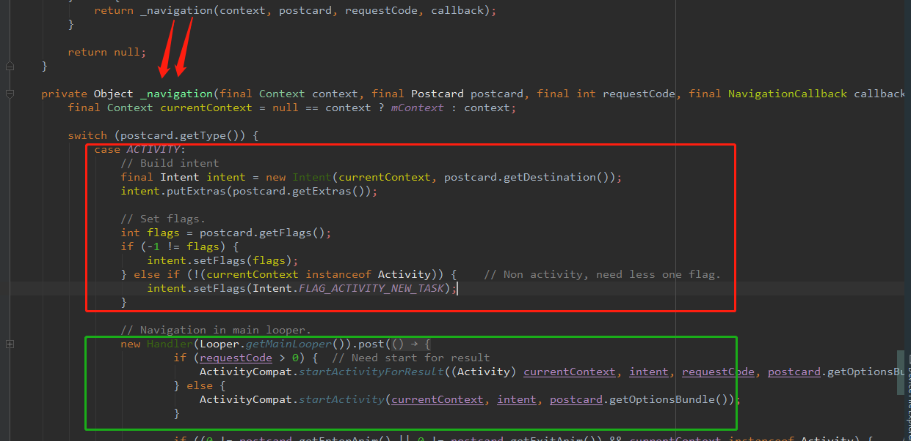
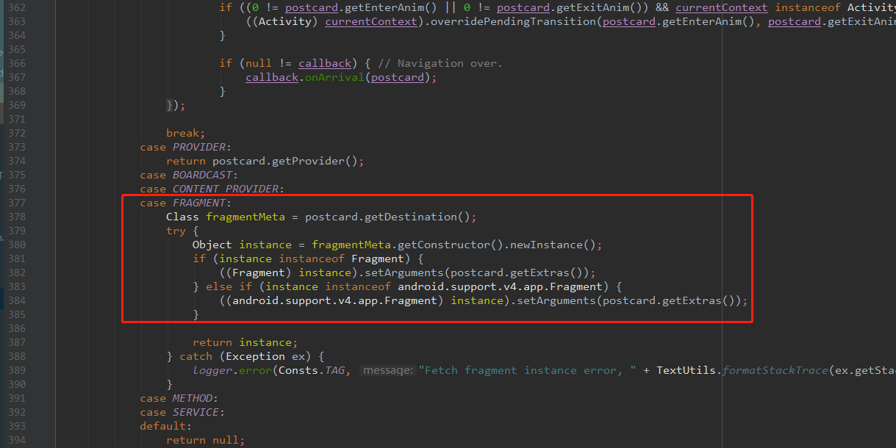

# Arouter

[TOC]

## 一、介绍

**使用：**

```java
//服务module中的FragmentService
@Route(path = "/service/fragmentService")
public class FragmentService{}

//服务module中的TestActivity
@Route(path = "/service/test")
public class TestActivity extends BaseActivity{}

//主APP中获取FragmentService实例
Fragment serviceFragment = (Fragment) ARouter.getInstance().build("/service/fragmentService").navigation();

//主APP中跳转服务module中的TestActivity
ARouter.getInstance().build("/service/test").navigation();

//!!!获取组件之间通信服务
ARouter.getInstance().navigation(TestProvider.class).test();

@Route(path = "/provider/testP")
public class TestProvider implements IProvider {
    @Override
    public void init(Context context) {
    }
    public String test(){
       return ("Hello Provider!");
    }
}

```

## 二、原理


#### 1. 通过注解生成器生成java文件(com.alibaba.android.arouter.routes)

```java
//1. 每个Module主要包含这三类文件
// module app 下的分组路由
public class ARouter$$Root$$app implements IRouteRoot {
  @Override
  public void loadInto(Map<String, Class<? extends IRouteGroup>> routes) {
    routes.put("account", ARouter$$Group$$account.class);
    routes.put("bankManager", ARouter$$Group$$bankManager.class);
    routes.put("check", ARouter$$Group$$check.class);
    routes.put("common", ARouter$$Group$$common.class);
    routes.put("faceRecognition", ARouter$$Group$$faceRecognition.class);
    routes.put("form", ARouter$$Group$$form.class);
  }
}
// module app 下的每个小组下的路由文件
public class ARouter$$Group$$account implements IRouteGroup {
  @Override
  public void loadInto(Map<String, RouteMeta> atlas) {
    atlas.put("/account/change/password", RouteMeta.build(RouteType.ACTIVITY, AccountChangePasswordActivity.class, "/account/change/password", "account", null, -1, -2147483648));
    atlas.put("/account/common/input/code", RouteMeta.build(RouteType.ACTIVITY, AccountVerifyCodeActivity.class, "/account/common/input/code", "account", null, -1, -2147483648));
    atlas.put("/account/forget/input/code", RouteMeta.build(RouteType.ACTIVITY, ForgetPwdInputVerifyCodeActivity.class, "/account/forget/input/code", "account", null, -1, -2147483648));
    atlas.put("/account/forget/input/phone", RouteMeta.build(RouteType.ACTIVITY, ForgetPwdInputPhoneActivity.class, "/account/forget/input/phone", "account", null, -1, -2147483648));
  }
}
// module app 下的 provider文件
public class ARouter$$Providers$$app implements IProviderGroup {
  @Override
  public void loadInto(Map<String, RouteMeta> providers) {
  }
}
```

#### 2. Arouter.init()初始化

1. 根据app包名多个classes.dex文件，然后遍历读取包名为"com.alibaba.android.arouter.routes"下的所有文件名集合，存储到缓存SP中;

2. 遍历读取前缀为`Root、Interceptors、Providers`的class，利用反射初始化路由到Warehouse(数据中心);

   ```java
   class Warehouse {
       // Cache route and metas
       static Map<String, Class<? extends IRouteGroup>> groupsIndex = new HashMap<>();
       static Map<String, RouteMeta> routes = new HashMap<>();
   
       // Cache provider
       static Map<Class, IProvider> providers = new HashMap<>();
       static Map<String, RouteMeta> providersIndex = new HashMap<>();
   
       // Cache interceptor
       static Map<Integer, Class<? extends IInterceptor>> interceptorsIndex = new UniqueKeyTreeMap<>("More than one interceptors use same priority [%s]");
       static List<IInterceptor> interceptors = new ArrayList<>();
   
       static void clear() {
           routes.clear();
           groupsIndex.clear();
           providers.clear();
           providersIndex.clear();
           interceptors.clear();
           interceptorsIndex.clear();
       }
   }
   ```

   #### 3. 跳转 ARouter.getInstance().build("path").navigation()

   判断路由类型，如果是activity，调用startActivity方法；如果是fragment，创建实例返回。






- 参考

[原理1](https://blog.csdn.net/u011101777/article/details/90735277)

[原理2](https://blog.csdn.net/songzi1228/article/details/106928671/)

