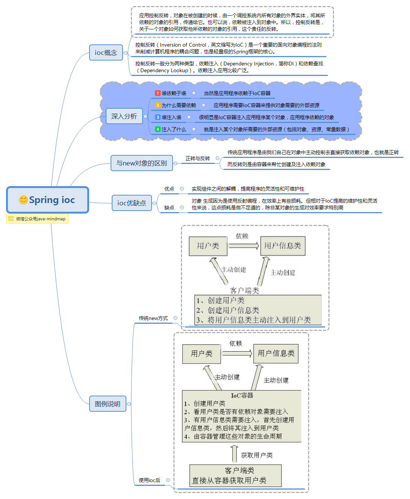

### IOC

[TOC]

> IoC可以认为是一种全新的**设计模式**，但是理论和时间成熟相对较晚，并没有包含在[GoF](https://baike.baidu.com/item/GoF)中。



#### 1. 介绍

​	**控制反转**（Inversion of Control，缩写为**IoC**），是[面向对象编程](https://baike.baidu.com/item/面向对象编程)中的一种设计原则，可以用来减低计算机代码之间的[耦合度](https://baike.baidu.com/item/耦合度)。其中最常见的方式叫做**依赖注入**（Dependency Injection，简称**DI**），还有一种方式叫“依赖查找”（Dependency Lookup）。通过控制反转，对象在被创建的时候，由一个调控系统内所有对象的外界实体将其所依赖的对象的引用传递给它。也可以说，依赖被注入到对象中。**一般通过反射实现对象创建。**

#### 2. 应用

​	android中常见的有Android Annotations,ButterKnife,Dagger等。**用xml配置依赖太麻烦，所以用注解呗。**

例如：

```java
// 通过注解实现对象创建
@EActivity(R.layout.activity_main)
public class MainActivity extends Activity {
   @ViewById(R.id.text)
   TextView textView;

   @AfterViews
   public void init() {
    textView.setText("annotations test");
   }

   @Click(R.id.text)
   void buttonClick() {
    Intent intent = new Intent(this,ChildActivity_.class);
    startActivity(intent);
  }
}
```

