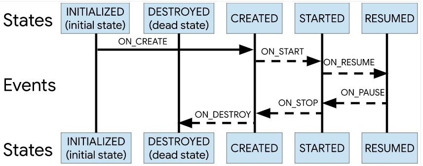

### Jetpack

[TOC]

#### 1. 介绍

​	Android Jetpack组件是库的集合，这些库是为协同工作而构建的，不够也可以单独使用，同时利用Kotlin语言的特性帮助您提高工作效率。


#### 2. Android KTX库概要 

​	是包含在Android Jetpack及其它Android库中的一组Kotlin扩展程序。可以为Jetpack、Android平台提供简洁的的API。利用了Kotlin语言功能：**扩展函数**、扩展属性、**Lambda**、命名参数、参数默认值、协程。

例如：

```java
//例子1： Android代码
sharedPreferences
        .edit()  // create an Editor
        .putBoolean("key", value)
        .apply() // write to disk asynchronously
// KTX库代码
sharedPreferences.edit { putBoolean("key", value) }
```

#### 3. Core KTX库

```java
dependencies {
    // 核心库 
    implementation "androidx.core:core-ktx:1.3.0"
    // 集合扩展库(ArrayMap、Lrccache..)  
    implementation "androidx.collection:collection-ktx:1.1.0"
    // fragment扩展库  
    implementation "androidx.fragment:fragment-ktx:1.2.4"
}
```

#### 4. Lifcycle KTX

1.  介绍

   **赋予组件感知生命周期的能力。**。Lifecycle KTX 为每个 [`Lifecycle`](https://developer.android.google.cn/topic/libraries/architecture/lifecycle) 对象定义一个 `LifecycleScope`。在此范围内启动的协程会在 `Lifecycle` 被销毁时取消。

```java
    dependencies {
        implementation "androidx.lifecycle:lifecycle-runtime-ktx:2.2.0"
    }
```

2. 初级例子：

```java
 // 使组件本身具有生命周期感知能力，避免在Activity生命周期中写过多代码。
 class MyActivity : AppCompatActivity() {
        private lateinit var myLocationListener: MyLocationListener
        override fun onCreate(...) {
            myLocationListener = MyLocationListener(this, lifecycle) { location ->
                // update UI
            }
            Util.checkUserStatus { result ->
                if (result) {
                    myLocationListener.enable()
                }
            }
        }
    }
 internal class MyLocationListener(
            private val context: Context,
            private val lifecycle: Lifecycle,
            private val callback: (Location) -> Unit) {
        private var enabled = false
        @OnLifecycleEvent(Lifecycle.Event.ON_START)
        fun start() {
            if (enabled) {
                // connect
            }
        }
        fun enable() {
            enabled = true
            if (lifecycle.currentState.isAtLeast(Lifecycle.State.STARTED)) {
                // connect if not connected
            }
        }
        @OnLifecycleEvent(Lifecycle.Event.ON_STOP)
        fun stop() {
            // disconnect if connected
        }
    }
```

3. 生命周期感知型组件的最佳做法

- 使界面控制器（Activity 和 Fragment）尽可能保持精简。它们不应试图获取自己的数据，而应使用 [`ViewModel`](https://developer.android.google.cn/reference/androidx/lifecycle/ViewModel) 执行此操作，并观察 [`LiveData`](https://developer.android.google.cn/reference/androidx/lifecycle/LiveData) 对象以将更改体现到视图中。
- 设法编写数据驱动型界面，对于此类界面，界面控制器的责任是随着数据更改而更新视图，或者将用户操作通知给 [`ViewModel`](https://developer.android.google.cn/reference/androidx/lifecycle/ViewModel)。
- 将数据逻辑放在 [`ViewModel`](https://developer.android.google.cn/reference/androidx/lifecycle/ViewModel) 类中。[`ViewModel`](https://developer.android.google.cn/reference/androidx/lifecycle/ViewModel) 应充当界面控制器与应用其余部分之间的连接器。不过要注意，[`ViewModel`](https://developer.android.google.cn/reference/androidx/lifecycle/ViewModel) 不负责获取数据（例如，从网络获取）。[`ViewModel`](https://developer.android.google.cn/reference/androidx/lifecycle/ViewModel) 应调用相应的组件来获取数据，然后将结果提供给界面控制器。
- 使用 [Data Binding](https://developer.android.google.cn/topic/libraries/data-binding) 在视图与界面控制器之间维持干净的接口。这样一来，您可以使视图更具声明性，并尽量减少需要在 Activity 和 Fragment 中编写的更新代码。如果您更愿意使用 Java 编程语言执行此操作，请使用诸如 [Butter Knife](http://jakewharton.github.io/butterknife/) 之类的库，以避免样板代码并实现更好的抽象化。
- 如果界面很复杂，不妨考虑创建 [presenter](http://www.gwtproject.org/articles/mvp-architecture.html#presenter) 类来处理界面的修改。这可能是一项艰巨的任务，但这样做可使界面组件更易于测试。
- 避免在 [`ViewModel`](https://developer.android.google.cn/reference/androidx/lifecycle/ViewModel) 中引用 `View` 或 `Activity` 上下文。如果 `ViewModel` 存在的时间比 Activity 更长（在配置更改的情况下），Activity 将泄露并且不会由垃圾回收器妥善处置。
- 使用 [Kotlin 协程](https://developer.android.google.cn/topic/libraries/architecture/coroutines)管理长时间运行的任务和其他可以异步运行的操作。

- 原理

1. `ComponentActivity implements LifecycleOwner`接口中的`Lifecycle getLifecycle();`方法。

   ```java
     // init
   	public ComponentActivity() {
           Lifecycle lifecycle = getLifecycle();
           getLifecycle().addObserver(new LifecycleEventObserver() {
               @Override
               public void onStateChanged(@NonNull LifecycleOwner source,
                       @NonNull Lifecycle.Event event) {
                   if (event == Lifecycle.Event.ON_DESTROY) {
                       if (!isChangingConfigurations()) {
                           getViewModelStore().clear();
                       }
                   }
               }
           });
       }
   
     //2. LifecycleRegistry 初始化  
     private final WeakReference<LifecycleOwner> mLifecycleOwner;
   	public LifecycleRegistry(@NonNull LifecycleOwner provider) {
     	mLifecycleOwner = new WeakReference<>(provider);
     	mState = INITIALIZED;
   	}
   ```

   

2. 让activity生命周期与lifecycle生命周期绑定



#### 5. ViewModel KTX

1. [`ViewModel`](https://developer.android.google.cn/reference/androidx/lifecycle/ViewModel) 类旨在以注重生命周期的方式存储和管理界面相关的数据。[`ViewModel`](https://developer.android.google.cn/reference/androidx/lifecycle/ViewModel) 类让数据可在发生屏幕旋转等配置更改后继续留存。
2. 另一个问题是，界面控制器经常需要进行异步调用，这些调用可能需要一些时间才能返回结果。界面控制器需要管理这些调用，并确保系统在其销毁后清理这些调用以避免潜在的内存泄露。

ViewModel KTX 库提供了一个 `viewModelScope()` 函数，可让您更轻松地从 `ViewModel` 启动[协程](https://developer.android.google.cn/kotlin/coroutines)。[`CoroutineScope`](https://kotlin.github.io/kotlinx.coroutines/kotlinx-coroutines-core/kotlinx.coroutines/-coroutine-scope/) 绑定至 `Dispatchers.Main`，并且会在清除 `ViewModel` 后自动取消。您可以使用 `viewModelScope()`，而无需为每个 `ViewModel` 创建一个新范围。

```java
dependencies {
        implementation "androidx.lifecycle:lifecycle-viewmodel-ktx:2.2.0"
}
class MainViewModel : ViewModel() {
    // Make a network request without blocking the UI thread
    private fun makeNetworkRequest() {
        // launch a coroutine in viewModelScope
        viewModelScope.launch  {
            remoteApi.slowFetch()
            ...
        }
    }
    // No need to override onCleared()
}
```

- 原理 

  1. 利用map数据结构存储viewModel，key-value：包名:viewmodel对象；

  2. Activity基类ComponentActivity中初始化map(ViewModelStore)，销毁时自动clear。Activity:viewModel = 1:1关系。

```java
public class ViewModelStore {
    private final HashMap<String, ViewModel> mMap = new HashMap<>();
    final void put(String key, ViewModel viewModel) {
        ViewModel oldViewModel = mMap.put(key, viewModel);
        if (oldViewModel != null) {
            oldViewModel.onCleared();
        }
    }
    final ViewModel get(String key) {
        return mMap.get(key);
    }
    Set<String> keys() {
        return new HashSet<>(mMap.keySet());
    }
    public final void clear() {
        for (ViewModel vm : mMap.values()) {
            vm.clear();
        }
        mMap.clear();
    }
}
```


#### 6. LiveData KTX

1. 介绍

   使用 LiveData 时，您可能需要异步计算值。例如，您可能需要检索用户的偏好设置并将其传送给界面。在这些情况下，LiveData KTX 可提供一个 `liveData` 构建器函数，该函数会调用 `suspend` 函数，并将结果作为 `LiveData` 对象传送。

   ```java
        dependencies {
           implementation "androidx.lifecycle:lifecycle-livedata-ktx:2.2.0"
       }
   ```

2. 例子

   在以下示例中，`loadUser()` 是在其他地方声明的 suspend 函数。 您可以使用 `liveData` 构建器函数异步调用 `loadUser()`，然后使用 `emit()` 来发出结果：

   ```java
   val user: LiveData<User> = liveData {
       val data = database.loadUser() // loadUser is a suspend function.
       emit(data)
   }
   ```

#### 7. Room KTX

​	Room 扩展程序增加了对数据库事务的协程支持。

```java
dependencies {
    implementation "androidx.room:room-ktx:2.2.5"
}

@Query("SELECT * FROM Users")
suspend fun getUsers(): List<User>
@Query("SELECT * FROM Users")
fun getUsers(): Flow<List<User
  
```

#### 8. Navigation KTX

​	导航组件.


- 参考

[1. JetpackMvvm](https://github.com/hegaojian/JetpackMvvm)

[2. Jetpack-MVVM-Best-Practice](https://github.com/KunMinX/Jetpack-MVVM-Best-Practice)