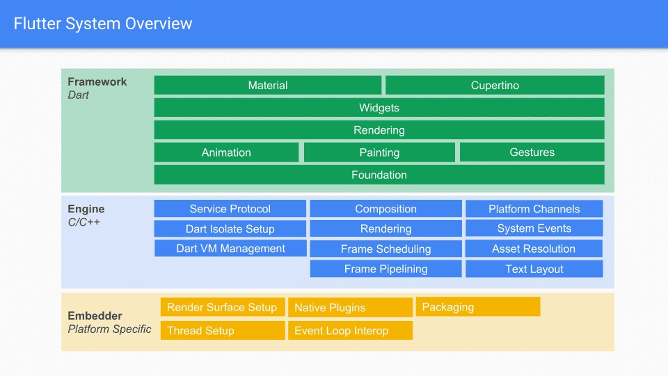

## Flutter

[TOC]

[1. 入门书籍](https://book.flutterchina.club/)

[2. Dark packages插件](https://pub.flutter-io.cn/)

[3. Flutter中文网](https://flutterchina.club/using-packages/)

### 一、架构设计

可以看到，Flutter框架主要分为Framework、Engine和 Embedder三层。
其中，Framework使用Dart语言实现，包括UI、文本、图片、按钮等Widgets，渲染，动画，手势等，与开发者直接交互的就是这一层。Engine使用C++实现，主要包括Skia、Dart 和 Text。

- Skia是开源的二维图形库，提供了适用于多种软硬件平台的通用API。其已作为Google Chrome，Chrome OS，Android, Mozilla Firefox, Firefox OS等其他众多产品的图形引擎，支持平台还包括Windows, macOS, iOS，Android，Ubuntu等。
- Dart 部分主要包括:Dart Runtime，Garbage Collection(GC)，如果是Debug模式的话，还包括JIT(Just In Time)支持。Release和Profile模式下，是AOT(Ahead Of Time)编译成了原生的arm代码，并不存在JIT部分。
- Text 即文本渲染，其渲染层次如下，衍生自 Minikin的libtxt库(用于字体选择，分隔行)；HartBuzz用于字形选择和成型；Skia作为渲染/GPU后端，在Android和Fuchsia上使用FreeType渲染，在iOS上使用CoreGraphics来渲染字体。

Embedder则是一个嵌入层，该层的主要作用是把Flutter嵌入到各个平台上去，它的主要工作包括渲染Surface设置, 线程设置，以及插件等。平台(如iOS)只是提供一个画布，剩余的所有渲染相关的逻辑都在Flutter内部，这就使得它具有了很好的跨端一致性。

[参考](https://blog.csdn.net/xiangzhihong8/article/details/106433461/)

