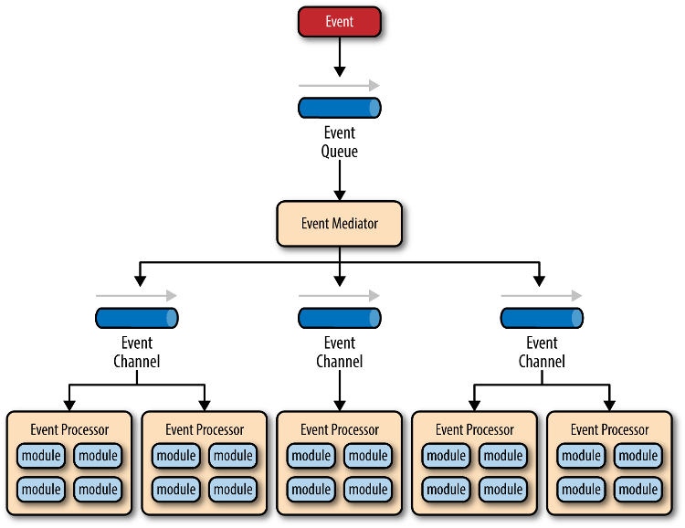

#### 架构师介绍

[TOC]

##### 1. 介绍

​	[软件架构师(Software Architect)](https://wiki.mbalib.com/wiki/软件架构师)

##### 2. 分类

> 通常我们说的架构师是**系统架构师**和**应用架构师**的结合。架构师也可以从开发语言、职责上划分，比如前端架构师、后端架构师、Java架构师、.Net架构师、LAMP架构师等。

1. 系统架构师：服务器负载，可靠性，伸缩，扩展，数据库切分，缓存应用等；

2. 应用架构师：理解业务，梳理模型，设计模式，接口，数据交互等；

3. 业务架构师：也可以叫业务领域专家、行业专家、产品咨询师、资深顾问通常我们说的架构师是1和2的结合。

##### 3. 常见软件架构分类

1. 分层架构；

   ​	分层架构（layered architecture）是最常见的软件架构，也是事实上的标准架构。如果你不知道要用什么架构，那就用它。

   这种架构将软件分成若干个水平层，每一层都有清晰的角色和分工，不需要知道其他层的细节。层与层之间通过接口通信。

   > - 表现层（presentation）：用户界面，负责视觉和用户互动
   > - 业务层（business）：实现业务逻辑
   > - 持久层（persistence）：提供数据，SQL 语句就放在这一层
   > - 数据库（database） ：保存数据

   有的软件在逻辑层和持久层之间，加了一个服务层（service），提供不同业务逻辑需要的一些通用接口。

   **优点**

   > - 结构简单，容易理解和开发
   > - 不同技能的程序员可以分工，负责不同的层，天然适合大多数软件公司的组织架构
   > - 每一层都可以独立测试，其他层的接口通过模拟解决

   **缺点**

   > - 一旦环境变化，需要代码调整或增加功能时，通常比较麻烦和费时
   > - 部署比较麻烦，即使只修改一个小地方，往往需要整个软件重新部署，不容易做持续发布
   > - 软件升级时，可能需要整个服务暂停
   > - 扩展性差。用户请求大量增加时，必须依次扩展每一层，由于每一层内部是耦合的，扩展会很困难

2. 事件驱动架构；

   ​	事件（event）是状态发生变化时，软件发出的通知。

   事件驱动架构（event-driven architecture）就是通过事件进行通信的软件架构。它分成四个部分。

   

   > - 事件队列（event queue）：接收事件的入口
   > - 分发器（event mediator）：将不同的事件分发到不同的业务逻辑单元
   > - 事件通道（event channel）：分发器与处理器之间的联系渠道
   > - 事件处理器（event processor）：实现业务逻辑，处理完成后会发出事件，触发下一步操作

   **优点**

   > - 分布式的异步架构，事件处理器之间高度解耦，软件的扩展性好
   > - 适用性广，各种类型的项目都可以用
   > - 性能较好，因为事件的异步本质，软件不易产生堵塞
   > - 事件处理器可以独立地加载和卸载，容易部署

   **缺点**

   > - 涉及异步编程（要考虑远程通信、失去响应等情况），开发相对复杂
   > - 难以支持原子性操作，因为事件通过会涉及多个处理器，很难回滚
   > - 分布式和异步特性导致这个架构较难测试

3. 微核架构；

   ​	微核架构（microkernel architecture）又称为"插件架构"（plug-in architecture），指的是软件的内核相对较小，主要功能和业务逻辑都通过插件实现。

   内核（core）通常只包含系统运行的最小功能。插件则是互相独立的，插件之间的通信，应该减少到最低，避免出现互相依赖的问题。

4. 微服务架构；

   微服务架构（microservices architecture）是服务导向架构（service-oriented architecture，缩写 SOA）的升级。

   每一个服务就是一个独立的部署单元（separately deployed unit）。这些单元都是分布式的，互相解耦，通过远程通信协议（比如REST、SOAP）联系。

5. 云架构。

   云结构（cloud architecture）主要解决扩展性和并发的问题，是最容易扩展的架构。

它的高扩展性，主要原因是没使用中央数据库，而是把数据都复制到内存中，变成可复制的内存数据单元。然后，业务处理能力封装成一个个处理单元（prcessing unit）。访问量增加，就新建处理单元；访问量减少，就关闭处理单元。由于没有中央数据库，所以扩展性的最大瓶颈消失了。由于每个处理单元的数据都在内存里，最好要进行数据持久化。

这个模式主要分成两部分：处理单元（processing unit）和虚拟中间件（virtualized middleware）。

> - 处理单元：实现业务逻辑
> - 虚拟中间件：负责通信、保持sessions、数据复制、分布式处理、处理单元的部署。

##### 4. 常见方法论

1. 目标：高性能、高可用、高扩展。
2. SOLID；
3. GOF(23种设计模式)；
4. IOC；
5. AOP；
6. ...