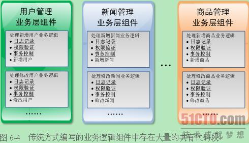
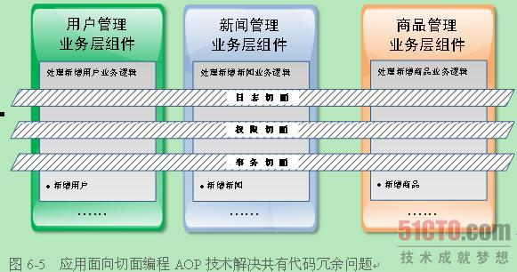

### AOP

[TOC]

#### 1. 介绍

面向切面编程：**Aspect  Oriented  Programming。**

- AOP是一种编程范式，提供从还有一个角度来考虑程序结构以完好面向对象编程（OOP）。
- AOP为开发人员提供了一种描写叙述横切关注点的机制，并可以自己主动将横切关注点织入到面向对象的软件系统中。从而实现了横切关注点的模块化。
- AOP可以将那些与业务无关，却为业务模块所共同调用的逻辑或责任。比如事务处理、统计、日志管理、权限控制等。封装起来，便于降低系统的反复代码，降低模块间的耦合度，并有利于未来的可操作性和可维护性。  

**切面（Aspect）**：由切点和增强组成，既包含了横切逻辑的定义。也包含了连接点的定义。

#### 2. 使用

Android AOP三剑客：APT、AspectJ、Javassist。

Android AOP就是**通过预编译方式和运行期动态代理实现程序功能的统一维护的一种技术**。利用AOP可以对业务逻辑的各个部分进行隔离，从而使得业务逻辑各部分之间的耦合度降低，提高程序的可重用性，提高开发效率。

- APT

  代表框架：DataBinding,Dagger2, ButterKnife, EventBus3 、DBFlow、AndroidAnnotation

- Javassist

  代表框架：热修复框架HotFix 、Savior（InstantRun）等。

  Javassist作用是在编译器间修改class文件，与之相似的ASM（热修复框架女娲）也有这个功能，可以让我们直接修改编译后的class二进制代码，首先我们得知道什么时候编译完成，并且我们要赶在class文件被转化为dex文件之前去修改。

- AspectJ

  代表框架： Hugo(Jake Wharton)。

  AspectJ支持编译期和加载时代码注入，在开始之前，我们先看看需要了解的词汇：
   **Advice（通知）:** 典型的 Advice 类型有 before、after 和 around，分别表示在目标方法执行之前、执行后和完全替代目标方法执行的代码。

  **Joint point（连接点）:** 程序中可能作为代码注入目标的特定的点和入口。

  **Pointcut（切入点）:** 告诉代码注入工具，在何处注入一段特定代码的表达式。

  **Aspect（切面）:** Pointcut 和 Advice 的组合看做切面。例如，在本例中通过定义一个 pointcut 和给定恰当的advice，添加一个了内存缓存的切面。

  **Weaving（织入）:** 注入代码（advices）到目标位置（joint points）的过程。

**参考：**

[热修复](https://www.cnblogs.com/popfisher/p/8543973.html)