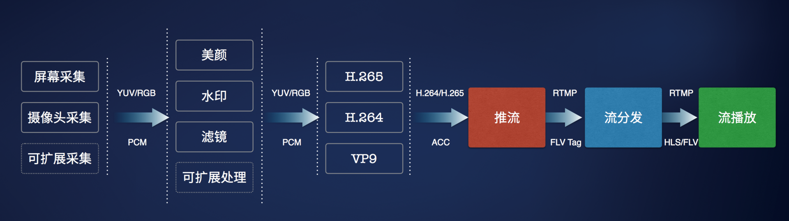

## 直播技术

[TOC]

### 一、直播

#### 1. 流程

1. 采集

   a). 通过Android Camera 拍摄预览中设置setPreviewCallBack实现onPreviewFrame接口，实时截取每一帧视频流的数据。

   b). 通过Android的MediaRecorder，在SetoutputFile函数中绑定LocalSocket实现。

   c). 流媒体服务器方式，利用FFmpeg或者GetStreamer等获取Camera视频。

2. 处理

3. 编码和封装

   a). 不编码，直接通过Socket传输原始YUV420SP视频帧。

   b). JEPG. 将原始YUV420SP视频帧压缩成H.264再传输。

   c). H.264/AVC.将原始YUV420SP视频帧压缩成H.264再传输，常见的基于H264的开源Encoder有JM、X264、T264、Hdot264等

   d). MPEG4.将原始YUV420SP视频帧压缩成MPEG4再传输

4. 推送到服务器

   a). SOCKET传输

   b). HTTP传输

   c). RTP/RTSP传输

   d). 流媒体服务器方式，如live555等

5. 服务器流转发

6. 播放器流播发

#### 2. 协议

**传输协议：**

常用的几种视频协议是：RTMP、HTTP-FLV、HLS、RTP/RTCP协议。

[参考](https://blog.csdn.net/ai2000ai/article/details/80306693)

我列一个表作为总结：

| 协议           | httpflv(国内) | rtmp(国内) | hls        | dash         |
| -------------- | ------------- | ---------- | ---------- | ------------ |
| 传输层         | http流        | tcp流      | http       | http         |
| 视频格式       | flv           | flv tag    | Ts文件     | Mp4 3gp webm |
| 延时           | 低            | 低         | 很高       | 高           |
| **数据分段！** | 连续流        | 连续流     | 切片文件   | 切片文件     |
| Html5播放      | 暂不支持      | 不支持     | 大部分支持 | 极大部分支持 |
| 服务器编程难易 | 简单          | 一般       | 一般+      | 中等         |

**H.264/AVC压缩技术(编码解码)**

​	H.264是国际标准化组织（ISO）和国际电信联盟（ITU）共同提出的继MPEG4之后的新一代数字视频压缩格式(高度压缩数字视频编解码器标准)。

1．低码率（Low Bit Rate）：和MPEG2和MPEG4 ASP等压缩技术相比，在同等图像质量下，采用H.264技术压缩后的数据量只有MPEG2的1/8，MPEG4的1/3。 [1] 

2．高质量的图像：H.264能提供连续、流畅的高质量图像（DVD质量）。 [1] 

3．容错能力强：H.264提供了解决在不稳定网络环境下容易发生的丢包等错误的必要工具。 [1] 

4．网络适应性强：H.264提供了网络抽象层（Network Abstraction Layer），使得H.264的文件能容易地在不同网络上传输（例如互联网，CDMA，GPRS，WCDMA，CDMA2000等）。 [1]

