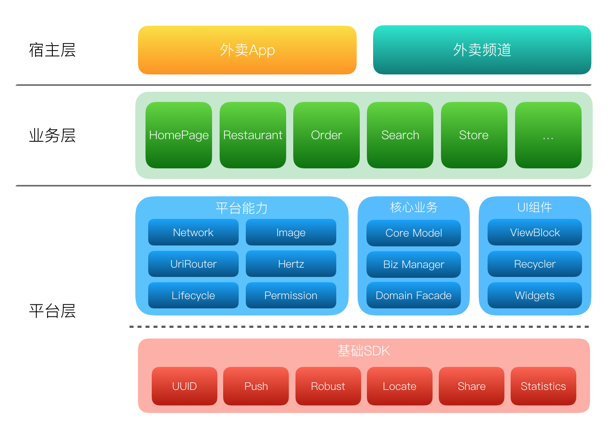

# 移动端架构的理解

[TOC]

## 一、架构设计原则

- **整体原则**

  架构服务于业务，随业务的发展而演进，以提升业务效率和体验为目标。

- **业务原则**

  1. 稳定性和可维护性；
  2. 与业务形态和组件架构契合；
  3. 成本可控(切记憋大招，多次小规模架构演进达到目标)；

## 二、组件化理解

1. why

   如果项目比较小，普通的 单工程+MVC架构就可以满足大部分需求了。

   当一个项目越来越大，开发人员越来越多，项目会遇到很多问题：

   - 业务模块间划分不清晰，模块之间耦合很大，非常难维护；
   - 所有模块代码写在一个项目中，测试或打包时，需要编译整个项目；

2. what

   

   - 宿主层

     可以包含多个宿主，对外提供apk。用于Application的初始化、dex加载和其他组件或功能的初始化。

   - 业务组件层

     包含多个可以独立运行的业务组件，可以单独编译、独立打包、独立测试。

   - 平台层

     包括组件间数据通信和页面跳转、核心业务、基础能力：网络、图片等。

3. how

   - 不同组件如何跳转或通信？

     美团URLRouter： scheme原理做页面跳转，ServiceLoader利用反射做组件方法调用;

     自定义 消息处理机制，类似于looper;

     EventBus;

     Arouter;

   - 组件模式和集成模式的转换？

   - library依赖问题？组件之间AndroidManifest合并问题?

   - 组件开发完成后相互之间的集成调试如何实现？还有就是在集成调试阶段，依赖多个组件进行开发时，如何实现只依赖部分组件时可以编译通过？

   - 。。

   - 

4. 需要考虑的问题？

- 组件化和模块化区别？

`A component is a similar concept, but typically refer to a high level; a component is a pieceof a whole system, while a module is a piece of an individual program.`

组件化和模块化是相似的，目的都是封装内聚、解耦复用；

组件是可以单独运行的，作为系统的一部分，模块是应用程序中一个类或多个类的集合；

组件侧重于对外，提供接口统一访问；模块侧重于内聚，不同模块没有明确界限；

一个组件可以包含多个模块实现。

- ..
- ..
- ..
- .
- ..
- 

## 三、插件化理解

## 四、热修复理解

## 五、APP架构的关注点有哪些？

​	业界有一些做得比较好的产品，也是我们参考的对象，毕竟技术领域尽量要避免重复造轮子。像微信、支付宝、美团等超级 App 的架构演进我们也会去学习了解，吸取别人的经验。

关注点这里，会关注(**组件化、插件化、动态迭代、代码多端复用**)：

1. 模块 / 组件划分、分层的策略和维度；

2. 模块 / 组件间通信方案；

3. 架构演进中遇到的问题；

4. 架构演进过程中使用的工具；

5. 防劣化机制；

6. 架构演进和业务迭代的合作模式；

7. 后续架构演进的方向。

- 参考

[1. 头条](https://mp.weixin.qq.com/s/e_QmHNOOhplKzIz1MXn08g)

[2. 组件和模块区别](https://blog.csdn.net/weixin_30359021/article/details/95141665)

[3. 文章](https://www.liyisite.com/article/12/android-xiang-mu-mo-kuai-hua-zu-jian-hua-de-jia-gou-zhi-lu-yi/)

[4. 安居客架构演进](https://mp.weixin.qq.com/s?__biz=MzA4NTQwNDcyMA%3D%3D&mid=2650662653&idx=1&sn=e15a36e4460eb3d1890d92aa921c0962&scene=45#wechat_redirect)

[5. 安居客模块化组件化](https://mp.weixin.qq.com/s?__biz=MzU4ODM2MjczNA==&mid=2247483732&idx=1&sn=b7ee1151b2c8ad2e997b8db39adf3267&chksm=fddca7d5caab2ec33905cc3350f31c0c98794774b0d04a01845565e3989b1f20205c7f432cb9&scene=38#wechat_redirect)

[6. 美团技术文章列表-平台化架构演进](https://tech.meituan.com/2018/03/16/meituan-food-delivery-android-architecture-evolution.html)

[7. 后台-基于SOA组件化架构-组件化和平台化](https://my.oschina.net/u/1183665/blog/523957)

[8. 微信Android模块化架构重构实践](https://mp.weixin.qq.com/s/6Q818XA5FaHd7jJMFBG60w)

[9. 组件化、插件化面试](https://blog.csdn.net/Coo123_/article/details/105231799)

[10. 组件化demo](https://juejin.cn/post/6844903649102004231#heading-14)

