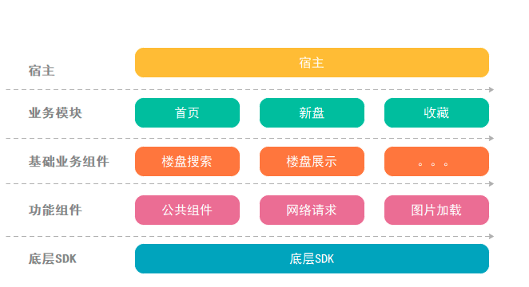

#### 移动端架构的理解

[TOC]

## 一、架构设计原则

- **整体原则**

  架构服务于业务，以提升业务效率和体验为目标。

- **业务原则**

  1. 稳定性和可维护性；
  2. 与业务形态和组件架构契合；
  3. 成本可控(切记憋大招，多次小规模架构演进达到目标)；

  

## 二、APP架构的关注点有哪些？

​	业界有一些做得比较好的产品，也是我们参考的对象，毕竟技术领域尽量要避免重复造轮子。像微信、支付宝、美团等超级 App 的架构演进我们也会去学习了解，吸取别人的经验。

关注点这里，会关注(**组件化、插件化、动态迭代、代码多端复用**)：

1. 模块 / 组件划分、分层的策略和维度；

2. 模块 / 组件间通信方案；

3. 架构演进中遇到的问题；

4. 架构演进过程中使用的工具；

5. 防劣化机制；

6. 架构演进和业务迭代的合作模式；

7. 后续架构演进的方向。

## 二、模块之间通信方式有哪些？

- 参考

[1. 头条](https://mp.weixin.qq.com/s/e_QmHNOOhplKzIz1MXn08g)

[2. 组件和模块区别](https://blog.csdn.net/weixin_30359021/article/details/95141665)

[3. 文章](https://www.liyisite.com/article/12/android-xiang-mu-mo-kuai-hua-zu-jian-hua-de-jia-gou-zhi-lu-yi/)

[4. 安居客架构演进](https://mp.weixin.qq.com/s?__biz=MzA4NTQwNDcyMA%3D%3D&mid=2650662653&idx=1&sn=e15a36e4460eb3d1890d92aa921c0962&scene=45#wechat_redirect)

[5. 安居客模块化组件化](https://mp.weixin.qq.com/s?__biz=MzU4ODM2MjczNA==&mid=2247483732&idx=1&sn=b7ee1151b2c8ad2e997b8db39adf3267&chksm=fddca7d5caab2ec33905cc3350f31c0c98794774b0d04a01845565e3989b1f20205c7f432cb9&scene=38#wechat_redirect)

对比:

| 类别 | 目的       | 特点           | 接口       | 成果               | 架构定位 |
| ---- | ---------- | -------------- | ---------- | ------------------ | -------- |
| 组件 | 重用、解耦 | 高重用、松耦合 | 无统一接口 | 基础库、基础组件   | 纵向分层 |
| 模块 | 隔离/封装  | 高内聚、松耦合 | 统一接口   | 业务框架、业务模块 | 横向分块 |

说明:

组件：最初的目的是代码重用，功能相对单一或者独立。在整个系统的代码层次上位于最底层，被其他代码所依赖，所以说组件化是纵向分层。
模块：最初的目的是将同一类型的代码整合在一起，所以模块的功能相对复杂，但都同属于一个业务。不同模块之间也会存在依赖关系，但大部分都是业务性的互相跳转，从地位上来说它们都是平级的。

