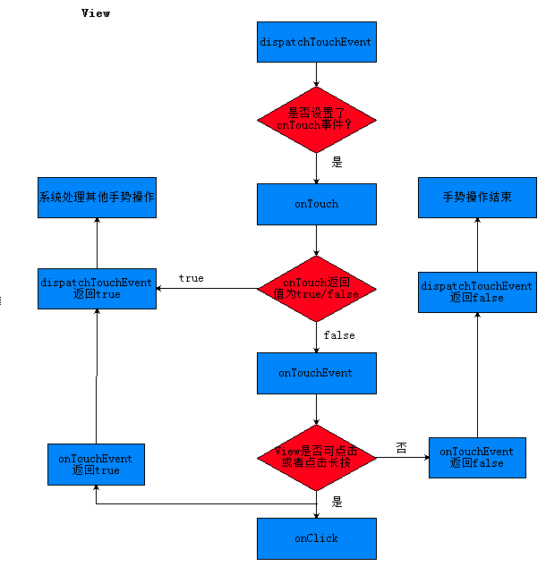

# 2面试题-Android

[TOC]

## 一、UI

#### 1. Launcher启动流程？

> Launcher本质上是一个App(HomeAPP)，系统启动后第一个启动，清单文件类型为`android.intent.category.LAUNCHER`.

1. 系统启动时，Zygote进程fork出SystemServer进程，执行SystemServer.java类；
2. SystemServer会启动AMS、PMS以及其他service;
3. PMS解析本地应用，并把数据信息保存起来(包括launcher app)；
4. AMS触发systemReady(...)方法，其中执行了startHomeActivity(...);
5. 构建home intent,然后通过PMS查找到一个符合HomeIntent的Activity；
6. 启动Acitvity。

#### 2. Activity启动流程？

>  **大致流程：(背诵)**
>
>  单击桌面图标 -> 发送请求到AMS-> Zygote fork新进程->ActivityThread执行main方法(handler loop)
>
>  ->通过attach函数创建ApplicationThread于AMS通信(server端)`                mgr.attachApplication(mAppThread);`
>
>  ->AMS发送bindApplication message -> create application(onCreate)
>
>  ->AMS发送 launcherActivity message -> Activity attach创建PhoneWindow对象(包含空DecorViewFL)
>
>  =》在onCreate的`setContentView(layoutId)`中将布局加载到DecorView的content中
>
>  =》在onResume中将DecorView添加到WindowManager中`wm.addView(mDecor, getWindow().getAttributes());`
>
>  =》在WindowManagerGlobal中分别保存view，和新创建的ViewRootImpl，然后执行root.setView进行遍历绘制。
>
>  =>ViewRoot执行测量绘制、然后与WMS通信提供窗口信息或接受窗口事件到view。

-  例子
   1. 单击桌面淘宝图标，Launcher通知AMS启动淘宝APP(清单文件中的入口类);
   2. AMS记录要启动的Activity信息，并且通知Launcher进入pause状态;
   3. Launcher进入pause状态后，通知AMS已经paused了，可以启动淘宝了;
   4. 淘宝app未开启过，所以AMS启动新的进程，并且在新进程中创建ActivityThread对象，执行其中的main函数方法;
   5. 淘宝app主线程启动完毕后通知AMS，并传入applicationThread以便通讯;
   6. AMS通知淘宝绑定Application并启动MainActivity;
   7. 淘宝启动MainActivitiy，并且创建和关联Context,最后调用onCreate方法。

#### 3. UI绘制流程？

1. setContentView会创建一个DocorView并将自定义的layout添加到DocorView；
2. onResume时候会将DocorView添加到PhoneWindow上，并执行performTraversals开始绘制；
3. onMeasure测量(`从顶层父View到子View递归调用measure方法，measure方法又回调OnMeasure`)；
4. onLayout布局(`从顶层父View向子View的递归调用view.layout方法的过程，即父View根据上一步measure子View所得到的布局大小和布局参数，将子View放在合适的位置上`)；
5. onDraw绘制(`ViewRoot创建一个Canvas对象，然后调用OnDraw()。六个步骤：①、绘制视图的背景；②、保存画布的图层（Layer）；③、绘制View的内容；④、绘制View子视图，如果没有就不用；⑤、还原图层（Layer）；⑥、绘制滚动条。`)；
6. 然后通过Surface将Canvas绘制到缓存区，每16毫秒，SurfaceFlinger进程合成多个Surface后调用opengl进行栅格化和最终显示。

问题：

1. MeasureSpec的三种模式和对子View的影响？

#### 4. 事件分发机制？

dispatchT --> onInterceptT --> onTouch  -->  onTouchEvent  -->  onClick;

首先应该搞清楚两个问题：事件分发机制分发的是什么？怎么进行分发？

分发的是MotionEvent事件了，因而我们讨论的问题就成了当MotionEvent事件生成之后，事件是怎么传递到某一个View控件上面并且得到处理的过程；

​	android事件产生后的传递过程是从`Activity--->Window--->View的，即隧道式传递`，而View又分为不包含子View的View以及包含子View的ViewGroup，事件产生之后首先传递到Activity上面，而Activity接着会传递到PhoneWindow上，PhoneWindow会传递给RootView，而RootView其实就是DecorView了，接下来便是从DecorView到View上的分发过程了，具体就可以分成ViewGroup和View的分发两种情况了；

对于ViewGroup而言，当事件分发到当前ViewGroup上面的时候，首先会调用他的dispatchTouchEvent方法，在dispatchTouchEvent方法里面会调用onInterceptTouchEvent来判断是否要拦截当前事件，如果要拦截的话，就会调用ViewGroup自己的onTouchEvent方法了，如果onInterceptTouchEvent返回false的话表示不拦截当前事件，那么事件将会继续往当前ViewGroup的子View上面传递了，如果他的子View是ViewGroup的话，则重复ViewGroup事件分发过程，如果子View就是View的话，则转到下面的View分发过程；

对于View而言，事件传递过来首先当然也是执行他的dispatchTouchEvent方法了，如果我们为当前View设置了onTouchListener监听器的话，首先就会执行他的回调方法onTouch了，这个方法的返回值将决定事件是否要继续传递下去了，如果返回false的话，表示事件没有被消费，还会继续传递下去，如果返回true的话，表示事件已经被消费了，不再需要向下传递了；如果返回false，那么将会执行当前View的onTouchEvent方法，如果我们为当前View设置了onLongClickListener监听器的话，则首先会执行他的回调方法onLongClick，和onTouch方法类似，如果该方法返回true表示事件被消费，不会继续向下传递，返回false的话，事件会继续向下传递，为了分析，我们假定返回false，如果我们设置了onClickListener监听器的话，则会执行他的回调方法onClick，该方法是没有返回值的，所以也是我们事件分发机制中最后执行的方法了；可以注意到的一点就是只要你的当前View是clickable或者longclickable的，View的onTouchEvent方法默认都会返回true，也就是说对于事件传递到View上来说，系统默认是由View来消费事件的，但是ViewGroup就不是这样了；

上面的事件分发过程只是正常情况下的，如果有这样一种情况，比如事件传递到最里层的View之后，调用该View的onTouchEvent方法返回了false，那么这时候事件将通过冒泡式的方式向他的父View传递，调用它父View的onTouchEvent方法，如果正好他的父View的onTouchEvent方法也返回false的话，这个时候事件最终将会传递到Activity的onTouchEvent方法了，也就是最终就只能由Activity自己来处理了；

**问题：**

1. 一旦一个ViewGroup决定拦截事件，那么这个事件序列剩余的部分将不再会由该ViewGroup的子View去处理了，即事件将在此ViewGroup层停止向下传递，同时随后的事件序列将不再会调用onInterceptTouchEvent方法了(down 返回false，move返回true，up返回false，子view只处理down事件)；
2. 触摸事件传递顺序：dispatchTouchEvent–>>onTouch–>>onTouchEvent–>>onClick。
3. onTouch和onTouchEvent区别：两个方法先后在dispatchTouchEvent中调用，只有给View设置了触摸事件View#setOnTouchListener才会执行onTouch方法；onTouch方法的返回值决定是否执行onTouchEvent方法。
4. 手势操作执行的顺序为ACTION_DOWN,ACTION_MOVE,ACTION_UP，只有dispatchTouchEvent方法返回true值时后面的手势才会被执行。
5. onClick方法的调用是在onTouchEvent的ACTION_UP手势里面执行的，也就是当手势抬起时，手势操作结束才会触发onClick方法的调用。

#### 5. 手势冲突如何解决？

​	scrollview 包含recycleView有何异常？

#### 5. 动画实现原理？

#### 

## 二、Framework

#### 1. Android系统三大进程？

init进程、zygote进程、systemServer进程。

#### 2. Handler机制和Handler.postDelayed实现？

