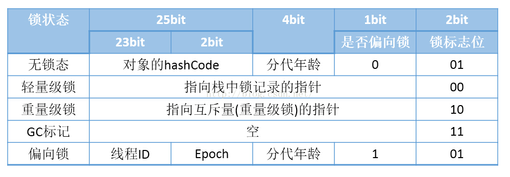

# Java基础

[TOC]

## 一、基本数据类型相关

#### 1. 常量池

##### a. String常量池

​	[参考1](https://www.cnblogs.com/starry-skys/p/12285241.html)

​	[参考2](https://blog.csdn.net/hz90s/article/details/80819619)

```java
        //创建了两个对象，一份存在字符串常量池中，一份存在堆中
        String s = new String("aa");
        //检查常量池中是否存在字符串aa，此处存在则直接返回
        String s1 = s.intern();
        String s2 = "aa";

        System.out.println(s == s2);  //① 
        System.out.println(s1 == s2); //②

        String s3 = new String("b") + new String("b"); //约等于 变量b + 变量b
        //常量池中没有bb，在jdk1.7之后会把堆中的引用放到常量池中，故引用地址相等
        String s4 = s3.intern();
        String s5 = "bb";

        System.out.println(s3 == s5 ); //③ ！！
        System.out.println(s4 == s5);  //④
```


##### b. Integer常量池

[参考](https://www.cnblogs.com/DreamSea/archive/2011/11/20/2256396.html)

```java
 				Integer i1 = 40;  // 常量池取对象 [-128,127]
        Integer i2 = 40;
        Integer i3 = 0;
        Integer i4 = new Integer(40);
        Integer i5 = new Integer(40);
        Integer i6 = new Integer(0);

        Integer i100 = 400;
        Integer i200 = 400;

        System.out.println("i1=i2\t" + (i1 == i2));
        System.out.println("i1=i2+i3\t" + (i1 == i2 + i3));
        System.out.println("i4=i5\t" + (i4 == i5));
        System.out.println("i4=i5+i6\t" + (i4 == i5 + i6));

        System.out.println(i100 == i200); // 超过常量池范围，都是new的对象。
```

##### c. int与double的转换

```java
				// 两个int类型的相计算结果为int；其中一个为double结果自动为double！
				int t = -2 / 3;  
        double d = -2 / 3;
        double d1 = -2d / 3;

        System.out.println(t);
        System.out.println(d);
        System.out.println(d1);
        System.out.println(-2 / 3);
        System.out.println(-7.9 / 3);

        System.out.println("-----");

        double[] list = {-1, -0.666, 0, 0.666, 1};
        double xx = -2 / 3;
        for (double temp : list) {
            if (temp > xx) {
                System.out.println(temp);
            }
        }
```


### 1. weakReference与softReference区别？

sf: 当内存不足的时候才会被回收，多用于高速缓存防止内存溢出；

wr:每次gc的时候都会被回收，用于实现cache机制。

### 2. sleep和wait区别？

sleep是线程类的静态方法，wait是对象方法(任何一个对象都有)；

sleep不释放同步锁，wait释放同步锁，需要notify/notifyAll唤醒；

sleep必须捕获异常。

### 3. String、StringBuffer、StringBuilder区别？

执行速度：StringBuilder>StringBuffer>String;

StringBuffer是线程安全的，StringBuilder不是的；

stirng赋值每次开辟新空间，stringbuffer可以在原有空间追加。

### 4. Http、Https区别？

1、https需要ca证书；

2、http是明文传输，https是安全的ssl加密传输；

3、是完全不同的连接方式，端口80，443；

4、http的连接很简单，是无状态的；HTTPS协议是由SSL+HTTP协议构建的可进行加密传输、身份认证的网络协议，比http协议安全。

[https原理:](android/100qa网络安全.md)

### 5. TCP/UDP区别？

1、TCP是面向连接的(三次握手四次挥手)，UDP是面向无连接的；

2、TCP是面向数据流的，UDP是基于数据报的；

3、TCP是保证数据准确性、顺序性的，UDK可能丢包和无序。

### 6. Http Get Post区别？

1、url可见性

​	Get方法参数在url中可见，Post参数在http的包体内；

2、传输大小限制

​	Get Url最大长度为2048个字符，post没有限制；

3、缓存

​	get可以被缓存和保存在历史记录或书签中，post不可以；

4、编码方式

​	get请求只能使用url编码，post支持多种编码方式；

5、字符类型

​	get只支持ASCII字符，post没有字符限制；

为什么get的效率比post高？

1、post在接收返回来的数据会先将请求头发送给服务器确认，然后才真正的发送数据，（相当于第一次先向服务器打个招呼，第二次才将数据真正的发过来，get则是直接发送数据。专业的说法是，get产生一个TCP数据包，post产生两个TCP。数据包但并不是所有的浏览器post都会请求两次，火狐浏览器就会请求一次）总结起来就是请求的过程比get更多；

2、get会将数据进行缓存。


### 7. Socket建立网络连接的步骤？

**服务器端套路**

创建ServerSocket对象，绑定监听端口。
通过accept（）方法监听客户端请求。
连接建立后，通过输入流读取客户端发送的请求信息。
通过输出流向客户端发送响应信息。
关闭响应的资源。
**客户端套路**

创建Socket对象，指明需要连接的服务器的地址和端口号。
连接建立后，通过输出流向服务器发送请求信息。
通过输入流获取服务器响应的信息。
关闭相应资源。
**多线程实现服务器与多客户端之间通信步骤**

服务器端创建ServerSocket，循环调用accept()等待客户端连接。
客户端创建一个socket并请求和服务器端连接。
服务器端接受客户端请求，创建socket与该客户建立专线连接。
建立连接的两个socket在一个单独的线程上对话。
服务器端继续等待新的连接。

### 8. ==、equals、hashcode区别？

**基本数据类型:** == 比的值是否相等；

**对象：** ==、equals都比较的是指针是否相同(对象不重写equals)。String默认重新了equals方法(比较值);

**hashcode：**hashCode是Object类的一个方法，返回一个离散的int整数。在集合中提供查询速度。

如果两个对象equals相等，hashcode一定相等；hashcode相等，equals不一定相等。

### 9. int integer区别？

`public final class Integer extends Number implements Comparable<Integer> {...}`

```java
// Integer class
public final class Integer extends Number implements Comparable<Integer> {...}

Integer i5 = 127;//java在编译的时候,被翻译成-> Integer i5 = Integer.valueOf(127);
Integer i6 = 127;
// integer对于-128到127之间的数，会进行缓存，Integer i5 = 127时，会将127进行缓存，下次再写Integer i6 = 127时，就会直接从缓存中取，就不会new了。!!!
System.out.println(i5 == i6);//true

```

1、int是基本数据类型，Integer是int的封装类；

2、int默认值为0，Integer默认值为null；

3、比较时，integer会自动拆箱为int进行比较。

### 10. Serializable和Parcelable的区别？

Serializable 是java序列号接口，在硬盘读写数据会产生大量临时变量，内部执行大量io，效率低；

Parcelable 是Android序列化接口，序列化麻烦，在内存中读写，对象不能保存在磁盘中。

### 11. 说说你对java反射的理解？

> JAVA反射机制是在运行状态中,  对于任意一个类, 都能够知道这个类的所有属性和方法; 对于任意一个对象, 都能够调用它的任意一个方法和属性。

 从对象出发，通过反射（Class类）可以取得取得类的完整信息（类名 Class类型，所在包、具有的所有方法 Method[]类型、某个方法的完整信息（包括修饰符、返回值类型、异常、参数类型）、所有属性 Field[]、某个属性的完整信息、构造器 Constructors），调用类的属性或方法自己的总结： 在运行过程中获得类、对象、方法的所有信息。

缺点： 性能问题、安全限制、内部暴露(难以维护)；

优点： 反射提高了Java程序的灵活性和扩展性，降低耦合性，提高自适应能力。它允许程序创建和控制任何类的对象，无需提前硬编码目标类；反射是其它一些常用语言，如C、C++、Fortran 或者Pascal等都不具备的。

使用场景：

1. 简单工厂(直接传工厂实现类路径，不用频繁修改工厂类)；

2. spring beanfactory 通过xml配置， 减少 A类直接newB类的强耦合(IOC控制翻转或依赖注入)；
3. 单元测试，对私有方法进行测试。
4. retrofit利用反射 获取 Service声明的方法，并将所有的方法放在serviceMothodCache集合中。

### 12. List、Set、Map区别？

Collection 接口的接口 对象的集合（单列集合）
├——-List 接口：元素按进入先后有序保存，可重复
│—————-├ LinkedList 接口实现类， 链表， 插入删除， 没有同步， 线程不安全
│—————-├ ArrayList 接口实现类， 数组， 随机访问， 没有同步， 线程不安全
│—————-└ Vector 接口实现类 数组， 同步， 线程安全
│ ———————-└ Stack 是Vector类的实现类
└——-Set 接口： 仅接收一次，不可重复，并做内部排序
├—————-└HashSet 使用hash表（数组）存储元素
│————————└ LinkedHashSet 链表维护元素的插入次序
└ —————-TreeSet 底层实现为二叉树，元素排好序

Map 接口 键值对的集合 （双列集合）
├———Hashtable 接口实现类， 同步， 线程安全
├———HashMap 接口实现类 ，没有同步， 线程不安全-
│—————–├ LinkedHashMap 双向链表和哈希表实现
│—————–└ WeakHashMap
├ ——–TreeMap 红黑树对所有的key进行排序
└———IdentifyHashMap

### 13. ArrayMap、HashMap区别？

1、Android特定提供的API，能有效利用空间，在千级数量量以内使用；

2、线程不安全的，在remove的时候会收缩数组；

3、ArrayMap底层用两个数组存储，添加删除元素用二分搜索查找元素；

4、SparseArray类似有ArrayMap，只支持key为int类型；

### 14. HashMap、HashTable区别？

hashTable是线程安全的；

hashTable中key和value都不允许为空；

hashTabel直接使用对象的hashCode，而hashmap重新计算hash值；

扩容方式不同： ht默认11，hm默认16，hashmap要求底层数组一定为2的整数次幂。hashmap扩容为2倍，hashTable为old*2+1;

### 15. HashMap、HashSet区别？

1、一个实现Map接口(key-value)，一个实现Set接口(value)；

2、HashSet底层也通过HashMap存在的，把Value存储为了常量。

3、HashMap使用key获取hashcode，HashSet使用对象计算hashcode，如果两个对象hashcode相等，可以判断对象是否相等来比较；

### 16. ArrayList、LinkedList区别？

ArrayList底层用数组实现，插入和删除效率低；linkedList使用链表实现，查找效率低；

### 17. 如何保证线程安全？

1、synchronized；

2、Object方法中的wait，notify；

3、ThreadLocal机制来实现；

### 18. 如何实现线程同步？

1、sync关键字修饰方法；

2、sync关键字修复语句块；

3、volatile实现线程同步；

### 19. 有三个线程T1,T2,T3，如果保存他们顺序执行？

```java
    public static void main(String[] args) {
        final Thread t1 = new Thread(new Runnable() {
            @Override
            public void run() {
                System.out.println("t1");
            }
        });
        final Thread t2 = new Thread(new Runnable() { 
            @Override
            public void run() {
                try {
                    //2. 引用t1线程，等待t1线程执行完
                    t1.join();
                } catch (InterruptedException e) {
                    e.printStackTrace();
                }
                System.out.println("t2");
            }
        });
        Thread t3 = new Thread(new Runnable() {
            @Override
            public void run() {
                try {
                    //1. 引用t2线程，等待t2线程执行完
                    t2.join();
                } catch (InterruptedException e) {
                    e.printStackTrace();
                }
                System.out.println("t3");
            }
        });
        t3.start();
        t2.start();
        t1.start();
    }
```

### 20. Synchronized 和 volatile关键字区别？

1. 锁提供了两种特性： 互斥性(mutual exclusion)和可见性(visibility)；

2. 在Java中，为了保证多线程读写数据一致性，可以采用以下方式：

   同步：如用sync关键字，或者使用锁对象；

   使用volatile关键字：它能使变量的修改立即对其他线程可见(无法保证原子性)。

3. volatile详解

   如果定义变量使用了volatile关键字，它就具备两种特性：1. 可见性 2. 禁止指令重新排序。

4. volatile与synchronized

   1、volatile本质是告诉JVM，**当前变量在寄存器中的值是不可靠的，**需要从注册中读取。synchronized则是**锁定当前变量，**其他线程会被阻塞；

   2、volatile进能在变量级别使用，sync可以在变量、方法使用；

   3、volatile仅能实现变量的可见性，sync可以保证变量的可见性、原子性；

   4、volatile不会造成线程阻塞，而sync会；

   5、使用volatile唯一安全情况是类中**只有一个可变的域(n=n+1,n++就不行)**。

### 21. ReentrantLock、Synchronized比较？

1、 都是可重入的独占锁，性能上没有太多差别，比起synchronized功能更加丰富，支持公平锁实现，支持中断响应以及限时等待等等。可以配合一个或多个Condition条件方便的实现等待通知机制。

2、语法

```java
public class ReentrantLockTest {
		// 三次 lock() 三次unlock()
    public static void main(String[] args) throws InterruptedException {
        ReentrantLock lock = new ReentrantLock();
        for (int i = 1; i <= 3; i++) {
            lock.lock();
        }

        for(int i=1;i<=3;i++){
            try {

            } finally {
                lock.unlock();
            }
        }
    }
}
```

3、使用场景

sync使用简单，无序担心忘记手动解锁，加锁解锁是隐式的，使用简单，方便调试；如果必须用lock的高级属性的话，再使用ReetratLock锁。

1. 锁的分类？

   > CAS原理(Compare and Swap)。 独占锁是一种悲观锁，synchronized就是一种独占锁，会导致其它所有需要锁的线程挂起，等待持有锁的线程释放锁。而另一个更加有效的锁就是乐观锁。所谓乐观锁就是，每次不加锁而是假设没有冲突而去完成某项操作，如果因为冲突失败就重试，直到成功为止。

   

   - 重量级锁

     synchronized，当前线程获取对象锁，其他线程挂起。

   - 轻量级锁

     **在某些情况下，sync区域不存在竞争，依然按照重量锁的方式运行，会无端消耗资源。不过，需要注意的是轻量锁或者偏向锁不能代替重量级锁的功能，只是在无竞争环境下，减少无端消耗，如果出现竞争，还是会转换成重量级锁。**

     在解释轻量级锁的执行过程之前，先明白一点，轻量级锁所**适应的场景是线程交替执行同步块**的情况，如果存在同一时间访问同一锁的情况，就会导致轻量级锁膨胀为重量级锁。

     （1）在代码进入同步块的时候，如果同步对象锁状态为无锁状态（锁标志位为“01”状态），虚拟机首先将在当前线程的栈帧中建立一个名为锁记录（Lock Record）的空间，用于存储旧的Mark Word的拷贝，官方称其为Displaced Mark Word。(锁记录解锁的时候会用到)

     （2）虚拟机将使用CAS操作尝试将对象的Mark Word更新为轻量级锁的标志位和指向锁记录（Lock Record）的指针。

     （3）如果这个更新动作成功了，那么这个线程就拥有了该对象的锁。

     （4）如果这个更新操作失败了，虚拟机首先会检查当前线程是否已经拥有了这个对象的锁，如果已经拥有，那就可以直接进入同步块继续执行。否则就说明这个锁度一项已经被其他线程抢占了。一旦发生这种情况，那么轻量级锁就会膨胀为重量级锁。Mark Word中存储的就会指向重量级锁的指针，后面等待锁的线程也会进入阻塞状态。

   - 偏向锁

     ​	引入偏向锁是为了在无多线程竞争的情况下尽量减少不必要的轻量级锁执行路径，因为轻量级锁的获取及释放依赖多次CAS原子指令，而偏向锁只需要在置换ThreadID的时候依赖一次CAS原子指令（由于一旦出现多线程竞争的情况就必须撤销偏向锁，所以偏向锁的撤销操作的性能损耗必须小于节省下来的CAS原子指令的性能消耗）。上面说过，轻量级锁是为了在线程交替执行同步块时提高性能，而偏向锁则是在只有一个线程执行同步块时进一步提高性能。

   - 优化

     1、适应性自旋锁：

     ​	从轻量级锁获取的流程中我们知道**，**当线程在获取轻量级锁的过程中执行CAS操作失败时，是要通过自旋来获取重量级锁的。问题在于，自旋是需要消耗CPU的，如果一直获取不到锁的话，那该线程就一直处在自旋状态，白白浪费CPU资源。解决这个问题最简单的办法就是指定自旋的次数，例如让其循环10次，如果还没获取到锁就进入阻塞状态。但是JDK采用了更聪明的方式——适应性自旋，简单来说就是线程如果自旋成功了，则下次自旋的次数会更多，如果自旋失败了，则自旋的次数就会减少。

     2、锁粗话

     ​	就是将多次连接在一起的加锁、解锁操作合并为一次，将多个连续的锁扩展成一个范围更大的锁。`stringbuffer.append(); sb.append()`

     3、锁消除

     | 锁       | 优点                                                         | 缺点                                             | 适用场景                             |
     | -------- | ------------------------------------------------------------ | ------------------------------------------------ | ------------------------------------ |
     | 偏向锁   | 加锁和解锁不需要额外的消耗，和执行非同步方法比仅存在纳秒级的差距。 | 如果线程间存在锁竞争，会带来额外的锁撤销的消耗。 | 适用于只有一个线程访问同步块场景。   |
     | 轻量级锁 | 竞争的线程不会阻塞，提高了程序的响应速度。                   | 如果始终得不到锁竞争的线程使用自旋会消耗CPU。    | 追求响应时间。同步块执行速度非常快。 |
     | 重量级锁 | 线程竞争不使用自旋，不会消耗CPU。                            | 线程阻塞，响应时间缓慢。                         | 追求吞吐量。同步块执行速度较长。     |

### 22. 死锁的四个必要条件？

   （1）互斥条件：进程对所分配到的资源不允许其他进程进行访问，若其他进程访问该资源，只能等待，直至占有该资源的进程使用完成后释放该资源

   （2）请求和保持条件：进程获得一定的资源之后，又对其他资源发出请求，但是该资源可能被其他进程占有，此事请求阻塞，但又对自己获得的资源保持不放

   （3）不可剥夺条件：是指进程已获得的资源，在未完成使用之前，不可被剥夺，只能在使用完后自己释放

   （4）环路等待条件：是指进程发生死锁后，必然存在一个进程--资源之间的环形链。

   ### 23. 线程池理解？

**好处：**

第一：降低资源消耗。通过重复利用已创建的线程降低线程创建和销毁造成的消耗。
第二：提高响应速度。当任务到达时，任务可以不需要等到线程创建就能立即执行。
第三：提高线程的可管理性。线程是稀缺资源，如果无限制地创建，不仅会消耗系统资源，
还会降低系统的稳定性，使用线程池可以进行统一分配、调优和监控。

**流程：**

1）当提交一个新任务到线程池时，线程池判断corePoolSize线程池是否都在执行任务，如果有空闲线程，则创建一个新的工作线程来执行任务，直到当前线程数等于corePoolSize；

2）如果当前线程数为corePoolSize，继续提交的任务被保存到阻塞队列中，等待被执行；

3）如果阻塞队列满了，那就创建新的线程执行当前任务，直到线程池中的线程数达到maxPoolSize，这时再有任务来，由饱和策略来处理提交的任务

   [参考1](https://blog.csdn.net/luzhensmart/article/details/88044364)

   ### 24. 加密算法(base64,MD5,对称加密和非对称加密)和使用场景？

   > 大量数据加密建议采用对称加密算法，提高加解密速度；小量的机密数据，可以采用非对称加密算法。在实际的操作过程中，我们通常采用的方式是：**采用非对称加密算法管理对称算法的密钥，然后用对称加密算法加密数据，这样我们就集成了两类加密算法的优点，既实现了加密速度快的优点，又实现了安全方便管理密钥的优点。**


- 对称加密算法

  AES/DES。用对称算法对敏感信息进行加密、解密。

  对称加密算法使用同一个密匙加密和解密，速度快，适合给大量数据加密。对称加密客户端和服务端使用同一个密匙，存在被抓包破解的风险。

- 非对称加密算法

  RSA/DSA。非对称加密算法使用公钥加密，私钥解密，私钥签名，公钥验签。安全性比对称加密高，但速度较慢。非对称加密使用两个密匙，服务端和客户端密匙不一样，私钥放在服务端，黑客一般是拿不到的，安全性高。

  而且非对称加密的RSA加密效率较低，一次加密的数据大小也很局限！后来，我和ios的哥们商量了一个方案：**客户端传递的参数使用RSA公钥加密，另外随机生成一个8位desKey使用RSA公钥加密传递给服务端；服务端使用私钥解密参数及DES密码，再将客户端需要的数据使用desKey进行DES加密后返回给客户端。**这样既能保证数据安全，又能提高加密效率！

- 散列算法

  MD5，不可逆的加密算法，目前是最牢靠的加密算法之一。主要用于身份验证。

- Base64

  其实不是安全领域下的加密解密算法，只能算是一个编码算法，通常用于把二进制数据编码为可写的字符形式的数据，对数据内容进行编码来适合传输(可以对img图像编码用于传输)。这是一种可逆的编码方式。

### 25. 说说你的Java注解的理解？

> The common interface extended by all annatation types(所有的注解类型都继承自这个普通的接口Annatation). 或者说 **「注解的本质就是一个继承了 Annotation 接口的接口」**。
>
> 包括(元注解)： @Target @Retention @Doucumented @Inherited

- 作用

  以前用XML是各大框架的青睐，它以松耦合的方式配置项目，当随着项目越来越多，xml内容变的复杂，维护成本高；也是人们提出来一种标记式高耦合配置方式，注解。

- 使用场景

  ```java
      @HelloWorldAnn("hello")
      public static void main(String[] args) {
          Class cls = MainTest.class;
          Method method = null;
          try {
              method = cls.getMethod("main",String[].class);
          } catch (NoSuchMethodException e) {
              e.printStackTrace();
          }
          HelloWorldAnn helloWorldAnn = method.getAnnotation(HelloWorldAnn.class);
          System.out.println(helloWorldAnn.value());  // 打印Hello
      }
      
      @Target(value = ElementType.METHOD)
      @Retention(value = RetentionPolicy.RUNTIME)
      public @interface HelloWorldAnn{
          String value();
      }
  ```

  1. **自定义注解+拦截器 实现登录校验**

  2. **自定义注解+AOP 实现面向切面日志打印**

     劣势： 增加了代码的耦合性，且需要与反射结合使用。

     优点：节约配置，减少配置文件大小。

- 原理

  [查看](android/100qa进阶.md)   

### 27. 写一个生产者-消费者实现

 [参考](https://www.cnblogs.com/yunche/p/9540561.html)

### 28. LinkedHashMap

​	利用双向链表把Entry联系起来，可以实现插入顺序遍历。内部已经实现LRU算法。

```java
// 保持最近使用的6个元素(get put是把最新的元素放在最后)
public class LRU<K,V> extends LinkedHashMap<K,V> implements Map<K,V> {
    public LRU(int initialCapacity,
               float loadFactor,
               boolean accessOrder) {
        super(initialCapacity, loadFactor, accessOrder);
    }

    @Override
    protected boolean removeEldestEntry(Entry<K, V> eldest) {
        if(size() > 6){
            return  true;
        }
        return  false;
    }
}

public static void main(String[] args) {
        // accessOrder必须为True
        LRU<Character, Integer> lru = new LRU<>(
                16, 0.75f, true);

        String s = "abcdefghijkl";
        for (int i = 0; i < s.length(); i++) {
            lru.put(s.charAt(i), i);
        }
        System.out.println("LRU中key为h的Entry的值为： " + lru.get('h'));
        System.out.println("LRU的大小 ：" + lru.size()); // 6
        System.out.println("LRU ：" + lru);  // LRU ：{g=6, i=8, j=9, k=10, l=11, h=7}
    }
```

### 29. ConcurrentHashMap和Hashtable区别？

​	hashtable每次同步时锁住整个结构，ConcurrentHashMap锁的方式是微粒度的，默认有16个桶，只有全部写入才锁住整个结构，效率更高。


### 30. 多读少写并发场景使用的数据结构CopyOnWriteArrayList？

CopyOnWriteArrayList、CopyOnWriteMap处理这种场景用的。

原理： 读的时候不加锁，写的时候先加锁，再把数据copy一份然后更新数据，最后指针指向新数据，再解锁。

缺点：多占用一份内存，数据一致性问题。

### 31. SynchronousQueue原理和使用场景

[原理](https://blog.csdn.net/yanyan19880509/article/details/52562039)

### 32. 线程并发之AQS

[AQS讲解](https://www.cnblogs.com/waterystone/p/4920797.html)

### 33. http协议队首阻塞问题

1 队首阻塞

就是需要排队，队首的事情没有处理完的时候，后面的人都要等着。

2 http1.0的队首阻塞

对于同一个tcp连接，所有的http1.0请求放入队列中，只有前一个请求的响应收到了，然后才能发送下一个请求。

可见，http1.0的队首组塞发生在客户端。

3 http1.1的队首阻塞

对于同一个tcp连接，http1.1允许一次发送多个http1.1请求，也就是说，不必等前一个响应收到，就可以发送下一个请求，这样就解决了http1.0的客户端的队首阻塞。但是，http1.1规定，服务器端的响应的发送要根据请求被接收的顺序排队，也就是说，先接收到的请求的响应也要先发送。这样造成的问题是，如果最先收到的请求的处理时间长的话，响应生成也慢，就会阻塞已经生成了的响应的发送。也会造成队首阻塞。

可见，http1.1的队首阻塞发生在服务器端。

4 http2是怎样解决队首阻塞的

http2无论在客户端还是在服务器端都不需要排队，在同一个tcp连接上，有多个stream，由各个stream发送和接收http请求，各个steam相互独立，互不阻塞。

只要tcp没有人在用那么就可以发送已经生成的requst或者reponse的数据，在两端都不用等，从而彻底解决了http协议层面的队首阻塞问题。

### 34. http2.0 多路复用？

[参考](https://segmentfault.com/a/1190000011172823)

### 35. http2.0特性？

HTTP/2有三大特性：头部压缩、Server Push、多路复用。

总所周知，**HTTP 1.x拥有队首阻塞、不支持多路复用、Header无法压缩等诸多缺点。**尽管针对这些缺点也提出了很多解决方案，如长连接、连接与合并请求、HTTP管道等，但都治标不治本，直到HTTP 2.0的出现，它新增的以下设计从根本上解决了HTTP 1.x所面临的诸多问题。

- **二进制分帧层，是HTTP 2.0性能增强的核心，改变了客户端与服务器之间交互数据的方式，将传输的信息（Header、Body等）分割为更小的消息和帧，并采用二进制格式的编码**。

- 并行请求与响应，客户端及服务器可以把HTTP消息分解为互不依赖的帧，然后乱序发送，最后再在另一端把这些消息组合起来。

- 请求优先级（0表示最高优先级、2 31 2^{31}2 31-1表示最低优先级），每个流可以携带一个优先值，有了这个优先值，客户端及服务器就可以在处理不同的流时采取不同的策略，以最优的方式发送流、消息和帧。但优先级的处理需要慎重，否则有可能会引入队首阻塞问题。

- **单TCP连接，HTTP 2.0可以让所有数据流共用一个连接，从而更有效的使用TCP连接**

- 流量控制，控制每个流占用的资源，与TCP的流量控制实现是一模一样的。

- **服务器推送，**HTTP 2.0可以对一个客户端请求发送多个响应，即除了最初请求响应外，服务器还可以额外的向客户端推送资源，而无需客户端明确地请求。

- **首部（Header）压缩，**HTTP 2.0会在客户端及服务器使用“首部表”来跟踪和存储之前发送的键-值对，对于相同的数据，不会再通过每次请求和响应发送。首部表在连接存续期间始终存在，由客户端及服务器共同渐进的更新。每个新的首部键-值对要么追加到当前表的末尾，要么替换表中的值。
   

  虽然HTTP 2.0解决了1.x中的诸多问题，但它也存在以下问题。

虽然消除了HTTP队首阻塞现象，但TCP层次上仍然存在队首阻塞现象。要想彻底解决这个问题，就需要彻底抛弃TCP，自己来定义协议。可以参考谷歌的QUIC。
如果TCP窗口缩放被禁用，那宽带延迟积效应可能会限制连接的吞吐量。
丢包时，TCP拥塞窗口会缩小。

## 二、Jvm

### 1. 类加载机制

[参考](https://blog.csdn.net/xinlingchengbao/article/details/88376479)

### 2. 反射机制

**流程：**

1. 获取当前调用类的classloader；

2. 调用native检查权限是否合法；

3. 然后jvm回调javac层ClassLoader进行类加载；

4. 利用双亲委派模式加载class(`loadclass()`)。

    newInstance() 主要做了三件事：

   　　1. 权限检测，如果不通过直接抛出异常；

   　　2. 查找无参构造器，并将其缓存起来；

   　　3. 调用具体方法的无参构造方法，生成实例并返回；

```java
  // demo
	// 1. 使用外部配置的实现，进行动态加载类
  TempFunctionTest test = (TempFunctionTest)Class.forName("com.tester.HelloReflect").newInstance();
  test.sayHello("call directly");
  // 2. 根据配置的函数名，进行方法调用（不需要通用的接口抽象）
  Object t2 = new TempFunctionTest();
  Method method = t2.getClass().getDeclaredMethod("sayHello", String.class);
  method.invoke(test, "method invoke");
```

[参考](https://www.cnblogs.com/yougewe/p/10125073.html)

### 3. 注解的类型和原理

```java
@Target(ElementType.METHOD)
@Retention(RetentionPolicy.SOURCE)
public @interface Override {
}
```

[参考](https://www.runoob.com/w3cnote/java-annotation.html)


## 三、多线程

### 1. wait/notify/notifyAll区别？

[参考-对象锁 ](https://www.jianshu.com/p/25e243850bd2?appinstall=0)

