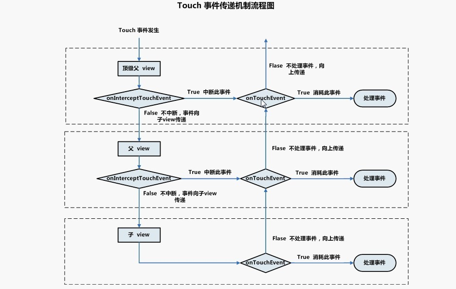

## Android基础

[TOC]

[参考1](https://www.jianshu.com/p/7bb56481063d)

### 四大组件

#### 1. 生命周期

##### 1. Activity声明周期？

- 生命周期

  **normal:**onCreate->onStart()->onResume->onPause()->onStop()->onDestroy();

  **the acitvity comes to the foreground:** onStop()->onRestart()->onStart->...

  **low memory:** onPause()/onStop()->process is killed.

  **AActivity切换到BActivity:**

  AActivity:onCreate()->onStart()->onResume()->onPause();

  BActivity:onCreate()->onStart()->onResume();

  AActivity:onStop();

  返回AAcitvity：

  BActivity:onPause();

  AActivity:onRestart()->onStart()->onResume();

  BActivity:onStop()->onDestory();

  **AActivity切换到BDialog:**

  AActivity:onCreate()->onStart()->onResume()->onPause();

  BDialog:onCreate()->onStart()->onResume();

- onSaveinstanceState()/onRestoreInstanceState()

  outState参数作用： 数据报保存，键值对形式保存在Bundel对象中。

  **onSaveInstanceState调用时机：**

  (1)activity被系统销毁，也可能没有销毁就调用了；

  (2)按下Home键或电源键，Acitvity进入后台；

  (3)启动其他Activity，Activity被压入栈底；

  注意：

  (1)用户主动销毁不会调用，如单击回退键或调用finish();

  (2)调用时间不固定，该方法一定在onStop之前调用，但不确定在onPause之前还是之后；

  **onRestoreInstanceState调用时机：**

  (1)在Activity被系统销毁后，恢复时被调用； bundle对象也通过参数传递到onCreate()方法中。

##### 2. Service生命周期？

> startService()->onCreate()->onStartCommand()->onDestory();
>
> bindService()->onCreate()->onBind()->onUnbind()->onDestroy();


1）启动Service服务
单次：`startService() —> onCreate() —> onStartCommand()`
多次：`startService() —> onCreate() —> onStartCommand() —> onStartCommand()`
2）停止Service服务
`stopService() —> onDestroy()`
3）绑定Service服务
`bindService() —> onCreate() —> onBind()`
4）解绑Service服务
`unbindService() —> onUnbind() —> onDestroy()`
5）启动绑定Service服务
`startService() —> onCreate() —> onStartCommand() —> bindService() —> onBind()`
6）解绑停止Service服务
`unbindService() —> onUnbind() —> stopService() —> onDestroy()`
7）解绑绑定Service服务
`unbindService() —> onUnbind(ture) —> bindService() —> onRebind()`

##### 3.  onResume中可以直接调用getHeight获取高度信息吗(ks)？

​	不可以。调用的时候还未开始测量UI。

```java
 final void handleResumeActivity(IBinder token,
            boolean clearHide, boolean isForward, boolean reallyResume) {
        unscheduleGcIdler();
        mSomeActivitiesChanged = true;
 
        //1. 调用performReusmeActivity，其中会调用activity.onResume()
        ActivityClientRecord r = performResumeActivity(token, clearHide);
 
         ......
        if (r != null) {
            final Activity a = r.activity;
            if (r.window == null && !a.mFinished && willBeVisible) {
                r.window = r.activity.getWindow();
                View decor = r.window.getDecorView();
                decor.setVisibility(View.INVISIBLE);
                ViewManager wm = a.getWindowManager();
                WindowManager.LayoutParams l = r.window.getAttributes();
                a.mDecor = decor;
                l.type = WindowManager.LayoutParams.TYPE_BASE_APPLICATION;
                l.softInputMode |= forwardBit;
                if (a.mVisibleFromClient) {
                    a.mWindowAdded = true;
                    //2. 将decorView添加到window中，这也是View绘制开始的起点
                    wm.addView(decor, l);
                }
        }
}        
```


##### 3. java虚拟机和Dalvik虚拟机和ART区别？

[查看](android/100qaAndroid基础.md)

##### 4. 讲解一下Context？

> Context是一个抽象基类，可以理解为上下文，或环境，是提供一些程序运行的基本信息。

Context有两个子类，ContextWrapper(包装类)和ContextImpl(实现类)。

ContextWrapper有三个直接子类，ContextThemeWrapper(Activity继承)、Service、Application。

Context一共三种类型：Application、Service和Activity，绝大多数情况下是通用的。

Context数量=Activity数量+Service数量+1(Application)

##### 5. 四种LaunchMode及其使用场景？

- standard模式

  默认模式，创建Activity并放入栈中。

- singleTop模式

  如果activity正好在栈顶，就会重用该实例(调用实例onNewIntent())。多次点击或新闻类app。

  使用场景： 跳转按钮多次单击界面重复、

- singleTask模式

  如果存在，清空该实例上面的实例，并调用onNewIntent()方法。场景：主界面、浏览器。

- singleInstance模式

  在一个新栈中创建该Activity的实例，并让多个应用共享该栈中的该Activity实例(新栈中只有它一个实例)。

  如呼叫来电、闹铃提醒。

##### 6. Android动画种类和实现？

- 帧动画

  专门用来一个一个的显示Drawable的resources，像放幻灯片一样。

- 补间动画

  指通过指定View的初始状态、变化时间、方式，通过一系列算法进行图片变换。只要有Alpha、Scale、Translate、Rotate四种效果。

  **注意：只是在视图层实现了动画效果，并没有真正改变View的属性，比如滑动列表，改变标题栏的透明度。**

- 属性动画

##### 7. AsyncTask实现原理？

> AsyncTask的实现原理 = 线程池 + Handler。

由于线程池大小限制问题，适合http请求或耗时较短的任务，大规模的下载或数据库操作会导致线程池阻塞。

缺陷： AsyncTask第一次使用必须在主线程加载(4.1系统之前)；只能在UI线程使用；多次调用报错；代码太多，控制不灵活。

##### 8. 谈谈你对Binder机制的理解？

[参考Android基础](android/100qaAndroid基础.md)

​	Linux传统IPC主要有：管道、消息队列、共享内存和Socket等。消息队列和管道采用存储-转发方式，至少需要两次拷贝过程(用户空间-内核空间)。内存共享控制复杂，难以使用。socket作为一款通用接口，其传输效率低，开销大，主要用于跨网络的低速进程通信。从安全角度考虑，传统IPC无法获取对方进程可靠的UID/PID,且访问接入点是开放的，无法建立私用通道。

​	Bindler通信机制起源于一个简单的想法：**将申请服务的请求和对应的响应信息，写入一个所有进程都能访问的地址空间中。当进程使用这些数据时，只需要访问对应的内存地址，以减少内容复制引入的开销。为此，Bindler机制利用kernel空间作为共享区域，并用binder driver来建立每个进程的内存地址和kernel空间中存储地址的映射。从而使数据只copy一次就可以。同时为发送方添加UID/PID身份，既支持实名也支持匿名Bunder，提高安全性。**

- bindler架构

1. 四大组成部分

   Client进程：使用服务的进程；

   Server进程：提供服务的进程；

   ServiceManager进程：SM的作用是将字符串形式的Binder名字转化成Client中对应Binder的引用，使得client能够通过binder名字获取对应server中binder实体的引用；

   Binder驱动：驱动负责进程之间Binder通信的建立、数据的传递和交互等一系列底层支持。

2. 使用步骤

   **注册服务：**服务端通过SM注册服务，注册过程是向Binder驱动全局链表binder_procs中插入服务的信息。

   **查询服务：**客户端向SM中发起获取服务的请求，SM从服务列表中查找Client需要的对应服务信息，将该服务的代理Binder(BinderProxy)返回给客户端。

   **使用服务：**

   ① Binder驱动为跨进程通信做准备：通过调用mmap()系统函数实现内存映射。在Binder驱动中创建一块接收缓存区。同时将内核缓存区地址和Server端中用户空间一块地址同时都映射到该接收缓存区中。这时候就创建了虚拟区间和映射的关系。

   ② Client进程将数据发送到Server进程。Client进程通过调用copy_from_user()发送数据拷贝到内核中（Binder驱动）的缓存区中，此时Client发起请求的线程会被挂起。由于在①中构建了映射关系，此时相当于也将数据发送到了Server端的用户空间中。之后Binder驱动通知Server端进程执行解包。

   ③ Server进程根据Client进程发送来的数据，调用目标方法。收到Binder驱动通知后，Server进程对数据进行解包，并调用相关方法处理。

   ④ Server进程将目标方法处理结果返回给Client进程。将处理结果放回自己的共享空间（即①中映射的Binder驱动缓存区中）。Binder驱动通知Client进程获取返回结果，此时②中被挂起的线程会被重新唤醒。Client进程通过系统调用copy_to_user(),从内核缓存区拷贝Server进程返回的结果。

   从上面使用服务的过程可以看到，整个过程只拷贝了一次发送的数据和一次接收的数据。而正如开头所述，消息队列和管道这两种IPC拷贝次数为2次。

##### 9. Android中进程通讯方式有哪些？

Intent(Bundle)：四大组件通讯；

AIDL：一对多进程通讯；

Messenger： 基于AIDL，server只有一个线程；

ContentProvider：数据源的增删改查(例如通讯录)；

BroadcastReceiver:广播。

##### 10. View的绘制流程？

参考案例分析

##### 11. 事件传递流程？

[查看](android/100qaAndroid基础.md)

1、Touch事件传递的相关API有dispatchTouchEvent、onTouchEvent、onInterceptTouchEvent；

2、Touch事件相关的类有View、ViewGroup、Activity；

3、Touch事件会被封装成MotionEvent对象，该对象封装了手势按下、移动、松开等动作；

4、Touch事件通常从Activity#dispatchTouchEvent发出，只要没有被消费，会一直往下传递，到最底层的View；

5、如果Touch事件传递到的每个View都不消费事件，那么Touch事件会反向向上传递,最终交由Activity#onTouchEvent处理；

6、onInterceptTouchEvent为ViewGroup特有，可以拦截事件；

7、Down事件到来时，如果一个View没有消费该事件，那么后续的MOVE/UP事件都不会再给它；




##### 12. ANR是什么？如何避免ANR?

ANR:Application Not Responding，即应用无响应

ANR一般有三种类型：

1：KeyDispatchTimeout(5 seconds) –主要类型

按键或触摸事件在特定时间内无响应

2：BroadcastTimeout(10 seconds)

 BroadcastReceiver在特定时间内无法处理完成

3：ServiceTimeout(20 seconds) –小概率类型

​	Service在特定的时间内无法处理完成

超时的原因一般有两种：

(1)当前的事件没有机会得到处理（UI线程正在处理前一个事件没有及时完成或者looper被某种原因阻塞住）

(2)当前的事件正在处理，但没有及时完成

​	UI线程尽量只做跟UI相关的工作，耗时的工作（数据库操作，I/O，连接网络或者其他可能阻碍UI线程的操作）放入单独的线程处理，尽量用Handler来处理UI thread和thread之间的交互。

UI线程主要包括如下：

Activity:onCreate(), onResume(), onDestroy(), onKeyDown(), onClick()

AsyncTask: onPreExecute(), onProgressUpdate(), onPostExecute(), onCancel()

Mainthread handler: handleMessage(), post(runnable r) other

##### 13. 内存泄漏及优化？

- 内存泄漏和内存溢出区别？

  内存溢出OOM:当程序申请内存时，没有足够内存供其使用。比如integer类型中放long，就会内存溢出。

  内存泄漏：对象无法被回收。检查工具：leakCanary。

- 内存泄漏原因：

  (1)Handler引起的内存泄漏(解决：静态内部类+弱引用)；

  (2)单例模式引起的内存泄漏(解决：用全局ApplicationContext代替ActivityContext)；

  (3)非静态内部类或匿名类引起的内存泄漏(解决：修改为静态内部类)；

  (4)注册/反注册未成对使用；(广播，eventbus等)；

  (5)资源对象没有关闭(close(),recycler())；

  (6)集合对象没有及时清理。

##### 14. webview和js交互的三种调用方式？

- 1 Android原生交互方式

  ```java
  //1. JS调用native方法(4.2之后使用，不然存在安全漏洞)
  mWebView.addJavascriptInterface(new JsInterface(), "android"); // "android"是js那边调用Java方法时的一个“句柄”或者引用，跟h5约定好，可以写成别的。android.openUrlByBrowser()
  public class JsInterface {
          @JavascriptInterface
          public void backpage() {　　// 无返回值，无参
              finish();
          }
  
          @JavascriptInterface
          public void openUrlByBrowser(String url) {　　// 无返回值，有参
              openBrowser(url);
          }
  
          @JavascriptInterface
          public boolean haszhifubao() {　　// 有返回值
              return AppPackageChecked.isExist(WebShowActivity.this, "com.eg.android.AlipayGphone");
          }
      }
  
  //2. native调用js方法
  mWebView.loadUrl("javascript:pauseVideo()");　　// pauseVideo()是H5那边定义好的
  // android 4.4以上 才能使用
  buttonLeft.setOnClickListener(new View.OnClickListener() {
              @Override
              public void onClick(View view) {
                  webView.post(new Runnable() {
                      @Override
                      public void run() {
                          webView.evaluateJavascript("javascript:callJS()", new ValueCallback<String>() {
                              @Override
                              public void onReceiveValue(String s) {
                                  //将button显示的文字改成JS返回的字符串
                                  buttonLeft.setText(s);
                              }
                          });
                      }
                  });
              }
          });
  ```

  

- 2 拦截URL跳转方式方式

  通过 WebViewClient 的shouldOverrideUrlLoading ()方法回调拦截 url 。

- 3 拦截Prompt提示框方法  

  通过 WebChromeClient 的onJsAlert()、onJsConfirm()、onJsPrompt（）方法回调拦截JS对话框alert()、confirm()、prompt（） 消息。

##### 15. Launcher原理？

[查看](android/100qaAndroid基础.md)

Launcher进程、system_server进程、Zygote进程、App进程。

##### 16. Window、Activity、DecorView、ViewRoot区别？

...案例分析

Activity(attach)->PhoneWindow(包含)->DecorView对象->addView。

##### 17. performTraversals 执行至少2次问题？

造成这个现象的根本原因是performTranversal函数在View的测量流程中会执行2次(与Surface是否存在有关)。

- 视图容器的ViewGroup宽高不是match_parent或具体数值时，都会对子view进行两次measure，layout.

  大家应该都知道，有些`ViewGroup`可能会让自己的子视图测量两次。比如说，父视图先让每个子视图自己测量，使用`View.MeasureSpec.UNSPECIFIED`，然后在根据每个子视图希望得到的大小不超过父视图的一些限制，就让子视图得到自己希望的大小，否则就用其他尺寸来重新测量子视图。这一类的视图有`FrameLayout`,`RelativeLayout`等。

- View初始化时的三次measure,两次layout却只一次draw吗？

  两次measure效率太低，android底层做了优化。

  ```java
  public final void measure(int widthMeasureSpec, int heightMeasureSpec) {
    ......
    // 当FLAG_FORCE_LAYOUT位为１时，就是当前视图请求一次布局操作
    //或者当前当前widthSpec和heightSpec不等于上次调用时传入的参数的时候
    //才进行从新绘制。
      if (forceLayout || !matchingSize &&
              (widthMeasureSpec != mOldWidthMeasureSpec ||
                      heightMeasureSpec != mOldHeightMeasureSpec)) {
              ......
              onMeasure(widthMeasureSpec, heightMeasureSpec);
              ......
      }
      ......
  }
  ```

  

##### 18. Listview recycleView 区别？

- 封装了对viewholder的回收复用；
- 可以同时实现线性布局、网格布局、瀑布流布局，完美替代Listview+GirdeView，更容易组合设计出自己的滑动布局；
- 自带了itemAnimation，可以设置加载和移除时的动画。

##### 19. RelativeLayout、LinearLayout性能区别？

> 影响布局性能有两个因素，1. 层级深度 2. 选择RL或LL。
>
> 重要性： 1 > 2。

相同的层级深度下，两个布局的性能差别在measure，RL>LL。

**原因：**RL内的子View会进行两次onMeasure，分别是横向和纵向的； LL分两种情况，如果没有weight，就只关心orientation，子view测量一次，如果有weight，子view测量两次；分别是先orientation，再是weight。

**例子：**相同的布局，一个RelativeLayout可以完成，但是要使用多个LinearLayout，肯定使用Relativelayout的，尽管会子view会测量两次，但是也比使用多个LinearLayout性能好多了。

##### 20. convertView和ViewHolder的理解？

RecycleBin机制。

- convertView 是作为缓存的view，通过使用这个缓存减少inflater加载组件这一步；

- viewHolder中持有的组件和convertView中的组件指向同一对象，所有这里使用viewholder就是替换掉findViewById,防止多次调用。

  ```java
  @Override
  public View getView(finalint position, View convertView, ViewGroup parent) {
    ViewHolder holder;
    //观察convertView随ListView滚动情况             
    Log.v("MyListViewBase", "getView " + position + " " + convertView);
    if (convertView == null) {
      convertView = mInflater.inflate(R.layout.item,null);
      holder = new ViewHolder();
      /**得到各个控件的对象*/                     
      holder.title = (TextView) convertView.findViewById(R.id.ItemTitle);
      holder.text = (TextView) convertView.findViewById(R.id.ItemText);
      holder.bt = (Button) convertView.findViewById(R.id.ItemButton);
      convertView.setTag(holder);//绑定ViewHolder对象                    
    }
    else{
      holder = (ViewHolder)convertView.getTag();//取出ViewHolder对象                   
    }
    /**设置TextView显示的内容，即我们存放在动态数组中的数据*/             
    holder.title.setText(getDate().get(position).get("ItemTitle").toString());
    holder.text.setText(getDate().get(position).get("ItemText").toString());
  
    return convertView;
  }
  ```

##### 21. 硬件加速原理？

对于App开发者，简单了解硬件加速原理及上层API实现，开发时就可以充分利用硬件加速提高页面的性能。以Android举例，实现一个圆角矩形按钮通常有两种方案：使用PNG图片；使用代码（XML/Java）实现。简单对比两种方案如下。

| 方案          | 原理                                     | 特点                                              |
| ------------- | ---------------------------------------- | ------------------------------------------------- |
| 使用PNG图片   | 解码png生成bitmap，传递到底层，由GPU渲染 | 图片解码消耗CPU运算资源，Bitmap占用内存大，绘制慢 |
| 使用xml或java | 直接将Shape信息传递到底层，有GPU渲染     | 消耗cpu资源少，占用内存小，绘制块                 |

- CPU更擅长复杂逻辑控制，而GPU得益于大量ALU和并行结构设计，更擅长数学运算。

- 页面由各种基础元素（DisplayList）构成，渲染时需要进行大量浮点运算。

- 硬件加速条件下，CPU用于控制复杂绘制逻辑、构建或更新DisplayList；GPU用于完成图形计算、渲染DisplayList。

- 硬件加速条件下，刷新界面尤其是播放动画时，CPU只重建或更新必要的DisplayList，进一步提高渲染效率。

实现同样效果，应尽量使用更简单的DisplayList，从而达到更好的性能（Shape代替Bitmap等）。

### 1. 基础机制

#### 1. Binder机制

​	binder是什么？来自哪里？

​	传统IPC机制方式和缺点？binder原理和优势？	

#### 2. Launcher启动过程

​	什么是Launcher？启动过程？

​	包含：linux三大进程；AMS、PMS；`<category android:name="android.intent.category.Home">`属性。

### 2. 线程

#### 1.  为什么Android中要设计成只能在UI线程更新UI呢？

​	根本原因：为了达到流畅的用户体验，在16ms内完成一帧的绘制(刷新频率60HZ)。

​	单线程访问好处：

	1. 多线程设计复杂，并发问题难处理(加锁和同时更新UI不可控)，更新性能很难达到；

   	2. 单线程架构设计简单，提高界面更新性能问题；
   	3. Android的UI控件不是**线程安全**的，如果在多线程中并发访问可能会导致UI控件处于不可预期的状态。

#### 2. 主线程和UI线程区别？

​	ActivityThread的main函数是app的入口方法，也叫主线程；

​	UI线程是View绘制和刷新所在的线程，即ViewRootImpl创建算在的线程。

​	通常情况下，我们一般认为Main Thread就是UIThread。更确切的说，UIThread是**创建View所在的线程**，否则会报错`Only the original thread that created a view hierarchy can touch its views.`

#### 3. 非UI线程真的不能刷新UI吗？

​	答：不一定，之所以子线程不能更新界面，是因为Android在线程的方法里面采用checkThread进行判断是否是主线程，而这个方法是在ViewRootImpl中的，这个类是在onResume里面才生成的，因此，如果这个时候子线程在onCreate方法里面生成更新UI，而且没有做阻塞，就是耗时多的操作，还是可以更新UI的。

#### 4. SurfaceView为什么可以在子线程绘制呢？

​	窗口中的view共享一个window，window又对应一个Surface，所以窗口中的view共享一个Surface。他的绘制操作，最终都会调用到ViewRootImpl，那么这个就会被检查是否主线程了，所以只要在ViewRootImpl启动后，访问UI的所有操作都不可以在子线程中进行。

​	而SurfaceView本身就自带一个Surface，使用双缓存机制，与主线程和Window窗口是分离的，容易实现子线程访问(一般出现在游戏或被动更新功能中)。

### 3. Handler

#### 1. 谈谈Handler机制？

1. 作用

   跨线程通信，因为子线程不能操作UI。

2. 组成

   Message(消息)、MessageQueue(消息队列)、Handler(消息处理器)、Looper(消息池)。

   组成比例(1个线程)：Thread(1):Looper(1):MessageQueue(1):Handler(N)。

3. 流程

   ​	主线程创建的时候会创建一个Looper，同时在Looper内部创建一个消息队列。而创建Handler的时候会取出当前线程的Looper和消息队列，然后Handler在子线程通过**MessageQueue.equeueMessage**在消息队列中添加一条Message；

   ​	通过**Looper.looper()**开启的消息循环会不断调用**MessageQueue.next()**，无消息时会阻塞。取得对应的Message并且通过**Handler.dispatchMessage**传递给Handler，最终调用Handler.handlerMessage处理消息。

#### 2. Hander引起的内存泄漏如何处理？

1. 泄漏原因

   **非静态内部类默认持有外部类的引用。**

   当用户关闭activity时，Hander持有activity的引用，导致activity泄漏。

2. 解决方法

   将Handler定义为静态内部类，在内部类持有Activity的弱引用，并在onDestory中调用**handler.removeMessages**。

#### 3. Looper死循环为什么不会导致ANR?

​	ANR发生条件：消息没有及时处理、消息处理事件过长。

​	而阻塞是没有消息时发生的，不符合ANR条件。**主线程就任务就是处理各种消息，没有消息就会阻塞等待。**

#### 4. Message如何存储？

​	按时间顺序的单链表结构存储，最近时间在链表头。其他时间Message会遍历插入链表对应位置。

#### 5. 子线程如何使用Hander?

```java
 Thread(Runnable {
            Looper.prepare() // 1. 创建looper和消息队里(绑定当前线程)
            val handler = object :Handler(){  //2. handler
                override fun handleMessage(msg: Message) {
                    super.handleMessage(msg)
                }
            }
            Looper.loop() // 3. 循环处理消息
            //4. 上面阻塞了，永远不会执行到这里。  
        }).start()
```

#### 6. Message如何创建效果好？

1. 直接生成 `Message m = new Message()`;

2. 通过`Message m = Message.obtain()`;

3. 通过`Message m = mHander.obtainMessage()`，内部调用2方法;

   后两者效果更好，因为Android默认的消息池中消息数量是50(对象池，链表实现)，而后两者是直接在消息池中取出一个Message实例，这样做就可以避免多生成Message实例。

#### 7. HandlerThread干嘛用的？

​	是google提供的一个带looper的线程，方便与线程通信(UI消息的简单实现)。

```java
public class HandlerThread extends Thread {
	@Override
    public void run() {
        mTid = Process.myTid();
        Looper.prepare();
        synchronized (this) {
            mLooper = Looper.myLooper();
            notifyAll();
        }
        Process.setThreadPriority(mPriority);
        onLooperPrepared();
        Looper.loop();
        mTid = -1;
    }
}
// 外界调用
Handler mThreadHandler = new Handler(handlerThread.loop); // 传入loop
```

#### 8. 消息阻塞的深层机制？

> IO事件：输入输出(input/output)的对象可以是文件(file)， 网络(socket)，进程之间的管道(pipe)。在linux系统中，都用文件描述符(fd)来表示。

​	epoll机制：epoll是Linux内核为处理大批量[文件描述符](https://baike.baidu.com/item/文件描述符/9809582)而作了改进的poll，是Linux下多路复用IO接口select/poll的增强版本，它能显著提高程序在大量[并发连接](https://baike.baidu.com/item/并发连接/3763280)中只有少量活跃的情况下的系统CPU利用率。

- `select` 和 `poll` 监听文件描述符list，进行一个线性的查找 O(n)

- `epoll`: 使用了内核文件级别的回调机制O(1)

  epoll高效的本质在于：

  减少了用户态和内核态的文件句柄拷贝

  减少了对可读可写文件句柄的遍历

  mmap 加速了内核与用户空间的信息传递，epoll是通过内核与用户mmap同一块内存，避免了无谓的内存拷贝

  IO性能不会随着监听的文件描述的数量增长而下降

  使用红黑树存储fd，以及对应的回调函数，其插入，查找，删除的性能不错，相比于hash，不必预先分配很多的空间

  #### 9. Native Looper?

  1. 目的

     Native Loope主要配合Java looper 实现线程通信机制。

  2. 实现

     ​	整个的结构很简单，JAVA Looper包含一个MessageQueue，MessageQueue对应的Native 实例是一个NativeMessageQueue实例，NativeMessageQueue在创建的时候生成一个Native Looper。  **其实Native Looper存在的意义就是作为JAVA Looper机制的开关器。**

     ```java
     public final class MessageQueue {
     	 private long mPtr; // 本地消息队列指针
     	 private native static long nativeInit();
        private native static void nativeDestroy(long ptr);
        private native void nativePollOnce(long ptr, int timeoutMillis); // 是否block 
        private native static void nativeWake(long ptr); // 唤醒本地线程
        private native static boolean nativeIsPolling(long ptr);
        private native static void nativeSetFileDescriptorEvents(long ptr, int fd, int events);
     }  
     // C++
     NativeMessageQueue::NativeMessageQueue() {  
         mLooper = Looper::getForThread();  
         if (mLooper == NULL) {  
             mLooper = new Looper(false);  
             Looper::setForThread(mLooper);  
         }  
     }  
     ```

     两种情况：

     ​	当添加Message时，会唤醒本地线程，调用nativewake函数；

     ​	当消息队列为空时，调用nativePollOnce阻塞本地线程。

  3. 。。


### 4. View

#### 1. Activity、Window、View关系？


### 5. 性能优化


### 6. 架构

#### 1. 说说你对软件架构的理解？

 1. 软件架构的本质、设计三原则；

 2. 架构设计思想和方法(solid/分离关注点/依赖注入/面向切面)；

 3. android架构的发展。

    [参考](https://zhuanlan.zhihu.com/p/66535377)

### 7. 开源

#### 1. Glide


#### 2. Retrofit

1. 如何与UI线程通信的？

   ```java
   static class Android extends Platform {
       @Override public Executor defaultCallbackExecutor() {
         return new MainThreadExecutor();
   }
   @Override CallAdapter.Factory defaultCallAdapterFactory(Executor callbackExecutor) {
     return new ExecutorCallAdapterFactory(callbackExecutor);
   } 
   static class MainThreadExecutor implements Executor {
     //!!! 通过建立绑定UI线程Looper的Hander实现。
     private final Handler handler = new Handler(Looper.getMainLooper());
     @Override public void execute(Runnable r) {
       handler.post(r);
     }
   }
   ```

2. ...


- 引用

[参考1](https://github.com/yangchong211/YCBlogs)

[参考2](https://juejin.im/post/5c81db916fb9a049d37fe6a1)

[参考3](https://github.com/gatieme/CodingInterviews)

