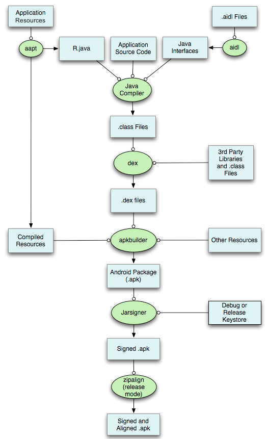

# Android 高级

[TOC]

## 一、设计题

#### 1. 从一个有100w个手机号的文件中，从头匹配手机号搜索设计(1、13、135对应的手机号)？

1. 100W个手机号加载到内存，大约占10M空间，存储为数组结构；

2. 遍历数组，首位数字为0的存在一个Map中，key为”0“，value为”对应的数组下标“，然后是首位为1到9的同样处理；以此类推，处理第2-11位手机号，共生成10*11=110个Map；

3. 用户输入首位为1，则查找首位对应key为1的Map，得到首位为1的下标数组；用户继续输入3，则查找第二位为3的Map，得到第二位为3的下标数组；找到两个数组的交集，结果为13开头的手机号下标数组。依次查找后序手机号即可。

   空间复杂度为10M，时间复杂度 每位查找基本上递减1/10；


## 二、高级题

### 1. Gradle构建流程

```java
1.clean  清理工程  删除build文件夹
// ************** Configuration on demand is an incubating feature  *******
2、preBuild          每个module 都会执行preBuild   准备配置文件
3、preReleaseBuild   准备release configuration    在 preBuild 之后执行 会依赖preBuild
4、checkReleaseManifest 检查 release下的manifest 在 preReleaseBuild 之后执行 依赖preReleaseBuild 
5、preDebugAndroidTestBuild          准备debug下的Test   在preBuild后执行 依赖preBuild
6、preDebugBuild                 准备 debug configuration  在preBuild后执行 依赖preBuild
7、preDebugUnitTestBuild             准备 debug下的单元测试构建  在preBuild后执行 依赖preBuild
8、preReleaseUnitTestBuild           准备 release下的单元测试构建  在preBuild后执行 依赖preBuild
   // ***************** 以上  build 文件夹不存在 ***********************************
   //  ****************  接下来是对依赖的包 进行下载 *********************在build/incremental/exploded-aar下
9、prepareComAndroidSupportSupportV42311Library       生成 Android SupportV4.23.1库支持 在build/incremental/exploded-aar下
10、prepareComNdAndroidSmartcanCommonsUtilAar1205SmartcanReleaseLibrary   生成 smartcan.commons.util-aar.1.2.0.5.smartcan.release
11、prepareComNdAndroidSmartcanDatalayerAar1205SmartcanReleaseLibrary        生成 smartcan.commons.datalayer-aar.1.2.0.5.smartcan.release
12、prepareComNdAndroidSmartcanDatatransferAar1205SmartcanReleaseLibrary     生成 smartcan.commons.datatransfer-aar.1.2.0.5.smartcan.release
13、prepareComNdAndroidSmartcanFrameworkAar1205SmartcanReleaseLibrary        生成 smartcan.commons.framnework-aar.1.2.0.5.smartcan.release
14、prepareComNdAndroidSmartcanNetworkAar1205SmartcanReleaseLibrary          生成 smartcan.commons.network-aar.1.2.0.5.smartcan.release
15、prepareComNdAndroidSmartcanSmartcanCoreAar1205SmartcanReleaseLibrary 生成 smartcan.commons.smartcan.core-aar.1.2.0.5.smartcan.release
16、prepareComNdAndroidSmartcanSmartcanDatacollectionAar1205SmartcanReleaseLibrary  生成 smartcan.commons.datacollection-aar.1.2.0.5.smartcan.release
17、prepareComNdSdpAndroidProcesscheck108Library                         生成  android.process.check.1.0.8 
18、prepareReleaseDependencies        加载 远端的依赖   加载 所有的需要从远端下载的依赖   
19、compileReleaseAidl               编译release环境下的 AIDL文件   依赖prepareDebugDependencies   在build/incremental/aidl/release下
20、compileReleaseRenderscript       编译 release环境下的渲染脚本， Renderscript用来进行高性能计算，是一种类C脚本语言 依赖prepareDebugDependencies  在build/incremental/rs/release下
21、generateReleaseBuildConfig   会生成 releasse下的 资源和源码 包括BuildConfig  在build/generate/source/buildConfig/release  依赖checkReleaseManifest
22、generateReleaseAssets            生成 release下的 Assets文件       但没有完全生成个  算是准备
23、mergeReleaseAssets               生成 debug下的Assets文件 在 build/intermediates/assets/release下,  和 merge.xml文件 在build/intermediates/incremental/mergeAssets/release下   依赖ReleaseDependencies 
24、generateReleaseResValues     准备resource的 values文件  
25、generateReleaseResources     准备 资源文件 
26、mergeReleaseResources             release下的 生成Resource文件 在build/incremental/res/release下 和 merge.xml 在build/intermediates/incremental/mergeResources/release下
27、processReleaseManifest           依赖prepareReleaseDependencies  生成 AndroidManifest文件 在build/incremental/manifest/full/release
28、processReleaseResources          生成resources-release.ap_    在 build/intermediates/resources下
29、generateReleaseSources           生成R文件  在build/generate/source/r/debug下 
30、processReleaseJavaRes            
31、compileReleaseJavaWithJavac      使用Javac编译Java代码
32、proguardRelease                  生成 混淆文件 运行混淆规则
33、androidJavadocsPicked
34、copyMappingTask                  复制 mapping文件  
35、androidJavadocsJar               生成 Javadocs的Jar文件
36、androidSourcesJar                生成 Java源码的 Jar文件
37、compileLint                      静态代码检查
38、copyDebugLint                    
39、checkDebugManifest               检查 release下的manifest 在 preDebugBuild 之后执行 依赖preDebugBuild 
40、prepareDebugDependencies     debug下  加载 远端的依赖   加载 所有的需要从远端下载的依赖
41、compileDebugAidl             编译debug环境下的 AIDL文件   依赖prepareDebugDependencies   在build/incremental/aidl/debug下
42、compileDebugRenderscript     编译 debug环境下的渲染脚本   依赖prepareDebugDependencies  在build/incremental/rs/debug下
43、generateDebugBuildConfig     会生成 debug下的 资源和源码 包括BuildConfig  在build/generate/source/buildConfig/debug  依赖checkDebugManifest
44、generateDebugAssets              准备 debug下的 Assets文件  
45、mergeDebugAssets             生成 debug下的Assets文件 在 build/intermediates/assets/debug下,  和 merge.xml文件 在build/intermediates/incremental/mergeAssets/debug下   依赖ReleaseDependencies  
46、generateDebugResValues           准备resource的 values文件  件
47、generateDebugResources           准备 资源文件
48、mergeDebugResources              生成资源文件 在generateDebugResources后执行  在build/incremental/res/debug下  和 merge.xml在build/intermediates/incremental/mergeResources/debug下
49、processDebugManifest         依赖prepareReleaseDependencies  生成 AndroidManifest文件 在build/incremental/manifest/full/release
50、processDebugResources            生成resources-debug.ap_    在 build/intermediates/resources下
51、generateDebugSources         生成R文件  在build/generate/source/r/debug下
52、processDebugJavaRes              生成Java资源文件 
53、compileDebugJavaWithJavac            使用Javac编译Java代码
54、extractDebugAnnotations              
55、mergeDebugProguardFiles       生成混淆文件
56、compileDebugNdk              编译NDK
57、packageDebugJniLibs              打包本地依赖包
58、packageDebugRenderscript    打包渲染脚本
59、packageDebugResources        debug  打包资源文件
60、proguardDebug                混淆
61、bundleDebug
62、compileDebugSources          编译java源码
63、assembleDebug                编译创建Jar包
64、copyReleaseLint
65、extractReleaseAnnotations
66、mergeReleaseProguardFiles        生成混淆文件 在buil/outputs/
67、compileReleaseNdk
68、packageReleaseJniLibs
69、packageReleaseRenderscript
70、packageReleaseResources
80、bundleRelease
81、compileReleaseSources        编译
82、assembleRelease              编译创建Jar包
83、assemble     包含了项目中的所有打包相关的任务，比如java项目中打的jar包，Android项目中打的apk
84、lint         android静态代码检查
85、prepareDebugUnitTestDependencies    加载单元测试以来的远程包
85、processDebugUnitTestJavaRes          生成单元测试
86、compileDebugUnitTestJavaWithJavac        使用Javac编译Java单元测试代码
87、compileDebugUnitTestSources              编译单元测试 源码
88、mockableAndroidJar
89、assembleDebugUnitTest                    编译打包
90、testDebugUnitTestPicked                  测试UT
91、prepareReleaseUnitTestDependencies       加载 UT的依赖
92、processReleaseUnitTestJavaRes            加载UT需要的资源文件
93、compileReleaseUnitTestJavaWithJavac      使用Javac编译Java单元测试代码
94、compileReleaseUnitTestSources            编译单元测试 源码
95、assembleReleaseUnitTest                  编译打包
96、testReleaseUnitTestPicked                测试UT
97、test         包含了所有的测试任务
98、check       包含了项目中所有验证相关的任务
99、:build       包含所有的 build任务
100、uploadArchivesUploading:  上传
```

### 2. Android打包流程

- 利用aapt打包资源文件，生成R.java和resources.ap_文件(包括assert、res/raw、清单文件、res目录)。将所有资源与编译生成的resource.arsc文件以及"加密"过的AndroidManifest.xml打包压缩成resources.ap_文件；

- 处理AIDL文件，生成相应的.java文件；

- 编译工程源代码，生成相应的class文件。处理文件包括src、R.java、AIDL生成的java文件、库jar文件，调用javac编译生成；

- 转换所有的class文件，生成class。dex文件。使用dx工具将字节码文件转换为dalvik字节码。

- 打包生成apk，利用apkbuilder工具；

- 对apk进行签名；

- 对签名后的apk进行对齐处理(zipalign)。

  这一步需要使用的工具为zipalign，它的主要工作是将apk包进行对齐处理，使apk包中的所有资源文件距离文件起始偏移为4字节的整数倍，这样通过内存映射访问apk时的速度会更快，验证apk文件是否对齐过的工作由ZipAlign.cpp文件的 `verify()`函数完成，处理对齐的工作则由`process()`函数完成。



### 3. APK安装流程

- APK安装涉及目录

  1. system/app：系统自带的应用程序，需要root权限才能删除；
  2. data/app：用户程序安装目录，安装时会把apk复制到此目录下；
  3. data/data/：存放应用程序的数据；
  4. data/dalvik-cache：将apk中的dex文件安装到该目录下。

- 流程

  （1）拷贝apk到指定的目录：默认情况下，用户安装的apk首先会拷贝到/data/app下，用户有访问/data/app目录的权限，但系统出厂的apk文件会被放到/system分区下，包括/system/app，/system/vendor/app，以及/system/priv-app等，该分区需要root权限的用户才能访问。
  （2）加载apk、拷贝文件、创建应用的数据目录：为了加快APP的启动速度，apk在安装的时候，会首先将APP的可执行文件（dex）拷贝到/data/dalvik-cache目录下，缓存起来。再在/data/data/目录下创建应用程序的数据目录（以应用包名命令），用来存放应用的数据库、xml文件、cache、二进制的so动态库等。
  （3）解析apk的AndroidManifest.xml文件：在安装apk的过程中，会解析apk的AndroidManifest.xml文件，将apk的权限、应用包名、apk的安装位置、版本、userID等重要信息保存在/data/system/packages.xml文件中。这些操作都是在**PackageManagerService**中完成
  的。
  （4）显示icon图标：应用程序经过PMS中的逻辑处理后，相当于已经注册好了，如果想要在Android桌面上看到icon图标，则需要Launcher将系统中已经安装的程序展现在桌面上。


### 4. Glide 图片缓存设计？图片滚出屏幕后怎么处理的？

- 缓存设计

  1. 活动缓存(弱引用)；

     存储正在显示的图片，图片移除屏幕或关闭当前界面图片都会保存到内存缓存。

     对资源添加了引用计数器，当屏幕中都不引用资源时，移除到内存缓存。

  2. 内存缓存(有最大Size、强引用LruCache&LinkedHashMap);

  3. 资源缓存(解码后的图片、LruCache)；

  4. 原始缓存(LruCache)；

- ListView图片滚出屏幕处理？

  活动缓存只会存储当前界面上对应item上的图片，item移除屏幕，当ImageView复用时，会先清空它对应的活动缓存的值(移动到内存缓存)，然后再加载新图片到活动缓存(活动缓存会一直保存6个item对应的资源)。

### 5. ListView、RecycleView 区别？

- 都用适配器设计模式

  解耦View和数据源，为View提供统一数据读取方法。

- RecycleView 代码设计更精细化、功能化

  ```java
  LayoutManager  // 负责Item视图布局显示管理(支持多种布局显示)
  ItemDecoration // 添加分割线
  RecyclerView.Adapter
  BadgeGateUsersAdapter.ViewHolder
  RecyclerView.Recycler // 负责管理缓存  
  ```

- 缓存设计区别(**ListView 二级缓存、RecyclerView四级缓存**)

  **缓存级别设计区别：**

  1. scrap:      对应listView的一级缓存(屏幕内显示的)

  2. cached:   对应listView的二级缓存(移除屏幕的)

     linearlayoutmanager来说cached缓存默认大小为2，起到的作用就是rv滑动时刚被移出屏幕的viewholer的收容所。

  3. extension:    三级缓存

     第三级缓存，这是一个自定义的缓存，没错rv是可以自定义缓存行为的

  目前来说这还只是个空实现而已，从这点来看其实rv所说的四级缓存本质上还只是三级缓存。

  pool：    四级缓存

   pool一般会和cached配合使用，这么来说，cached存不下的会被保存到pool中毕竟cached默认容量大小只有2，但是pool容量       也是有限的当保存满之后再有viewholder到来的话就只能会无情抛弃掉，它也有一个默认的容量大小5.

  **其他区别：**

  1. ListView缓存的是View，而RV存储的是ViewHolder；
  2. cached如果命中，可以直接复用，无需createVew和bindView(item划出立即划入场景，listview不能立即使用)；
  3. RecycleViewPool可以共用多个相同Adapter的ViewHolder，避免重复销毁和创建(场景：ViewPager+多个RV等)。

- RV支持局部刷新

  ```java
  // rv实现
  mRvAdapter.notifyItemChanged(1);
  // listView实现局部刷新(调用getView方法)
  //我们通过ListView的getChildAt()来获得需要更新的View，然后通过getTag()获得ViewHolder，从而实现更新。
  /**
       * 更新对应view的内容
       * @param name
       * @param position
       */
      private void updateName(String name, int position) {
          int firstVisiblePosition = listview.getFirstVisiblePosition();
          int lastVisiblePosition = listview.getLastVisiblePosition();
          //在看见范围内才更新进度条
          if (position >= firstVisiblePosition && position <= lastVisiblePosition) {
              //获取指定位置view对象!!!
              View view = listview.getChildAt(position - firstVisiblePosition);
              if (view.getTag() instanceof TestListViewAdapter.ViewHolder) {
                  //获取指定view对应的ViewHolder!!!
                  TestListViewAdapter.ViewHolder viewHolder = (TestListViewAdapter.ViewHolder) view.getTag();
                  viewHolder.name.setText(name);
              }
          }
      }
  ```

- 数据源改变时处理区别

  ListView和RecyclerView最大的区别在于数据源改变时的缓存的处理逻辑，ListView是”一锅端”，将所有的mActiveViews都移入了二级缓存mScrapViews(**都需要重新bindview**)，而RecyclerView则是更加灵活地对每个View修改标志位，**区分是否重新bindView**。

### 6. V1V2V3签名区别？

[参考](https://www.jb51.net/article/174939.htm)