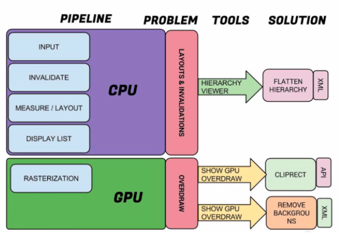

# UI卡顿

[TOC]

## 一、UI渲染机制

- 每16毫秒发出垂直信号，触发对UI进行渲染，渲染过程需要在16ms内完成，否则掉帧(就是卡顿)；

- 16ms需要做的事：

  有了对Android渲染机制基本的认识以后，那么我们的卡顿的原因就在于没有办法在16ms内完成该完成的操作，而主要因素是在于没有必要的layouts、invalidations、Overdraw。渲染的过程是由CPU与GPU协作完成，下面一张图很好的展示出了CPU和GPU的工作，以及潜在的问题，检测的工具和解决方案。

  

### **解决办法：**

- 通过Hierarchy Viewer去检测渲染效率，去除不必要的嵌套；
- 通过Show GPU Overdraw去检测Overdraw，最终可以通过移除不必要的背景以及使用canvas.clipRect解决大多数问题（**clipRect的妙用**）；
- **对自定义view进行优化**；

## 二、线上监控

### 1. 利用UI线程Looper打印的日志!!!

> 自定义Looper的Printer实现，计算每个消息执行时间，大于阈值，打印堆栈信息。

```java
// 获取消息执行时间
public class BlockDetectByPrinter {

    public static void start() {

        Looper.getMainLooper().setMessageLogging(new Printer() {

            private static final String START = ">>>>> Dispatching";
            private static final String END = "<<<<< Finished";

            @Override
            public void println(String x) {
                if (x.startsWith(START)) {
                    LogMonitor.getInstance().startMonitor();
                }
                if (x.startsWith(END)) {
                    LogMonitor.getInstance().removeMonitor();
                }
            }
        });

    }
}
// 打印堆栈
Looper.getMainLooper().getThread().getStackTrace();

// 日志分析
1. 监测生命周期函数(500ms)
 <<<<< Finished to Handler (android.app.ActivityThread$H) {18b87a0} null

2. 监测一帧时间包括动画、输入、绘制(20ms)          }
<<<<< Finished to Handler (android.view.Choreographer$FrameHandler) 

3. 监测UI事件(500ms)
click:<<<<< Finished to Handler (android.view.ViewRootImpl$ViewRootHandler) {c043eb5} android.view.View$PerformClick@2c9289b
longClick:<<<<< Finished to Handler (android.view.ViewRootImpl$ViewRootHandler) {c043eb5} android.view.View$CheckForLongPress@15e1c49

```

### 2. 利用Choreographer


### 3. Dumpsys命令

```shell
> adb shell dumpsys gfxinfo <PACKAGE_NAME>
Stats since: 752958278148ns
    Total frames rendered: 82189
    Janky frames: 35335 (42.99%)  #丢帧率
    90th percentile: 34ms
    95th percentile: 42ms
    99th percentile: 69ms
    Number Missed Vsync: 4706
    Number High input latency: 142
    Number Slow UI thread: 17270
    Number Slow bitmap uploads: 1542
    Number Slow draw: 23342

```


<br/>

- 参考

  [1. dumpsys](https://developer.android.com/training/testing/performance)

  [2.BlockCanary](http://blog.zhaiyifan.cn/2016/01/16/BlockCanaryTransparentPerformanceMonitor/)

  [3BlockCanaryEx](https://github.com/seiginonakama/BlockCanaryEx)

  [4AndroidPerformanceMonitor](https://github.com/markzhai/AndroidPerformanceMonitor/blob/master/README_CN.md)

