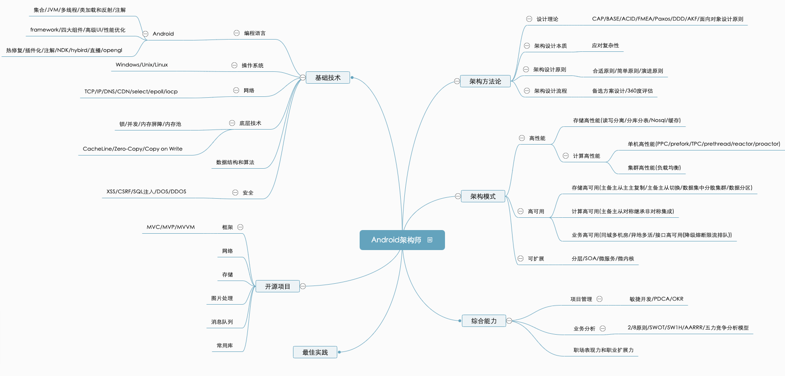

### Android知识图谱

1. 怎样理解面向对象和面向过程？

   **编程语言发展**

   机器语言->汇编语言->高级语言

   面对日益复杂的软件系统，开发过程逐渐简单化。  

   **最根本的不同是思维方式的不同**

   面向过程：一切以过程为中心，分析解决问题的步骤，依次用函数实现；

   面向对象：先思考解决问题包含哪些概念，我们要设计哪些类来表示这些概念，这些类有哪些属性，提供哪些接口方法，设计什么样的继承体系。然后用这些类像搭积木一样把程序搭出来。

   **Demo: 把大象放进冰箱**

2. 说说你对面向对象设计原则SOLID的理解?

  | SRP  | [The Single Responsibility Principle](https://www.cnblogs.com/OceanEyes/p/overview-of-solid-principles.html) | 单一责任原则 |
  | :--- | :----------------------------------------------------------- | :----------- |
  | OCP  | The Open Closed Principle                                    | 开放封闭原则 |
  | LSP  | The Liskov Substitution Principle                            | 里氏替换原则 |
  | ISP  | The Interface Segregation Principle                          | 接口分离原则 |
  | DIP  | The Dependency Inversion Principle                           | 依赖倒置原则 |

3. 23种设计模式理解和使用？

   参考： [博客](https://www.cnblogs.com/nov5026/p/8250464.html)  、[《Design Patterns》](https://pan.baidu.com/s/1XCJlsDcZr4rKwVLxWHvHkQ) 

4. 目前主流框架及优劣势？涉及的设计思想？最佳实践？

   Mvc/Mvp/Mvvm/Jetpack

5. 常用开源库有哪些及优劣势？运用的设计思想？最佳实践？

   [Retrofit2](retrofit2.html)、[Okhttp3](Okhttp3.html)；

   Eventbus、rxjava2、协程;

   UI： Glide、 SmartRefresh、BaseRecyclerViewAdapterHelper；

6. 屏幕适配问题理解？

   > 将设计图宽度(通常375px)适配到不同屏幕手机上，保证所有元素所占比例与设计图相同。

   - 适配方法：

   传统dp直接适配、宽高限定符适配、UI框架适配、今日头条适配(修改屏幕密度)、smallestWidth适配(推荐)。

   - 注意事项：

     使用相对布局（RelativeLayout），禁用绝对布局（AbsoluteLayout）;

     使用"wrap_content"、"match_parent"和"weight“来控制视图组件的宽度和高度；

   参考： [UI适配方案1](https://mp.weixin.qq.com/s/X-aL2vb4uEhqnLzU5wjc4Q)、[UI适配方案2](https://blog.csdn.net/helloworld_han/article/details/80249584).

7. Android中跨进程通讯方式

