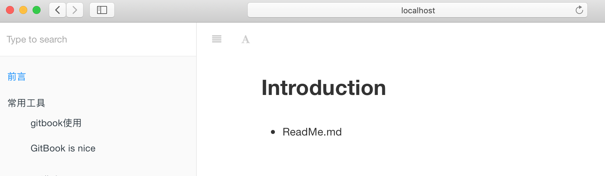

# GitBook使用教程(Mac)

### 简介

- [GitBook 官网](https://www.gitbook.com/)
- [GitBook 文档](https://github.com/GitbookIO/gitbook)

### 使用步骤

#### 安装Node.js

GitBook 是一个基于 Node.js 的命令行工具，下载安装 [Node.js](https://nodejs.org/en)，安装完成之后，你可以使用下面的命令来检验是否安装成功。

```shell
bogon:~ xin$ node -v
v10.16.3
```

#### 安装 GitBook

输入下面的命令来安装 GitBook。

```shell
$ npm install gitbook-cli -g
```

安装完成之后，你可以使用下面的命令来检验是否安装成功。

```shell
bogon:~ xin$ gitbook -V
CLI version: 2.3.2
GitBook version: 3.2.3
```

更多详情请参照 [GitBook 安装文档](https://github.com/GitbookIO/gitbook/blob/master/docs/setup.md) 来安装 GitBook。

#### 安装 GitBook 编辑器

去 [GitBook 官网](https://www.gitbook.com/) 下载 GitBook 编辑器；如果是 Mac 用户且安装过 `brew cask` 的话可以使用 `brew cask install gitbook-editor` 命令行来安装 GitBook 编辑器。

推荐使用[**Typora**](https://www.typora.io/)直接编辑markdown文件。

#### 先睹为快

GitBook 准备工作做好之后，我们进入一个你要写书的目录，输入如下命令。

```shell
$ gitbook init
warn: no summary file in this book
info: create README.md
info: create SUMMARY.md
info: initialization is finished
```

可以看到他会创建 README.md 和 SUMMARY.md 这两个文件，README.md 应该不陌生，就是说明文档，而 SUMMARY.md 其实就是书的章节目录，其默认内容如下所示：

```
# Summary

* [Introduction](README.md)
```

接下来，我们输入 `$ gitbook serve` 命令，然后在浏览器地址栏中输入 `http://localhost:4000` 便可预览书籍。



运行该命令后会在书籍的文件夹中生成一个 `_book` 文件夹, 里面的内容即为生成的 html 文件，我们可以使用下面命令来生成网页而不开启服务器。

```
gitbook build
```

下面我们来详细介绍下 GitBook 目录结构及相关文件。

### 目录结构

GitBook 基本的目录结构如下所示：

```
.
├── book.json   存放配置信息
├── README.md   
├── SUMMARY.md  章节目录
├── chapter-1/
|   ├── README.md
|   └── something.md
└── chapter-2/
    ├── README.md
    └── something.md
```

### 结语

这是我对 GitBook 使用的总结，希望能帮到今后需要的小伙伴。