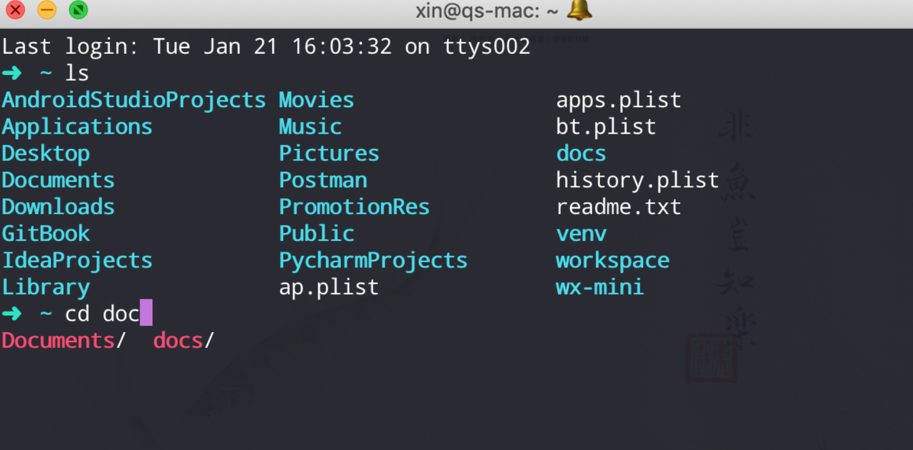

### iTerm2使用



##### iTrem2下载

下载地址 ：[官网](https://www.iterm2.com/)，请下载并安装；

##### 安装On My Zsh

[官网](https://ohmyz.sh/)

`$ sh -c "$(curl -fsSL https://raw.github.com/ohmyzsh/ohmyzsh/master/tools/install.sh)"`

在安装过程中会提示 `Do you want to change your default shell to zsh? [Y/n]`（是否将默认 Shell 切换到 Zsh），按下 `Y` 并回车即可。随后会提示 `Password for xxx`，输入你的用户密码并回车即可。当你看见大大的 `Oh my zsh` 标志时就表示 Oh My Zsh 已经安装成功了。

##### 常用命令

```shell
vim ~/.zshrc     									# 配置文件(可以修改主题等)
ls ~/.oh-my-zsh/themes						# 查看主题
cp /usr/share/vim/vimrc ~/.vimrc	#复制 vim 配置模版
echo 'syntax on' >> ~/.vimrc			# 开启语法高亮
echo 'set nu!' >> ~/.vimrc			  # 开启行号显示

# 乱码问题解决(最后在终端配置里选择Powerline字体)
cd ~/Downloads && git clone https://github.com/powerline/fonts.git	#将 Powerline 字体文件下载到「下载」文件夹中
cd fonts && ./install.sh	#安装所有 Powerline 字体
cd && rm -rf ~/Downloads/fonts	#删除下载的字体文件
```

