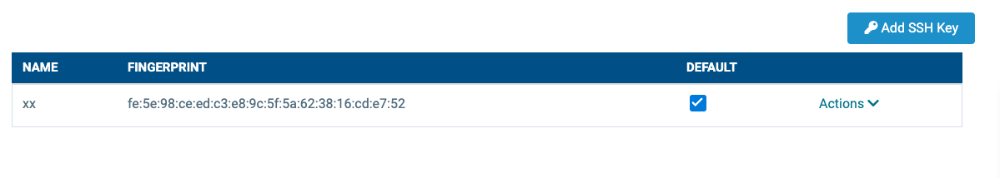
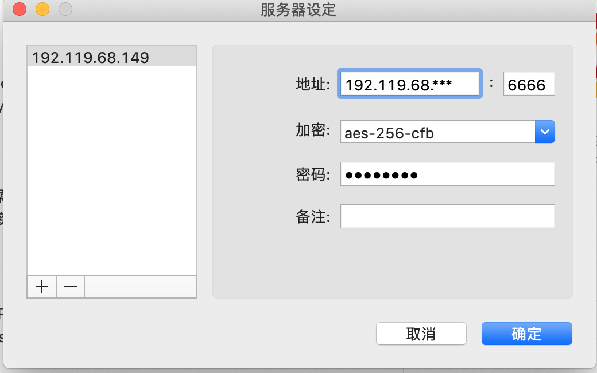

# VPS安装教程

[TOC]

### 1. VPS购买

亲测推荐使用[hostwinds](https://www.hostwinds.com/)，**（因为访问巨慢，改为搬瓦工💥）**,最便宜的一个月4.99刀(配置的时候其他付费选项都不要选，有些是linux工具和自己搭建web服务器用的)。成功结果如图：


### 2. ssh登录

1. 本身生成`id_rsa.pub`文件，通过后台上传ssh内容；

   

2. 登录 `ssh root@104.168.247.234`;

3. 输入root密码。

### 3. 安装shadowsocks服务(centos7.4)

#### 配置epel源，安装python-pip

```shell
wget -O /etc/yum.repos.d/epel.repo http://mirrors.aliyun.com/repo/epel-7.repo
yum install python-pip
pip install --upgrade pip
```

#### 安装shadowsocks

```
pip install shadowsocks
```

#### 创建配置文件

```shell
mkdir /etc/shadowsocks
vi /etc/shadowsocks/shadowsocks.json
```

添加内容

```json
{
    "server":"192.119.68.***",  代理服务器的IP
    "server_port":8099,         端口
    "local_address": "127.0.0.1",
    "local_port":1080,
    "password":"password",      密码
    "timeout":300,
    "method":"aes-256-cfb",
    "fast_open": false,
    "workers": 1
}
```

#### 开启防火墙

`iptables -I INPUT -p tcp --dport 8090 -j ACCEPT`

#### 启动shadowsocks客户端

```shell
ssserver -c /etc/shadowsocks/shadowsocks.json -d start  
ssserver -c /etc/shadowsocks/shadowsocks.json -d stop
```

#### 验证

https://blog.whsir.com/post-2711.html

验证shadowsocks客户端是否正常运行，正常会返回你的代理IP

```shell
telnet 104.168.247.234 8099
curl --socks5 127.0.0.1:1080 http://httpbin.org/ip
curl www.google.com
```

#### Mac使用

安装小飞机客户端，添加服务，如何连接就可以访问gg了。



- 推荐资料

  [CN2 GIA线路](https://www.cnblogs.com/kaishirenshi/p/11757736.html)

  [VPS指南-(推荐搬瓦工)](https://tlanyan.me/vps-merchant-collection/)

  [搬瓦工指南](https://www.banwagong.net/)

  [SS客户端下载](https://tlanyan.me/shadowsock-clients/)

