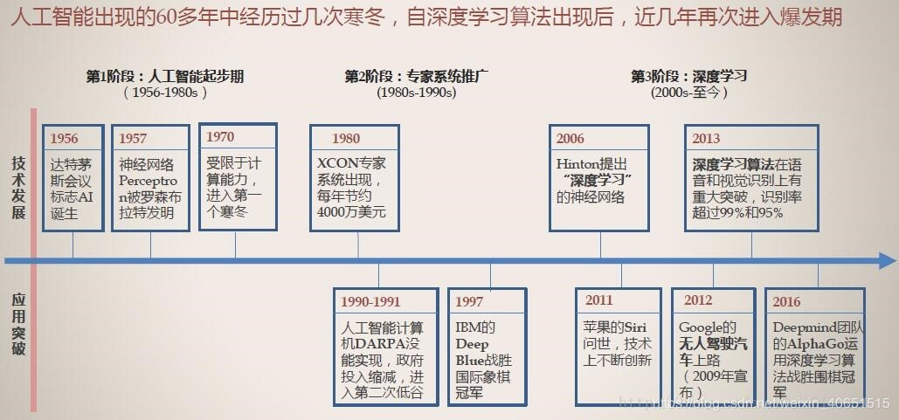

#### AI概述

> 人工智能（Artificial Intelligence），英文缩写为AI。该领域的研究包括机器人、语言识别、图像识别、自然语言处理等。

##### 发展

​	[北京人工智能产业发展白皮书2018](https://www.sciping.com/wp-content/uploads/2018/07/北京人工智能产业发展白皮书.pdf)

- 1950年： Alan Turing发表了“计算机器和智能”，提出了模仿游戏的想法 - 一个考虑机器是否可以思考的问题。图灵测试成为人工智能哲学的重要组成部分，人工智能在机器中讨论智能，意识和能力。1956年举行了达特茅斯会议，会议讨论的内容起名为**人工智能**，也就成为了人工智能元年。
-  2009年：谷歌秘密开发了一款无人驾驶汽车。到2014年，它通过了内华达州的自驾车测试。
- 2011年： Apple发布了Siri,iOS操作系统的虚拟助手。Siri使用自然语言用户界面来向其人类用户推断，观察，回答和推荐事物。它适应语音命令，并为每个用户投射“个性化体验”。
- 2015-2017：谷歌DeepMind的AlphaGo，一个玩棋盘游戏Go的计算机程序，击败了各种（人类）冠军。

##### 如何学习

- 基础

  算法基础、数据分析、机器学习、深度学习。

- 学习方向

  图像处理、语音识别、自然语言处理、传统预测等。

- 项目实战

- 应用场景

  医疗、家具、智慧城市、新零售、无人驾驶等。

##### 知识点

- 机器学习

  特征工程；模型、策略、优化；分类、回归和聚合；tensorflow;神经网络；图像识别；自然语言处理；

##### 涉及内容介绍

| 名称               | 介绍                   |
| ------------------ | ---------------------- |
| matplotlib、plotly | 数据可视化工具         |
| jupyter notebook   | 一款编程、文档展示工具 |
| anaconda conda     | 包管理器               |
| numpy、pandas      | 科学计算基础库         |
| Tensorflow         | 深度学习框架           |
|                    |                        |

1. 机器学习

   机器学习是从**数据**中自动分析获得**规律(模型)**，并利用规律对**未知数据进行预测**。

   涉及算法：

   ​	k-近邻算法、朴素贝叶斯算法、决策树和随机森林、逻辑回归；

   ​	线性回归；

   ​	k-means;

2. 深度学习

   涉及算法：

   ​	简单神经网路、卷积神经网络；