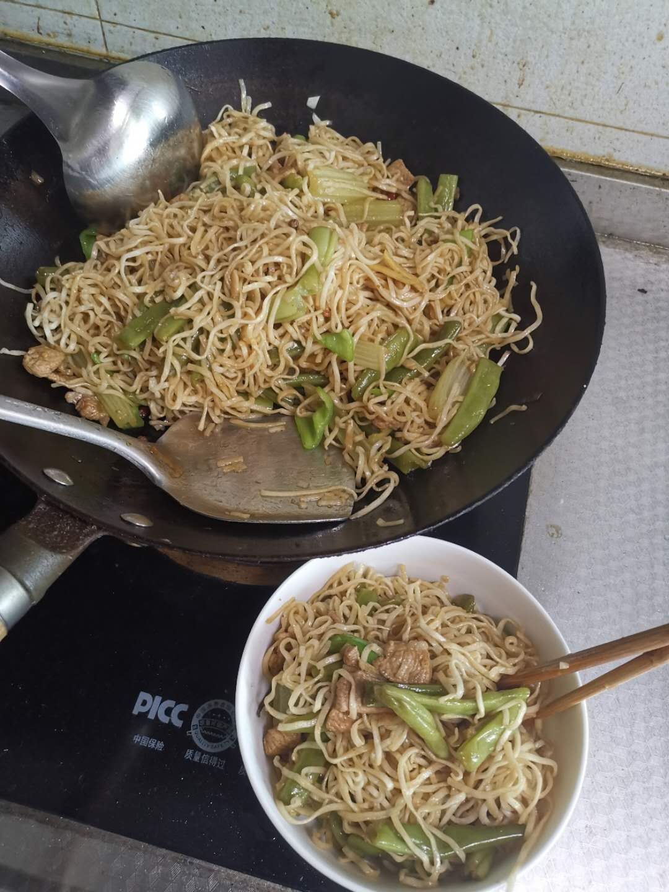

### 自己动手做美食

[TOC]

> 作为一个地道的北方人，还是比较喜欢吃面食。由于排行是家里老小，宝贝疙瘩，在家从没有自己做过饭，可为人又有点好吃，所以自己动手做自己的美食食谱吧！

#### 1. 豆角焖面

##### 食材准备

​	主食：切面1斤(4人份)；五花肉半斤；豆角半斤；芹菜1根；青椒1根；

​	调料：大葱一段、大蒜3斑、姜、干辣椒3个、大茴香1颗、花椒8粒、胡椒粉、盐、生抽、老抽、耗油、料酒；

##### 流程

1. 蒸面：切面撕成10厘米左右，加入少量食用油，拌开，这样防止面条黏连；篦子上放一张打湿的笼布，放上面条，蒸锅水开后，放入篦子，大火蒸8分钟。

   面条蒸好后，用筷子挑散。

2. 准备配菜：

   - 豆角、芹菜择成小段；青椒切成小片；肉切成肉丝；
   - 切姜丝、葱片、蒜片和干辣椒、大茴香、花椒放入碗中备用；

3. 开炒

   - 油锅烧热，倒入食用油(比平时多一点)，倒入肉丝翻炒，炒制发白是放入葱姜蒜，翻炒出香味；
   - 然后倒入豆角、芹菜翻炒，翻炒均匀后开始调味，放入盐、老抽调色、生抽调味、料酒去腥增香、少量耗油和胡椒粉，翻炒均匀；
   - 加水与菜持平，盖上锅盖煮5分钟；水开后，盛出一碗汤汁备用，然后放入面条，浇上汤汁，盖上锅盖焖6分钟，改用小火；
   - 打开锅盖，加入青椒(蒜片)，把面条和菜挑开均匀，关火等2分钟即可。

**如图：**

#### 2. 炸泥鳅

> 家里附件有挺长的一条小河，环境也很清爽，有时候下班了经常去溜达。晚上的时候有挺多人逮鱼，泥鳅挺多，我就买了装备去逮，还好，一个小时能逮10条(4寸左右)，非常不错的放松方式。

1、将泥鳅养在清水盆中，多次换水，让泥鳅吐净泥水。
2、将泥鳅放入有盖的器皿中，快速加入适量食盐(一平勺)，立即盖上锅盖，等待1小时，泥鳅会吐出肚里杂物。

3、捞出冲洗干净，将泥鳅放入密闭的袋子中，放入开水中20秒，将泥鳅杀死。

4、在大泥鳅头部以下2厘米处，用刀在胆的部位切一个三角口取出胆、肠等内脏，将鱼籽保留。

5、洗净泥鳅，在盆中加少许盐、葱花、料酒和几片生姜，喂0.5-1小时，让调料的味道进入泥鳅。

6、打散鸡蛋，将面粉和淀粉(1:1)、盐、十三香加入蛋液中拌匀备用。
7、锅里热油，将泥鳅一只只夹起，在蛋液里拖一下，扔到油锅里，开炸；（油有五分热就可以下锅了，太热容易焦。泥鳅个头小，一开始其实也只要炸一两分钟就好了，回炸时再翻四五下应该就行了，俺全是凭感觉）
8、全部炸好以后，再入锅回炸1分钟，装盘后撒上葱花即可。

#### 3. 小炒鸡肉

1. 鸡肉切小块，反复清洗三遍，抓取水分，备用。
2. 准备两个青椒、一个红椒，洗干净后，切成滚刀块，备用。
3. 葱姜切成片(稍大点)、大蒜对半切开、抓入干辣椒、花椒、茴香，放在一起备用。
4. 锅烧热，加入油滑锅，倒出油加入凉油；将鸡块倒入锅中，小火慢煎(不要着急翻动)，鸡皮定型后尽量晃动锅，让鸡块均匀受热，煎出鸡块中的油脂；大火煸炒三分钟。
5. 倒入葱姜蒜等作料，炒出香味；
6. 加入一罐啤酒，适量清水，没过鸡块；加入老抽体色，水烧开后，小火焖煮8分钟；
7. 将调料挑出来，加入食盐、白糖、胡椒粉、耗油、生抽翻炒均匀；
8. 倒入青红椒，炒一分钟即可。

#### 4. 手撕包菜

1. 手动撕开包菜成块状，清洗干净，控干水分；
2. 准备葱蒜辣椒备用、准备两种酱油、一勺白糖调好；
3. 干锅倒油烧到冒烟，加入调料爆香；
4. 倒入包菜，大火翻炒，倒入调料汁、一勺蚝油；
5. 可以倒入适量盐(可选)。

#### 5. 酸辣土豆丝

1. 土豆切丝，浸泡10分钟(如果土豆丝太厚可以焯水)；
2. 准备葱姜蒜辣椒备用；
3. 锅中放食用油，油温烧至7成热，放蒜末、花椒、干辣椒炒香。
4. 再放土豆丝大火爆炒，炒至土豆丝断生；
5. 最后，放入青红椒丝翻炒均匀，再放盐半勺、鸡精半勺、醋1勺炒匀出锅即可。

#### 6. 炒馍片

1. 馍切小块状；
2. 打两个鸡蛋，加入葱花、盐、胡椒粉；
3. 将鸡蛋倒入馍块中，拌匀；
4. 锅烧热加油，倒入膜片，小火炒至焦黄；

#### 7. 洋葱炒蛋

1. 鸡蛋打散，加入少量料酒、盐；
2. 洋葱切瓣，注意辣眼睛；
3. 锅热加油，炒蛋至微变焦黄，盛出；
4. 锅热加油，大火，倒入洋葱翻炒一分钟，加入酱油、胡椒粉、盐、鸡精翻炒；
5. 最后加入鸡蛋翻炒(可以加青椒)即可。