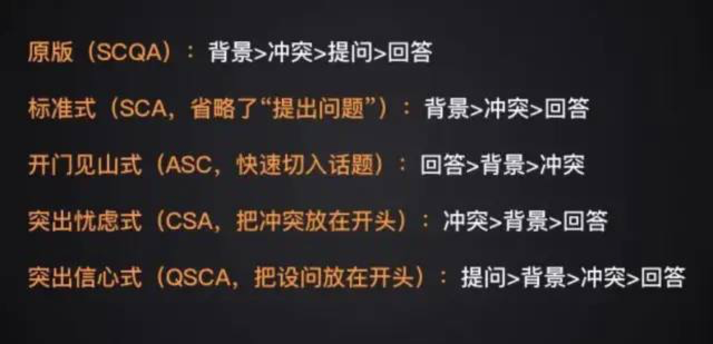

### 金字塔原理

[TOC]

> 让我们合理的组织思想、表达观念吧！

#### 1. What

​	金字塔原理是一种**重点突出、逻辑清晰、主次分明的逻辑思路、表达方式和规范动作**，该原理用于商务写作、商务演示、表达和演说。

​	金字塔原理的基本结构是：**中心思想明确，结论先行，以上统下，归类分组，逻辑递进。先重要后次要，先全局后细节，先结论后原因，先结果后过程。**

#### 2. Why

​	通过金字塔原理的训练，**表达者会更关注、挖掘受众的意图、需求、利益点、关注点、兴趣点和兴奋点，想清内容说什么、怎么说，掌握表达的标准结构、规范动作**。避免自嗨型的表达。

​	金字塔原理，能够帮助达到沟通效果：重点突出，思路清晰，主次分明，让受众有兴趣、能理解、能接受、记得住。

#### 3. How

用金字塔原理来组织思想的方法，分成五个部分：

##### **第一、论点先行，论据不超过7条。**

​	在表达一个观点时，应该先说出结论，原因在于大脑的运作方式，如果大脑提前了解一个结论，那么它就会自动地把接下来获得的信息归纳到这个结论下面来寻找联系，**我们大脑天生对有因果关系和连贯性的事情有更强的记忆和理解能力**。

​	论点要清晰并有明确的思想，要让别人一看就立刻知道你想要表达的内容。

##### **第二、组织思想的四个逻辑。**

​	**时间顺序**：按照事件发生的先后顺序对问题进行分析，不建议用时间倒叙，毕竟商务表达和文学创作的情境是不一样的。

​	**空间顺序**：也称之为结构顺序，比如按照地域、部门、属性等分类问题，也是强化人脑记忆的方法。

​	**重要性顺序**：比如上车按照老弱病残优先原则，就是一个典型的重要性顺序，重要的事情先说，后面的事项是对前面事项的补充。

​	**逻辑演绎顺序**：即“三大段”，大前提、小前提、结论。比如大前提是所有人都会变老，小前提是老K是人，所以结论就是老K也会变老。

##### **第三、自上而下表达、自下而上思考。**

​	组织思想的四个逻辑，既可以是自上而下，也可以是自下而上的形式，先有上层的结论，再梳理下层的论据，也可以用自下而上的形式，先把下层各种想法汇总，再总结出上层的结论。

##### **第四、MECE法则。**

​	ME，指相互独立；CE，指完全穷尽。**MECE法则就是每一个论点下面支撑的论据都应当是彼此相互独立，但是整合起来又是完全穷尽的**，这样你的论证才是清晰有道理的。每条论据都必须符合MECE法则。

##### **第五、SCQA方法。**

我们的**大脑天生喜欢有因果关系和故事性的事情**，所以你最好以故事性的方法引出你的观点。而讲故事的方法就是SCQ方法。

**S指背景(Situation)**：事情发生的时间和地点，你向对方介绍一个观点或者分析一个问题之前，先介绍大家共同认可的背景信息。

**C指冲突(Complication)**：中间发生了什么事情，一个问题能否引起别人的兴趣关键在于冲突设计。

**Q指疑问**：读者产生了疑问，才能让他们有兴趣听下去。

**A指答案**：给出合理的解决方法，顺便表达自己。

SCQ的使用方法，举例如下：

S：我们一直在进行“数据中台”项目开发。

C：目前我们已经完成20%，碰到了什么问题。

Q：这个问题如何解决？（领导产生了疑问）

**SCQA套路如下：**

#### 4. 其他组织方式

##### 总分总结构

​	演讲要做到：凤头、猪肚、豹尾。就是说演讲的开头要引人入胜，如同凤头一样精美绝伦；中间要言之有物，如同猪肚一样充实丰满；结尾要耐人寻味，如同豹尾一样雄劲潇洒。

##### 钩子表达

​	时间钩、关联钩、天秤钩、调焦钩。

##### 电梯间法则

​	结构思考力结构化思维，它能让你在30秒内想清楚，说明白。

##### RIDE说服术

​	说服过程要按“风险、利益、差异、影响”这样的顺序。

#### 5. 例子

