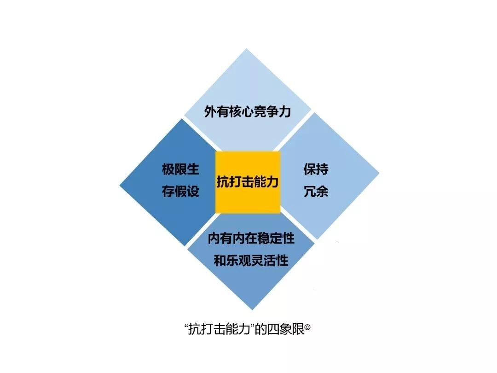

### 诗意栖居

[TOC]

#### 名言警句

1. **天道酬勤。**
2. **说话办事要具备政治思维。**
3. **做真实的自己，做自己喜欢和擅长的事情，做到极致！**
4. **我们只有让自己时刻保持着危机感，才能在面对未知事物时，能带给自己更多的安全感。**
5. **为什么不去死？人无法选择生，无法逃避死，但可以决定怎么活！**
6. **Keep thinking outside the box.**
7. 
8. **求其上，得其中；求其中，得其下；求其下，必败！**
9. **受不得穷，立不得品；受不得屈，做不得事.**
10. **唯一不变的是变化.**
11. ...
12. ...
13. ...

#### 思维方式

1. 游戏思维-深圳

   吃鸡游戏。 利用人性弱点去赚钱，比如一层一层的闯关，然后给与随机的各种奖励，不断刺激人的探索欲和好奇欲，人性是个无底洞，商家就可以在这个过程中谋取利益。

2. 电商思维-杭州

   通俗一点说就是卖货思维，发源地在浙江，只不过以前在线下，现在搬到了线上。

   卖货的手段无非就是价格战，做促销，做流量等等，现在电商和直播的出现，使卖货思维更具备了立体感，比如网红带货，直播购物等等。

   卖货思维是一种初级的商业思维，但是门槛较低，收入和付出成正比，适合出身平凡的人。

3. 金融思维-上海

   金融思维是一种很顶端的思维。本质说白了就是：为有钱人理财，为暂时缺钱的有钱人融资。

   在金融玩具眼里，每一个物品，每一项服务，每一个企业，都可以变成一个金融产品，然后对其进行配置运作。比如电影的金融化，当你在看电影，别人却在赌票房。

   金融的核心在于信用，没有信用就谈不上融资和托管，水往低处流，钱往高处走，钱永远流向信用最高的地方。

4. 32中思维方法

   [32](http://www.360doc.com/content/18/0817/23/44718932_779111213.shtml)

5. ..

#### 歇后语

1. 面试造飞机，工作拧螺丝。

2. 帮你是情分，不帮是本分。
3. 钱是英雄胆，衣是圣人毛。
4. 路遥知马力，日久见人心。
5. 言轻莫劝人(人微言轻)，人穷莫入众。
6. 穷在闹市无人问，富在深山有远亲。
7. 塞翁失马，焉知非福。
8. 木秀于林，非必摧之。
9. 读万卷书，不如行万里路，行万里路不如阅人无数，阅人无数不如名师指路。

