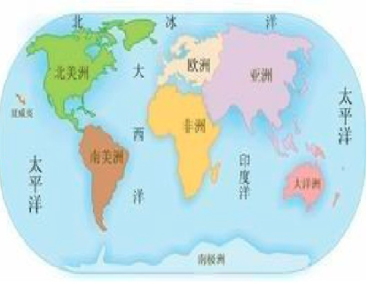

### Wrold map

[TOC]

#### 1. 七大洲四大洋

[高清世界地图](http://maps-ps123.qqxzb-img.com/world/UploadFile/201305/2013050521400620.jpg)

#### 2. 国家

​	截止2018年，世界上共有233个国家和地区，其中国家有195个，地区有38个。

1. 亚洲

   共48个国家和地区。bai其中48个国家。

   东亚：中国、蒙古、朝鲜、韩国、日本

   东南亚：菲律宾、越南、老挝、柬埔寨、缅甸、泰国、马来西亚、文莱、新加坡、印度尼西亚、东帝汶

   南亚：尼泊尔、不丹、孟加拉国、印度、巴基斯坦、斯里兰卡、马尔代夫

   中亚：哈萨克斯坦、吉尔吉斯斯坦、塔吉克斯坦、乌兹别克斯坦、土库曼斯坦

   西亚：阿富汗、伊拉克、伊朗、叙利亚、约旦、黎巴嫩、以色列、巴勒斯坦、沙特阿拉伯、巴林、卡塔尔、科威特、阿拉伯联合酋长国（阿联酋）、阿曼、也门、格鲁吉亚、亚美尼亚、阿塞拜疆、土耳其、塞浦路斯

2. 欧洲

   共46个国家和地区。其中44个国家，2个其他地区。

   北欧：芬兰、瑞典、挪威、冰岛、丹麦 、法罗群岛（丹）（6）

   东欧：爱沙尼亚、拉脱维亚、立陶宛、白俄罗斯、俄罗斯、乌克兰、摩尔多瓦（7）

   中欧：波兰、捷克、斯洛伐克、匈牙利、德国、奥地利、瑞士、列支敦士登（8）

   西欧：英国、爱尔兰、荷兰、比利时、卢森堡、法国、摩纳哥（7）

   南欧：罗马尼亚、保加利亚、塞尔维亚、马其顿、阿尔巴尼亚、希腊、斯洛文尼亚、克罗地亚、黑山、马耳他、波斯尼亚和黑塞哥维那（波黑）、意大利、梵蒂冈、圣马力诺、西班牙、葡萄牙、安道尔、直布罗陀（英、西争议，英国实际控制）（18）

3. 非洲

   共61个国家和地区。其中54个国家，7个其他地区。

   北非：埃及、利比亚、突尼斯、阿尔及利亚、摩洛哥、亚速尔群岛（葡）、马德拉群岛（葡）、加那利群岛（西）（8）

   东非：苏丹、南苏丹、埃塞俄比亚、厄立特里亚、索马里、吉布提、肯尼亚、坦桑尼亚、乌干达、卢旺达、布隆迪、塞舌尔（12）

   中非：乍得、中非、喀麦隆、赤道几内亚、加蓬、刚果共和国[刚果（布）]、刚果民主共和国[刚果（金）]、圣多美和普林西比（8）

   西非：毛里塔尼亚、西撒哈拉（未被国际社会广泛承认）、塞内加尔、冈比亚、马里、布基纳法索、几内亚、几内亚比绍、佛得角、塞拉利昂、利比里亚、科特迪瓦、加纳、多哥、贝宁、尼日尔、尼日利亚（17）

   南非：赞比亚、安哥拉、津巴布韦、马拉维、莫桑比克、博茨瓦纳、纳米比亚、南非、斯威士兰、莱索托、马达加斯加、科摩罗、毛里求斯、留尼汪岛（法）、圣赫勒拿岛（英）、马约特（法）（16）

4. 北美洲

   共40个国家和地区。其中23个国家，17个其他地区。

   北美：加拿大、美国、墨西哥、格陵兰（丹）、圣皮埃尔和密克隆（法）、百慕大（英）（6）

   中美洲：危地马拉、伯利兹、萨尔瓦多、洪都拉斯、尼加拉瓜、哥斯达黎加、巴拿马（7）

   加勒比海地区：巴哈马、古巴、牙买加、海地、多米尼加、安提瓜和巴布达、圣基茨和尼维斯、多米尼克、圣卢西亚、圣文森特和格林纳丁斯、格林纳达、巴巴多斯、特立尼达和多巴哥、波多黎各（美）、英属维尔京群岛、美属维尔京群岛、安圭拉（英）、蒙特塞拉特（英）、瓜德罗普（法）、马提尼克（法）、阿鲁巴（荷）、荷属圣马丁、法属圣马丁、圣巴泰勒米岛（法）、特克斯和凯科斯群岛（英）、开曼群岛（英）、库拉索（荷）（27）

5. 南美洲

   共14个国家和地区。其中12个国家，2个其他地区。

   北部：哥伦比亚、委内瑞拉、圭亚那、苏里南、法属圭亚那（5）

   中西部：厄瓜多尔、秘鲁、玻利维亚（3）

   东部：巴西（1）

   南部：智利、阿根廷、乌拉圭、巴拉圭、马尔维纳斯群岛（阿根、英争议）（5）

6. 大洋洲

   共24个国家和地区。其中14个国家，10个其他地区。

   澳大利亚、新西兰

   密克罗尼西亚：帕劳、密克罗尼西亚联邦、马绍尔群岛、基里巴斯、瑙鲁、北马里亚纳（美）、关岛（美） （7）

   美拉尼西亚：巴布亚新几内亚、所罗门群岛、瓦努阿图、斐济群岛、新喀里多尼亚（法）（5）

   波利尼西亚：图瓦卢、萨摩亚、汤加、库克群岛（新）、纽埃（新）、托克劳（新）、法属波利尼西亚、瓦利斯和富图纳（法）、皮特凯恩群岛（英）、美属萨摩亚（10）

#### 3. 人口top20国家

| 世界排名 |                             国家                             |   人口数量    | 增长率 | 人口密度（公里²） |
| :------: | :----------------------------------------------------------: | :-----------: | :----: | :---------------: |
|    1     | [中国](https://www.phb123.com/city/renkou/country_1.html) | 1,400,050,000 | 0.39%  |      144.30       |
|    2     | [印度](https://www.phb123.com/city/renkou/country_2.html) | 1,354,051,854 | 1.11%  |      411.87       |
|    3     | [美国](https://www.phb123.com/city/renkou/country_3.html) |  326,766,748  | 0.71%  |       34.86       |
|    4     | [印度尼西亚](https://www.phb123.com/city/renkou/country_4.html) |  266,794,980  | 1.06%  |      140.08       |
|    5     | [巴西](https://www.phb123.com/city/renkou/country_5.html) |  210,867,954  | 0.75%  |       24.76       |
|    6     | [巴基斯坦](https://www.phb123.com/city/renkou/country_6.html) |  200,813,818  | 1.93%  |      227.70       |
|    7     | [尼日利亚](https://www.phb123.com/city/renkou/country_7.html) |  195,875,237  | 2.61%  |      212.04       |
|    8     | [孟加拉国](https://www.phb123.com/city/renkou/country_8.html) |  166,368,149  | 1.03%  |      1127.38      |
|    9     | [俄罗斯](https://www.phb123.com/city/renkou/country_9.html) |  143,964,709  | 0.00%  |       8.42        |
|    10    | [墨西哥](https://www.phb123.com/city/renkou/country_10.html) |  130,759,074  | 1.24%  |       66.57       |
|    11    | [日本](https://www.phb123.com/city/renkou/country_11.html) |  127,185,332  | 0.00%  |      336.53       |
|    12    | [埃塞俄比亚](https://www.phb123.com/city/renkou/country_12.html) |  106,672,306  | 2.46%  |       97.38       |
|    13    | [菲律宾](https://www.phb123.com/city/renkou/country_13.html) |  106,512,074  | 1.52%  |      311.12       |
|    14    | [埃及](https://www.phb123.com/city/renkou/country_14.html) |  99,375,741   | 1.87%  |       99.13       |
|    15    | [越南](https://www.phb123.com/city/renkou/country_15.html) |  96,491,146   | 0.99%  |      291.33       |
|    16    | [刚果民主共和国](https://www.phb123.com/city/renkou/country_16.html) |  82,643,624   | 3.09%  |       34.70       |
|    17    | [德国](https://www.phb123.com/city/renkou/country_17.html) |  82,293,457   | 0.22%  |      230.44       |
|    18    | [伊朗](https://www.phb123.com/city/renkou/country_18.html) |  82,011,735   | 1.05%  |       49.76       |
|    19    | [土耳其](https://www.phb123.com/city/renkou/country_19.html) |  81,916,871   | 1.45%  |      104.54       |
|    20    | [泰国](https://www.phb123.com/city/renkou/country_20.html) |  69,183,173   | 0.21%  |      134.83       |

#### 4. GDP Top Rank

​		美国（GDP：21.41万亿）

　　中国（GDP：15.54万亿）

　　日本（GDP：5.36万亿）

　　德国（GDP：4.42万亿）

　　印度（GDP：3.16万亿）

　　法国（GDP：3.06万亿）

　　英国（GDP：3.02万亿）

　　意大利（GDP：2.26万亿）

　　巴西（GDP：2.26万亿）

　　加拿大（GDP：1.91万亿）