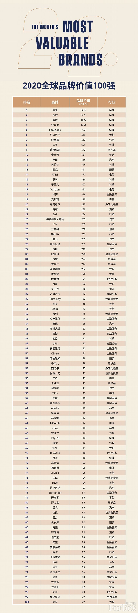

### Top 品牌

[TOC]

#### 一、Top 100 品牌

#### 二、奢侈品

LVMH全称为LouisVuittonMoetHennessy，是全球最大的奢侈品集团，旗下有香槟王、库克香槟、路易威登、罗威、思琳、纪梵希、芬迪、娇兰、宝格丽、丝芙兰等五十多个品牌。1987年LVMH集团CEO伯纳德·阿诺特就把迪奥香水整合到旗下。

| 品牌     | 介绍                                                     |
| -------- | -------------------------------------------------------- |
| 路易威登 | 法国巴黎，箱包起家。LV,Louis Vuitton。                   |
| 迪奥     | 克里斯汀·迪奥，Dior,法国，设计师。服装、香水起家。早死。 |
| 古驰     | 意大利，GUCCI，精美皮具起家。马衔扣、竹节手柄特色。      |
| 爱马仕   | 法国巴黎，Hermès，马具起家。                             |
| 香奈儿   | 法国，Coco Chanel，女性。                                |
| 卡地亚   | 法国钟表及珠宝制造商，Cartier。                          |
| 劳力士   | Rolex是瑞士著名的手表制造商。皇冠的注册商标。            |

#### 三、Top 10 服装奢

1. 唐纳.卡兰(donnakaran)
2. 路易·威登
3. 香奈儿
4. 范思哲Versace
5. 迪奥
6. 古驰
7. 瓦伦蒂诺.加拉瓦尼Valentino garavani,华伦天奴
8. Prada
9. Guess
10. 乔治阿玛尼Armani

#### 四、Top 10 珠宝

1. 卡地亚
2. 蒂芬妮
3. ENZO
4. Oxette
5. 宝诗龙

#### 五、Top 10 皮具

1. Lv
2. Chanel
3. Dior
4. GUCCI
5. 瓦伦蒂诺.加拉瓦尼Valentino garavani,华伦天奴
6. Prada
7. 乔治阿玛尼Armani
8. 登喜路
9. 芬迪
10. COACH蔻驰

#### 六、Top 10 化妆品

娇兰、兰蔻、娇韵诗、伊丽莎白雅顿、奥伦纳素、伊诗兰顿、倩碧、资生堂、迪奥、香奈儿。

#### 七、Top 10 香水

香奈儿、雅诗兰黛、兰蔻、CalvinKlein、古驰、迪奥、伊丽莎白雅顿、大卫杜夫，娇兰，罗夫罗伦。

#### 八、Top 10 手表

欧米茄、积家、伯爵、江诗丹顿、劳力士、卡地亚、爱彼、万国、宝玑、百达翡丽。

#### 九、Top 10 汽车

劳斯莱斯、宾利、法拉利、兰博基尼、玛莎拉蒂、阿斯顿马丁、布加迪、世爵、柏格尼。

#### 十、Top 10 酒

绝对伏特加、轩尼诗、尊尼获加、芝华士、酩悦香槟、人头马、马爹利、百加得、家豪威士忌、尊荣极品威士忌。