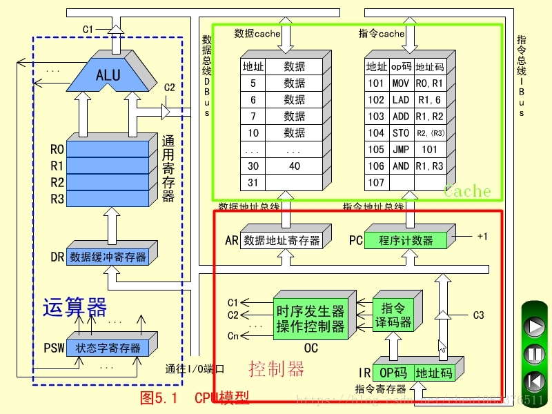

# CPU

[TOC]

## 一、简介

​	CPU即中央处理器，是计算机的大脑。由控制器、运算器和Cache三大部分组成。



- 单核和多核的区别？

  多核包含多个处理器核心，可以同时运行更多的线程，执行速度更快(一般一个核心支持2个线程)。

  ```shell
  # mac pro
  $ sysctl machdep.cpu.brand_string # 处理器
  machdep.cpu.brand_string: Intel(R) Core(TM) i7-4870HQ CPU @ 2.50GHz 
  $ sysctl -n machdep.cpu.core_count # 核心数
  4
  $ sysctl -n machdep.cpu.thread_count # 支持线程数
  8
  
  # 华为mate20(海思麒麟960)
   $ cat /sys/devices/system/cpu/possible # CPU核心数8核
  0-7
   $ cat /sys/devices/system/cpu/cpu0/cpufreq/cpuinfo_max_freq # 第一个CPU最大功率
  1844000
   $ cat /proc/cpuinfo 
  Processor       : AArch64 Processor rev 1 (aarch64) # 架构ARM
  processor       : 0、1、2、3、4、5、6、7
  BogoMIPS        : 3.84                              # 百万条指令每秒
  Features        : fp asimd evtstrm aes pmull crc32
  CPU implementer : 0x41
  CPU architecture: 8                                 # 8核
  CPU variant     : 0x0
  CPU part        : 0xd03
  CPU revision    : 4
  
  ```

- Intel、Arm的区别？

  Intel架构处理器适用于桌面场景，性能强大、速度快，但功耗大(**频率越高越好**)；

  Arm架构处理器适用于移动手机场景，精简、高效、节能(**多核心低主频**)。

